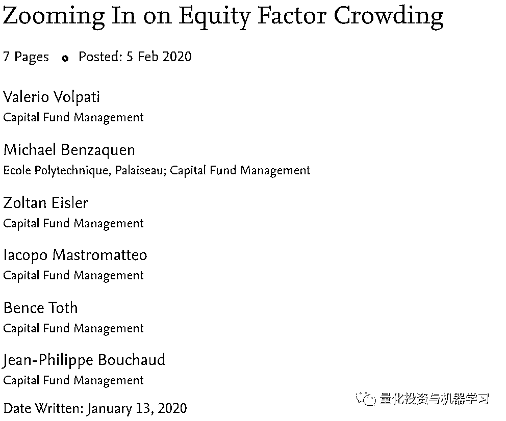
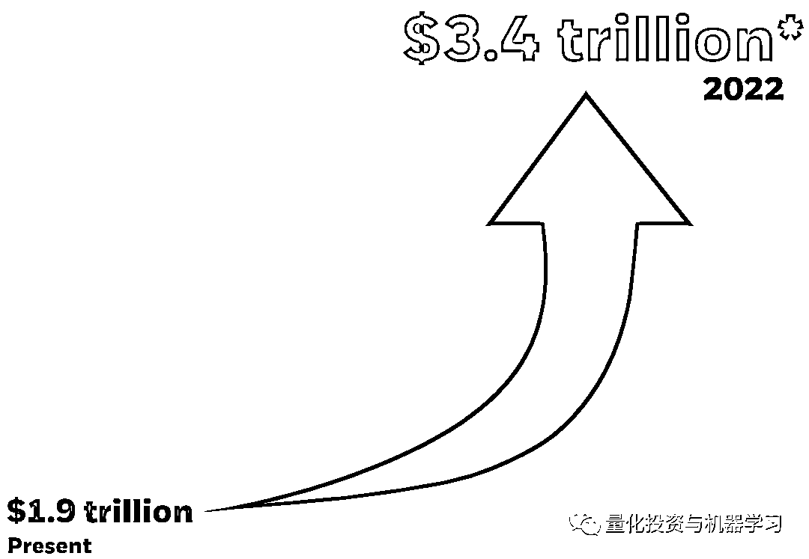
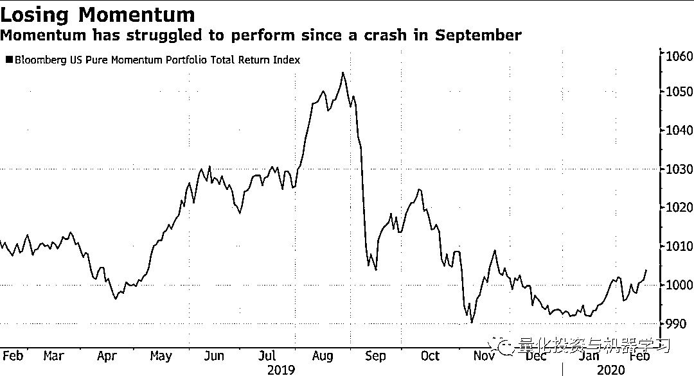

# 因子投资太拥挤！

> 原文：[`mp.weixin.qq.com/s?__biz=MzAxNTc0Mjg0Mg==&mid=2653297238&idx=1&sn=39f65a3dac871473831d4deb9398db01&chksm=802dd843b75a5155453d7f08f5030df9fb805606f90ed0b637e44311c34c72b09787bed767f0&scene=27#wechat_redirect`](http://mp.weixin.qq.com/s?__biz=MzAxNTc0Mjg0Mg==&mid=2653297238&idx=1&sn=39f65a3dac871473831d4deb9398db01&chksm=802dd843b75a5155453d7f08f5030df9fb805606f90ed0b637e44311c34c72b09787bed767f0&scene=27#wechat_redirect)

**标星★****置顶****公众号**爱你们♥  

编译：1+1=6

之前很难证明传统的因子投资已经变得过于拥挤。近日，来自 Capital Fund Management（CFM）的分析人士表示：他们发现了确凿的证据。并写成一篇论文，发表在 SSRN 上：

“这意味着，由于人们的推动，你在交易时试图获得的价格比你最初想象的要高”。这篇论文的作者之一、CFM 董事长 Jean-Philippe Bouchaud 表示。“因此，**额外的成本，尽管它来自于一个相当小的相关性，但足以吃掉很大一部分信号**”。

Bouchaud 的结论呼应了人们长期以来的担忧，即因子投资的受欢迎程度对其产生了负的影响。

根据 BlackRock 估计，目前投资总额已达 2 万亿美元：

*图片来自：贝莱德

资金外流和市场波动困扰着大量采用多策略的传统量化基金公司，促使一些公司采用新的投资策略或更快的投资策略。

动量本身是后危机时期牛市的最大赢家之一，在过去 10 年里，除了两年以外，动量几乎都超过了全球基准指数。

去年 9 月，该策略遭遇了 10 年来最大的单日崩盘，许多人将其归咎于大型投资者的快速去杠杆化。此后，这种投资风格一直举步维艰。

*图片来自：彭博

CFM 梳理了 1000 多只不同的股票，发现自 2012 年以来，动量购买信号与导致交易成本上升的市场失衡之间的相关性有所增强。**研究人员通过观察执行价格和中间价格之间的差距，以及买入量与卖出量之间的差距，捕捉到了这一点。**

纵观市场，"动量交易只代表市场中极小的一部分。" Bouchaud 说。“但有趣的是，我们试图在论文中指出的是，**这实际上足以引发交易成本，其数量级与该策略的收益相当**”。

CFM 还发现**价值和规模因子**也有类似拥挤的迹象，尽管证据不那么明确，因为这些都是“慢性”策略。同时，由于数据嘈杂过于，无法得出这两个因子的拥挤程度在过去几年中实际上已经加剧的结论。

但总体而言，对于 Eugene Fama 和 Kenneth French 创建的因子模型来说，这是具有打击性的，因为砝码三因子模型包括了价值和规模因子。

作者在最近的论文中说：**“简单的 Fama-French 因子投资接近饱和。****”**

*图片来自：该论文

CFM 认为羊群行为会导致基于规则的策略失败，但这一观点会被吐槽反驳。贝莱德就表示：这些单向量化策略往往会被其他类型投资者买进卖出的行为所抵消。他们推出的 smart-beta exchange-traded funds 还促进了因子策略的繁荣。贝莱德还在去年 12 月的一份报告中表示，交易成本远未影响投资收益。

**交易周期（5 天）的 AUM 和容量**

*图片来自：贝莱德

许多人认为，价值股或小盘股较大盘的折价幅度越来越大，表明这些因子的受欢迎程度正在下降。

此外，Alpha Architect 的创始人 Wes Gray 表示，由于基本面表现强劲，交易量大的交易仍然可能获得收益。他指出，近年来，动量、低波动性和质量等因子带来了不错的业绩。

但对 Bouchaud 来说，这项研究证实了 CFM 长期以来的观点：**即量化分析师不能再依赖于传统因子。相反，他们应该找到更创新的方法来应对旧的理论，或者挖掘新的品种。**

心系武汉

**等疫情结束，花枝春满。**

**山河无恙，人间皆安。**

2020 年第 42 篇文章

量化投资与机器学习微信公众号，是业内垂直于**Quant、MFE、Fintech、AI、ML**等领域的**量化类主流自媒体。**公众号拥有来自**公募、私募、券商、期货、银行、保险资管、海外**等众多圈内**18W+**关注者。每日发布行业前沿研究成果和最新量化资讯。

你点的每个“在看”，都是对我们最大的鼓励