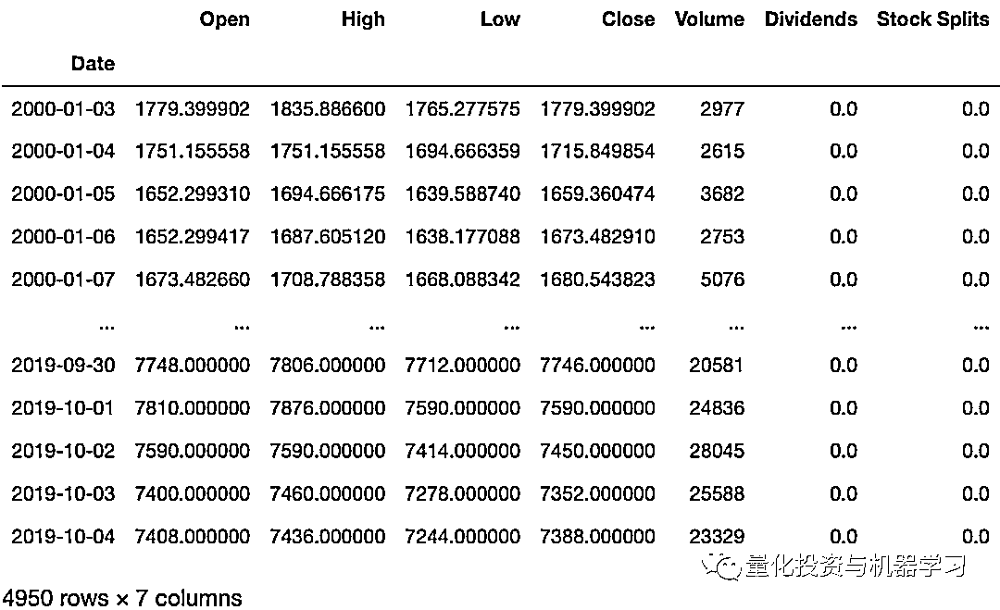
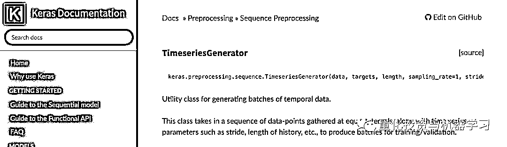
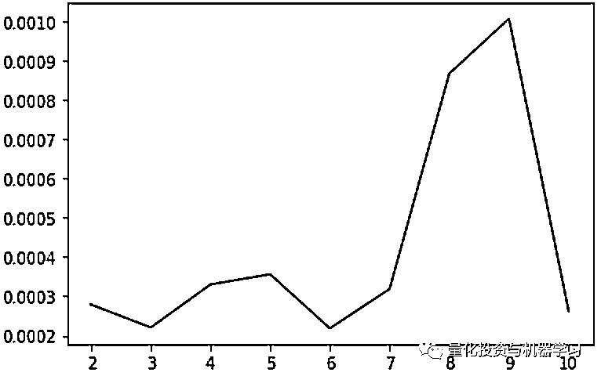
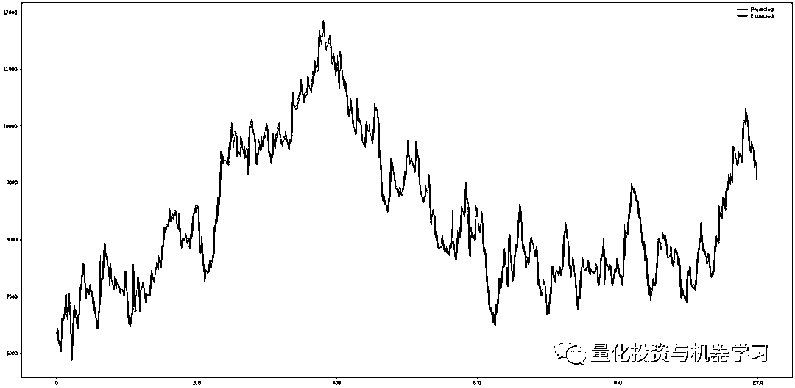

# 使用神经网络预测股价：失败了！！！

> 原文：[`mp.weixin.qq.com/s?__biz=MzAxNTc0Mjg0Mg==&mid=2653297220&idx=1&sn=5964c7abfa1c054362012b19de8e2a84&chksm=802dd851b75a5147ba8d940eafa3732e60fcfe7b88a5725c21420035f4dbd5f2a510b9f66bc6&scene=27#wechat_redirect`](http://mp.weixin.qq.com/s?__biz=MzAxNTc0Mjg0Mg==&mid=2653297220&idx=1&sn=5964c7abfa1c054362012b19de8e2a84&chksm=802dd851b75a5147ba8d940eafa3732e60fcfe7b88a5725c21420035f4dbd5f2a510b9f66bc6&scene=27#wechat_redirect)


**标星★****置顶****公众号**爱你们♥  

编译：1+1=6

***0***

**前言**

当我们说起金融时间序列的预测，大家可能第一个想到的是预测股票价格。  然而，Chollet 的《Deep Learning with Python》一书强调，**人们不应该尝试使用时间序列预测方法去预测股票价格**。  他解释道，在股市中过去的数据并不是估计未来的一个好的基础。  

那么，有没有可能用神经网络来预测股价呢？今天公众号带你来探讨。

***1***

**案例**

我们将训练一个神经网络，它将使用 n 个已知值（过去的价格）来预测(n+1)-th 的价格。我们假设两次价格测量之间的时间是常数。

我们将使用前几天的收盘价来预测收盘价。使用 yfinance Python 包获取数据。

```py
pip install yfinance 
```

下一步： 

```py
import yfinance as yf
# create the object that represents Maersk stock data
# here MAERSK-B.CO -- is the Maerks's ticker
maersk = yf.Ticker('MAERSK-B.CO') 
```

我们还没有下载任何数据，只创建了可以用来请求数据的对象。雅虎财经为 Maersk 提供了股息数据，我们知道，**股息（股票的利息）会影响股票价格**。因此，我们希望神经网络在预测价格时考虑股息。这意味着，当我们告诉网络使用前几天的一组价格来预测某一天的收盘价时，我们还需要为它提供一个标记，告诉它当天是否支付了股息。

要获得支付股息的日期，请查看 maersk.dividends。为了得到股票价格，我们调用 history 方法。这个方法有几个参数，我们用到的是 period 和 interval。

Period 参数定义我们请求数据的时间段。该参数支持一些预定义的字符串值，我们将使用其中的一个。我们传递字符串'max’ ，它告诉我们所有可用的数据。使用开始和结束参数可以定义确切的周期。但是，因为我们将使用所有可用的数据，所以我们将使用 period 参数并传递'max'。

Interval 参数告诉方法两个后续值之间的间隔。 它取一个预先定义的值，我们将通过'1d' ，因为我们要使用每日价格。

```py
history = maersk.history(period='max', interval='1d') 
```

看看 dataframe：



当设计一个神经网络来预测时间序列时，应该决定网络将有多少 input。在我们的例子中，我们必须选择输入网络的价格数量来预测下一个价格。由于我们现在还不知道这个数字，所以最好能够生成具有不同数量输入的数据集。幸运的是，Keras 开发人员已经考虑到了这一点，现在 Keras 提供了一个时间序列生成器，可以生成具有不同输入量的数据集。在时间序列预测的情况下，输入值和目标值都来自同一个序列。这意味着我们使用大小为 j 的移动窗口，其中 j 是我们用来预测(j+1)-th 值的值的个数。

换句话说，我们获取时间序列的 j 后续元素({ x1，x2，... xj }) ，然后取(j + 1) th 元素(x₍ⱼ₊₁₎)并将它设置为目标值。这对(j，(j+1)-th)构成一个单独的训练示例。为了生成另一个训练示例，我们将移动窗口一个 step，并使用{x₂x₃,……x₍ⱼ₊₁₎}作为输入，x₍ⱼ₊₂₎作为目标值。

Keras 为我们提供了 TimeseriesGenerator 类，我们将使用这个类来生成训练集。



https://keras.io/preprocessing/sequence/

这里唯一的困难是我们还希望网络考虑股息。因此，我们必须编写一个函数，该函数使用 TimeseriesGenerator 类生成训练集，然后使用关于股息的信息丰富生成器的输出。

```py
def generate_series(data, value_num):
    close = data['Close']
    dividends = data['Dividends']
    tsg = TimeseriesGenerator(close, close,
                              length=value_num,
                              batch_size=len(close))
    global_index = value_num
    i, t = tsg[0]
    has_dividends = np.zeros(len(i))
    for b_row in range(len(t)):
        assert(abs(t[b_row] - close[global_index]) <= 0.001)
        has_dividends[b_row] = dividends[global_index] > 0            
        global_index += 1
    return np.concatenate((i, np.transpose([has_dividends])),
                           axis=1), t 
```

该函数接受两个参数：我们希望它处理的数据集（data 参数）和序列应该具有的输入值的数量（value_num 参数）。

如你所知，神经网络是用梯度下降法训练的，采用梯度的成本函数。最简单的方法是假设我们使用整个数据集来计算成本函数梯度。然而，也有不利的一面。首先，数据集可能非常大，这使得计算梯度非常耗时。其次，如果数据集非常大，那么梯度值也可以非常大，非常大！以至于它根本不适合机器精度。一些人会指出，我们实际上并不需要确切的梯度值。我们只需要它的估计值来决定我们应该朝哪个方向移动，以最小化成本函数。因此，我们可以利用训练样本的一个小子集来估计梯度。当然，我们最终会遍历整个数据集，但是不需要一次计算整个数据集的梯度。我们可以将数据集划分为几个称为 batch 的子集，一次只处理一个 batch。我们使用单批计算的梯度来更新网络的权值。一旦我们处理了所有的批次，我们可以说我们运行了一个单独的训练周期。在一次训练中，可能有多个 epoch，具体的 epoch 数量取决于任务。同时，训练的例子必须打乱。这意味着随后的两个训练示例不能属于同一批。让我们测试这个函数并生成一个使用四个输入值的数据集。

```py
inputs, targets = generate_series(history, 4) 
```

让我们看一个例子：

```py
# print(inputs[3818])
array([1.246046e+04, 1.232848e+04, 1.244496e+04, 1.274000e+04,
       1.000000e+00]) 
```

我们可以看到，一个训练示例是一个带有 4 个价格和 5 个附加值的向量，该值表示当天是否支付股息。注意，值比较大。的确，价格范围从 767.7 到 12740.0 的神经网络在这样的范围内不能很好地工作，所以我们必须将数据归一化。我们将使用最简单的归一化方法：MinMax。

```py
h_min = history.min()
normalized_h = (history - h_min) / (history.max() - h_min) 
```

重新生成数据集：

```py
inputs, targets = generate_series(normalized_h, 4) 
```

看看数据归一化后的结果：

```py
# print(inputs[3818])
array([0.9766511 , 0.96562732, 0.97535645, 1.        , 1.        ]) 
```

正如我们所看到的，这些值现在的范围是从 0 到 1。这使得任务更容易了。然而，我们现在必须保留 h.min()和 h.max()，以便在预测价格时对网络输入进行规一化，并对其输出进行反规一化以获得准确的值。

最后，神经网络该出场了！网络将有(n+1)输入，n 表示价格，1 表示股息指标和一个输出。我们仍然需要确定 n。为此，我们将编写一个函数来创建具有指定数量输入的神经网络。我们使用 input_shape=(n+1,)表达式来包含股息指示器。

```py
def create_model(n):
    m = models.Sequential()
    m.add(layers.Dense(64, activation='relu', input_shape=(n+1,)))
    m.add(layers.Dense(64, activation='relu'))
    m.add(layers.Dense(1))
    return m 
```

在训练网络之前，我们将数据集划分为两部分：训练集和测试集。在训练网络时，我们不会使用测试集的例子。

```py
train_inputs = inputs[:-1000]
val_inputs = inputs[-1000:]
train_targets = targets[:-1000]
val_targets = targets[-1000:] 
```

我们再写一个函数。这个函数将帮助我们决定网络应该有多少输入。这个函数接受输入的数量来检查要训练的 epoch 的数量。该函数将创建一个网络，为其准备数据，然后对网络进行训练，并在测试集中评估其性能。

```py
def select_inputs(data, start, end, epochs):
    models = {}
    for inputs in range(start, end+1):
        print('Using {} inputs'.format(inputs))
        model_inputs, targets = generate_series(data, inputs)

        train_inputs = model_inputs[:-1000]
        val_inputs = model_inputs[-1000:]
        train_targets = targets[:-1000]
        val_targets = targets[-1000:]

        m = create_model(inputs)
        print('Training')
        m.compile(optimizer='adam', loss='mse')
        h = m.fit(train_inputs, train_targets,
                  epochs=epochs,
                  batch_size=32,
                  validation_data=(val_inputs, val_targets))
        model_info = {'model': m, 'history': h.history}
        models[inputs] = model_info
    return models 
```

现在，让我们用 2 到 10 个输入为 20 个 epoch 训练网络：

```py
dtrained_models = select_inputs(normalized_h, 2, 10, 20) 
```

当训练完成后，我们可以用下面的代码得到一个简短的总结：

```py
model_stats = {}
for k, v in trained_models.items():
    train_history = v['history']
    loss = train_history['loss'][-1]
    val_loss = train_history['val_loss'][-1]
    model_stats[k] = {'inputs': k, 'loss': loss, 'val_loss': val_loss} 
```

打印 model_stats 值，我们可以看到摘要：

```py
{2: {'inputs': 2,
  'loss': 6.159038594863468e-05,
  'val_loss': 0.0006709674960002303},
 3: {'inputs': 3,
  'loss': 7.425233190960614e-05,
  'val_loss': 0.00021176348975859583},
 4: {'inputs': 4,
  'loss': 7.471898652647588e-05,
  'val_loss': 0.00022580388654023408},
 5: {'inputs': 5,
  'loss': 8.866131339595126e-05,
  'val_loss': 0.00027424713294021784},
 6: {'inputs': 6,
  'loss': 7.322355930846842e-05,
  'val_loss': 0.0003323734663426876},
 7: {'inputs': 7,
  'loss': 8.709070955596233e-05,
  'val_loss': 0.0004295352199114859},
 8: {'inputs': 8,
  'loss': 8.170129280188121e-05,
  'val_loss': 0.00024587249546311797},
 9: {'inputs': 9,
  'loss': 7.327485314296024e-05,
  'val_loss': 0.0003118165017804131},
 10: {'inputs': 10,
  'loss': 8.064566193526276e-05,
  'val_loss': 0.0003668071269057691}} 
```

我们可以看到，使用测试集计算的错误总是略大于为训练集计算的值。这意味着网络处理已知数据比处理未知数据稍微好一些。

现在，我们可以根据网络的输入值来绘制测试误差图。

```py
import matplotlib.pyplot as plt
val_loss = []
indices = []
for k, v in model_stats.items():
    indices.append(k)
    val_loss.append(v['val_loss'])
plt.plot(indices, val_loss) 
```



通过这个图，我们可以看到哪个网络显示的测试错误最少。确切的结果可能会随着时间的推移而变化，这取决于雅虎财经历史数据的数量。

有一个有趣的现象。如果一个人运行这个脚本两次，那么他们将收到不同的结果。换句话说，最小的测试错误是由不同的网络产生的。由于网络之间的唯一区别是输入的数量，那么我们可以得出结论：**测试误差并不依赖于输入的数量有多少。****这反过来支持了最初的推测，即我们无法用神经网络预测股价**。显然，网络训练忽略一些输入，结论是输出并不依赖于它们。

我们已经把数据进行了标准化。现在我们来计算网络的精确误差。

```py
close_min = history['Close'].min()
close_max = history['Close'].max()
for k in model_stats:
    e = ((close_max - close_min) * model_stats[k]['val_loss'] + close_min)
    print(k, e) 
```

输出：

```py
2 771.0400773414451
3 770.341964375037
4 771.6538168560887
5 771.9637314503287
6 770.3164239349957
7 771.5147973106168
8 778.0784490537151
9 779.7546236891968
10 770.8432766947052 
```

误差非常大！即使对于测试误差最小的网络，精确误差也是非常大的。反正，我们是不会相信用这样一个网络去买卖股票。

现在，我们画一个图来比较精确的价格和预测的价格。



***2*** 

**总结**

对于未知数据，我们得到了较大的误差。这意味着该网络未能预测收盘价。或许，我们可以通过改变现有的网络结构来改善这一结果。但，我们不认为我们可以得到更多的数据，因为我们已经使用了所有可用的数据。使用不同公司的数据来训练一个网络是可能的，但是由于这些公司可能有不同的属性，它们的股价可能会根据不同的规律变化，这只会使网络混乱。

值得注意的是，**网络本身并不能预测股价**。相反，它它尝试使用给定的值猜测一个序列的下一个值是什么。这是因为价格没有编码下一次它会如何变化。如果价格上涨一段时间，就不能保证下一分钟不会下跌。**价格受外部事件的影响很大，这是网络所不知的。**

或许，我们将能够使用神经网络进行**短期预测**，来确定**未来几分钟内的价格变化**。这可能是因为我们预测的时间段越短，外部事件发生的变化就越小。然而，在这种情况下，**最好使用线性回归模型来预测价格变化的方向。**

如果我们仔细观察股价曲线，我们会发现它的变化是随机的。如果我们只有价格而不知道外部事件，这就是事实。因此，**股价看起来就像一个鞅**，这一个我们无法预测的过程。

**鞅（Martingale）**于博弈论中的表示公平博弈的数学模型，在概率论中是满足下述条件的随机过程：已知过去某一时刻 s 以及之前所有时刻的观测值，若某一时刻 t 的观测值的条件期望等于过去某一时刻 s 的观测值，则称这一随机过程是鞅。所以：

**最好不要用神经网络来预测股价**

参考资料

1、Bugorskij, V. Ispol’zovanie nejronnyh setej dlya modelirovaniya prognoza kotirovok cennyh bumag / V. Bugorskij, A. Sergienko // Prikladnaya informatika. — 2008\. — T. № 3(15). (in Russian)

2、Chollet, F. Deep learning with python — 2017\. — Manning Publications.

3、Elliot, A. Time Series Prediction : Predicting Stock Price / A. Elliot, C. H. Hsu // ArXiv e-prints. — 2017.

4、Ian Goodfellow. Deep Learning / Ian Goodfellow, Yoshua Bengio, Aaron Courville — MIT Press, 2016.

心系武汉

**等疫情结束，花枝春满。**

**山河无恙，人间皆安。**

2020 年第 41 篇文章

量化投资与机器学习微信公众号，是业内垂直于**Quant、MFE、Fintech、AI、ML**等领域的**量化类主流自媒体。**公众号拥有来自**公募、私募、券商、期货、银行、保险资管、海外**等众多圈内**18W+**关注者。每日发布行业前沿研究成果和最新量化资讯。

你点的每个“在看”，都是对我们最大的鼓励