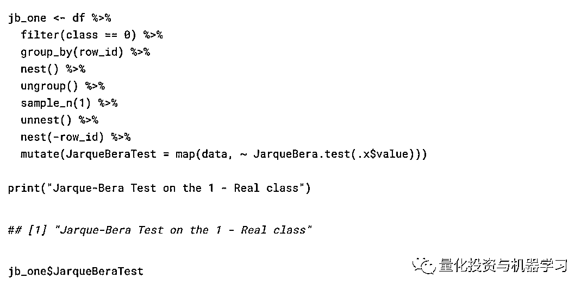
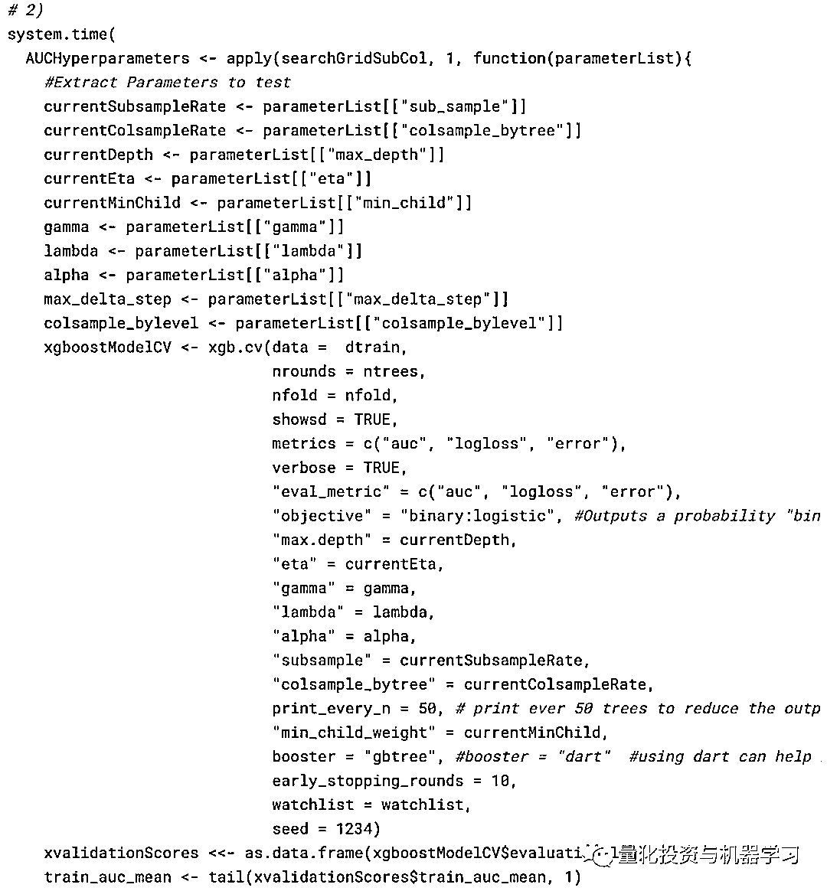
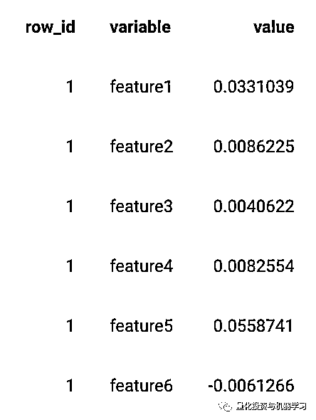
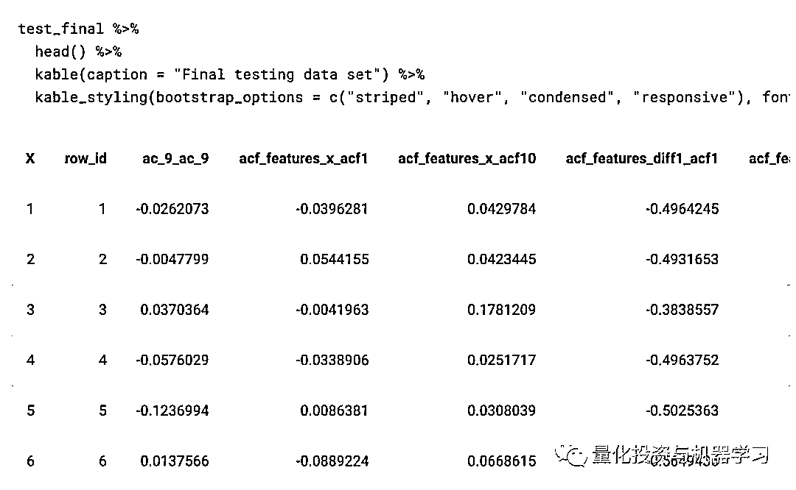

# 真假美猴王！基于 XGBoost 的『金融时序』 VS 『合成时序』

> 原文：[`mp.weixin.qq.com/s?__biz=MzAxNTc0Mjg0Mg==&mid=2653297204&idx=1&sn=b34f1cec6a91c40f5e756bfbdcf68b5f&chksm=802dd821b75a51376a15175f70c50801f6f5dcfbbfd280b20dac452320f637e4cd68a190d242&scene=27#wechat_redirect`](http://mp.weixin.qq.com/s?__biz=MzAxNTc0Mjg0Mg==&mid=2653297204&idx=1&sn=b34f1cec6a91c40f5e756bfbdcf68b5f&chksm=802dd821b75a51376a15175f70c50801f6f5dcfbbfd280b20dac452320f637e4cd68a190d242&scene=27#wechat_redirect)

**标星★****置顶****公众号**爱你们♥  

作者：Matthew   编译：方的馒头

***0***

**前言**

今天，公众号要给大家介绍，**区分真实的金融时间序列和合成的时间序列**。数据是匿名的，我们不知道哪个时间序列来自什么资产。

在最后，我们获得了 67％的样本内测试准确度和 65％的样本外测试准确度。

我们有 12,000 个真实时间序列和 12,000 个综合创建的时间序列，总共 24,000 个观测值。

全文总共三部分，让我们开始吧，**十分有意思！**

***1*** 

**准备工作**

导入相关库文件：

**注意：**我们有两个数据集，train_Val.csv 是训练和验证数据集以及 test.csv 数据集。直到第 3 部分的最后，我才接触到 test.csv 数据集。所有分析和优化仅在 train_val.csv 数据集上执行。train_val.csv 包含 12，000 个观测值，test.csv 包含 12，000 个观测值。

***2***

**第一部分**

数据格式：

列名如下所示：

训练数据中有 260 个“特征”以及从测试数据中排除的类别变量。一年中约有 253 个交易日，feature1，feature2，…featureN 是每日时间序列。从最初的观测（和绘图）来看，我们认为该数据是“收益”数据。首先清除一点数据，因为时间序列在使用 feature1，feature2，…featureN 作为输入时效果不佳。我们随机选择了一年，并使用函数 getTradingDates 重命名了这些列（总是有一个万能的 R 程序包……）。

在这里（如果我们做不同的事情），将保持 tidy 数据原理，并使用 test ％>％ add_column（dataset =” test）和 train ％>％ add_colum（dataset =” train”）而不是 test$dataset<- “ test 和 train_val $dataset <-“ train”。但这没关系。

清洗后的训练数据：

清洗后的测试数据：

**目标：**是要分类哪些金融时间序列是真实的，哪些是合成创建的（通过某种算法，我们不知道它是如何生成合成时间序列的）。

我们使用 R 中的 melt 函数重新排列了数据，但是建议任何阅读此文件的人都使用 tidyverse 包中的 pivol_longer 函数。可以参考 pivot_longer 包。

**注意：**我们将训练数据称为 df，事后看来是不好的做法，应该将其称为与 train_Val 命名数据集相关的名称。请记住，df 引用了 train_Val 数据集。（并且不包括 test.csv 数据集数据）

如我们所见，数据有 3,120,000 行，即 12,000 个资产* 260 个交易日。接下来，使用 ggplot 绘制收益序列。

接下来绘制箱形图以获得平均收益率，其次是标准差。

接下来，计算 Durbin-Watson 统计数据。主要使用 R 的 tidy 数据原理进行编码，因此使用 broom 包中的 tidy 功能稍微整理一下 DW 统计数据的输出。对合成时间序列和真实时间序列都执行此操作。

接下来对每个 DurbinWatson 检验绘制箱型图统计数据。

使用 tidyquant 包中的 tq_mutate 函数计算了 10 天的滚动平均值和标准差。value 对应于金融时间序列的收益，并绘制为蓝色，在收益上绘制了 10 天的滚动平均值和标准偏差。（我们在这里再次使用了 melt，但查看了 pivot_longer 函数以获得更直观的应用程序）

  

此处代码中的一个重要说明是，我们是按组随机抽样的，也就是说，我们不会从所有组的所有观测结果中随机抽样。取而代之的是，将每个时间序列 group_by（按 class == 0 过滤后的 6,000 个观测值中的每一个，同样当按 class == 1 过滤时，也是如此），然后将 nest（）数据折叠每个资产的每日时间序列到一个 list。从这里我们将有 6,000 个观测值，每个观测值的时间序列都嵌套在列表中。因此，可以对 6,000 个观测值中的 1 个进行采样，然后对 unnest（）进行采样，以获取所选随机资产之一的完整时间序列集，而不是对所有资产时间序列数据进行随机采样（这是完全错误的）。

例如，下面的注释代码 group_by（）的 ID 变量和 nest（）中的数据，需要一个随机 sample_n（）中的分组数据，然后 unnest（）的数据到其原始形式，此时用的随机样本 IDs。

接下来，针对一个随机观测值在两个序列上计算 Dickey Fuller 检验，因此计算出了 sample_n（1）参数（要在所有 12,000 个观测值上进行计算都非常昂贵）。

合成序列：

真实金融序列：

接下来是 Jarque-Bera 的正态性检验。首先是关于合成序列：

真实金融序列：

**自相关图**

为观测时间序列的“随机”样本绘制了自相关函数。我们选择了 4 个观测值，并根据它们筛选出数据。

足够的数据分析我们可能还可以同时进行 PACF 图和其他一些探索性数据分析，继续使用 tsfeatures 包生成金融时间序列特征。

在下面的代码中所做的是随机抽取 5 个组（使用整个数据集需要很长时间才能计算时间序列特征），然后将 tsfeatures 包中的所有函数应用于每个时间序列资产数据通过映射每个资产数据并计算时间序列特征来完成。

***3***

**第二部分**

本节需要一些时间来处理和计算（尤其是在整个样本上），我们已经将结果保存为 csv，我将使用它并加载到预先计算的时间序列特征中。

**注意**：错误的做法只是将 df 数据称为 Stats，仅包含时间序列特征的数据。这仍然仅引用 train_val.csv 数据，而不是 test.csv 数据。

训练数据看起来像：（在计算了时间序列特征之后）。现在，每种资产已从约 260 天分解到 1 个信号时间序列特征观测。

回想一下这里的目标是对合成时间序列与真实时间序列进行分类，而不是第二天的价格。对于每项资产，我们都有一个信号观测值，并据此可以训练一种分类算法，以区分真实时间序列与合成时间序列。

训练数据：

数据的大小仍为 12,000，具有 109 个特征（从 tsfeatures 包创建）。也就是说，我们有 6,000 个合成和 6,000 个实时金融时间序列（12,000 *〜260 = 3,120,000，但我们应用 tsfeatures 将每个资产的〜260 分解为 1 个单一观测值）

我们将这个问题从时间序列预测问题分解为纯粹的分类问题。接下来，在训练和验证集之间拆分数据……我们还将数据拆分为 X_train，Y_train ...等。

将 df / Stats 数据集分为 75％的观测值的训练集和 25％的观测值的样本内测试数据集。

训练 X（输入变量）数据：

训练 Y（预测变量）数据：

我们为 XGBoost 模型设置数据：

创建了一个网格搜索，以便在参数空间上进行搜索以找到数据集的最佳参数。它需要做更多的工作，但这是一个很好的起点。可以将代码添加到 expand.grid 函数中。也就是说，例如，我们想增加树的深度，可以添加到 max_depth = c（5，8，14）的更多参数中，例如 max_depth = c（5，8，14，1，2，3，4，6 ，7）。注意向网格搜索中添加参数会成倍增加计算时间。你向每个参数添加一个值，模型必须搜索与该参数关联的所有可能的组合。也就是说，将 eta = c（0.1）和 max_depth = c（5）相加将为我们提供训练模型中一次迭代/循环的最佳参数，即，将 eta = c（0.1）映射到 max_depth = c（5）。向 eta = c（0.1，0.3）和 max_depth = c（5）添加一个附加值会将 eta = 0.1 映射到 max_depth = 5 并将 eta = 0.3 映射到 max_depth =5。如果我添加另一个值，像 eta = c （0.1、0.3、0.4），则所有这三个值都将映射为 max_depth = c（5）。将值添加到 max_depth = c（5）参数将为网格搜索增加一层额外的复杂性。XGBoost 模型中有许多参数需要优化，这会大大增加计算复杂性。因此，在尝试避免陷入局部最小值时（任何使用梯度下降优化的贪婪算法都可以做到：贪婪算法），了解机器学习中模型背后的统计数据非常重要。

  

可以使用以下代码将网格搜索的输出设置为一个漂亮的数据框。但是，我们没有将此输出保存到文件，因此无法读取。

根据当时的结果，最佳参数为：

*   ntrees = 95，

*   eta = 0.1，

*   max_depth = 5

为了简单起见，其他参数保留为默认设置。

***4***

**第三部分**

现在，我们已经从交叉验证网格搜索中获得了最佳参数，现在可以在整个 train_val.csv 数据集上训练最终的 XGBoost 模型。

基于树的模型的优点在于，我们可以从模型中获取重要性得分，然后找出哪些变量对模型的收益贡献最大。

也就是说，XGBoost 模型发现 spike 是最重要的变量。spike 来自 R 中 tsfeatures 包的 stl_features 函数。它根据季节和趋势分解（STL）计算趋势和季节性的各种度量，并根据分量 e_t 的一次性方差来度量时间序列的 spikiness。

第二个变量也很有趣，它来自 CompEngine 数据库的 compenginefeature set。它将变量分组为自相关、预测、平稳性、分布和缩放。

ARCH.LM 来自 tsfeatures 包的 arch_stat 函数，并且基于自回归条件异方差（ARCH）Engle1982 的拉格朗日乘数。

这些只是 XGBoost 模型发现的最重要的几个变量。可以在此处找到模型中使用的变量的完整概述和更多信息。

**使用样本内测试集进行预测**

现在，我们已经使用最佳参数对模型进行了训练，想根据使用验证数据的交叉验证阶段，查看它的得分是否相同或更高。使用 dval（这是来自训练分组的验证数据集）来验证模型。

这是一个时间序列（股票市场）分类问题，因此平衡精度得分为 67％并不算差。

从这里我们结束训练和验证模型。我们已经基于训练和验证数据集获得了最佳值，现在想在未知数据 test.csv 数据上对其进行检验。

读取了测试数据，并从 tsfeatures 包中计算了时间序列特征，就像处理训练数据一样。

**测试特征的外观（它们看起来类似于训练数据集）：**

我们称其为 test_final，并且无缘无故进行测试-从一开始它就是相同的 test.csv。

接下来，在测试数据集上创建与训练数据集相同的时间序列特征。将其另存为 TSfeatures_test.csv。

我们已经计算出训练数据集和测试数据集的所有 tsfeatures。将这两个另存为 TSfeatures_train_val.csv 和 TSfeatures_test.csv。

**加载训练和测试特征数据集**

训练和测试的最终数据如下：

最后，我们可以在保留的测试集上运行最终模型，并根据训练数据和最佳参数获得我们的预测。

根据 test.csv 数据进行最终预测。R 中的预测功能很棒，它可以采用任何模型进行预测，我们只需要与模型一起提供测试数据即可。从预测中“询问”概率分数。我们还绘制了预测概率的密度。

最后！根据预测的概率提交文件。

何评估分数：

介于 0.4-0.6 之间的结果被视为随机结果。

从 0.6 开始，该算法正确分类，超过 0.7 的算法很棒。

低于 0.4 时，它们能够区分合成序列与实时序列，但它们是可以互换的。

根据保留的测试集，我们获得了 0.649636〜0.65％的结果（比 0.67％样本内训练集要低一些！），但仍与我们使用的正确方法一致（即没有泄漏测试数据到训练数据中）。

***5***

**总结**

**时间序列特征选择和分类模型的组合可以很好地处理我们所面对的时间序列分类问题！**

**各位加油！** 

心系武汉

**等疫情结束，花枝春满。**

**山河无恙，人间皆安。**

2020 年第 40 篇文章

量化投资与机器学习微信公众号，是业内垂直于**Quant、MFE、Fintech、AI、ML**等领域的**量化类主流自媒体。**公众号拥有来自**公募、私募、券商、期货、银行、保险资管、海外**等众多圈内**18W+**关注者。每日发布行业前沿研究成果和最新量化资讯。

你点的每个“在看”，都是对我们最大的鼓励