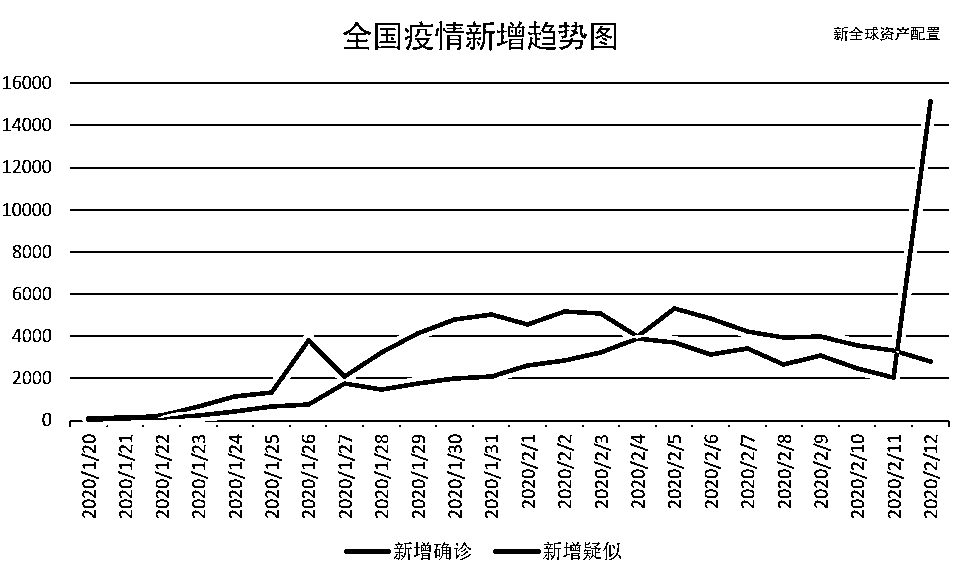
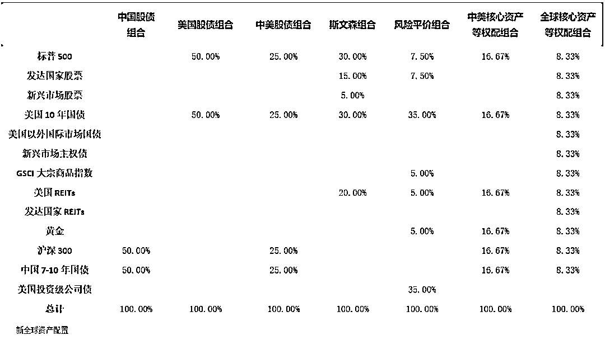

# 以史为鉴：重大疫情中的资产配置

> 原文：[`mp.weixin.qq.com/s?__biz=MzAxNTc0Mjg0Mg==&mid=2653297130&idx=1&sn=c97f0b2f5efd550fb94e6886c405246e&chksm=802ddbffb75a52e9effe810df0f8cfe5562fcc57e748887bf15193b4ff2028904f14b09a209c&scene=27#wechat_redirect`](http://mp.weixin.qq.com/s?__biz=MzAxNTc0Mjg0Mg==&mid=2653297130&idx=1&sn=c97f0b2f5efd550fb94e6886c405246e&chksm=802ddbffb75a52e9effe810df0f8cfe5562fcc57e748887bf15193b4ff2028904f14b09a209c&scene=27#wechat_redirect)

**标星★****置顶****公众号**爱你们♥  

***0***

**前言**

己亥末，庚子春，荆楚大疫，染者数万。2020 年的春天似乎开启得并不顺利，猛烈袭来的新冠疫情让很多人都经历了一个漫长而又揪心的春节假期。与此同时，资本永不眠，全球股票市场，尤其是与中国相关的股票资产，也遭遇了一波强劲冲击。
自 1 月 20 日晚钟南山院士接受央视采访指出新冠病毒存在“人传人”以来，到 2 月 3 日 A 股新年后第一个交易日收盘期间，黑天鹅扇动起了翅膀，市场陷入一片恐慌之中： 

数据来源：彭博终端、万得终端

数据时间：2020.01.21-2020.02.03

（注：本文中所有资产回报均使用美元计价）

中国 A 股市场自然是最大的重灾区，沪深 300 指数在区区 4 个交易日内便下跌了近 14%；在 A 股春节休市期间，海外跟踪 A 股股指的品种也出现了明显的恐慌抛售，其中美股市场上跟踪沪深 300 指数的德银沪深 300ETF 跌幅达 14.86%，新加坡富时中国 A50 指数期货（美元计价）则在 1 月 27 日大年初三单日下挫 5.64%。全球其他市场股指在此期间也出现了一定幅度的下跌，即使是表现最好的纳斯达克 100 指数，也在世卫组织（下文简称 WHO)宣布新冠疫情为“国际关注的突发公共卫生事件”（下文简称 PHEIC）后，于 1 月的最后一个交易日录得超过 2%的单日跌幅。其他大类资产中，由于大宗商品的需求预期在疫情的影响下大幅降低，GSCI 国际大宗商品指数下跌超过 10%；债券和黄金则充分发挥了其避险的作用，均获得了正回报。数据来源：万得终端 数据时间：2020.01.20-2020.02.102 月 3 日后，随着全国新增确诊和新增疑似病例的增长拐点逐步浮现，全球股票都基本修复了疫情黑天鹅带来的下跌，全球科技创新的代表纳斯达克 100 指数甚至继续连创新高。然而对于普通 A 股投资者来说，骤然吃下疫情带来的 10%以上的回撤还是非常难受的，尤其是 2 月 3 日，重新开市的 A 股大盘低开超过 8%，面对满屏幕的跌停，难免控制不住自己的恐慌情绪，加入抛售大潮之中......翻开人类的历史，可以说是一部与病毒的斗争史。尽管随着科学的进步和医学家不懈的努力，人类在预防和控制传染病方面已经取得巨大的进展。然而，21 世纪以来，非典型肺炎（SARS）、甲型 H1N1 流感、埃博拉病毒接踵而至。它们对当地乃至全球经济的影响，加上人们各种情绪及预期的交织，反应在全球资产的价格走势上。**以史为鉴，可以知兴替。在当前新冠病毒仍在肆虐之时，我们且看在历史上三次重大疫情事件中，股票和其他全球大类资产都受到了怎样的冲击，我们又可以如何应对。**

***1***

**历史上重大疫情对资本市场的影响**

** “非典” (2002/11-2003/07)**
谈起重大疫情，大家记忆最深的当属 2003 年的“非典”(SARS)。断货的板蓝根，烧醋的锅炉，弥漫大街小巷的 84 消毒液…这一幕幕还历历在目，举国上下陷入了恐慌。然而 SARS 对中国 A 股市场的影响却并没有想象的大，因疫情引发的恐慌抛售仅仅持续了一周。当时处于熊市周期(2001 年-2005 年)的 A 股，在疫情的发酵期和高峰期反而发生过猛烈的反弹。 但是相比之下，南边的东方之珠似乎就没有那么好运了。香港恒生指数不仅延续了 2001 年互联网泡沫破裂以来的下跌趋势，更因 SARS 疫情而雪上加霜。但值得一提的是，恒生指数也正是在 SARS 疫情的至暗时刻，于 2003 年 4 月 25 日形成了之后 5 年大牛市的底部。股神巴菲特也在这个黄金坑中挖到了港股中石油，成就了其投资中国的经典案例。以下是 SARS 疫情发展的时间线，以及当时的市场反应：我们按照 SARS 疫情事件的发展过程将其分为三个阶段——发酵期、高峰期及消退期。在此期间，A 股及港股的净值走势图如下图所示： 

数据时间：2002.05.16-2004.07.14

数据来源：彭博终端

上图展示了 SARS 疫情期间股市的净值走势。可以看到，市场对疫情的反应还是比较迅速的。在疫情的高峰初期，恒指便已开始下跌，整个高峰期内最大下跌幅度达 8%。进入高峰期末期后，市场步入反弹回升的阶段。而 A 股虽然反应较为迟滞，但受疫情驱动的下跌也是集中在疫情公开的第一周内。A 股和港股在时间上的差异，来自于当年国内面对重大疫情的处理经验远不如今天丰富，市场普遍低估了该疫情对全国经济的影响。总的来说，疫情对股市的冲击主要集中在 4 月底官方公布确诊人数暴涨的一周内，大盘出现了恐慌抛售，但该影响在官方数据显示的疫情拐点之前便已开始修复**。****因此从长期来看，一个能被解决的疫情对股市冲击通常存在于短期，对股票资产的长期发展影响不大。**A 股受 SARS 疫情的冲击主要集中在 2003 年 4 月 18 日至 2003 年 4 月 25 日期间。各大类资产的同期表现如下表所示：沪深 300 受非典疫情冲击最大时各大类资产的表现 数据来源：彭博终端、万得终端数据时间：2003.04.18-2003.04.25A 股和 H 股都分别受到了不小的冲击，其中沪深 300 下跌了 7.8%，恒指下跌 1.9%。激增的病例确诊人数使得 A 股市场投资者发现 SARS 疫情的影响此前被严重低估了，恐慌情绪造成 A 股在 6 个交易日中有 5 个交易日都是下跌状态。当年的五一假期后 A 股也延迟了两个工作日才在 2003 年 5 月 12 日重新开市，而疫情在 5 月初已迎来拐点。与此同时，国内债券市场并没有因为此次事件发生大幅上涨。原因在于，国内的整体宏观经济在第二季度摆脱了衰退的迹象，趋势向好，利率存在着向上预期，即债券面临下跌的压力。另一方面，“非典”这一黑天鹅的出现抑制了经济向好的良好预期。这一矛盾使得债券市场对定价出现了分化。在这一事件发生时，虽然股市立即反应出来，但债市却出现了先跌后涨，最终在这一股市回撤期间录得较小幅度的负收益。但从整个 4 月下旬来看，市场对疫情的担忧还是使得债市迎来了一个小牛市。至于其它海外资产，其价格波动受此次疫情冲击不大，更多的是受国际事件和宏观环境的影响。其中大宗商品发生了较大幅度的下跌，而美股、美债和黄金都在此期间录得正收益。伊拉克战争的开战消除了市场的不确定性，此外全球经济向好的趋势，使得 2003 年的第二季度成为各大资产持续上涨的起点，大宗商品也在 4 月底后开始回升。总的来说，在 SARS 疫情的冲击下，国内股市表现弱于债市，海外资产的表现又优于国内资产。但疫情的影响只存在于短期，港股的长期投资者否极泰来，甚至迎来了 5 年大牛市的起点。

**甲型 H1N1 流感（2009/04-2010/08）**

甲型 H1N1 流感最初于 2009 年 3 月在墨西哥暴发，并迅速在全球范围内蔓延。世界卫生组织(WHO)先将此流感称为“人感染猪流感”，后将其更名为“甲型 H1N1 流感”。疫情于 4 月中旬蔓延至美国以及全球。下面我们便以美国市场为主线，梳理疫情影响美国的时间线，并将整个过程划分成 5 个时间段：发酵期，高峰期 1，缓解期，高峰期 2 和消退期。如下表所示：与 SARS 疫情事件类似，在 2009 年 4 月 15 日美国首例病例出现时，美股市场并没有对疫情作出反应，标普 500 当日上涨了 1%,延续着底部爬升的势头。直到 4 月 25 日 WHO 宣布疫情为 PHEIC，资本市场才嗅到了一丝风险气息，标普 500 当日跌了 1%。然而此反应仅持续了一天，随后标普 500 便继续上涨。6 月 11 日，WHO 将警告级别提升至 6 级，资本市场终于意识到了疫情的严重性，H1N1 疫情进入了高峰期，标普 500、发达国家与新兴市场股票均在随后的一个月内大跌逾 6%。7 月中旬后，随着多数国家流感活动的下降，事件影响得到缓和，标普 500 强势上涨了 22%。然而疫情并没有直接结束，2009 年 10 月 23 日，奥巴马宣布美国进入紧急状态，疫情活动在美国达到了顶峰。此后 4 天，标普 500 连跌 4 天，合计跌去 3.4%。所幸疫情的拐点在十月底悄然出现，伴随的疫苗的使用，疫情在美国逐步得到控制。虽然 WHO 直到次年 8 月才宣布 H1N1 流感的大流行结束，但全球主要股指之后的走势已经跟疫情关系不大了。从下方的标普 500 净值图中也能更清晰的看到 H1N1 事件不同阶段，全球主要股指 的不同反应。总体来说由于当时全球股指处于 08 年金融危机后的超跌修复阶段，疫情冲击只带来了短期的回调，并未影响长期的上涨趋势。而发达国家股票和新兴国家股票走势与标普 500 走势基本一致，但受到疫情的冲击更大。值得一提的是，由于 H1N1 疫情的发源地在墨西哥，新兴市场股票更早地对疫情作出了反应。

数据时间：2008.09.02-2010.09.02

数据来源：彭博终端 

标普 500 在 H1N1 疫情的第一个高峰期受到冲击最大，发达国家和发展中国家股票也受到了同等级别的冲击，只有美国国债在此阶段能够获得正收益，其他品种都没能很好的帮助我们对冲风险，包括黄金。其中大宗商品和美国房地产行业受影响最严重，分别回撤了 14.37%和 12.72%。标普 500 受 H1N1 疫情冲击最大时各大类资产的表现数据时间：2009.06.11-2009.07.10 数据来源：彭博终端

**埃博拉病毒（2014/03-2014/12）**

埃博拉病毒最早出现在 1976 年的南苏丹和刚果民主共和国，从那时起，其高传染性和高致死率就令世人闻风丧胆。2014 年 3 月，西非又爆发了最大规模的埃博拉病毒疫情，受影响的国家主要包括几内亚、利比里亚和塞拉利昂。2014 年 9 月，埃博拉病毒传入美国、意大利和西班牙等国家，瞬间引起全球资本市场的担忧和恐慌。据统计，该次疫情最严重时期感染了 28,637 人，夺取了 11,315 人的性命。此次埃博拉疫情和同期资本市场反应的时间线索，如下表所示：我们按照埃博拉疫情的发展过程将其分为三个阶段——发酵期、高峰期及消退期。在此期间，美国标普 500 指数净值走势图如下图所示：

数据时间：2014.01.01-2015.03.31 

数据来源：彭博终端

在发酵期，由于疫情集中在非洲几个国家，对美国等资本市场发达的国家和地区并没有产生明显的影响，甚至在 8 月 8 日，WHO 宣布此次疫情为 PHEIC 之后，美股还在持续上涨。直到 9 月份，疫情传入了美国本土和欧洲发达国家，迅速造成了资本市场的恐慌。两周内，美股开始快速下挫，标普 500 指数一度下跌超 10%。与此同时，全球其他国家和地区均受到了不小的冲击，发达国家股票和新兴市场股票更是一泻千里，跌幅远大于美股。不同的是，美股在疫情尚未出现拐点时，便迅速完成了”V”形大反转，在此后的一个月，不仅收复了失地，还创出了新高。相比之下，发达国家和新兴市场股票就逊色了许多，并未回到前高，这也说明全球投资者对美国市场更为认可。11 月末，疫情逐渐在美国与发达国家被控制住，迎来了高峰拐点，除了新兴市场股指在 2015 年初还创下新低之外，美国和发达国家股票均已回到正轨。2014 年的埃博拉疫情，对美国股市的冲击主要集中在疫情的爆发期内 9 月 20 日至 10 月 15 日期间。对此，我们统计了全球主要大类资产在此期间内的同期表现，如下表所示：

标普 500 受埃博拉疫情冲击最大时各大类资产的表现 数据时间：2014.09.20-2014.10.15 数据来源：彭博终端在疫情重创美股的三周内，无论是发达国家股票还是新兴市场国家股票，都出现了较大的跌幅，大宗商品也不例外。同时，美国 10 年期国债和黄金则表现出了较好的避险属性，在此期间分别上涨了 3.69%和 1.44%。总的来说，此次埃博拉疫情事件，对全球市场来说是一个突发的“黑天鹅”，但“来也匆匆，去也匆匆”，从长期来看，仍然只是小插曲，并没有改变全球宏观基本面的走势。由于疫情并未波及中国，A 股市场在本次疫情中也没有受到冲击。

***2***

**资产配置组合可以缓冲重大疫情带来的冲击**

在前面的三次历史重大疫情对资本市场的影响分析中，我们不难总结出这样一个规律：**即疫情早期资本市场往往后知后觉，之后却猛然意识到疫情的严重性，相关的股票和大宗商品市场发生恐慌性抛售，但这种恐慌又往往能在最多一个月内消除，修复行情在疫情的高峰拐点来临之前便会开启。**
对于只配置了股票资产的普通投资者来说，疫情高峰期带来的急跌既让人措手不及，又使人难以承受。那么，投资过程中这种痛苦的经历能否通过构建一个分散化的全球资产配置组合缓解呢？我们便构建了以下资产配置组合：

**“非典”（2002/11-2003/07)**

非典疫情期间，由于疫情冲击主要集中在大中华地区，我们主要分析与中国资产相关的投资组合的表现。非典期间与中国资产相关的投资组合表现数据时间：2002.11.16-2003.07.14 数据来源：彭博终端 中国股债组合虽然将中国股票在疫情期间的最大回撤几乎减半，但其收益也比股票低了不少；若在此基础上加入美国股债组合，便占到了分散化的便宜，其回报和最大回撤都能得到极大的优化；若在中美股债组合的基础上再进一步分散化配置美国房地产和黄金，则投资组合在疫情期间和疫情结束后每个周期内都能取得更好的回报，同时最大回撤进一步降低。表现最好的组合当属在分散化程度最高的全球核心资产等权配组合，在包含了中国、美国、发达国家和发展中国家股债，以及全球大宗商品、全球房地产和黄金这 12 类资产后，该组合在 SARS 疫情期间的收益达到了 14.58%。

**甲型 H1N1 流感（2009/04-2010/08）**

H1N1 疫情期间相关的投资组合表现数据时间：2009.04.15-2010.08.11 数据来源：彭博终端

甲型 H1N1 流感在全球肆虐期间，正好赶上美股从 08 年全球金融危机的底部超跌修复时期，因此标普 500 本身尽管也曾出现超过 15%的回撤，但仍取得了 33%以上的不俗回报。中国资产在此期间的表现则拖了后腿，无论是中国股债组合还是中美股债组合，表现均不尽人意。但值得一提的是，在中美股债组合的基础上加入了美国房地产和黄金的中美核心资产等权配组合，则是另一番光景，其回报仅略逊于标普 500，但疫情期间的最大回撤却降低到了接近美国股债组合的水平。 

其他组合中，耶鲁基金掌门人斯文森构建的斯文森组合在 H1N1 疫情期间取得的收益傲视群雄；而依据桥水创始人达里奥的风险平价理念构建的全球风险平价组合的表现同样不遑多让，在不到 3%的最大回撤之下取得了 25%以上的区间回报。全球核心资产等权配组合，在此期间也稳稳跑赢了标普 500。

**埃博拉病毒（2014/08-2014/12）**

埃博拉疫情期间相关的投资组合表现数据时间：2014.08.08-2014.12.31 数据来源：彭博终端自 WHO 宣布埃博拉病毒为“国家关注的突发卫生事件”（PHEIC）起，至埃博拉病毒在主要发达国家得到控制的不到 5 个月中，美股牛市的势头受到了一定的抑制。此一时，彼一时，本次疫情中受影响较小的中国股市却迎来了大牛市的开端，持有中国股票的组合全部跑赢标普 500，而且中国股票占比越高的组合表现收益越高。埃博拉疫情结束后，2015 年夏天的那场股灾让无数投资者心碎，但持有足够分散化的中美股债组合和中美核心资产等权配组合的投资者依然能持续享受到稳稳的幸福。

**新冠疫情（2020/01/21-2020/02/03）**

新冠疫情期间相关的投资组合表现

数据时间：2020.01.21-2020.02.03

数据来源：彭博终端

回到本次新冠病毒疫情，尽管目前仍无法断言疫情的拐点为何时，然而巨大的市场冲击已然发生。如上表，区区两周内，只有中国股票占比极小的全球风险平价组合录得正收益。然而，即使持有了坑爹的沪深 300，中美核心资产等权配组合依然能依靠投资组合的高度分散性，在一片恐慌抛售中只出现了略高于 2%的回撤。**综上所述，分散化的全球资产配置组合，能在重大疫情到来之时，极大的缓冲疫情所在国的市场冲击。**然而，既然疫情带来的市场冲击大多只存在于短期的，全球资产配置组合在更长的市场周期内表现如何呢？以下为上述各投资组合在 2003-2019 年这 16 年间的表现回测结果：

各投资组合 16 年间的表现回测结果

数据时间：2003.01.01-2019.12.31

数据来源：彭博终端

虽然在收益端，各资产配置组合均略逊中美股指，但在风险端，各资产配置组合都大幅降低了波动率和最大回撤，因此在夏普比率上均高出中美股指不少。**持有全球资产配置组合可以使投资者更安稳地获得穿越牛熊周期的收益。**

***3***

**板块轮动配置能否抵御疫情对市场的冲击？**

面对重大疫情带来的黑天鹅，还有不少人提出在股票资产内部通过板块轮动配置，亦可起到抵御疫情对市场的冲击的作用。在此我们也抛砖引玉，从板块超额收益的角度来探讨，在疫情中受益最大的医疗板块以及最受伤的可选消费板块在三次重大疫情中的表现是否如人们所想。

**“非典”（2002/11-2003/07）**

数据时间：2002.11-2003.07

数据来源：彭博终端

如上图，我们使用了中国医疗板块指数以及中国可选消费板块指数作为研究对象，分析两个板块对沪深 300 指数的累计超额收益的走势。可以看到，在疫情对市场冲击最大的 4 月中旬至 5 月初，中国医疗板块的确在短期内对大盘超额收益猛增，然而随着疫情的消退，其超额收益很快便消失不见，甚至在疫情结束后的半年内出现了断崖式下滑；而可选消费板块却在疫情全过程中对大盘都有着稳定的超额收益，这与人们的印象并不相符。

**甲型 H1N1 流感（2009/04-2010/08）**

数据时间：2009.04-2010.08

数据来源：彭博终端

对于 H1N1 疫情，我们则通过美国医疗与可选消费板块指数对比标普 500 的累计超额收益对疫情造成的板块轮动进行分析。与 SARS 疫情类似的是，在 H1N1 疫情两次爆发高峰期中，医疗板块的超额收益均短暂出现了大幅提升，且在疫情消退后同样大幅跑输大盘；然而不同的是，美国医疗板块在整个疫情期间超额收益几乎都为负，而美国消费板块的超额收益则无论在疫情当中还是疫情后六个月都在持续上涨，仅在第一个疫情高峰期跑输大盘。

**埃博拉病毒（2014/03-2014/12）**

数据时间：2014.03-2014.12

数据来源：彭博终端

美国医疗板块和可选消费板块在埃博拉疫情期间的表现则大不相同。医疗板块在疫情进入高峰期开始便稳步跑赢大盘，其超额收益即便在疫情消退与结束后亦不曾衰减。相比之下，可选消费则在整个疫情期间内都跑输大盘，但在疫情消退后还是迎来了报复性上涨。然而，不管是可选消费板块在 SARS 和 H1N1 疫情中的持续强势，还是医疗板块在埃博拉疫情中大幅跑赢大盘，其根本驱动逻辑还是落在板块长期基本面上。**突如其来的疫情，即使在短期内使医疗板块超额收益激增，或让可选消费跑输大盘，当我们把时间拉长之后，这种短期影响都会趋向于均值回归。**

***4***

**写在最后**

面对突如其来的新冠疫情，中国举国上下积极应对，响应速度和力度都比 17 年前的 SARS 期间更快更强。然而本次疫情中我们面对的国内外经济形势也更复杂，央行放水下，近期各风险资产价格均 V 型反转。一边是百业萧条，一边是市场指数攀升，魔幻地共存着。
**而后会不会补跌呢？与其这样的瞎猜，不如老老实实地做资产配置。**

文章中反复提到的“黑天鹅”最著名的布道者是——纳西姆·尼古拉斯·塔勒布，他在另一本著作《灰犀牛》中指出：很多导致人们犯错的动因在于过于的急功近利、目光短浅、资源分配不均衡以及对风险的低估和误判。

书中提到，对非洲来说，“埃博拉病毒危机的爆发和许多其他的灰犀牛式危机的爆发是一样的，都始自人们的抵触否认和拖延怠慢。问题的根源在于非洲根本没有有效的健康医疗体系。导致埃博拉病毒暴发流行的原因，不仅仅是医学界要挑战的难题，行政管理问题、颠倒的奖惩制度、不合理的资源配置、疾病监测应对机制的失败；先受惰性阻碍、后受恐惧支配的决策过程；基层组织的匮乏等一系列的问题，都是疫情期间无法忽视难题。”

2014 年年末，世界卫生组织估计：埃博拉病毒带来一万多的死亡人数造成的损失还仅仅是个开始。其给非洲西部国家造成的经济损失大概是 320 亿美元，其中大部分的损失来自贸易和经济活动。据估计，如果事前建立一个疾病防控体系，其费用仅仅会是事后处理灾难时全部费用的一半。

而我们的选择，不应该只停留在‘事后花费重金补救’和‘事中任其发展’之间。**我们原本有机会建立一个事前机制。****对于疫情来看，是一套有效的防疫机制，可以随时响应；****对于投资者来说，一个能穿越牛熊，稳健抵御各种奇葩黑天鹅的侵袭的投资组合是我们的事前机制。**

写完这篇文章，希望让大家在这段不可多得的闭关修炼期中有所收获，也希望大家和家人都相安无事，在投资和生活中都要稳稳的幸福。

心系武汉

**等疫情结束，花枝春满。**

**山河无恙，人间皆安。**

2020 年第 39 篇文章

量化投资与机器学习微信公众号，是业内垂直于**Quant、MFE、Fintech、AI、ML**等领域的**量化类主流自媒体。**公众号拥有来自**公募、私募、券商、期货、银行、保险资管、海外**等众多圈内**18W+**关注者。每日发布行业前沿研究成果和最新量化资讯。

你点的每个“在看”，都是对我们最大的鼓励