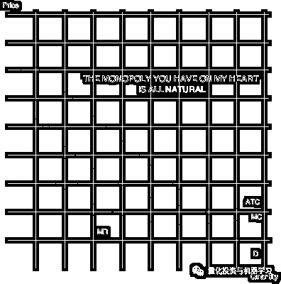
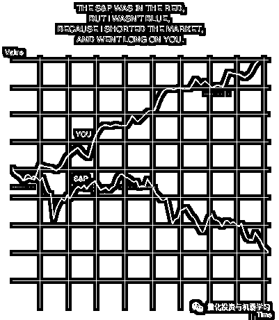
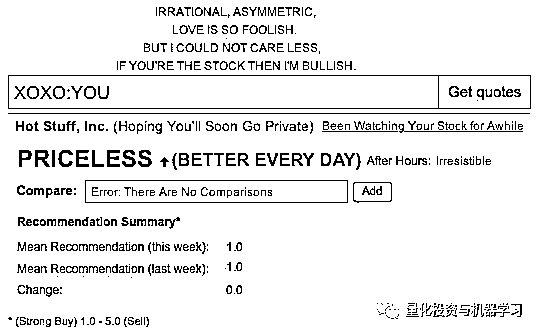
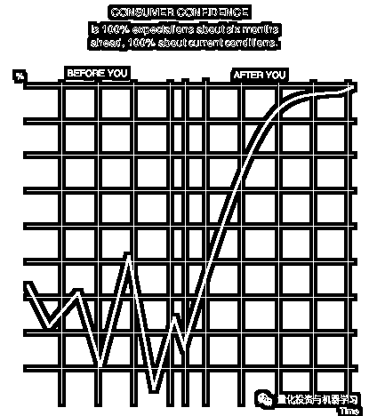
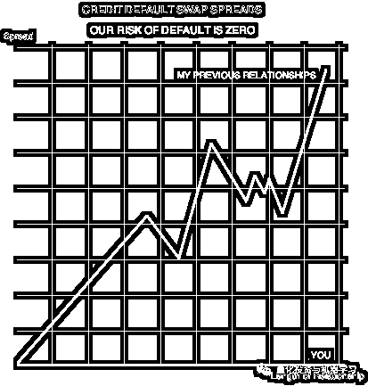
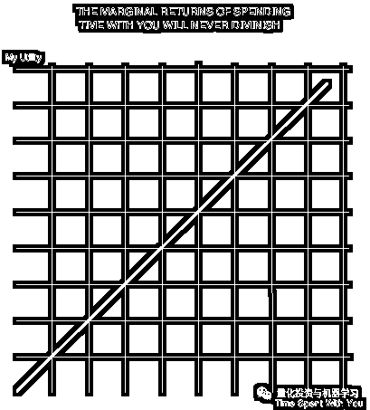

# 经济学教你

> 原文：[`mp.weixin.qq.com/s?__biz=MzAxNTc0Mjg0Mg==&mid=2653297125&idx=1&sn=2b4265a66f3be26b3266fda87bb5eafc&chksm=802ddbf0b75a52e666ed959b5a6488d6bfe459775d3e3826fe3f339f92acc94c9627e471ea4f&scene=27#wechat_redirect`](http://mp.weixin.qq.com/s?__biz=MzAxNTc0Mjg0Mg==&mid=2653297125&idx=1&sn=2b4265a66f3be26b3266fda87bb5eafc&chksm=802ddbf0b75a52e666ed959b5a6488d6bfe459775d3e3826fe3f339f92acc94c9627e471ea4f&scene=27#wechat_redirect)

**标星★****置顶****公众号**爱你们♥  

今天是情人节，用几张简单的图表跟大家分享，如何用酷酷的经济学轻松幽默地表达浪漫爱意。

**我的心里只有你**

**▍**你对我的心拥有垄断地位，而且是完全的自然垄断！

**无论股市怎么跌，我都一路看涨你**

**▍**中国股市红色是涨，而欧美股市红色是跌。short 和 long 分别是对股票价值的看空和看涨，所以蓝色在图中代表的是对你的坚定心意，会随着时间一路上扬，绝对的价值潜力股。

**如果你是一支股票，我就坚定牛市**

**▍****股票代码：**吻你。

**▍****企业名称：**超赞的你 （希望很快能成为我的私有）

**▍****股票价格：**无价（并且一天都比一天好）

**▍****对比股：**无与伦比

**▍**爱情是不理智的，不对称的。但我都不在乎，就是爱你。

**和你在一起后，我对爱情的信心是 100%**

**▍**遇见你之前，我对爱情的（消费者）信心低迷。现在我信心高涨，确定就是你！

**执子之手，与子偕老**

**▍**咱俩的信用违约互换（CDS）的违约风险永远为零。再也不会分开，不再让你孤单。

****越了解你就越爱你****

****

****▍**和你在一起共度时光，边际时间收益曲线永远向上。**

**---** 

**看到这里附赠彩蛋，第六张图发给对方后可以轻描淡写拽拽地加一句：**

****我觉得不应该是直线，应该是指数函数才对（跟你在一起的时间越多，爱你会更更多）。****

**对方要是接受了你的表白，就直接说：**

****让我们一起降低恋爱婚姻市场的摩擦性失业率吧！****

**同时，公众号也要表白武汉**

**心系武汉**

****等疫情结束，花枝春满。****

****山河无恙，人间皆安。****

****我们就相爱吧！****

**2020 年第 38 篇文章**

**量化投资与机器学习微信公众号，是业内垂直于**Quant、MFE、Fintech、AI、ML**等领域的**量化类主流自媒体。**公众号拥有来自**公募、私募、券商、期货、银行、保险资管、海外**等众多圈内**18W+**关注者。每日发布行业前沿研究成果和最新量化资讯。**

******你点的每个“在看”，都是对我们最大的鼓励**