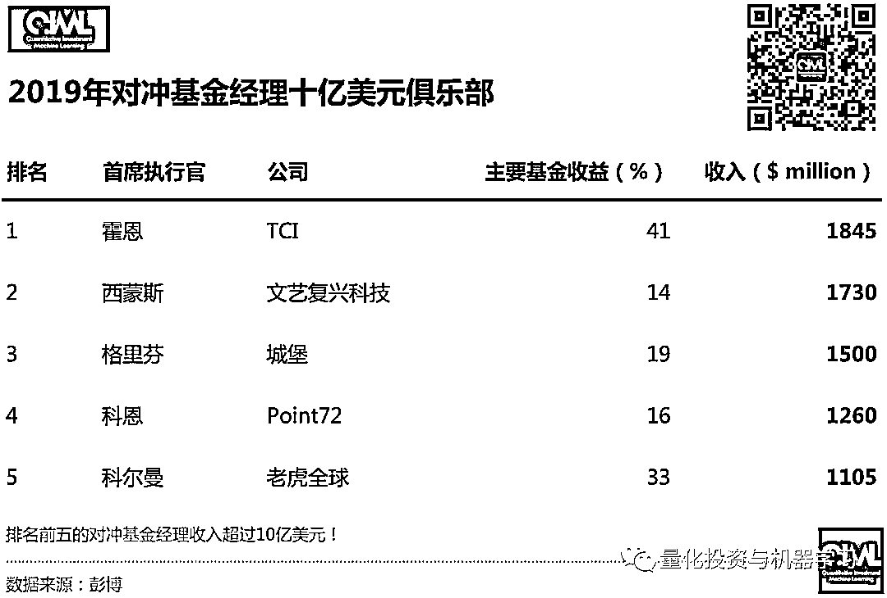
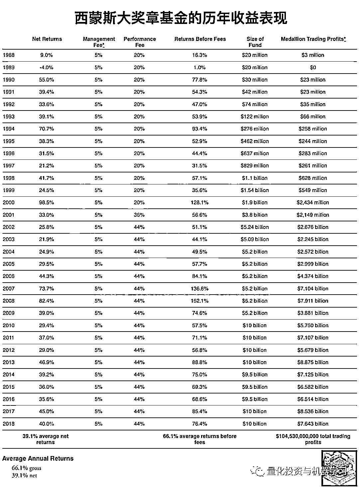
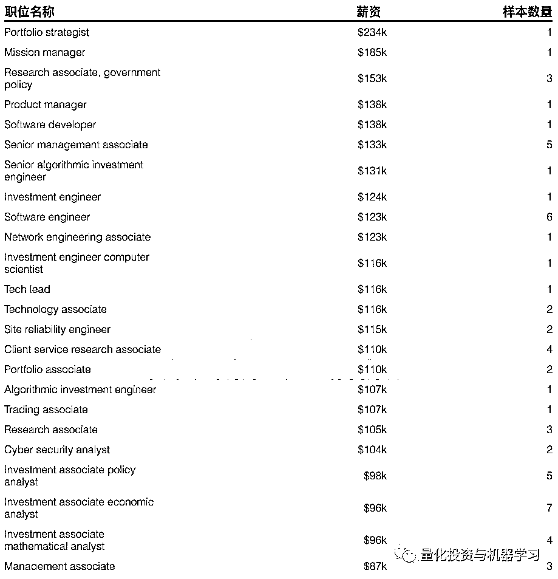

# 一百二十、亿！全球 15 位顶级对冲基金经理收入揭晓~

> 原文：[`mp.weixin.qq.com/s?__biz=MzAxNTc0Mjg0Mg==&mid=2653297105&idx=1&sn=877a0889c6cab876fc924cc06dc55604&chksm=802ddbc4b75a52d2f58e1f03b3e58b1c97f1abcbdb998657dcd0ed87c6a91e01994c0dda1bf0&scene=27#wechat_redirect`](http://mp.weixin.qq.com/s?__biz=MzAxNTc0Mjg0Mg==&mid=2653297105&idx=1&sn=877a0889c6cab876fc924cc06dc55604&chksm=802ddbc4b75a52d2f58e1f03b3e58b1c97f1abcbdb998657dcd0ed87c6a91e01994c0dda1bf0&scene=27#wechat_redirect)

**标星★****置顶****公众号**爱你们♥   

量化投资与机器学习微信公众号报道

**120 亿！****(单位：****$)**

是的，你没听错，是这个数字！

这一数字超过了 JPMorgan 向其所有 5.6 万名员工支付的薪酬！

这一数字几乎是去年拉斯维加斯赌客输掉钱的 2 倍！

同时，**这也是 2019 年 15 位对冲基金经理的收入总和！**

***1***

**先看一组数字**

先不管这 15 位对冲基金经理的收入，我们首先来看一份 LCH 近期发布的投资报告：在 2019 年，**有 20 位表现优秀的对冲基金经理获得了 593 亿美元的收益，实现了至少 10 年来的最佳年度收益。**

TCI 基金经理 Christopher Hohn 的 TIC 获得 84 亿美元的惊人收益，位居榜首。Lone Pine 的基金经理 Steve Mandel 以 73 亿美元的收益位居第二，文艺复兴科技的西蒙斯位居第三。这项年度调查的重点是那些自成立以来总体利润最高的基金经理，而规模最大、历史最悠久的对冲基金往往在这一排名中表现最好。 

**如需获取****高清原图****，****后台回复****【前 20】**

看到了上面的榜单，想必大家心里也有数了。在对冲基金 2019 年吸收赚的**1780 亿**美元资金中，**表现最好的 20 家基金约占三分之一**。自成立之日起，所有对冲基金共为客户赚取了 1.28 万亿美元，其中的 44%，约 5580 亿美元来自前 20 名。同时在 2019 年，基金主要受益于股市和债市的飙升。2019 年美股三大指数全年均涨逾 22%，纳指甚至涨逾 35%，录得 2013 年来最大年度涨幅。

下面我们就来看看具体对冲基金管理人的收入情况：

***2***

**江湖精彩，大佬依旧！**

**如需获取****高清原图****，****后台回复****【120 亿】**

***3***

**排名前五的 10 亿大佬**

根据彭博亿万富翁指数的估计，其中：Chris Hohn、Jim Simons、Ken Griffin、Steve Cohen 和 Chase Coleman**每人的收入超过****10 亿****美元****！**

这些基金公司中有许多都是**通过****押注同一只股票（通常是科技股）赚钱的**。根据对一份对监管申报文件的分析上超过，在 10 家贡献股票收益率最高的公司中，马云的**阿里巴巴**和**Facebook**是最高的两个！

**霍****恩**，欧洲最大的对冲基金之一掌门人。在他管理的 TCI 上涨 41%后位居榜首。主要是因为他集中押注于一些股票，包括：Alphabet、微软和加拿大铁路等而收益颇丰！

*图片来自：网络

**格****里芬**，通过他的多策略基金赚了将近 15 亿美元。这还不包括他的做市业务 Citadel Securities，该业务创造了数十亿美元的收入。

*图片来自：网络

**史****蒂文• 科恩**，如果不熟悉他的朋友一定知道《Billions》这部剧：

**尔虞我诈、****环环相扣、****高潮迭起**

*图片来自：网络

**相关阅读：**

[扒一扒 Billions 第四季：你必须知道的投资秘密（上）](http://mp.weixin.qq.com/s?__biz=MzAxNTc0Mjg0Mg==&mid=2653293801&idx=1&sn=00e71e5179b99ac8cf60ecebf996d37c&chksm=802dcefcb75a47ea118e5c20195a85ceabd4785eacc67a31c380450a856219ffd9b50466429e&scene=21#wechat_redirect)

[扒一扒 Billions 第四季：你必须知道的投资秘密（中）](http://mp.weixin.qq.com/s?__biz=MzAxNTc0Mjg0Mg==&mid=2653293936&idx=1&sn=59f47b30f8b0a9468328ed8515d76f78&chksm=802dcf65b75a4673a642430965d9bafc853b26be01804153be196ab0a8afef9272cf3e6f4805&scene=21#wechat_redirect)

[扒一扒 Billions 第四季：你必须知道的投资秘密（下）](http://mp.weixin.qq.com/s?__biz=MzAxNTc0Mjg0Mg==&mid=2653294079&idx=1&sn=001acaeef585dc688ebf83171c058116&chksm=802dcfeab75a46fc69e14d2a2cd0e56553b7f89d54217b896d7b58e53cce34bd2c7b51386120&scene=21#wechat_redirect)

SAC 的创始人 Steve Cohen（史蒂文• 科恩，现为 Point72 首席执行官）。其旗下基金被称为美国最赚钱的基金之一，其近 20 年内高达 30%的年均收益率一度被认为投资传奇。而在被控内幕交易后，该基金被迫对外部投资者关闭，并缴纳 18 亿美元天价罚款及和解金。**Billions 中的****主角鲍比·阿克塞尔罗德的原型正是科恩。**

剧中鲍比的原型：科恩

1978 年科恩从宾大沃顿商学院毕业。之后进入华尔街 Gruntal 公司成为一名初级交易员，凭借着独特的天赋，工作第一天他就获得了 8000 美元的收益。由于表现出色，很快科恩就开始独立领导自己的团队，手下有 6 名交易员，负责管理 7500 万美元的资金。1987 年 10 月 19 日美国股市单日暴跌 22.6%，创下华尔街史上最大百分比跌幅。科恩认为，纽交所的经纪人们把股市价格看得太低了，之后他把公司的 5000 万美元资金押注股市。暴跌后第二日股市出现反弹，科恩的大胆押注帮助公司弥补了损失。Gruntal 公司允许交易员从收益中提取 60%，科恩在第一年赚了 10 万美元，第二年赚了 100 万美元。在他 25 岁左右的时候，在市场平淡的年份里，他也可以赚得 500 万美元；行情好的话那就是 1000 万美元。1992 年，在华尔街积累了丰富经验和雄厚财富的科恩成立了自己的基金：**塞克资本（SAC Capital）**，公司的名字源于他自己名字的三个首字母缩写。 

在之后的 18 年里，以平均收益率超 30%傲视群雄，2000 年的收益率甚至高达 70.34%。

Billions 中，Axe Capital 手下的基金经理一年收入都是百万美元起步。超级跑车，豪宅，以及巨大的压力是 Axe Capital 的基金经理典型写照。这也是 SAC 旗下基金经理的写照。许多人了解 SAC 是因为，曾经有一个中国明星交易员江平，在 2009 年拿到了令人咋舌的 1 亿美元奖金！这个数字已经超过了许多对冲基金的创始人。这就是 SAC 基金经理的收入水平。

**在 SAC 工作的人大概是世界上最辛苦的 200 名员工，“没业绩，毋宁死”，他们年薪通常 200 万美元以上，但关键要看各人表现，而不是 SAC 整体赢利情况**。在 SAC 有着丰盛的假日派对，三名公司内部的按摩师，以及公司旁边的雪茄吧。在公司的停车场更是豪车云集，从法拉利，马萨拉蒂到宾利一应俱全。

 **“如果说索罗斯是老虎，他就是对冲基金行业的大白鲨”** 科恩的一位资深客户对媒体如此表示。

也正是因为超高的回报，科恩管理的基金也屡遭质疑，甚至是调查。

*图片来自：网络

查克的原型叫 Bharara，是一名印度裔的美国联邦检察官。他起诉过花旗银行和美国银行，有过成功定罪连胜 85 起的记录。Bharara 指控科恩及他的公司涉嫌内幕交易。从此契而不舍地追踪科恩和他公司的交易行为。

2013 年，终于有一项指控得到落实，SAC 承认涉及内幕交易，当局开出了 18 亿美元的罚单，创下美国有史以来最高的内幕交易罚金纪录。8 名直接参与内幕交易的员工先后入狱。曾经辉煌一时的 SAC 退出了历史舞台。

*图片来自：网络

经历了多重内幕交易丑闻之后，SAC 进行转型。将公司更名为**Point72 资产管理公司**，作为认罪协议的一部分，科恩同意他的公司将不再为外部投资者管理资金。Point72 正式成为一家家族理财室，其资本绝大部分是科恩本人的，还有少量来自员工。

新公司的名字可能源自 SAC 的地址 72 Cummings PointRoad。公司在网站宣布，Point72.com 所代表的是道德、卓越、机遇、创新和领导力。公司使命是通过提供卓越的风险收益回报力争成为资产管理界的翘楚；同时坚持最高的道德标准，并向业内的优秀人士提供机遇。

*图片来自：网络

在 Piont72 成立的当年，公司便获得了不菲收益，远超其他对冲基金表现。据纽约时报报道，2014 年 4 月以 100 亿美元启航的 Point72 总收益达到 25-30 亿美元。虽然这部分收益未剔除运营成本，但短短 8 个月内就有如此强劲表现还是证明科恩宝刀未老。

现在我们再看看 2019 年的排名，我们看到一个有趣的发现：

科恩在**基金收益**这块占到了他**总收入**的**89%**，力压文艺复兴的西蒙斯、Citadel 的格里芬，**真的是凭本事赚钱啊！****！****！**

*图片来自：QIML 自制

**西****蒙斯**今年 81 岁了，尽管十年前老爷子就从文艺复兴退休了，但他在榜单上的江湖地位那杠杠的！加上他在文艺复兴的股份和他对大奖章基金的投资，几乎可以保证他在未来几年仍将是薪酬最高的经理人之一！

**相关阅读：**

同时，在前段时间，文艺复兴正在重组董事团队，这些董事最终将接替创始西蒙斯，执掌全球最赚钱的对冲基金之一。根据提交给监管机构的文件，文艺复兴将董事会的成员数量增加了一倍（10 人），并将西蒙斯的儿子 Nathaniel Simons 提升为联席董事长。

前段时间编辑部推荐的由 Greg Zuckerman 撰写的畅销书***《The Man Who Solved the Market》***让我们了解了很多关于西蒙斯和文艺复兴的故事。也在量化圈引起热议，众多达人分享读书心得或评论。

**点击图片获取此书**

说起老虎基金，编辑部相信很多读者首先想到的是其创始人 Julian Robertson 老爷子。真的是不亏叫老虎：

**无冕之王，咆哮而来！**

*图片来自：网络

Julian Robertson 他所主导的基本面价值投资方法影响了华尔街一代的对冲基金经理。即使在今天老虎系的投资人也遍布整个华尔街比，如今天我们介绍的 Tiger Global 的老大**科尔曼。**

*图片来自：网络

**科****尔曼**更倾向于风险资本投资，其 360 亿美元的资产中约有一半来自风险资本投资，而他的对冲基金管理着约 100 亿美元。他的业绩一直保持两位数，2019 年的收益率达到 33% ！

科尔曼的老虎全球**只有两次亏损**：

***4***

**其余 10 位大佬收入**

从后 10 位的榜单中，我们可以看到：

**达****里奥**旗下最著名的**Pure Alpha II 基金**遭受了自 2000 年以来的首次亏损，跌了**0.5%！**因为自 1991 年 12 月桥水成立以来，除了 3 年以外的所有年份都实现了盈利。这样说达里奥今年排名下跌的一个主要原因。

如下图所示，与同类基金和宏观基金指数相比，Pure Alpha II 基金表现令人唏嘘！**标普 500 今年收益率都有 31.5%**，确实有点难受！

*图片来自：网络

Pure Alpha 在 2010 年和 2011 年分别达到 45%和 25%的最高收益率之后，就一直表现不佳。达里奥的旗舰产品自 2012 年初以来的年化收益率为 3.8%，2018 的收益率为 15%。这使得它在这一时期落后于 Jeff Talpins 的 Element Capital Management 和 Tudor Investment Corp.等佼佼者，而根据 Bloomberg 汇编的数据，过去三年的情况也是如此。

*图片来自：彭博

早在 2019 年 8 月，Pure Alpha 在年初至今下跌了 6% ，这要源于在债券收益率跌至创纪录低点时，其看跌全球利率。

原因是在 2019 年 8 月，**随着全球最大两个超级大国之间的贸易紧张局势进一步升级，面对全球经济增长前景日益恶化，各国央行转向温和，投资者纷纷转向相对安全的政府债券，导致债券收益率（与价格走势相反）暴跌至年来最低水平。**

据彭 Bloomberg 的报道，Pure Alpha II 当时下跌了 9%。

*图片来自：网络

2019 年 11 月，华尔街日报在题为《Bridgewater Makes $1.5 Billion Options Bet on Falling Market》的报道中指出，桥水押注 15 亿美元﹙约 106 亿元﹚，打赌未来 3 个月股市下跌。该报称，无法确定这笔投资是对市场的定向押注，还是对公司其他投资项目的风险对冲。

华尔街日报报道称，桥水通过高盛与摩根士丹利等华尔街投资银行的操作，斥资 15 亿美元购入大量看跌期权（put options）合约，涉及美股及欧股市场。据报道，这批 15 亿美元的看跌期权，占桥水目前资产管理规模的 1%左右。尽管比例不高，但这种放空的选择权具有时效性，如果股市没有在今年底前或明年 3 月前出现大幅度下跌，这笔大额空单将血本无归；如果出现像去年一样的情况重挫 20%，这笔合约可获利 270 亿美元。

*图片来自：网络

桥水在 3 月前买入看跌期权，作为 1000 亿美元的 bet 或对冲标普 500 和 Euro Stoxx 50 的一者或两者。

华尔街日报还说，桥水投资的空仓仓位很不寻常，该对冲基金正在押注股市将出现尾端风险（tail-risk）。

# **尾部风险（tail risk）**

尾部风险是指在巨灾事件发生后，直到合约到期日或损失发展期的期末，巨灾损失金额或证券化产品的结算价格还没有被精确确定的风险。一般指价格呈现极端大幅波动的风险，尾部风险产生的概率较小，但是发生一次带来的破坏力极强。

达里奥对这篇报道感到震惊，他在领英上否认了《华尔街日报》的报道。推文指出：“报道是错的。坦白说，我们没有任何押注股市会跌的净仓位。”

*图片来自：领英

他还指出，已经向撰写这篇报道的记者表示，向外传达桥水基金对股市感到悲观，具有误导性，结果《华尔街日报》还是这么做了。

机构投资者去年率先报告了 2019 年 Pure Alpha II 的亏损，有一段这么说：

*桥水在与客户的沟通中强调，Pure Alpha 的设计宗旨是：****与客户选择的基准相比，不管市场走向如何，都能产生正的 Alpha，没有系统性偏差****。** Pure Alpha 基金采用了桥水的混合组合策略。*

***这些基金与市场其它领域也没有关联****。** 根据桥水早期的一份文件显示，从该基金成立到 2018 年底，其与股市的相关系数为 0.19，与债券的相关系数为 0.15，与其他对冲基金经理的相关系数为 0.07。*

*2008 年，Pure Alpha 给投资者带来了很好的收益，在标普 500 指数下跌 37%的一年里，该指数上涨了 9.4% 。** 在 2018 年，Pure Alpha 的表现略好于市场。*

同时。Pure Alpha 策略的结构还为投资者提供了不同程度的波动性。客户通常会将一只 Pure Alpha 基金叠加在他们选择的 Beta 策略上，比如叠加在标普 500 指数上或全天候上。覆盖策略涉及使用衍生工具复制或抵消一个资产类别或市场风险敞口。

与此同时，据一名投资者称，为寻求在华投资的国际投资者打造的中国版全天候（All Weather，All Weather China）在 2019 年增长了 20.1%。

最近，一些人将达里奥作为作家的巨大声望和成功与其旗舰产品低迷的表现相比较。在《原则》的聚光灯下，Pure Alpha II 的表现显得没落。

达里奥是不是在自己的新书《原则》宣传上花了太多时间呢

*图片来自：领英

这本 600 页的成功宣言自 2017 年 9 月出版以来，已售出 220 万册。比尔·盖茨等名人都称赞过它，最近它还被改编成了儿童插画版。

与纳斯达克指数相比，2019 年几乎所有股票看起来都很像失败者

*图片来自：网络

桥水目前的管理规模约为 1600 亿美元，其中包括对冲基金和低收费产品，这个数字在过去 10 年的大部分时间里基本保持不变。作为全球最大对冲基金的创始人，达里奥的光环堪比巴菲特、Bill Gross。根据 Nexis 的搜索结果，自从 Dalio 的书出版以来，他已经在媒体上被提及了 9000 多次。

**D****avid Shaw**的排名虽然靠后，但是这位哥伦比亚大学前计算机科学教授管理的 D. E. Shaw 规模逾 500 亿美元。而且他本身很严谨、很聪明！

*图片来自：网络

如今，D.E.Shaw 在量化投资与传统基本面策略（如选股）结合方面处于领先地位。这种共生关系被资产管理公司戏称为：**Quantamental**（它是 Quantitative 和 Fundamental 两者的结合，就是**“量化”+“基本面”**的意思，简称**量本投资**）。

自从在 Union Square 成立以来，D.E.Shaw 已为投资者赚取了逾 290 亿美元。

尽管去年金融市场出现动荡，但其规模 140 亿美元的旗舰基金（自 2013 年以来一直不对新投资者开放）的净回报率超过 11%。这是 D.E.Shaw 在过去 10 年里第 7 次实现两位数增长，而在此期间，D.E.Shaw 从未经历过亏损。其 76 亿美元的宏观基金 Oculus 在 2018 年的回报率为 5.9%，以股票为主的 70 亿美元基金 Valence 的回报率为 8%。

*图片来自：FT

D.E.Shaw 的高管强调，他们唯一不变的就是全面采用数据驱动的“量化”方法，无论是在高速套利还是投资可再生能源领域。D.E.Shaw 投资者关系主管亚 Alexis Halaby 表示：**“我们的核心优势是对事物进行科学思考，因此我们不会觉得自己在偏离本源”。**

**D.E.Shaw 目前雇佣了大约 1300 名员工**，其中包括**80 多名博士**和**25 名国际数学奥林匹克奖牌获得者**。D.E.Shaw 的所有应聘者要都面临一系列的分析性问题，以证明自己是否适合在那里工作，就连美国前财长 Larry Summers 在 2006 年进入该公司之前，也不得不经历这些问题。观察人士表示，这种做法已渗透到企业文化中。

**我们的目标是找到金融市场可观测性模糊的边缘，这种模式非常微弱，以至于还没有被其他量化研究员所利用。然后他们尽可能多地储存这些信号，并系统地挖掘它们，直到它们耗尽——然后重复这个过程。从只有机器才能检测到微小、短暂的套利机会，到使用卫星地图等另类数据，是为了更好地了解一家公司的业绩。**

*图片来自：网络

**D.E.Shaw 还在加大对计算机科学前沿领域的投资**，成立了一个由《The Master Algorithm》作者、计算机科学与工程学教授 Pedro Domingos 领导的机器学习研究小组，并投资于一家量子计算初创公司。

现在还为时尚早，D.E.Shaw 董事总经理 Cedo Crnkovic 表示，一台功能齐全的量子计算机可能具有革命性的意义。他说：**“算力驱动着一切，为我们所能做的事情设定了一个限度，因此，成倍增长的计算能力将是革命性的。”**

几乎所有的传统投资公司都在争先恐后地聘请数据科学家、程序员和技术人员，把自己变成人与机器的混合体。D.E.Shaw 在连接这两个方面十分成功！

***5*** 

**编辑部的话**

**所以还是要去****顶级****的量化（对冲基金）私募！******

Citadel 认为，在整个薪酬体系中，对冲基金（买方）向量化分析师支付高于投资银行（卖方）的薪酬。 这有助于从事买方交易的量化分析师能从其 pnl 中获得最多 50%的提成。

下表列出了 Citadel、Renaissance Technologies（文艺复兴）、Balyasny、Two Sigma 和 Point72 等公司最近聘用的持 H1B 签证人的工资范围。平均工资远并不是 50 万美元以上，而是相对较低的**14.5 万美元**，最低工资也很低，才**5.8 万美元**。

显然，这些只是工资，因为对冲基金以支付高额奖金而著称。然而，如果你的工资是 15 万美元，你不太可能很快赚到 100 万美元。对冲基金的数据科学工作当然薪水不错，但是金钱和神话不一定相符。

**▍文艺复兴**

数据表明，文艺复兴是很多对冲基金中薪酬最高的机构之一。然而，值得注意的是，**工资并不是大多数人为西蒙斯工作的原因。****真正的吸引力是他们向 Medallion 基金投资的机会**，该基金只对员工开放，自 1988 年成立以来，**每年的回报率约为****40%****。**

****▍桥水****

这份表格上，高薪职位显然是 mission manager，年薪 18.5 万美元。目前还不清楚这指的是什么，但人们猜测这与戴利奥的原则有关，相对较高的薪酬反映出这一更广泛的使命对基金会有多么重要。

**▍Citadel**

H1B 签证数据显示，Citadel 向其**交易主管**支付了**50 万美元**的薪酬。今年 6 月，一名**大宗商品主管**的薪资为**50 万美元**，而一名**量化交易主管**的薪资为**37.5 万美元**。

**资历较浅的量化研究人员的薪酬从 14.5 万美元到 22 万美元不等**。**电子交易分析师和助理的薪酬为 10.5 万美元或 15 万美元**。

值得注意的是，**H1B 数字不包括奖金**，如果你是一明投资交易人员并能产生 Alpha 收益，那么，上面的数字是相当可观的。在许多情况下，基本工资只占总薪酬的一小部分。

**▍Millennium**

千禧年对冲基金在全球范围内被分为 200 个独立运营团队，每个团队的**收益与其自身业绩成正比**。 而千禧年的薪酬结构更加细化：**如果你的团队的策略做得好，你就会得到奖励，即使该基金其他团队都出现了亏损。**

这对你的工资和奖金意味着什么？千禧年没有在全球公布薪酬，但该基金的两家英国实体：Millennium Capital Management ltd.（英国控股公司，包括所有行政和投资人员）和 Millennium Capital Partners LLP（主要由投资人员组成）刚刚公布了截至 2018 年 12 月 31 日的年度薪酬信息。

Millennium Capital Partners 的薪酬最高。2018 年，12 名合伙人的平均利润分配为 130 万英镑（高于前一年的 110 万英镑），**收入最高的合伙人获得 650 万英镑**（低于前一年的 700 万英镑）。

除了 12 名合伙人，Millennium Capital Partners 在 2018 年聘用了**127 名专业投资人员**，向他们支付了总计 6900 万英镑的薪资，**平均每人 54.3 万英镑**。

如果加上行政人员，平均薪酬就会下降。Millennium Capital Management 在英国的 279 名员工（142 名专业人士和 137 名管理人员）2018 年的平均薪资为 9200 万英镑，**平均每人 33****万英镑**。

去年，千禧年旗下两家英国公司的营业额都增长了 19%左右，达到 2.26 亿英镑。然而，每个注册实体的成本几乎成比例增加，结果是利润基本停滞不前。

**▍其他**

下面列出的一些对冲基金是大型雇主。例如，Winton Capital Management 有 375 名员工。BlueBay 有 317 名。Aspect Capital 拥有 142 家公司等等。

除非你是合伙人，否则对冲基金对雇主的吸引力可能会比以前小。在伦敦的高盛（Goldman Sachs）， 2018 年的平均薪资为 31.4 万英镑，高于下表中的大多数对冲基金。一旦你加入了对冲基金，就很难再离开了。

2020 年第 37 篇文章

量化投资与机器学习微信公众号，是业内垂直于**Quant、MFE、Fintech、AI、ML**等领域的**量化类主流自媒体。**公众号拥有来自**公募、私募、券商、期货、银行、保险资管、海外**等众多圈内**18W+**关注者。每日发布行业前沿研究成果和最新量化资讯。

你点的每个“在看”，都是对我们最大的鼓励