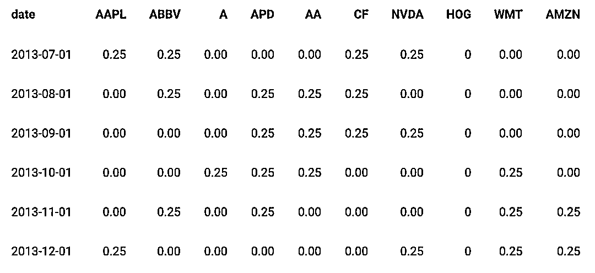

# 投资组合优化模型

> 原文：[`mp.weixin.qq.com/s?__biz=MzAxNTc0Mjg0Mg==&mid=2653297069&idx=1&sn=0ce39862e32f523faf81a971caa357ad&chksm=802ddbb8b75a52aece5e05cc447a6342a25da4d3b2551caa7cfcc02e660c5280a8206f3e8bc3&scene=27#wechat_redirect`](http://mp.weixin.qq.com/s?__biz=MzAxNTc0Mjg0Mg==&mid=2653297069&idx=1&sn=0ce39862e32f523faf81a971caa357ad&chksm=802ddbb8b75a52aece5e05cc447a6342a25da4d3b2551caa7cfcc02e660c5280a8206f3e8bc3&scene=27#wechat_redirect)

**标星★****置顶****公众号**爱你们♥   

作者：Matthew       编译：方的馒头

***1***

**前言**

今天这篇还是**通过 R 语言实现**。

投资组合优化方面的文献已经有数十年的历史了。在今天的推文，我们将介绍一些传统的投资组合优化模型。总体目标是从考虑的所有可能的具有定义的目标功能的投资组合中选择资产的投资组合。

**数据**

数据是使用 tidyquant()包的 tq_get()函数收集的。然后，使用 quantmod()包中的 periodReturn 函数将每日资产价格转换为每日对数收益。接下来，使用 rsample()包中的 rolling_origin()函数构造 6 个月的每日收益列表。目标是在滚动的基础上计算训练集（即 6 个月）上的 6 个月平均收益 mus 和 6 个月协方差矩阵 Sigmas，并将其应用于测试集（即 1 个月后）-每月再平衡。

正如收益数据一样，其同样适用于月度价格数据。

**价格和收益数据**

第一个 split 的收益数据如下所示：

**统计数据**

Mus（平均收益）数据如下所示：

Sigmas（协方差矩阵）数据如下所示：

***2***

**比较投资组合优化**

**全局最小方差投资组合**

全局最小方差投资组合

是一种资产组合，它为我们提供尽可能低的收益方差或投资组合波动性。这里的波动性被用作风险的替代品，因此波动性差异越小，资产的风险就越小。投资组合只关注风险，忽略预期收益。

目标函数是:

由于Σ未知，我们可以用协方差矩阵来估计它为Σ^。其中凸解变成：

我们的目标是希望从模型中找到最佳权重，从而使我们的风险最小化。

下面的问题包括我们的 Minimisation 问题

quad_form 函数采用

二次型，其中是 x 向量，p 是矩阵，或者在我们的例子中 w 是权重向量，∑是 A1,···,A5 的协方差矩阵。这些约束条件对应于

其中我们不能给我们的资产分配负权重，我们将所有资本投资于投资组合。

我们可以使用 R 中的 Disciplined Convex Programming(CVXR)包，其中:

*   分析问题

*   检验凸性

*   将问题转化为规范形式

*   解决问题

我们希望从模型中找到最佳权重，以使我们的风险最小化。我们可以通过解决优化问题，将列表绑定到单个数据框中并使用 ggplot2 来绘制样本最佳投资组合权重中一个月的滚动-基于前六个月的滚动 mus 和 Sigmas 来实现。

***3***

**马科维茨投资组合**

马科维茨均值-方差投资组合构建如下：

我们可以通过调整λ来设置不同的风险参数，并查看收益如何受到影响。这可以通过对具有不同值的数据运行多个优化问题来完成。较高的值将重点放在等式的右侧，因此不利于投资者的风险更大。

我们可以看到下图λ中的值变化如何影响风险和收益。 随着λ值的增加，我们承担的风险越小，但我们假设的收益就越少。低值的资产使我们以资产 A5 的权重投资于单项资产，增加λ值会增加其他资产 A4 的权重，从而分散了我们的风险。

**最大夏普比率**

**Mu 五分位数投资组合**

**Mu/Diag（Sigma）投资组合**

**Mu/Diag（sqrt（Sigma））投资组合**

***4***

**结果分析**

有 8 种不同的投资组合优化模型。将所有数据汇总在一起，可以更快速地检查结果。

  

从图中可以看出，全局最小方差投资组合显示出投资组合收益的最低波动性。 在此期间，每个投资组合的年终绩效指标也显示在底部。

绘制累积收益率表明，Markowitz lambda 投资组合在同一时期内的收益率最高，但是在同一时期内它们的标准差也最高。

此外，一些额外的测试数据，留在这里供大家将来参考：

2020 年第 36 篇文章

量化投资与机器学习微信公众号，是业内垂直于**Quant、MFE、Fintech、AI、ML**等领域的**量化类主流自媒体。**公众号拥有来自**公募、私募、券商、期货、银行、保险资管、海外**等众多圈内**18W+**关注者。每日发布行业前沿研究成果和最新量化资讯。

你点的每个“在看”，都是对我们最大的鼓励