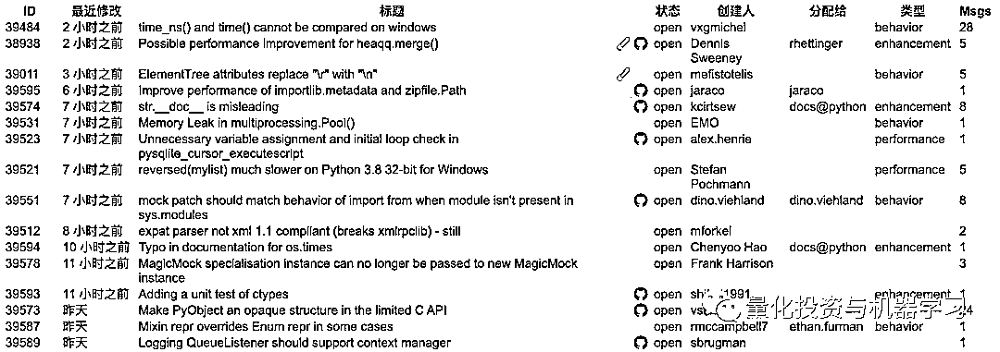

# 最新！想学 CPython，Python 之父 Guido 亲上阵

> 原文：[`mp.weixin.qq.com/s?__biz=MzAxNTc0Mjg0Mg==&mid=2653297002&idx=1&sn=fd41a41054c4f54294c3bf7bc127f692&chksm=802ddb7fb75a5269589725d5963f09b6ea54e6a4717418f7e256779a645e53e4d26bdea35666&scene=27#wechat_redirect`](http://mp.weixin.qq.com/s?__biz=MzAxNTc0Mjg0Mg==&mid=2653297002&idx=1&sn=fd41a41054c4f54294c3bf7bc127f692&chksm=802ddb7fb75a5269589725d5963f09b6ea54e6a4717418f7e256779a645e53e4d26bdea35666&scene=27#wechat_redirect)


**标星★****置顶****公众号**爱你们♥   

就在刚刚（2020 年 2 月 10 日），Python 之父 Guido van Rossum 在其个人 Blog 中发布了他对 CPython 学习的帮助教程。下面让我们一睹为快吧！


***1***

**你需要了解的！**

**1、你必须知道 C 语言！**  

*   大多数 stdlib 是用 Python 编写的，我们也需要 doc 帮助

**2、你必须了解 Git 和 GitHub！**

*   如果不会，请看这：

*https://devguide.python.org/gitbootcamp/*

3、你必须有 10 年以上的 Python 经验！

*   开个玩笑

***2***

**入门文档**

****▌**核心教程**，先从这里开始：

*▌**https://cpython-core-tutorial.readthedocs.io/en/latest/*

同时大神告诉我们：**要找到一个简单的问题，坚持是关键:-)**

****▌**DevGuide：**

*▌https://devguide.python.org/*


*   **Fork the repo：***https://devguide.python.org/#quick-reference*
*   **学习 Git：***https://devguide.python.org/gitbootcamp/*
*   **帮助：***https://devguide.python.org/help/*

*   **Zulip：***https://python.zulipchat.com/login/*
*   **Core mentorship：***https://www.python.org/dev/core-mentorship/*
*   **IRC: ** '#python-dev on freenode.net'

***3***

**选择你的第一个项目**

大神说：**这取决于你的经验和自信程度！**

****▌**寻找一个尚未解决的问题：**

*▌https://bugs.python.org/*



***4***

**Workflow**

**▌Git 设置**

1、如果你还没有 GitHub 账号，请登录 GitHub.com

2、在 GitHub 上调用 Python/CPython repo，点击**Fork**按钮（右上角）：


3、在本地克隆你的 fork：

```py
`git clone git@github.com:YOURUSERNAME/cpython.git`
`cd cpython`
```

4、配置 upstream remote，现在你可以用“git push”和“git pull”来 push/pull 你的 fork：

```py
git remote add upstream https://github.com/python/cpython/
```

5、创建一个分支工作

**DON’T WORK ON MASTER！**

```py
git checkout upstream/master -b YOURBRANCHNAME
```

或者  

```py
git checkout origin/master -b YOURBRANCHNAME
```

****▌**Python 构建设置**

1、在 Mac 上，安装**Xcode**，如果还没有安装：

*   在 SPRINT 之前做这件事，需要很长时间。
*   打开 Xcode 一次，安装命令行工具（make, compiler 等）
*   ./configure --with-pydebug
*   make（或者 make -j 以利用所有 CPU）

****▌**编辑-测试-调试，C 版本**

1、编辑一个 .c 或 .h 文件等 2、make3、./python.exe 给出交互提示 4、./python.exe -m test [flags] testname …5、运行所有测试：./python.exe -m test （需要很长时间）

****▌**编辑-测试-调试，Python 版本**（和 C 类似，没有 make 步骤）

1、编辑一个 .py 文件 2、./python.exe 给出交互提示 3、./python.exe Lib/test/regrtest.py [flags] testname …4、运行所有测试：./python.exe Lib/test/regrtest.py（需要很长时间）

****▌**调试 Python 代码**

1、最简单的：用 print()2、其次，用 breakpoint()

**▌调试 C 代码**

1、如果你有 Python 代码来重现问题，请先尝试前面的部分（调试 Python 代码）。2、最简单的：用 printf()3、GDB (Linux)：*https://wiki.python.org/moin/DebuggingWithGdb*


*   $ gdb ./python.exe

    …

    (gdb) run SCRIPTNAME.py ARGUMENT …

*   $ gdb -ex r --args python SCRIPTNAME.py ARGUMENT …

4、lldb (Mac)：

*   $ lldb ./python.exe

    …

    (lldb) run SCRIPTNAME.py ARGUMENT …

*   $ lldb ./python.exe -- SCRIPTNAME.py ARGUMENT …

    …

    (lldb) run

5、Windows：在 Visual Studio 中使用调试器（而不是 VS 代码）

*▌https://docs.microsoft.com/en-us/visualstudio/python/debugging-mixed-mode-c-cpp-python-in-visual-studio?view=vs-2019*

2020 年第 35 篇文章

量化投资与机器学习微信公众号，是业内垂直于**Quant、MFE、Fintech、AI、ML**等领域的**量化类主流自媒体。**公众号拥有来自**公募、私募、券商、期货、银行、保险资管、海外**等众多圈内**18W+**关注者。每日发布行业前沿研究成果和最新量化资讯。

你点的每个“在看”，都是对我们最大的鼓励