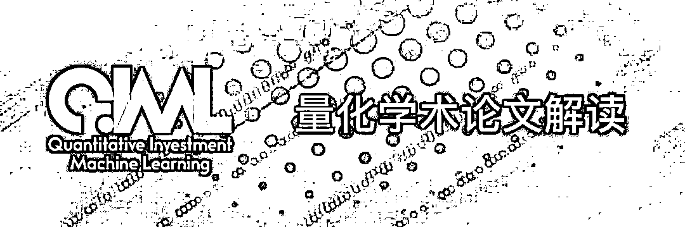
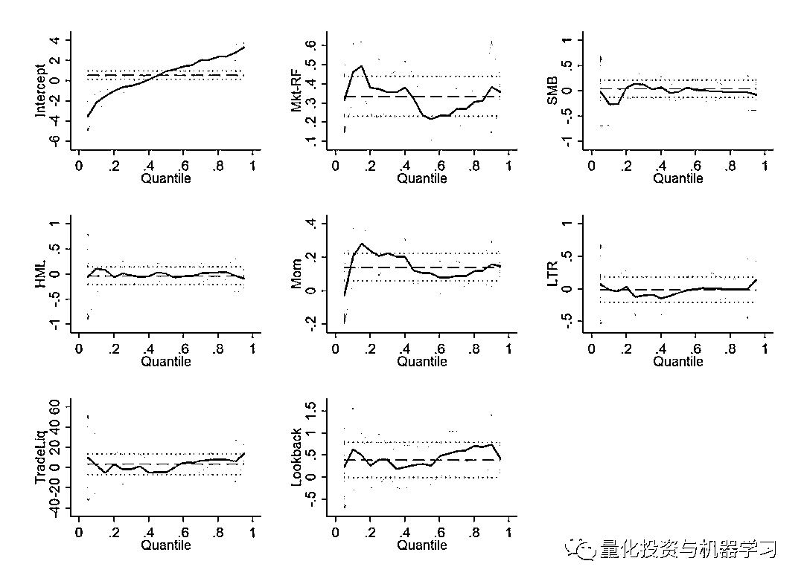
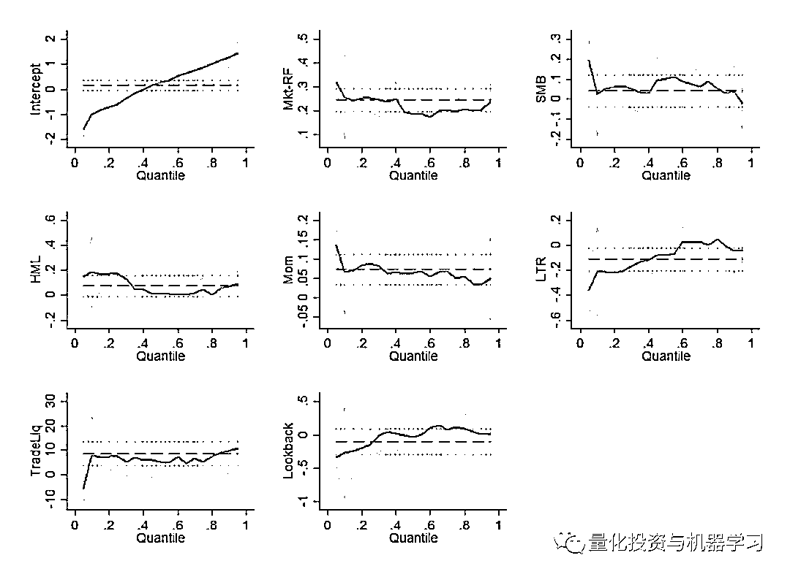

# 有的基金它还活着，有的却死了···

> 原文：[`mp.weixin.qq.com/s?__biz=MzAxNTc0Mjg0Mg==&mid=2653296980&idx=1&sn=567cbec6ef149aec2333e2f189e05591&chksm=802ddb41b75a5257aaf08b932c6474c9b2ff8fc588547f0556d047dbf6a98bf88f1cec263a4b&scene=27#wechat_redirect`](http://mp.weixin.qq.com/s?__biz=MzAxNTc0Mjg0Mg==&mid=2653296980&idx=1&sn=567cbec6ef149aec2333e2f189e05591&chksm=802ddb41b75a5257aaf08b932c6474c9b2ff8fc588547f0556d047dbf6a98bf88f1cec263a4b&scene=27#wechat_redirect)

**标星★****置顶****公众号**爱你们♥   

今天是周末，我们来看一篇有趣的论文。***Hedge Fund Strategies : A non-Parametric Analysis****Alessandra Canepa：University of Turin**Maria Gonzalez：University of Castilla-La Mancha**Frank S. Skinner：Brunel University**Date Written: August 2019*

*Keywords: hedge funds, manipulation proof performance measure, hedge fund strategies, stochastic dominance, bootstrap*

*JEL Classification: G11, G12, G2*

**获取论文，点击阅读原文**

***1***

**前言**

每一位对冲基金经理和交易员都想知道，在他竞争对手管理的基金中，到达运用了哪些策略。业绩最好的基金通常对其投资组合讳莫如深。但我们仍然可以从他们的历史月度收益中学到一些东西。Canepa、Gonzalez 和 Skinner 在一篇研究论文中描述了一种有趣的方法。他们的分析暗示，表现最佳的对冲基金之所以能够成功（通常情况下），是因为它们能够更好地管理自己的因子敞口。它们不像普通基金那样那么依赖经典的股票风险因子。如果它们面临某种风险因子，表现最好的对冲基金能够比一般基金更快地结束不佳的因子策略。

***2***

**摘要**

为什么表现最好的对冲基金是成功的？我们发现，有证据表明，表现最好的对冲基金采取的策略与表现平平的对冲基金不同，因为它们接受的风险因子较少，而这些风险因子在 2006 年以后普遍存在。在保持 Alpha 业绩不变的情况下，业绩最好的基金大多不会依赖于对非流动性投资的被动投资，而是通过接受市场风险来赚取风险溢价。此外，他们似乎能够利用稍纵即逝的机会获得动量利润，同时关闭损失的策略，从而避免动量反转。

***3***

**论文中有趣的内容**

首先，作者会考察对冲基金的表现是否与几个市场基准一样好。他们发现，尽管近年来对冲基金的收益率相对较低，但从 2001 年 1 月到 2012 年 12 月，市场并没有随机左右对冲基金。

其次，作者还研究了表现最好的对冲基金在样本外的表现是否持续优于表现一般的对冲基金，即使作者考虑了近年颇具挑战性的经济状况。他们发现：*the top performing quintile of hedge funds does second order stochastically dominate the mediocre performing third quintile out of sample*。然而，这种优越的性只持续了 6 个月。因此，作者得出的结论是，在至少 6 个月的时间里，表现最好的基金的表现始终强于表现一般的基金。

第三，作者考察了流动性以及其他风险因子（如动量）对样本外净超额收益率的影响。他们这样做是为了验证表现优异和平庸的基金，以确定表现最好的基金是否具有不同的风险特征，这意味着其采取了与表现平庸基金不同的策略。一个重要的提示是，作者们通过分位数回归方法将因子作为斜率系数，所以他们必须假设 Alpha 的性能是是常数。

Figure 1\. Marginal effects of risk factors on excess returns for top performing funds. Each graph in the above figure depicts the relation between the size and the significance of the coefficient and the quantile of a given risk factor for top performing funds as measured by the manipulation proof performance measure with a risk aversion parameter of 3\. The shaded areas depict the 5% upper and 95% lower confidence bounds. The risk factors are the market excess rate of return (MKTRF) and the size (SMB), growth (HML), momentum (MOM), momentum reversal (LTR), liquidity (TRADELIQ) and lookback straddles return (LOOKBACK) factors.

Figure 2\. Marginal effects of risk factors on excess returns for mediocre performing funds. Each graph in the above figure depicts the relation between the size and the significance of the coefficient and the quantile of a given risk factor for mediocre performing funds as measured by the manipulation proof performance measure with a risk aversion parameter of 3\. The shaded are depict the 5% upper and 95% lower confidence bounds. The risk factors are the market excess rate of return (MKTRF) and the size (SMB), growth (HML), momentum (MOM), momentum reversal (LTR), liquidity (TRADELIQ) and lookback straddles return (LOOKBACK) factors. 

作者还发现，与表现较一般的基金相比，表现最好的基金的收益是由不同风险因子驱动的。具体地说，表现最好的基金的超额收益与市场溢价和动量在广泛的分位数范围内显著相关，并且只与最高分位数、流动性和收益波动性相关。相比之下，普通基金的超额收益还与许多其他因子有关，包括市场溢价和动量，以及 SMB 和 HML Fama French 因子。此外，与表现优异的基金不同的是，**流动性是一个影响范围更广的重要因子**。有趣的是，动量反转对表现平平的基金的最低分位数有显著的负面影响，这表明，**表现平平的基金表现不如顶级基金的一个原因是它们在平仓时动作迟缓。**

**获取论文，点击阅读原文**

2020 年第 34 篇文章

量化投资与机器学习微信公众号，是业内垂直于**Quant、MFE、Fintech、AI、ML**等领域的**量化类主流自媒体。**公众号拥有来自**公募、私募、券商、期货、银行、保险资管、海外**等众多圈内**18W+**关注者。每日发布行业前沿研究成果和最新量化资讯。

你点的每个“在看”，都是对我们最大的鼓励