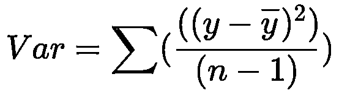
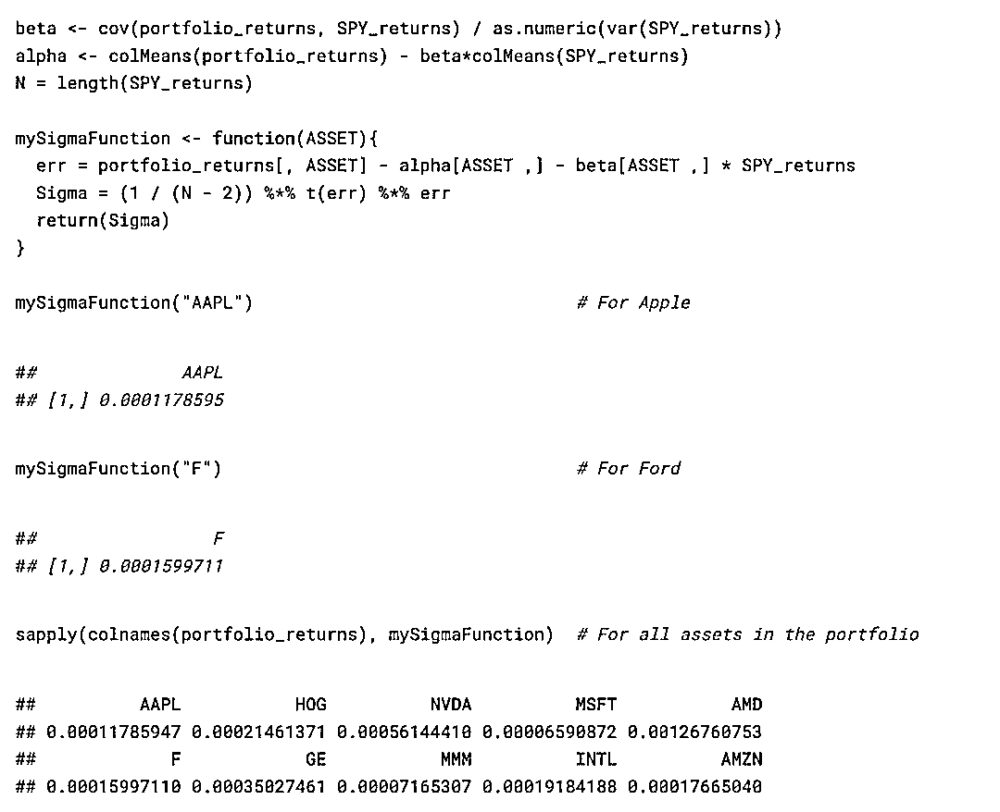
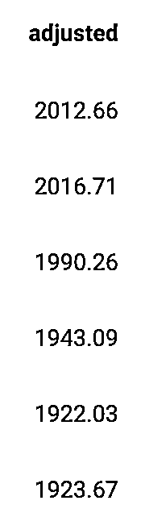
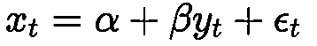
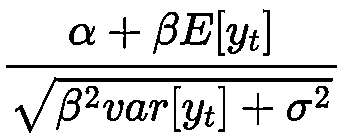
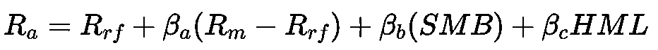
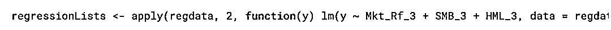
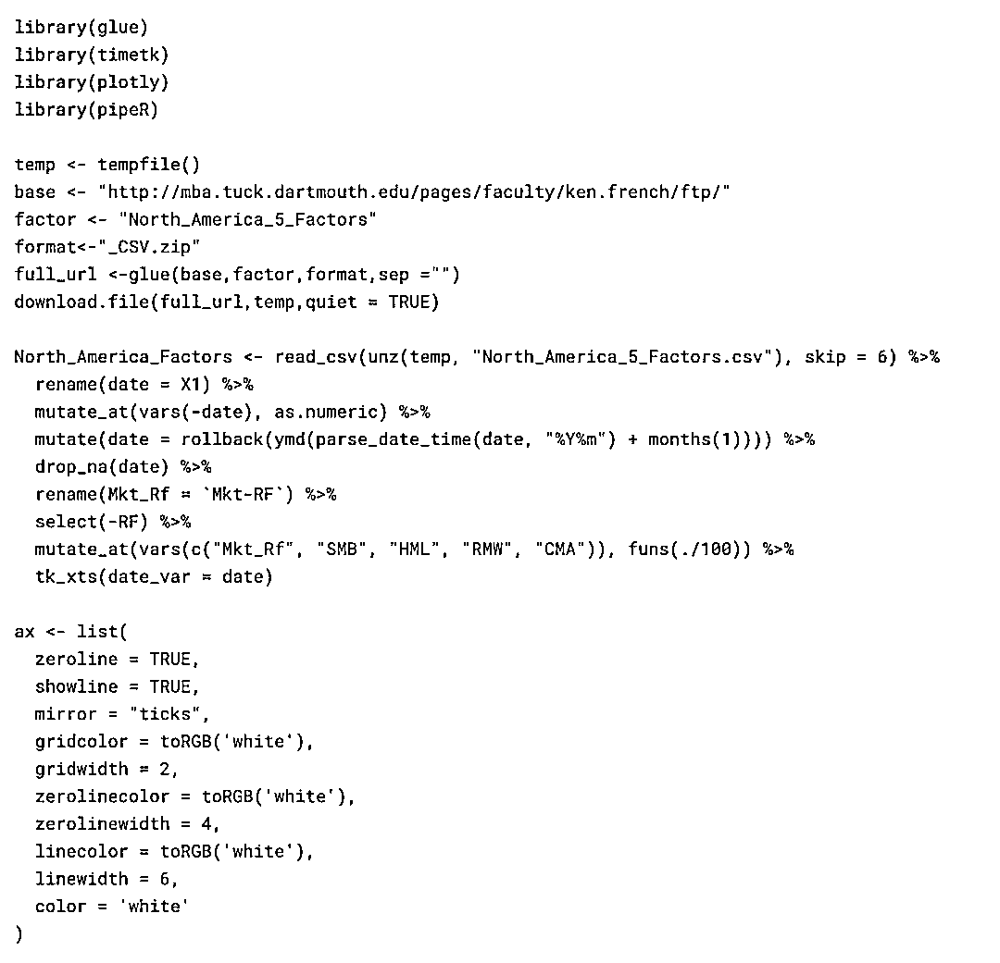

# 因子建模（附代码）

> 原文：[`mp.weixin.qq.com/s?__biz=MzAxNTc0Mjg0Mg==&mid=2653296966&idx=1&sn=a3c03a00c5d34c47889e6f1aacc7e581&chksm=802ddb53b75a52453e60df7d286ed0fb5057d55f4d8ea6b6a19854db3a5f1d22050c6938c046&scene=27#wechat_redirect`](http://mp.weixin.qq.com/s?__biz=MzAxNTc0Mjg0Mg==&mid=2653296966&idx=1&sn=a3c03a00c5d34c47889e6f1aacc7e581&chksm=802ddb53b75a52453e60df7d286ed0fb5057d55f4d8ea6b6a19854db3a5f1d22050c6938c046&scene=27#wechat_redirect)

**标星★****置顶****公众号**爱你们♥   

作者：Matthew        编译：方的馒头

***1***

**准备工作**

用于分析投资组合风险的最受欢迎的模型是因子模型，因为股票具有共同移动的趋势。证券的主要组成部分经常会解释很大一部分差异。由于我们主要关注构成投资组合的多种资产，因此需要对此进行说明。有些问题可能是为什么低市净率的股票要比具有较高市净率的股票好吗？在此，比率的“价格”部分仅是股价（每股），比率的“帐面”部分是“股东权益” /“流通股”，这是公司资产负债表上的项目。  

因子模型流行的另一个重要原因是维度。假设 N 资产随后具有 N 方差和 N(N-1)/2 相关性。如果我们有一个有 F 因子的因子模型，它有 N 个特质方差、F 个因子方差和 NF 个贝塔。只要：

因子模型的参数较少。

资本资产定价模型 Sharpe（1964）是由单个因子组成的最简单因子模型。

平均方差参数为：

因此 bi 是：

或者表示为：

其中 b 是回归线的斜率，它使收益的平方距离最小化，a 是截距或者阿尔法用一行 a+bf 表示。

我们将使用基础 R 函数进行这些计算，但是首先我们需要一些数据和 R 的一些库文件：

我们从 Yahoo Finance 使用 quantmod 或 tidyquant 的包装器将每日价格数据下载到了 quantmod 包中。区别在于，quantmod 收集数据并将其存储为 xts 对象，tidyquant 收集数据并将其存储为 tibble，从这里我们可以更轻松地使用 tidyverse 处理数据的功能，将数据转换回使用 timetk 包中的 tk_xts 函数将其添加到 xts 对象。

公司是苹果，哈雷戴维森，英伟达，微软，AMD，福特，通用电气，3M，英特尔和亚马逊。（**本文基于 R 语言实现**）

数据如下所示，我们删除了 Open，High，Low，Close 和 Volume 数据，仅保留了 Adjusted 价格，其中每个资产都是其自己的列，数据已转换为时间序列对象或 xts 对象， data 存储为索引（或行名），在下表中不可见。

我们还用同样的方法收集了标普 500 指数数据：

看起来类似于单个资产的价格。

我们可以用 chartSeries 函数绘制数据：

我们在 portfolio_returns 和 SPY 收益中对所有资产计算每日对数收益：

每项资产的收益数据：

我们可以使用 autoplot 功能通过 ggplot 功能绘制 xts 或者时间序列数据（我们仅绘制前 3 项资产）：

***2***

**R 实现**

接下来，我们首先需要定义以下几点：

*   我们在投资组合中拥有的资产数量，以前表示为 N

*   我们应用模型的天数，通常表示为 T。

a. 我们可以计算如下所示：

其中收益：

然而，为了更好的理解它，我们可以将其分解为每个计算：

beta 公式的 cov 协方差矩阵部分如下所示：

我们可以使用基础 R 来计算协方差如下：

其中 xi 是我们的资产，yi 是 SPY500。代码：

它对应于 cov（portfolio_returns，SPY_returns）计算中的第一个结果 AAPL。我们可以将 x = Portfolio_returns[，1]中的更改为，，…，以计算每项资产（分别为 HOG，NVDA 和 MSFT）的协方差，也可以将以上内容包装到 for 循环中以计算所有资产。注意：我只在 for 循环中将上述方程式中的更改为，其他所有内容都是不变的。

SPY 收益的方差为

其中计算为：

在 R 中我们可以像这样简单计算它：

将所有这些放在一起，我们可以计算 beta。回想一下：

其中此处的 ri 是在我们的投资组合中的每一项资产，y 是市场收益率或 SPY500 收益率。

使用 R 为我们资产的每一项计算 beta，我们可以将上述代码包装到一个函数中：

我们可以将这个函数应用于数据中的单项资产，然后将所有这些资产：

这里的解释是，值等于 1 表示资产与市场的移动完全相关，值>1 表示资产的移动比市场的移动更多，或者当市场移动时波动性更大，而值<1 表示资产的移动少于市场的移动。

通常，科技股的市场 beta 较高，而成熟的非科技股的市场 beta 较低。也就是说，AAPL，NVDA，MSFT 和 AMD 的 beta 均大于 1，而 HOG 和 Ford(F)的 beta 均小于 1。    

b. 阿尔法被定义为：

其中 _ri 是我们投资组合中单项资产的平均收益率，βi 是我们样本期内每个资产的 beta 值，_f 是 SPY 的平均收益率。因此，我们可以像这样计算 alpha：

我们资产的阿尔法或者如下：

还有其他方法计算，但是对于单因子模型我们可以从 PerformanceAnalytics 包中使用 CAPM.alpha。

比我们刚刚做的要简单多了。Ra 是资产收益率，Rb 是市场收益率，Rf 是无风险收益率。

在研究了 PerformanceAnalytics 包中的 CAPM.beta 函数之后，我们注意到它们具有 CAPM.beta.bull 和 CAPM.beta.bear 的函数，因此我想看看每项资产的绘制出来如何。

***3***

**可视化收益的协方差矩阵**

为了可视化协方差矩阵，需要一些更深入的研究。

最终，我们要计算以下内容：

其中

我们从之前使用 beta 和 alpha 结果，同理。我创建了一个函数，该函数接受资产并计算残差和 Sigma 值。我们在这里计算的是以下内容：

err

其中 i=1,···,N

Sigma

以上等式在基础 R 中的代码为：

现在我们有值。我们想要创建一个矩阵，其 Sigma 值位于对角线下方。

这将是我们创建的对角矩阵，如下所示：

现在我们有我们的对角矩阵 Diag(@)，我们可以使用收益计算对角矩阵：

然后从 stats 包中使用 cov2cor 函数。

相关表如下所示：

***4***

**ETF 分析和随机抽样的投资组合**

由于因子建模全部是关于风险和投资组合分析的，所以我们认为比较一些美国交易所交易基金（ETFs）和标普 500 指数随机选择的资产投资组合的表现会很有趣。

为了构建随机创建的投资组合，我们首先删除了维基百科页面中包含标普 500 指数公司的列表以及其交易代码，然后筛选出所有 A、B 和 C 类股票，因为一些公司具有多种资产类别，而我不想要对两种相同资产进行采样。

就像之前一样，我们收集数据并将其放入时间序列格式。

如下所示：

接下来，我们收集了美国 ETFs：

数据如下所示：

SPY500：

如下：

现在，我们有一系列的 3 个数据集，分别是从 SPY500 维、ETFs 和 SPY500 中随机选择的资产调整后的收盘价。接下来，计算每日收益率。

asset_returns 如下所示：

然而，我们想要假设我在一个投资组合中拥有所有这些资产。对行进行平均，并将数据加入 ETFs，并将其称为 all_returns。

all_returns 数据如下所示，其中我们可以看到 myPortfolio 已经添加了 ETF 数据集。

接下来，我们计算（像之前一样）投资组合的和。这次只用 PerformanceAnalytics 包中的 CAPM.beta 和 CAPM.alpha 函数。

根据它们的值排名了 ETF’s。我们可以看到 GDX 有最高值和最低值是有道理的，因为它的 Goldminers ETF 追踪了 Arca 黄金矿业指数（GDMNTR），该指数跟踪了从事黄金矿业的公司的业绩。据我所知，SPY500 上市的金矿公司很少。但是，这是一种按其值展示和排名 ETFs 并查看其相应值的好方法。

我们还可以通过阿尔法和贝塔的比值来排名阿尔法和贝塔，并绘制结果。

更改几行代码，我们可以绘制并看到负 alpha 的对 beta 比值最糟糕的表现。

我们可以先获得我们 ETF 的 Bata 和 alpha 值，再计算 alpha：

最终，对 ETF 进行了随机抽样（由于要分析的样本太多），并绘制了 ETF 之间的相关性。

***5***

**夏普比率、CAPM、Fama-French 因子分析**

使用简单的图仍无法为我们提供有关 ETF、投资组合或资产的足够信息。夏普比率 Sharpe（1966）是更好的度量。夏普（Sharpe）比率是一种报酬变动比率，它允许我们能够在调整风险之后将投资组合的表现与无风险资产进行比较。这需要之间的区别投资组合的收益率和无风险收益率，然后将其除以标准差（衡量投资组合的波动性）。

夏普比率告诉我们，每单位风险增加我们可以期望增加多少收益单位。夏普比率定义为：

其中

仅具有市场因素的单一资产模型如下：

在 t 时我们获得 x 和 y 的期望：

方差：

因此，夏普比率变为：

回想：

我们只需插入之前定义的

和

即可，方程式变为：

经过一些代数运算，我们可以获得：

最终我们得出以下结论：

我们可以用

表示夏普比率，其中 x_ 是 x 从 t=1 到 T 这个历史期间的平均值，简单计算为

在 R 中我们可以简单的使用：colMeans(all_returns)/sqrt(diag(var(all_returns)))。

**机器学习和集群**

我们可以根据其 bate、alpha 和夏普比率值对 ETF 进行聚类。我们为什么要这样做？该模型可能具有比此处 3 个变量更多的变量，因此可以将这些公司聚集在一个较高维度的空间中，因此我们可以基于这些簇选择 ETF，并将其用作投资组合多元化工具，即一个集群可能包含风险较高的 ETF，而另一个可能包含价值股或成长股。由于这里的变量很少，因此无法正常工作，但是有了更多的变量，我们可以更好地分类 ETF。

beta_alphas_sharpe 数据如下所示：

我们可以在一个 3D 图中绘制 bate、alpha 和夏普比率，并从 kmeans 模型中根据簇来对它们上色。这也给机会使用我们可以与之交互的 threejs 包。

***6***

**Fama 和 French 因子模型**

最后，我分析了各种 ETF 的表现。CAPM 公式试图通过单因子（整个市场）来解释投资组合的表现。CAPM 定义如下：  

我们可以通过在模型中添加因子来进一步扩展模型。因此，三因子模型看起来像：

它从 CAPM 中获取了市场因子，并增加了两个新因子，SMB 和 HML 或 Small-minus-Big 和 High-minus-Low。SMB 试图发挥规模效应，从长远来看，小型市值公司应跑赢市场。HML 其目的是通过根据较高的市销率对资产进行分类来捕获价值与增长效应。通常，市净率高的公司是价值股，而市净率低的公司是成长股，文献还显示，从长远来看，价值股的表现要优于成长股。

Fama French 因子模型使我们能够分析基金经理的业绩，因为如果 Fama French 因子可以解释资产管理者的投资组合，那么该基金经理就不会通过选择投资组合和技能来增加任何价值，因此也就没有获得 alpha 值。

更正式地说，我们的等式变为：

在 R 中使用以下来解决：

1、像以前一样下载数据，并将每日价格转换为每日收益-（我们设置了一个 seed，以便使用 set.seed 收集相同的数据）。

  

2、下载 ETF 并转换成每日收益。

3、将随机选择的股票的平均每日收益作为数据，并将数据与 ETF 合并，然后将数据设置为时间序列对象。我们还从 Kenneth French 网站上下载了每日 Fama French 3 因子，并整理了一下数据。

最终我们可以计算解为：

我们可以看到：

相反，我们可以使用线性回归模型来估计它们。对于我的随机投资组合 myPortfolio，我们可以使用 lm 函数来建立线性模型，然后使用 broom 包中的 tidy 函数将输出整理整齐：

我们可以使用 apply 命令并应用我们自己的自定义 lm 函数将其应用于数据中的所有 ETF。

我们还可以将 tidy 命令应用于各个 ETF，然后使用 stars.pval 使数据更加整洁。

最后，我们可以使用 lapply 函数整理数据，使用 map 函数将 p 值变异或转换为星形，从而对所有 ETF 应用相同的方法。然后随机抽取 5 个 ETF 回归样本。

这里有一些注意事项：我们应该对 ETF 的超额收益建模，而不仅仅是 ETF 收益。替换非常简单，例如与 lm 回归的中的 myPortfolio，其中 RF3 为 Fama 和 French 数据附带的无风险利率。我们也应该通过运行 coeftest（myPortfolioReg，NeweyWest（myPortfolioReg，lag = N，prewhite =FALSE））使用 NewyWest 调整后的标准误差。文献表明应该使用

滞后，其中 N 是观察数。我们可以像以前一样根据 ETF 的 alpha 对 ETF 进行排名，并在高 alpha 上做多，在低 alpha 上做空。通过此处的 Fama French 回归来运行我们的对冲投资组合，看看我们是否能够获得更好的表现。

最后，在这里我只使用了 3 因子模型。我们可以使用文献中的更多因子。在 Kenneth French 网站上，我们可以收集有关 Market，SMB，HML，RMW，CMA 和 MOM 的数据。其中 RMW 是利润因子，CMA 是投资因子，而 MOM 是动量因子。

在下面，将提取每日 Fama 和 French 5 因子模型并将其绘制出来。

  

2020 年第 33 篇文章

量化投资与机器学习微信公众号，是业内垂直于**Quant、MFE、Fintech、AI、ML**等领域的**量化类主流自媒体。**公众号拥有来自**公募、私募、券商、期货、银行、保险资管、海外**等众多圈内**18W+**关注者。每日发布行业前沿研究成果和最新量化资讯。

你点的每个“在看”，都是对我们最大的鼓励