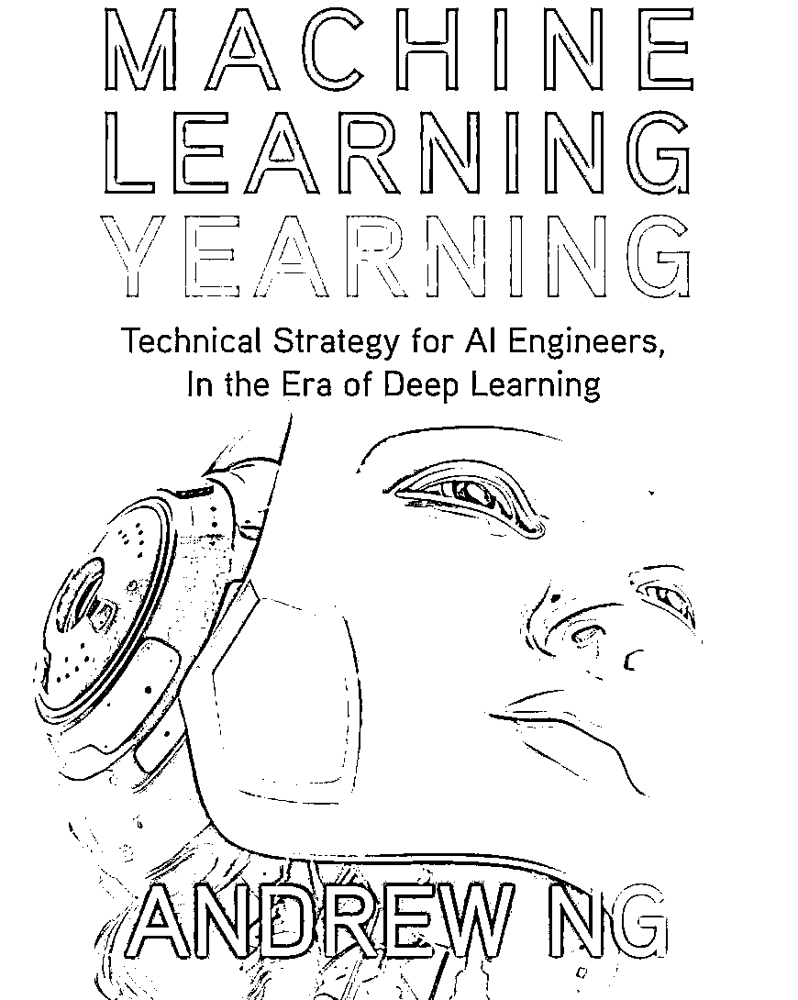

# 重磅！吴恩达新书《机器学习训练秘籍》中文版来了（附 PDF 下载）

> 原文：[`mp.weixin.qq.com/s?__biz=MzAxNTc0Mjg0Mg==&mid=2653296918&idx=1&sn=39739c8e63d1778fdd402b8587c54d00&chksm=802ddb03b75a5215a5d499d95c9e16b5caefdd65f1f95cdd72a691d152723f2cf813e5f73981&scene=27#wechat_redirect`](http://mp.weixin.qq.com/s?__biz=MzAxNTc0Mjg0Mg==&mid=2653296918&idx=1&sn=39739c8e63d1778fdd402b8587c54d00&chksm=802ddb03b75a5215a5d499d95c9e16b5caefdd65f1f95cdd72a691d152723f2cf813e5f73981&scene=27#wechat_redirect)

**《Machine Learning Yearning》** 

吴恩达在 AI 教育上，继《Machine Learning》和《Deep Learning Specialization》等视频课程后，再出力作《Machine Learning Yearning》（中文译为机**器学习训练秘籍**），**该书共计 58 章内容，旨在教你如何使用机器学习算法。**

**中文版电子书获得方式**

关注 **机器学习算法与自然语言处理** 公众号，然后在后台回复数字：**MLY**，即可获得下载链接。

▲长按关注，回复：MLY

**机器学习训练秘籍**

**Machine Learning Yearning**（中文译为机器学习训练秘籍）由官方授权的团队进行翻译。

官网链接：https://deeplearning-ai.github.io/machine-learning-yearning-cn/

**注：文末附有电子版下载方式～**

**关于这本书**

本书的重点不在于教授传统的机器学习算法，而在于教你如何使机器学习算法发挥作用。一些 AI 的技术课程会给你一个工具，而这本书将教会你如何使用这些工具。如果你渴望成为 AI 的技术领导者，并想要学习如何为团队设定一个方向，本书将有所帮助。

**让我们看看让人震撼的 58 章内容目录！**

1 机器学习为什么需要策略？

2 如何使用此书来帮助你的团队

3 先修知识与符号说明

4 规模驱动机器学习发展

5 开发集和测试集的定义

6 开发集和测试集应该服从同一分布

7 开发集和测试集应该有多大？?

8 使用单值评估指标进行优化

9 优化指标和满意度指标

10 通过开发集和度量指标加速迭代

11 何时修改开发集、测试集和指标

12 小结：建立开发集和测试集

13 快速构建并迭代你的第一个系统

14 误差分析：根据开发集样本评估想法

15 在误差分析时并行评估多个想法

16 清洗误标注的开发集和测试集样本

17 将大型开发集拆分为两个子集，专注其一

18 Eyeball 和 Blackbox 开发集该设置多大？

19 小结：基础误差分析

20 偏差和方差：误差的两大来源

21 偏差和方差举例

22 与最优错误率比较

23 处理偏差和方差

24 偏差和方差间的权衡

25 减少可避免偏差的技术

26 训练集误差分析

27 减少方差的技术

28 诊断偏差与方差：学习曲线

29 绘制训练误差曲线

30 解读学习曲线：高偏差

31 解读学习曲线：其它情况

32 绘制学习曲线

33 为何与人类表现水平进行对比

34 如何定义人类表现水平

35 超越人类表现水平

36 何时在不同的分布上训练与测试

37 如何决定是否使用你所有的数据

38 如何决定是否添加不一致的数据

39 给数据添加权重

40 从训练集泛化到开发集

41 辨别偏差、方差和数据不匹配误差

42 解决数据不匹配问题

43 人工合成数据

44 优化验证测试

45 优化验证测试的一般形式

46 强化学习举例

47 端到端学习的兴起

48 端到端学习的更多例子

49 端到端学习的优缺点

50 流水线组件的选择：数据可用性

51 流水线组件的选择：任务简单性

52 直接学习更为丰富的输出

53 根据组件进行误差分析

54 误差归因至某个组件

55 误差归因的一般情况

56 组件误差分析与人类水平对比

57 发现有缺陷的机器学习流水线

58 建立超级英雄团队 - 让你的队友阅读这本书吧！

**电子书下载**

1、关注下方 **深度学习这件小事** 公众号

2、后台回复关键词：**MLY**

注：建议复制，不然容易打错，都是数字。

▲长按关注，回复：MLY