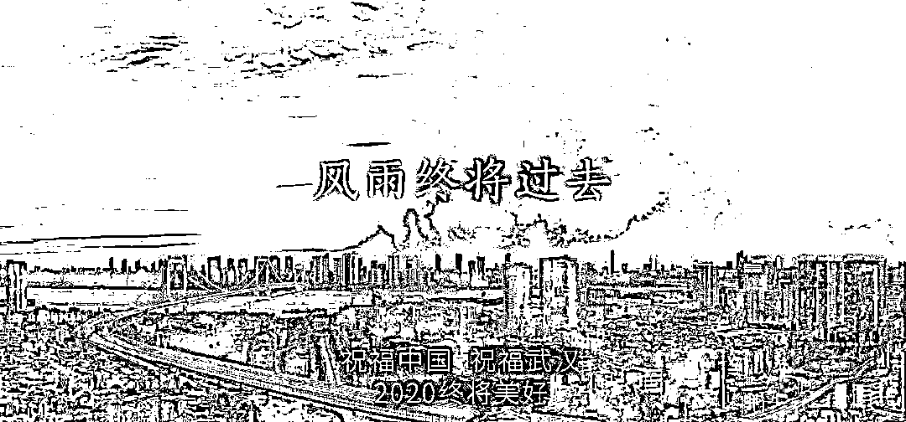

# 二、月 3 日

> 原文：[`mp.weixin.qq.com/s?__biz=MzAxNTc0Mjg0Mg==&mid=2653296905&idx=1&sn=574eccf4d0d7519cd2f71df346bd4c89&chksm=802ddb1cb75a520a64ce2479241ecee26d4844eec6754e451de6b6bacb343d298d5fab4da13b&scene=27#wechat_redirect`](http://mp.weixin.qq.com/s?__biz=MzAxNTc0Mjg0Mg==&mid=2653296905&idx=1&sn=574eccf4d0d7519cd2f71df346bd4c89&chksm=802ddb1cb75a520a64ce2479241ecee26d4844eec6754e451de6b6bacb343d298d5fab4da13b&scene=27#wechat_redirect)

今天是 A 股历史上一个特殊的日子，发生的事情大家都懂得。

近期的肺炎疫情也让所有人都过的很

