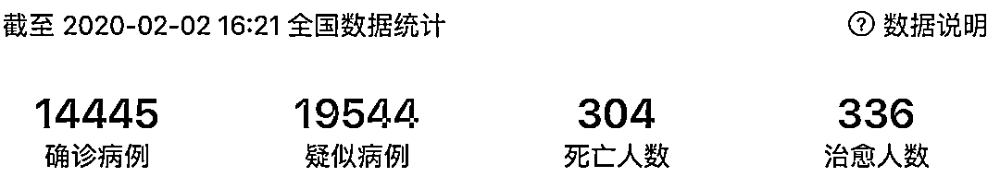
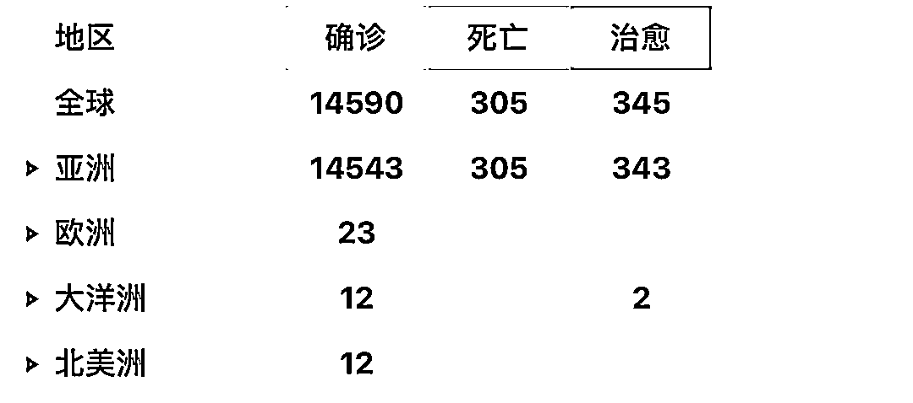
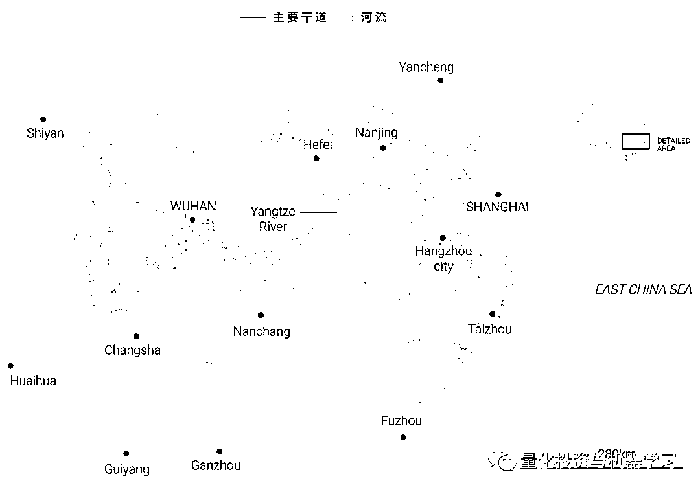
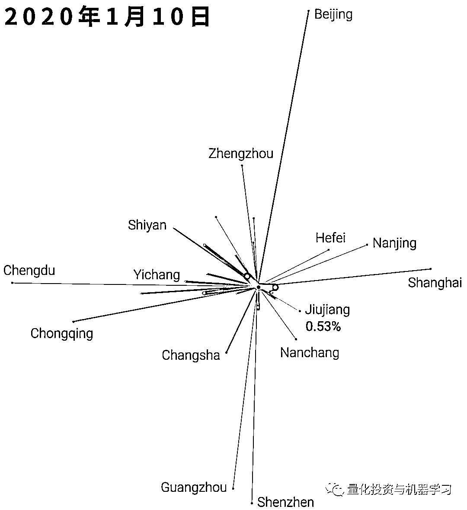
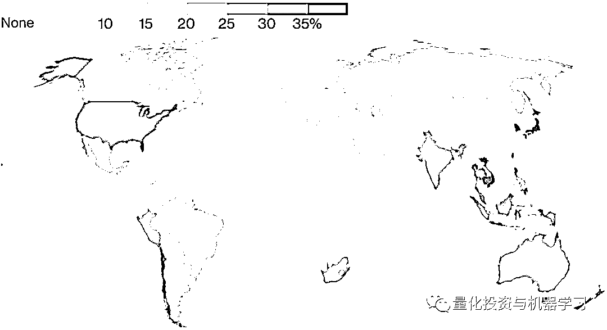
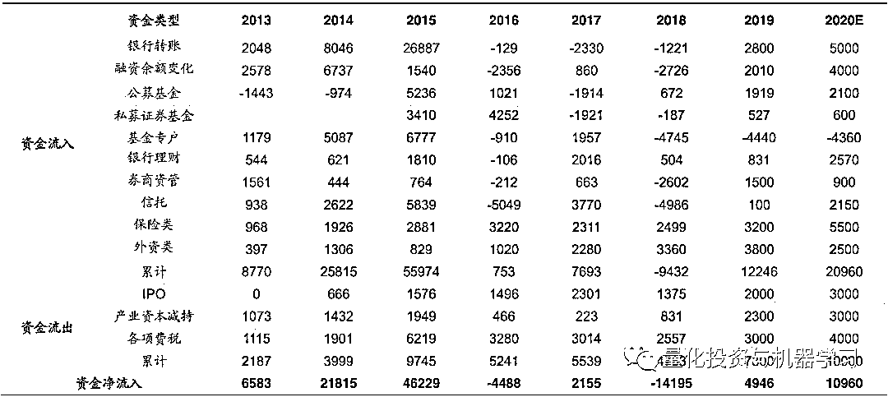

# 20+张图：关于新冠肺炎、金融市场和你！

> 原文：[`mp.weixin.qq.com/s?__biz=MzAxNTc0Mjg0Mg==&mid=2653296818&idx=1&sn=96fdeb8dc9cc9c5ead99abffe821c533&chksm=802ddaa7b75a53b1ac0b94fcff84f62b5045d13b72cf2f56800dfaf5e547e548e58aec6ddfe4&scene=27#wechat_redirect`](http://mp.weixin.qq.com/s?__biz=MzAxNTc0Mjg0Mg==&mid=2653296818&idx=1&sn=96fdeb8dc9cc9c5ead99abffe821c533&chksm=802ddaa7b75a53b1ac0b94fcff84f62b5045d13b72cf2f56800dfaf5e547e548e58aec6ddfe4&scene=27#wechat_redirect)

**标星★****置顶****公众号**爱你们♥   

奋战在新冠肺炎一线的某位护士

表格来自：丁香医生

## **每天都有确诊的人**

1 月 27 日，有 1771 例新增感染病例，这是自 2019 年 12 月疫情爆发以来首次出现最大单日增幅。

## **新冠状病毒和 Sars**

数据截至：2020 年 1 月 30 日

**病例情况**

数据截至：2020 年 1 月 31 日下午 3 点半

## **冠状病毒有多致命？**

卫生部门 1 月 29 日（星期三）证实，此次冠状病毒感染病例已超过 2002-2003 年 Sars 期间的感染人数。

## **症状和并发症**

2 岁以下的儿童和 65 岁以上的老人或免疫系统较弱的人特别容易出现严重的并发症，如肺炎。

## **疾病潜伏期**

## **五百万武汉人去哪儿了？**

武汉是连接中国的重要交通枢纽。武汉距离中国大多数重要城市只有几个小时的车程，这使其成为中国高速客运网络的一个主要枢纽。武汉市中国十大经济体之一，也是通往九个省份的门户。

武汉也是中国长江沿岸最大的中转港口之一，长江全长 6397 公里，是亚洲最长的河流，也是世界第三长河。 

1 月 26 日，周市长透露，在武汉进入戒严前，大约有 500 万人离开。根据相关数据显示：大多数人前往湖北省的其他城市。以下是两个重要日期的前几个目的地。

提供机票预订和数据服务的中国热门旅游平台 Flight Master 宣布，在 2019 年 12 月 30 日至 2020 年 1 月 22 日期间，武汉的十大国际目的地中，有三个是泰国的机场。截至 1 月 30 日，泰国已确诊 14 例冠状病毒病例，是中国以外确诊病例最多的国家。

从上到下依次是：*曼谷国际机场（新）、樟宜机场、东京成田国际机场、曼谷国际机场（旧）、香港国际机场、韩国仁川国际机场、大阪关西国际机场、澳门国际机场、普吉岛机场、马来西亚亚庇国际机场*

**疫情爆发地**

此次疫情与武汉的华南海鲜批发市场有关，现在该市场已被关闭。

## **动物影响**

新型冠状病毒证明是其存在于某些动物体内，在某些情况下可以传染给人类。 

**城市封锁**

动态可视化

全国人口与被封城市公民人数的比较：

**新肺炎对金融市场的影响** 

**就在刚刚央行表示：**

为维护疫情防控特殊时期银行体系流动性合理充裕和货币市场平稳运行，2020 年 2 月 3 日中国人民银行将开展**1.2 万亿元**公开市场逆回购操作投放资金，确保流动性充足供应，银行体系整体流动性比去年同期多 9000 亿元。

**摩根大通策略师表示：**虽然在感染情况改善之前，市抛售可能还会继续，但在过去，此类重大疫情只会导致股价平均下跌约 4.7% 。他们对全球股市保持着建设性的看法，并补充称，在过去，**因类似担忧而下跌的股票越多，日后反弹的就越多。**

图片来自：彭博

同时摩根大通研究了股市对过去流行病的反应，包括 2003 年的非典（SARS）和 2009 年的猪流感。他们指出，**这些事件并没有导致股票抛售的持续时间延长，而是在“几周内”变成了买进的机会，在全球对健康恐慌的兴趣达到顶峰后的三个月里，股指平均上涨了 23%。**

图片来自：摩根大通

**桥水达里****奥表示：**在过去几周的市场走势（其中的圆点表示了一些重要的发展截点）。成长型标的市场表现出强劲的下降趋势，投资向高质量标的市场转移。全球范围内，投资人已经抛售股票，而债券、黄金和美元兑人民币汇率则上涨。

图片来自：领英

### 新冠病毒对全球供应链的影响：

图片来自：OECD TiVA

**根据彭博报道：**随着旅行禁令和春节假期的延长，燃料将受到影响。预计汽油、航空燃油和汽油/柴油今年将占中国石油需求的 55%，占增长的近 60%。

图片来自：国际能源署

中国几乎所有最大的原油供应国都是 OPEC+成员国：

图片来自：中国海关

**西南证券表示：**本次疫情爆发主要集中在湖北省内，特别是武汉市，湖北和武汉也可能被划为疫区。但湖北省不是出口大省，2019 年其出口在全国占比为 1.4%，要远低于广东的 25.2%和江苏的 15.8%。因而即使被湖北省被划分为疫区其对出口贸易的影响也较有限。

湖北出口在全国占比不高

**海通证券表示：**

**1、新冠肺炎不会改变牛市趋势。**历史上牛市终结源于政策面或基本面出现重大转折，这次疫情对基本面影响类似 2003 年非典，是短期性的。

**2、会影响牛市节奏：**短期急跌后仍需要时间盘整消化，20Q1 市场形态类似 19Q4，等待疫情控制住及后续基本面数据支撑再上行。

3、坚定信心、保持耐心，借鉴非典，新增病例见顶对应市场恐慌底，**疫情不改变行业表现的中期排序。**

SARS 及 2019-nCov 前后各行业涨跌幅排名

股市资金净流入规模测算(亿元)

**中泰证券表示：**回顾 2003 年市场，中泰证券陈龙团队研报分析，按照划分，医药、公用事业、化工、食品饮料等板块在疫情爆发期的表现较好。

其中，**医药板块在疫情爆发期（2003/04/16—2003/04/30）的相对累计超额收益率最高，为 7.21%，远超其他消费板块**。与其他板块相比，医药板块受疫情爆发期的市场上流传的各种“病毒防控手段”的“认知”，受到短期主题性的投资资金追捧。

此外，医疗板块的内部细分来看，**从非典事件首例披露后，化学原材料药剂子版块表现最好。**在非典爆发期，其累计超额收益率为 17%。同时，生物制品及中药在爆发期的也有短期的强势表现。背后或在于非典防控时期，以板蓝根、口罩等作为居民认为的基本防控病毒措施受到市场热销有关。

**针对黑色系，国泰君安表示：**

**市场对于疫情带来钢材需求下滑没有分歧**，但我们认为，如果需求下降在 10%的范畴内，废钢带来的供应调节足以弥合需求的减量，当前螺纹期货价格已经跌穿电弧炉成本线，继续下行需要注意风险。

**针对农产品，中信建投期货表示：******对比非典时期，农产品行情预警。****

****

**综合来看，针对本轮新型冠状病毒疫情造成的市场影响，**机构普遍谨慎。****

**中金公司分析，短期而言，疫情的发展依然是决定市场和资产价格走势的关键。但与此同时，历史经验也告诉我们，单纯疫情本身并不是市场走势的决定因素，过去 6 次疫情的表现存在差异也与当时的宏观和市场环境有很大关系。此外**，疫情的高峰期可能市场情绪企稳的一个重要“分水岭”。****

**具体配置上，中信明明研报表示，我们详细回顾了 2003 年 SARS 疫情的发生经过、当时宏观经济与主要资产市场情况，在此基础上结合当下实际，给出大类资产配置建议。我们认为，**当前仍是股票、债券大类资产的配置时点，建议股票以中小创为主，债券拉长久期。****

**在这场没有硝烟的战斗中，**我们需要团结一致，共战疫情！****

****

**以上内容来自：Scmp、各大媒体与平台**

**2020 年第 31 篇文章**

**量化投资与机器学习微信公众号，是业内垂直于**Quant、MFE、Fintech、AI、ML**等领域的**量化类主流自媒体。**公众号拥有来自**公募、私募、券商、期货、银行、保险资管、海外**等众多圈内**18W+**关注者。每日发布行业前沿研究成果和最新量化资讯。**

******你点的每个“在看”，都是对我们最大的鼓励**