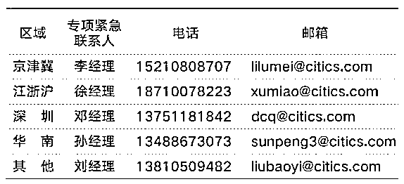

# 最新汇总！各大交易所、券商相关业务延期安排（望知悉）

> 原文：[`mp.weixin.qq.com/s?__biz=MzAxNTc0Mjg0Mg==&mid=2653296757&idx=1&sn=b8a084272e66f7ba9a01e20e33620fae&chksm=802dda60b75a537693f5cf4d469b8d19fd1447d3d7aaa6fc9998706c0b4649afe35cd32f2231&scene=27#wechat_redirect`](http://mp.weixin.qq.com/s?__biz=MzAxNTc0Mjg0Mg==&mid=2653296757&idx=1&sn=b8a084272e66f7ba9a01e20e33620fae&chksm=802dda60b75a537693f5cf4d469b8d19fd1447d3d7aaa6fc9998706c0b4649afe35cd32f2231&scene=27#wechat_redirect)

**标星★****置顶****公众号     **爱你们♥   

**QIML-TALK**

抗击疫情，请大家减少流动，共同努力相信可以很快挺过难关。根据《国务院办公厅关于延长 2020 年春节假期的通知》及沪深交易所与中国结算等机构的配套通知：2020 年春节休市时间延长至 2020 年 2 月 2 日（星期日），2020 年 2 月 3 日（星期一）正常开市。由于 2020 年 1 月 31 日调整为非交易日，各大交易所和券商托管都相应做了延期安排，积募为大家做了汇总，方便各管理人及时查找知晓。

*另关于基金业协会的相关信披报送截止日目前还没有收到通知，如有相关延期通知我们会第一时间告知大家。

**汇总**  |  积募

**来源**  |  国税总局官网、各大交易所官网、东方证券、

中信证券、华泰证券、国信证券、申万宏源、

广发证券、国泰君安、证券官方微信

**国税总局**

2 月份纳税申报期限延长至**2 月 24 日**

**纳税服务热线：**12366****

****各大交易所****

****以下交易所开市时间均为 2020 年 2 月 3 日：****上海证券交易所、沪深交易所  、全国中小企业股份转让系统、上海期货交易所、中国金融期货交易所、郑州商品交易所、大连商品交易所、银行间本币市场、银行间外汇市场 、上海黄金交易所、深圳证券交易所、港股通（沪深）****

********东方证券********

********托管与基金服务业务相应调整如下：********

******一、份额登记业务 ******

****对于 2020 年 1 月 31 日为开放日（含固定开放日及临时开放日）的产品：****

****1、因 2020 年 1 月 31 日被调整为非交易日，**若合同约定 1 月最后一个工作日为固定开放日的**，如产品确有开放和申赎交易需要的，管理人可设置 2020 年 2 月 3 日为临时开放日向我部提交申请流程办理。**** 

****2、对于节前已申请提交 2020 年 1 月 31 日为临时开放日的产品，自动将临时开放日延后至 2020 年 2 月 3 日，**已提交临时开放申请的管理人无需进行其他操作**。****

****3、管理人已预约的 2020 年 1 月 31 的直销认购、申购及赎回交易申请默认作废，**请有认申赎需求的管理人于 2 月 3 日后重新设置开放日并提交交易申请。******

****已预约的 2020 年 1 月 31 日的代销认购、申购及赎回申请，**请管理人选择调整方案后，由代销机构于调整后的开放日将相关申请数据发送至我部。****** 

****4、管理人提交的 2020 年 1 月 31 日的基金分红等权益业务办理申请默认作废，请有分红等权益业务办理需求的管理人在**2 月 3 日后重新提交**相应流程。****

****5、管理人已提交的基金产品于 2020 年 1 月 31 日的成立业务默认为顺延至 2020 年 2 月 3 日。****

****管理人已提交的基金产品于 2020 年 1 月 31 日的清盘业务默认为顺延至 2020 年 2 月 3 日处理。****

****6、对于基金合同约定月末最后一个交易日为业绩报酬计提日的产品我司将根据相关基金合同进行**统一调整**，计提基准日将调整为 1 月 23 日，管理人无需进行任何操作。****

******二、估值核算业务******

****因交易日推迟，部分经纪商将会安排重新清算业务，2 月 3 日有可能会影响到经纪商交易结算数据和对账单发送的时间点，因此会对托管、外包的会计核算处理进度有所影响，敬请谅解。**** 

******三、资金划付业务******

****由管理人主动提交或于管理人平台确认的 2020 年 1 月 31 日资金划付指令，将**自动推迟至 2 月 3 日执行，指令执行前资金人员会逐一与管理人进行沟通确认，**以确保资金指令执行无误。****

****温馨提示:****

**** 1、受 2 月 3 日会计核算处理进度等因素的影响， 当日 11 时的份额登记清算批次暂时取消，**首批次份额登记清算时间为下午 15：00 时。******

****2、由于管理人服务平台处于开放状态，请管理人务必**注意不要提交业务日期为 1 月 31 日的各项业务申请。******

****3、请管理人及时向投资者披露基金采取的运营调整方案。**1 月 31 日至 2 月 2 日之间，如有任何紧急事项或需求，敬请联系： ******

****运营外包：15821223485****

****托管业务：13917081769****

****资金划付：13564679343****

******原通知链接：**[东方托管｜关于 2020 年春节假期变更及产品运营事项调整的通知](https://mp.weixin.qq.com/s?__biz=MzU2OTg1NTMwNA==&mid=2247483764&idx=1&sn=c4ee536fa8e9acb0fedf4888f329e921&scene=21#wechat_redirect)**** 

******中信证券******

****相关业务处理方案（原文及调整详情请参见邮件、I·Service 平台等通知）。****

******重点涉及******

****1、原定于 1 月 31 日的相关业务处理，原则上将顺延至 2 月 3 日办理。****

****2、原定于 1 月 31 日进行产品开放及相应业绩报酬计提的，将自动顺延至 2 月 3 日处理。****

******原预约在 1 月 31 日进行产品申赎交易的，相关交易也将自动顺延至 2 月 3 日，管理人可在 2 月 3 日对预约单进行撤单处理。******

****3、产品涉及代销的，如有开放安排请务必与代销机构协商确定，我司将在 2 月 2 日向代销机构下发行情，代销机构可在 2 月 3 日处理行情进行开放。****

****4、请管理人充分履行投资者信息披露义务，按照合同约定方式向投资人进行信息披露（公告模板可通过 I·Service 平台或邮件下载）。****

******估值及信披处理相关提示事项如下：******

******（以下事项无需管理人操作）******

****1、管理人参与银行间市场交易，因假期调整涉及相关回购利息、费用需要调整的情形，请参照银行间市场相关要求与交易对手方协商一致后通知我司；****

****2、锁定期股票估值，对于采用估值指引中流动性折扣估值方法，解限日在 1 月 31 日的产品，默认采用 1 月 23 日流动性折扣率；****

****3、月末港股通估值，1 月 31 日国内 A 股休市，港交所为正常工作日，为确保信披的准确性，我司默认为 1 月 31 日持仓港股标的产品更新港股行情和采用 1 月 23 日对应汇率；****

****4、关于信披相关口径，我司按照原口径采用 1 月 31 日作为 1 月月报披露基准日；****

****5、我司将参照中登、中债登、上清所、银行间市场、上交所、深交所、金交所等机构通知执行相关品种的交易结算业务规则进行对应处理。****

******处理方案紧急联系人******

****如您对该处理方式有其他诉求，请在**2 月 1 日 18 点前**按照所属区域电话联系专项紧急联系人，否则视为认可该处理方式：****

********

******华泰证券******

****一、原定于 2020 年 1 月 31 日办理的业务原则上顺延至 2020 年 2 月 3 日，假期延长期间 INCOS 平台及微信公众号登录与查询功能正常开放。****

****二、基金合同原定于 2020 年 1 月 31 日计提业绩报酬的，**暂不计提（如有）**。如管理人确定 2020 年 2 月 3 日开放且有申赎交易计划的，请在 INCOS 平台提交 2 月 3 日临时开放申请。如有其它特殊需求，请与我部沟通联系。****

****三、假期延长期间，赢博士智能客服为您提供全天候服务，请登录 https://pb.htsc.com.cn/htsc-pos-nms/user/login  ，或关注公众号“**华泰证券托管外包”，在“微官网”中选择“在线客服”。如遇紧急情况需协助处理，可致电 025-83389988、025-83389966，电话咨询服务时间：9:00-17:00。******

****具体事项安排前期已通过 INCOS 平台发布并发送至您的邮箱，请注意查看并向份额持有人做好信息披露工作。****

******原通知链接：**[关于 2020 年春节假期延长期间服务安排的公告](https://mp.weixin.qq.com/s?__biz=MzUyNTI2NjQ4Ng==&mid=2247484120&idx=1&sn=35e9d2f53c467c28df8a855c990817b4&scene=21#wechat_redirect)****

********国信证券********

********一、原定于 2020 年 1 月 31 日处理的业务，原则上顺延至 2020 年 2 月 3 日********

******产品开放日及业绩报酬计提******

****1.若基金合同中约定的固定开放日为月末最后一个工作日（交易日），则原定于 2020 年 1 月 31 日的开放将自动顺延至下一工作日（即 2020 年 2 月 3 日）。****

****2.若基金合同中约定的业绩报酬计提日为月末最后一个工作日（交易日），顺延规则同上。****

******产品成立、分红、清盘******

****对于春节前已发起的 2020 年 1 月 31 日产品成立、分红、清盘业务，顺延至 2020 年 2 月 3 日处理。****

******二、以下业务自动失效，请您重新提交******

******划款指令******

****春节前已提交的划款日期为 2020 年 1 月 31 日的划款指令将自动失效。请您在鑫管家管理人服务平台将划款日期修改为 2020 年 2 月 3 日后再次提交。****

******临时开放日******

****春节前已设置的 2020 年 1 月 31 日临时开放日将**自动失效。**如 2020 年 2 月 3 日确有开放需求，请您按照设置临时开放日流程向我部重新提交申请。****

****若待开放基金产品有代销机构，请您于 2020 年 2 月 2 日 19:00 点之前登陆鑫管家管理人服务平台发起临时开放申请。并请管理人依照基金合同及相关法律法规向全体投资人进行披露。****

****请您知悉如上运营方案调整，并向投资者做好相应的信息披露及解释工作。如有任何疑问，请直接与我部联系。****

******温馨提示：******

****1、鑫管家管理人服务平台若无法登录，敬请管理人立即与我部联系。****

****2、仅由我部提供基金服务、由其他机构提供托管服务产品，请您与托管机构协商确认春节假期延长相关运营业务事项。****

****在线咨询（推荐）****

****凭账号登陆鑫管家管理人服务平台，点击屏幕右下方-【在线咨询】按钮，即可联系人工客服****

******服务热线及邮箱******

****托管业务（托管复核申请）****

****服务热线：0755-22940701****

****基金服务业务****

****服务热线：0755-22940703****

******原通知链接：**[关于春节假期延长相关运营业务事项调整的通知](https://mp.weixin.qq.com/s?__biz=MjM5NzI3MTI2NQ==&mid=2649383911&idx=1&sn=351bd2cbb54b69b8c25e998eb97384f7&scene=21#wechat_redirect)****

********申万宏源********

******一、需要管理人进行操作的事项：******

****对于节前已提交的划款日期为 1 月 31 日的银证转账、开放式基金划款等指令，基金综合管理平台自动将指令作废，管理人可在 2 月 3 日重新通过基金综合管理平台提交指令。****

******二、无需管理人进行修改操作，但需管理人注意执行日期的事项：******

******1、对于 1 月 31 日为开放日（含固定开放日及临时开放日）的产品******

****（1）对于节前已提交 1 月 31 日临时开放申请的产品，托管中心自动将临时开放日延后到 2 月 3 日，已提交申请的管理人无需进行任何修改操作。****

****（2）对于基金合同约定的固定开放日，因 1 月 31 日已被调整为非交易日，我司将按具体基金合同约定执行，管理人无需进行任何修改操作。****

******2、对于节前已提交的 1 月 31 日产品成立、分红、清盘申请******

****托管中心将自动延后到 2 月 3 日进行成立、分红、清盘的相关操作，**无需管理人进行任何修改操作。******

******3、对于节前 TA 已经确认的申赎、分红、清盘等业务，管理人已确认 1 月 31 日进行划款的指令******

****托管中心将自动对已确认的划款指令延后到 2 月 3 日执行划款操作，无需管理人进行任何修改操作。****

******4、对于节前已提交的划款日期为 1 月 31 日的产品付费指令******

****托管中心将自动延后到 2 月 3 日执行产品付费划款操作，无需管理人进行任何修改操作。****

******5、关于计提业绩报酬的时间：******

****对于基金合同约定月末最后一个交易日计提业绩报酬的，计提日将调整为 1 月 23 日。****

****以上业务如有疑问，敬请联系您的项目经理！****

****[**原通知链接：**重要！关于延长休市相关事项的通知](https://mp.weixin.qq.com/s?__biz=MzIwMjUxODc1Mw==&mid=2247484197&idx=1&sn=6232bf2c28f58e8e7a874c737a355d11&scene=21#wechat_redirect)**** 

********广发证券 ********

******1、原定 2020 年 1 月 31 日的业务办理原则上顺延至 2020 年 2 月 3 日；******

******2、如基金合同约定月末最后一个交易日为开放日，因 2020 年 1 月 31 日根据上述调整为假期，无法进行开放及相应业绩报酬计提（如有）；如管理人确定 2020 年 2 月 3 日开放且有申赎交易申请，请按设置临时开放日流程向我部申请办理。临开申请具体操作参照《广发证券资产托管及运营外包业务白皮书》之【8.1.3 产品临开申请】，查阅路径：（点击阅读原文可查看）******

******http://custody.gf.com.cn/guide/TA/incidentalMotion/******

******请管理人知悉该运营调整方案，并向所有涉及的产品份额持有人充分披露该调整方案。******

******如管理人对上述运营调整方案有其它特殊需求，请直接联系我部沟通处理，专项对接业务联系人如下所示：******

| 业务联系人 | 电子邮箱 | 手机 |
| 柳经理 | liurenzhi@gf.com.cn | 13249776247 |
| 蔡经理 | caiyi@gf.com.cn | 18664815916 |
| 关经理 | guanxuewei@gf.com.cn | 13710180883 |
| 蒋经理 | jiangchaofan@gf.com.cn | 18588875560 |
| 谢经理 | xiefangui@gf.com.cn | 18101880617 |
| 郑经理 | zhenglixuan@gf.com.cn | 13660640204 |
| 陈经理 | chenjinyou@gf.com.cn | 18022871187 |
| 肖经理 | xiaochao@gf.com.cn | 15989065135 |

********原通知链接：**[广发证券资产托管部关于因春节假期延长涉及相关运营业务调整的通知](https://mp.weixin.qq.com/s?__biz=MzIzNjE5Mjg3NQ==&mid=2649981220&idx=1&sn=a61b1bcd7e1a9e8311cdc6ea0359369d&scene=21#wechat_redirect)******

********国泰君安证券********

******一、划款类业务******

****管理人主动提交的 2020 年 1 月 31 日的托管户划款指令自动作废，请有划款需求的管理人重新提交划款指令（划款日期请选择自 2020 年 2 月 3 日起的交易日）。****

****管理人授权我部自动/半自动生成的 2020 年 1 月 31 日的划款指令将顺延至 2020 年 2 月 3 日执行（如适用）。****

******二、基金产品成立与清盘业务******

****管理人已提交的基金产品于 2020 年 1 月 31 日的成立业务默认顺延至 2020 年 2 月 3 日。****

****管理人已提交的基金产品于 2020 年 1 月 31 日的清盘业务默认顺延至 2020 年 2 月 3 日处理。****

******三、基金分红等权益业务******

****管理人提交的 2020 年 1 月 31 日的基金分红等权益业务办理申请默认作废，请有分红等权益业务办理需求的管理人重新提交相应流程。****

******四、基金开放业务（含基金认购业务） **      管理人已预约的 2020 年 1 月 31 的直销认购、申购及赎回交易申请默认作废，请有认申赎需求的管理人重新设置开放日并提交交易申请。****

****已预约的 2020 年 1 月 31 日的代销认购、申购及赎回申请，请管理人选择调整方案后，由代销机构于调整后的开放日将相关申请数据发送至我部。****

****基金合同约定 2020 年 1 月最后一个交易日为开放日/业绩报酬计提基准日的基金产品，请管理人于 2020 年 1 月 31 日 14:00 后登录我部管理人服务平台选择并确认运营调整方案（三项方案中选择一项），并于 2020 年 2 月 3 日 9：00 前（代销产品于 2020 年 2 月 1 日 24:00 前）完成确认。具体方案请见邮件及管理人服务平台通知。****

****请管理人及时向投资者披露基金采取的运营调整方案。如管理人对上述方案有疑问或其他需求的，**请直接联系营销经理，或拨打 021-38032989, 021-38031534, 021-38032283 , 021-38032445, 021-38032581,021-38031535。******

******原通知链接：**[2020 年春节假期及变更产品运营调整事项通知](https://mp.weixin.qq.com/s?__biz=MzAwNDA3NDA2MA==&mid=2650044651&idx=1&sn=d2ca27dd2a818378763e7f8e376dee28&scene=21#wechat_redirect)****

* * *

****** 附各机构通知原文链接******

****1、国务院****

****http://www.gov.cn/zhengce/content/2020-01/27/content_5472352.htm****

****2、国家税务总局****

****http://www.chinatax.gov.cn/chinatax/n810219/n810724/c5143132/content.html****

****3、上交所****

****http://www.sse.com.cn/aboutus/mediacenter/hotandd/c/c_20200127_4991580.shtml****

****4、深交所****

****http://www.szse.cn/disclosure/notice/t20200127_573917.html****

****5、中国结算****

****http://www.chinaclear.cn/zdjs/gszb/202001/9ef2bce2110c4c93aa199c98d41636ca.shtml****

****6、外汇交易中心****

****http://www.chinamoney.com.cn/chinese/rdgz/20200128/1521870.html#cp=rdgz****

****7、外汇交易中心****

****https://mp.weixin.qq.com/s/qnCVyf2HGKmfTzb_bHxFZw        ****

****8、全国股转公司****

****http://www.neeq.com.cn/important_news/200007422.html        ****

****9、上清所****

****http://www.shclearing.com/cpyyw/tzgg/202001/t20200128_632211.html       ****

****10、中债登****

****https://www.chinabond.com.cn/cb/cn/xwgg/ggtz/zyjsgs/zytz/20200128/153661101.shtml        ****

****11、中登开放式基金****

****http://www.chinaclear.cn/zdjs/stzgg/202001/916d4ad6e06d45898178c0f80345b612.shtml        ****

****12、上海黄金交易所****

****https://www.sge.com.cn/jjsnotice/5146910        ****

****13、中国人民银行****

****http://www.pbc.gov.cn/goutongjiaoliu/113456/113469/3965578/index.html       ****

****14、上海票据交易所****

****http://www.shcpe.com.cn/info_13_itemid_1835.html****

****2020 年第 29 篇文章**** 

****量化投资与机器学习微信公众号，是业内垂直于**Quant、MFE、Fintech、AI、ML**等领域的**量化类主流自媒体。**公众号拥有来自**公募、私募、券商、期货、银行、保险资管、海外**等众多圈内**18W+**关注者。每日发布行业前沿研究成果和最新量化资讯。****

************你点的每个“在看”，都是对我们最大的鼓励****