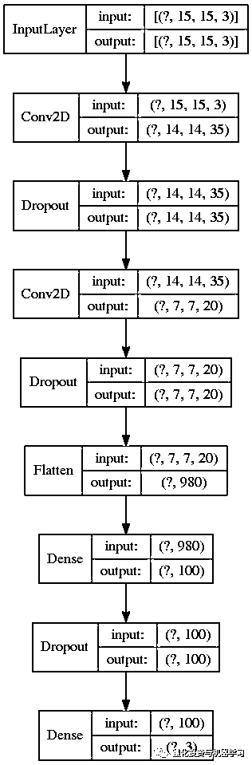

# 从金融时序到图像识别：基于深度 CNN 的股票量化策略（附代码）

> 原文：[`mp.weixin.qq.com/s?__biz=MzAxNTc0Mjg0Mg==&mid=2653296718&idx=1&sn=1d2c9a0f7af20b8c4f6c24fac90474e3&chksm=802dda5bb75a534db1d47c0eb2a09718bf245bf278e2b4ee12d1b99a96515e824cb2d6f3c62f&scene=27#wechat_redirect`](http://mp.weixin.qq.com/s?__biz=MzAxNTc0Mjg0Mg==&mid=2653296718&idx=1&sn=1d2c9a0f7af20b8c4f6c24fac90474e3&chksm=802dda5bb75a534db1d47c0eb2a09718bf245bf278e2b4ee12d1b99a96515e824cb2d6f3c62f&scene=27#wechat_redirect)

**标星★****置顶****公众号     **爱你们♥   

作者：Nayak     编译：1+1=6

***0***

**前言**

本文基于一篇题为*《Algorithmic Financial Trading with Deep Convolutional Neural Networks: Time Series to Image Conversion Approach》*的研究论文：

**获取论文，见文末**

我们从该论文中借用了作者的一些核心思想，同时又做了部分改进。

**获取相关代码，见文末**

***1***

**论文说了什么?**

在这一节中，我们将解释论文中提出的观点：

在你的交易数据中计算 15 个技术指标，每天有 15 个不同的周期长度。然后将 225（15*15）个新特征转换成 15*15 个图像。根据文中提供的算法，将数据标记为买入/卖出/持有。然后像处理其他图像分类问题一样训练一个卷积神经网络分类器。

图片来自：论文

我们用简单移动平均线（SMA）来解释技术指标和周期的概念：

6 天滚动

现在数据集的每一行都有 15 个新特征。如果将这些数字重新组合成一个 15x15 的数组，就得到了一个图像！但是有一件事要记住。在构建这些图像时，应保持相关技术指标在空间上的密切性。你要知道，当训练人脸识别时，如果一幅画的鼻子下面有一只眼睛，你肯定不会给它打上人脸的标签。

**1、打标签**

作者使用了以下算法：

图片来自：论文

利用 11 天窗口的收盘价。如果窗口内的中间数字最大，则将最后一天（第 11 天）标记为“卖出”，如果中间数字最小，则将最后一天标记为“买入”，否则标记为“持有”。像前面解释的那样滚动窗口并重复。这个想法是在谷底买入，在任何一个 11 天窗口的顶点卖出。

**2、训练**

作者使用了滚动窗口进行训练。假设我们的历史数据是从 2000 年到 2019 年，用 5 年的数据进行训练，然后对 1 年的数据进行测试，那么就从数据集中提取 2000 - 2004 年的数据用于训练，用 2005 年的数据进行测试。根据这些数据训练和测试你的模型。以此类推，如下图所示：

图片来自：论文

**3、模型表现评价**

作者在论文中提供了两种模型评价：计算绩效评价和金融绩效评价。计算绩效评价包括混淆矩阵、F1 得分、类别精度等。金融绩效评价是通过将模型预测应用于真实环境进行交易，并考虑收益。在此，我们将考虑计算绩效评价。

***2***

**模型实现**

正如本文开头所提到的，我们并没有严格遵循研究论文，因为它没有产生预期的结果。我们做了一些修改，结果与论文持平，在某些情况下甚至更好。

**1、数据**

国内如果想要研究美股数据，**WindQuant 万矿**（*www.windquant.com*）可以：

图片来自：www.windquant.com

图片来自：www.windquant.com

图片来自：www.windquant.com

**2、特征工程**

我们使用了部分论文中的指标（第一个偏差），所有指标代码都在 utils.py 文件中。

**获取相关代码，见文末**

图片来自：代码文件

**WindQuant 万矿**（*www.windquant.com*）也提供直接计算技术指标的函数，**直接调用即可，而且参数也可以自己调整**：

图片来自：www.windquant.com

图片来自：www.windquant.com

**3、标记数据**

在本文中，我们使用了作者的原始标记算法。代码实现：

标记后的数据集：

**4、归一化**

我们使用 Sklearn 的 MinMaxScaler 将数据归一化在[0,1]范围内，尽管论文中使用的是[- 1,1]范围（第二个偏差）。看大家喜好吧。

**5、特征选择**

在计算了这些指标后，根据它们的类型（动量、震荡等）将它们分组到图像中，并训练了许多 CNN 架构，我们意识到模型学习的还不够，也许是特征还不够好。因此，我们决定采用许多其他指标，而不是严格按照不同时期的计算规则。然后我们使用特征选择技术选择了 225 个高质量的特征。事实上，我们使用了两种特征选择方法 f_classif 和 mutual_info_classif，并从它们的结果中选择了共同的特征。在原文中没有提到 feature selection（第三个偏差）。

···

···

最后，我们对索引列表进行了排序，找到了 f_classif 和 mutual_info_classif 的交集。这是为了确保相关的特征在图像中非常接近，特征选择显著提高了模型的性能。

**6、将数据映射到图像**

到目前为止，我们已经有了一个包含 225 个特征的表格。我们需要转换成这样的图像：

**7、解决不平衡**

这类问题难以解决的另一个原因是数据严重不平衡。“持有”数量总是远远大于买入/卖出。实际上，本文提出的标记算法产生了相当多的买进/卖出实例。而实际的策略都会产生更少的实例。

对于模型来说，学习任何有意义的东西都是很困难的。这篇论文只提到“重采样”是解决这个问题的一种方法。我们尝试过过采样（Oversampling）合成数据生成（SMOTE，ADASYN） ，但都没有得到满意的结果。最后，我们选择了“样本权重”（第四个偏差)。这在处理 class 不平衡的时候很方便。以下是计算样本重量的方法：

然后将这个样本权重数组传递给 Keras 的 fit 函数。你还可以查看 class_weights 参数。

**8、训练**

文中提到的模型架构存在一些缺失。例如，它没有提到他们使用的步长。但是当我们尝试使用 stride=1 和 padding=same 的时候，我们意识到这个模型太大了，特别是对于 5 年数据的训练来说。不管我们使用的网络有多小，在滑动窗口训练方面都不好。因此，我们决定在完整训上使用交叉验证（第五个偏差）的方式对据进行训练。这部分代码包含了滚动窗口训练，都在 data_generator.py 文件中。

**获取相关代码，见文末**

到目前为止，我门找到的最好的 CNN 配置是：

  

Keras 模型训练是通过提前停止和减少 ronplateau 回调来完成的，如下所示：

···

正如你在上面看到的，用 F1 分数作为度量。对于测试数据的评估，我们也使用了混淆矩阵，Sklearn 的 F1 加权分数和 Kappa。

根据沃尔玛的数据，上述模型给出了以下结果：

这个结果在每次运行时都会有所不同，这可能是由于 Keras 权重初始化的缘故。但是每个类的精度值保持在[80,90]的范围内，kappa 值保持在[58,65]的范围内。这实际上是一个众所周知的行为，具体的讨论大家可以看这里：

*https://github.com/keras-team/keras/issues/2743*

简而言之，你必须为 Numpy 和 Tensorflow 设置随机 seed。我们已经为 numpy 设置了随机 seed。所以我们不确定它是否能解决这个问题。但是大多数时候，对于我们尝试过的其他 CNN 架构，class 0 和 class 1 （buy/sell）的精度低于 class 2（class 0/1 为 80-85）。

作者使用的模型结构具有相似的结构（2 个卷积层、dropout、密集层[全连接层]等) ，但得到的结果很一般（每个类的精度为 0.8 s）。 因此，我们不得不调整内核大小、dropout 和节点等，以便在数据上得到更好的分数。 以下是发布在论文中的结果：

我们认为这个结果还不错，因为这个模型可以识别大多数的买/卖实例。以下是作者对此的看法：

*“However, a lot of false entry and exit points are also generated. This is mainly due to the fact that “Buy” and “Sell” points appear much less frequent than “Hold” points, it is not easy for the neural network to catch the “seldom” entry and exit points without jeopardizing the general distribution of the dominant “Hold” values. In other words, in order to be able to catch most of the “Buy” and “Sell” points (recall), the model has a trade-off by generating false alarms for non-existent entry and exit points (precision). Besides, Hold points are not as clear as “Buy” and “Sell” (hills and valleys).* *It is quite possible for the neural network to confuse some of the “Hold” points with “Buy” and “Sell” points, especially if they are close to the top of the hill or bottom of the valley on sliding windows.”*

***3***

**进一步改善**

在 IBM 数据上使用相同架构的 CNN 并没有给出令人满意的买卖精度：

但通过调整超参数，我们肯定可以把它提高到与沃尔玛类似的水平。

虽然这些结果看起来足够好，但不能保证它会给我们带来在时间交易中的收益，因为它会受到你选择数据标签策略的限制。例如，我们对上述交易策略进行回测（使用的是原始标签，而不是模型预测），我们并没有赚到多少利润。

探索其他技术指标可能会进一步改善结果。

祝大家新年快乐！最近在不出门的情况下，自己多多探索吧！

***4***

**获取代码+论文**

在**后台**输入（严格大小写）***DCNN-Quant 最爱***

2020 年第 27 篇文章

量化投资与机器学习微信公众号，是业内垂直于**Quant、MFE、Fintech、AI、ML**等领域的**量化类主流自媒体。**公众号拥有来自**公募、私募、券商、期货、银行、保险资管、海外**等众多圈内**18W+**关注者。每日发布行业前沿研究成果和最新量化资讯。

你点的每个“在看”，都是对我们最大的鼓励