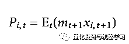
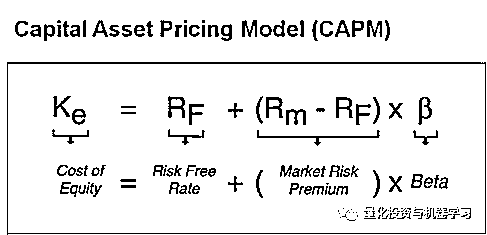
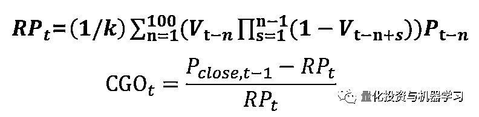
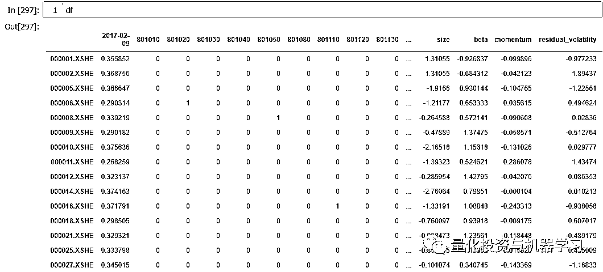
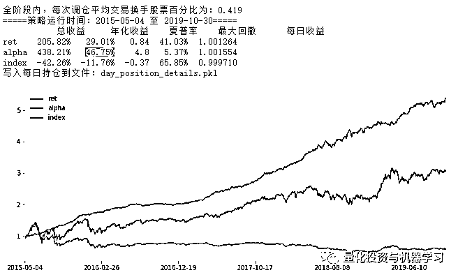

# 刀尖上的舞蹈？股票 Alpha 模型与机器学习

> 原文：[`mp.weixin.qq.com/s?__biz=MzAxNTc0Mjg0Mg==&mid=2653296664&idx=1&sn=51fd99d1611275e71570b2561674af8b&chksm=802dda0db75a531b26c8a5f1b85232d2ae2b86f17fc7dd3f09db1b0c52f718ffca50ee348d5b&scene=27#wechat_redirect`](http://mp.weixin.qq.com/s?__biz=MzAxNTc0Mjg0Mg==&mid=2653296664&idx=1&sn=51fd99d1611275e71570b2561674af8b&chksm=802dda0db75a531b26c8a5f1b85232d2ae2b86f17fc7dd3f09db1b0c52f718ffca50ee348d5b&scene=27#wechat_redirect)

**标星★****置顶****公众号     **爱你们♥   

***0***

**前言**

在开发股票投资模型这项工作中，很少有凭空搭建的楼阁。尽管可以使用机器学习类的工具增强模型性能，但是大部分模型的基础结构，依然基于传统的资产定价模型和因子分析演化而来。

在春节期间发布这篇文章，依然是一篇学习和工作笔记。我们简单回顾传统的学界业界经典模型，具体到非线性的机器学习工具对于因子模型的性能改善，再到因子挖掘和模型评价，聊一聊已经被头部私募几乎玩烂的高换手股票 alpha 模型构建方法。

***1***

**传统意义上的资产定价因子与异象**

**1、学界历史研究结论**

面对资产定价类问题，了解前人的探索路径和来龙去脉非常重要，从这里可以找到基础的问题解决方法。金融资产价格是由资金时间价值和风险共同决定的，这很容易理解。现在的资金比未来的资金更有价值，资金有成本，借钱时要支付利息。资产有波动风险，上波动做多者盈利，下波动做多者亏损。所以开户去赌博的时候，投资者也要被教育：投资有风险，入市需谨慎。

早期关于竞争性交易的一个基本假设是：不存在套利机会。因为当套利机会出现时，市场参与者将参与套利活动，从而使套利机会消失，我们算出的理论价格就是在没有套利机会下的均衡价格。现代的资产定价理论（asset pricing theory）基本上就是在这样的环境下提出和发展的。可以通过证明不存在套利机会，来论证任何交易资产的价格，都可以写作下一时间不同自然状态下资产支付额的加权或折现和，其中权值与资产无关（Ross, 1978 和 Harrisonand Kreps, 1979）。

无套利定价公式可以写成更抽象（以概率求和表达）的形式：

E 是概率求和

m 是折现因子，表达当前价格和下期价格之间的关系

xi, t+1 股票价格可以定义为下一时刻的价格加股息：xi, t+1 = Pi, t+1 + di, t+1

m 和 xi 都取决于某种自然状态，它只会影响个别资产 i 的价格。到了这一步，m 已经成为唯一变量。然后对于很短的时间范围，可以假定 m 在各个状态之间变化不大（假定 m 为 1）。所以无套利意味着 Pt = Et Pt+1（本期资产价格等于下期资产价格，无套利空间）。　

经过一系列推导后，无套利理论（non-arbitrage pricing principle）认为资产价格变化是不可预知的：价格是一个鞅（martingale，是随机游走的推广形式，也有人理解为“停时的布朗运动”，所以时间序列择时策略中有亏损加仓的“马丁格尔”类策略，就是假设价格随机波动但一定回归均值）。无套利理论相当于给资产定价做出了定性结论——价格不可预测。

利用几何布朗运动随机过程模拟资产价格

但是总体上的价格不可预测，或者说不存在套利机会，并不意味着在每个时间点或者每个独立的股票上都不存在机会（总体上市场不会失灵，但是总有交易性机会存在，这个观点得到学界业界认可）。

如果我们通过某种模型计算出，某股票价格不合理，又坚信当前价格一定回归合理价格，那么可以在这个回归环节中实施套利来获利。谁的模型（包括建模分析方法和自变量）更加精确，就会更快速并低风险地捕捉到此机会，业界为此付出了半个多世纪的努力，并且还在延续。

所以说资产价格是否可以预测，并不能下结论。

学界历史研究结论普遍认为短期资产价格不可预测，或者实施交易并不能够覆盖冲击成本。但是很多学者发现长期价格是有规律可循的，并且提出了很多模型和因子，来描述长期价格运行规律。

威廉·夏普（William F. Sharpe，1964）和约翰·K·林特纳（Prof.John K.Lintner,1965）在马柯维茨均值-方差组合投资模型理论基础上提出资本资产定价模型（CAMP），可以被认为是现代金融理论的重要基础之一，为金融市场运行规律的分析提供了基本框架。

CAPM 模型公式

CAPM 可以被认为是一个单因子模型，当然更早些时候，哈里·马科维茨（Harry Markowit，1952）提出的投资组合理论（Modern portfolio theory）是现代金融学的开端。但是 mean-variance 框架中，协方差矩阵需要估计的参数太多，实操起来可行性有限。马科维茨希望把它简化成一个“单因子”模型来考察风险和收益之间的关系，CAPM 完成了这一重任。

直观描述，CAPM 认为股票价格的唯一影响因素是股票市场指数，股票价格和指数价格之间有一个 beta 系数作为其对市场的敏感度。

 CAPM beta 公式

我们一般用“个股与市场之间的协方差”除以“市场的方差”作为β系数。但是估计的β系数指代表过去的变动性，我们关心的是该证券未来价格的变动性。如果要做预测，隐含的假设是β作为因子系数较为稳定。如果只做历史分析，也要求β系数*市场价格尽可能接近每只股票的价格。

CAPM 最大的贡献对于目前的市场，可能是“Beta 无法解释的部分被称作 alpha 收益”这样的一种收益（风险）分类方法，因为 CAPM 在横截面上对于股票价格差异解释能力太弱了，毕竟一个提出 50 多年的模型无法很好的描述市场。

CAMP 提出市场因子，并使用横截面回归得到该因子的系数，然后以线性数学模型解释横截面收益率差异，这个框架更值得关注。因为在此后，多因子套利定价理论（APT）认为股票价格受到许多其他因素（宏观经济因素、某些指数）的影响，寻找影响因素，成为学界主要工作。所以说 APT 打开了因子投资的大门（构建股票收益率和因子的线性关系），一点也不为过。

**2、定价多因子模型的一般结构和检验**

本部分我们引入 FF 三因子模型做简介，会提到它和目前的大部分多因子收益模型结构区别。

沿着 CAPM 的道路和 APT 的理论框架，学界开始研究如何寻找到简单易解释的因子，在线性模型内能够显著解释截面收益率，其中一个分支就是 Fama 和 French 1992 年对美国股票市场决定不同股票回报率差异的因素的研究，发现加入了股票的总市值和市净率后，具有三个因子的扩展模型的解释力要比单因子 CAPM 模型强得多。

FF3 模型公式

原始 FF3 模型中的 RM 因子构造方式不再多说（和 CAPM 一致），另外两个因子（市值因子 SMB、账面市值比因子 HML）的构造方式也是和 RM 一致的截面投资组合收益率（Portfolio returns）。

原论文中，每年 5 月末时的市值（size）大小进行排序，按照 50%分位值把股票分为 S(small)和 B(big)两组；再依据 5 月末时的账面市值比（取 1/PB）大小所有股票进行排序，分为 L(low，30%)，M(medium,40%)，H(high,30%)三组，再分别对 S,B 和 L,M,H 取交集，股票即被分为了 SL，SM，SH，BL，BM，BH 六组，FF3 用了这种大减小、高减低的构造方式。

FF3 因子构成

因子的值是一个市值加权月度收益率序列，因为研究了 29 年的数据，所以因子的长度是 342 个月（Fama 当时的研究只做到了 1991 年 10 月，所以是 342 个月）。FF3 模型的 3 个因子值都是投资组合收益率，所以使用了时间序列回归来分析个股收益率均值和 beta 在截面上的关系。

FF3 模型时间序列回归结构

每只个股要做一次时间序列回归（每只股票的 342 个数据做一次三元一次回归），自变量是每次回归中 RM、SMB、HML，其因子值都是固定的（Portfolio returns），变动的只有 3 个系数。得到的需要着重分析的结果是回归模型的截距 α_i，石川博士的文章有描述“这个α_i 恰恰就是截面关系式中的个股 i 的定价错误”。检验个股α_i 是否在统计上为零，如果显著为 0，说明该股票可以被模型解释。市场内越大范围的α_i 如果显著为 0，说明模型对市场有解释力。

检验一个定价多因子模型，目前最受推崇的方法是 Fama-MacBeth 回归，它最初提出目的是为了检验 CAPM，Fama-MacBeth 最大的改进在于采用了滚动窗口回归时序上的因子 beta（因子载荷，或者说因子系数）。该方法第一步仍然是通过时间序列回归（滚动窗口）得到个股收益率在因子上的暴露β_i，第二步在每个时间 t 上进行了一次截面回归，然后把这 T 次截面回归得到的参数取均值，作为回归的估计值。

Fama-MacBeth 模型时间序列+截面回归结构

实际上 Fama-MacBeth 依然不是我们目前大部分人所作的多因子收益模型结构，除了统计检测方面的贡献之外，它提供了几个多因子收益模型构建的重要思路（或者说为我们之后的模型构建提供了启发）：

A、滚动窗口让模型持续获得较为新鲜的数据，剔除陈旧数据。

B、每个截面 t 所作的回归对于当前数据较为敏感。

C、如石川博士所说，截面回归使得因子可以是 portfolio returns，也可以是别的指标。

因子 factor 这个概念在前文叙述中，均指已经被发现并做过相关研究的某项属性，按照（风险）因子模型定义，因子是不能赚钱的，但可以解释收益率差异。如果使用一个严谨的因子模型依然无法解释收益率差异，那剩下的部分能被某个“待发现”的因子有效解释，这种“待发现”的因子被称为异象（anomaly），我们所说的挖掘因子赚钱，实际上是在挖异象。

***2*** 

**机器学习非线性模型基本结构**

学界至今涉及到机器学习在投资中的应用类文章不多，可能有以下几个方面：

A、以机器学习为代表的非线性类模型难以解释内在结构。

B、传统因子研究大部分积累在基本面领域，而机器学习需要高密度的海量数据训练，目前的历史样本长度对应基本面因子频率（月度季度为主）显得捉襟见肘。

C、常规基本面因子几乎全部被价值兑现，成为风险或风格因子；量价类因子的生命周期有限，绩效模型经不起时间检验。

D、量价 alpha 模型对应的资金容量很小，且容易被快速兑现价值（透支），较大规模金融机构普遍不愿意在此投入精力，通过这类模型收回投资显得困难。

E、自己体会……

机器学习工具种类繁多，今天有限的篇幅中我们只描述自己涉足过的几个部分，在此领域展开研究从量价因子入手也最简单，最容易获得统计特征。在股票因子研究中，本文从因子研究者角度看，部分机器学习工具最直观的帮助在于解决了因子共线性（Multi-collinearity）问题，可以容纳较高数量的因子并行生成模型，且模型拟合度高，有助于提升性能。

这可能也是我觉得机器学习“真香”，然后再深入到应用层面的细节研究这些工具的原因，本文一定程度上也可以理解为是从使用效果相对于传统线性模型的改善而展开的。

要继续后文，我们要明白机器学习中的两个概念：

A、任何通过样本空间内损失函数最小的循环计算方法，完成特征或者说因子 X（feature）到结果/标签 Y（label）之间的映射，都可以认为是机器学习。损失函数（loss function）是用来度量模型的预测值与真实值的不一致程度，损失函数越小，预测正确程度越高。最简单的线性回归，它假定自变量与结果变量之间的关系是线性的，也就是说变量关系可以连成一条直线，这条直线近似描述样本分布。线性回归的损失函数是最小化均方误差，也就是样本点到回归直线的距离最短。

线性回归

B、决策树算法，是监督学习（supervised learning）的一种。监督学习要求训练之前要给定（人为标注）y 标签。监督学习是从给定的训练数据集中学习出一个函数（模型），当新的数据到来时，可以根据这个函数（将 x 数据代入模型，得到 y）预测结果。监督学习的训练集要求包括输入输出，也可以说是特征（x）和目标（y）。

**1、决策树的基本概念**

决策树是大部分机器学习使用者都会接触到的工具，也是一种近似于人类判定问题过程的算法。字如其意，它的模型结构呈现树状，但是和真实的树不一样，它的生长是从树冠开始的，也就是其第 1 层（顶层）是分类节点，首先将样本做二分类处理，然后第 2 层，第 3 层，不断向下生长分类……

分类问题

上图中的案例，我们对当前一个热点问题（武汉 2019-nCoV 冠状病毒肺炎）进行了简单分类，构建了一个两层决策树，通过两个问题（特征）完成了是否能够立刻确诊的区分，因为很多种呼吸道疾病都可以引发肺部感染，但必须是通过专用的检测试剂，才能确定是本次 2019-nCoV 冠状病毒肺炎。能够进行分叉的结点（图中圆角矩形）被称为节点，没有进行分叉的结点（图中椭圆）被称为叶子节点。

在周志华老师的《机器学习》西瓜书中，就举了这样一个决策树的应用场景案例：我们要判断一个西瓜是不是好西瓜，通常会进行一系列的判断，如先看它是什么颜色，它敲起来是什么声音等等，这些分类条件都是节点或叶子节点。

用股票因子构建决策树

在决策树的每个结点处，根据特征的表现通过某种规则分裂出下一层的叶子节点，终端的叶子节点即为最终的分类结果。也就是说，我们通过上图中这样一个又一个条件判断，不断的对样本进行划分，在马上要讲到的股票选股问题中，最终给出上涨下跌的结论。决策树学习的关键就是如何选择最优划分属性。

和线性模型通过一个数学公式描述自变量特征（x）和应变量目标（y）的关系不同，我们无法用直线（平面，一元或多元一次方程）或曲线（曲面，一元或多元高次方程）来描述决策树的内部自变量结构。决策树的形态最好是通过可视化方法展示，而不是公式描述。也正是因为这个原因，我认为它接近于人脑对于问题的分类和分层处理逻辑，它能够比直线或多项式更好地描述样本空间状态（也就是说拥有更好的拟合度），并且假设这种拟合度在样本外依然有效。

**2、树的生长与限制生长**

通过前文我们认识到，决策树的确是一种拟合度很高的工具。决策树层数足够多，决策树的枝叶可以把每一个样本都分对，那么决策树在样本内的分类准确率就是 100%，可以预想到，其泛化能力（样本外分类能力）会很差。

所以为了控制模型拟合度，必须让其在样本内外，都尽可能准确。以股票分类问题为例，适度地学习到样本内各种特征 x 和下周期收益率 y 的关系，但是又不过渡学习，这种模型才可以实盘使用。

以刚才的图片为例，让我们看看决策树结点是如何产生的。

A、使用所有训练数据构建根节点（顶部结点，也称为 root node），选择一个最优特征，按这一特征将训练数据集分割成 2 个子集，该分类方法使得 2 个子集是在当前条件下最好的分类。

B、 如果这些子集已经能够被基本正确分类，那么构建叶节点，并将这些子集分到所对应的叶节点去。显然一次分类就能很好划分样本是不可能的，所以树会继续向下生长。

C、对这些子集选择新的最优特征，继续对其进行分割，构建相应的节点，直至所有训练数据子集被基本正确的分类，或者没有合适的特征为止。

D、在不进行生长限制的情况下，每个子集都被分到叶节点上，即都有了明确的类，这样就生成了一颗决策树。

这里牵扯到一个重要问题：如何界定“子集已经能够被正确分类”？答案是，每次分类要使新子集的信息增益（Information Gain）最大。决策树中常用的判断信息量增减的方法，是信息熵（Entropy）和基尼系数（Gini）。决策树中的 ID3 和 C4.5 都是基于信息熵来判定分类后的纯度，在本文中，我们以更常用的 CART 二分类树讲解分类纯度。提一句，基尼系数作为收入不平等的一种度量，在小时候常听到，我们攻击美帝时常描述对方社会“贫富差异巨大，基尼系数在危险边缘”，这可能有助于你理解基尼系数。

k：数据集中样本类型数量

Pi：第 i 类样本的数量占总样本数量的比例

基尼系数表示集合的不确定性（不纯度），基尼系数越大，集合不确定性越高，不纯度也越大。李航老师在《统计学习方法》一书中对于基尼系数有清晰定义，有兴趣的读者可以详细了解：

*https://blog.csdn.net/yeziand01/article/details/80731078*

回到主题，在今天的文章里，我们试图清晰解读决策树为什么要继续生长（追求分类后样本的纯度），以及如何控制其继续生长。

限制层数，是第一种控制生长的方法，决策树提供了重要的参数：max_depth，很粗暴地做限制了模型的拟合度。除此之外，还有 min_samples_split（节点再划分所需最少样本数）和 min_samples_leaf（叶子节点所需最少样本数），当然还有其他可调式的参数，很多书籍和公开资料都有介绍。

它们都是拒绝树疯狂生长的主要方法，被统称为剪枝（pruning）逻辑。该逻辑从已经生成的树上裁掉一些子树或叶节点，并将其根节点或父节点作为新的叶子节点，从而简化分类树模型，对抗过拟合，提升模型泛化能力。

**3、特征重要性和分类准确率分析**

决策树可以对各个特征对模型的重要性进行查看，可以直接用于检查股票因子模型中各因子在收益中的重要性占比，属性方法是 featureimportances。该过程可以从模型层面评估特征质量，比如某些因子重要性很高，可以思考它们的构造方式，尝试在这里进一步衍生。贡献非常低的因子可以直接剔除。

关于 featureimportances，sklearn 官网说明原文如下：The importance of a feature is computed as the (normalized) total reduction of the criterion brought by that feature. It is also known as the Gini importance.（特征的重要性计算为该特征带来的标准的总和（标准化）。这也被称为基尼重要性）。计算公式是 weighted_n_node_samples（各个节点的加权样本数，权值是基尼系数），除以根节点的总样本数（nodes[0].weighted_n_node_samples）。

作为使用者而非算法开发者，我们通常调用 scikit-learn 包的决策树工具，所以特征重要性如何计算有大致了解即可，关键是在实践中，如何分析特征重要性，是解决问题，得到良好模型，并给你的团队解释该模型，增强实盘信心的关键。

连续建模后，模型返回的特征重要性

分类准确率也是我们判定模型效果的重要指标，准确率定义是被正确分类的样本数/样本总数。比如说总共有 63000 个股票样本（3000 只股票，多个特征 x 和一个标签 y，一个月的数据量），其中有 40000 个样本是预测正确的，则样本内准确率为 40000 / 63000 = 63.49%。

分类准确率可以认为是非回测层面（换而言之纯机器学习模型分类层面）最核心的性能评价指标。我的方式是不断调整特征、调整模型超参数，追求样本内和样本外的准确率压缩到尽可能接近的区间。

理论上我们需要的训练集和测试集的准确率

一元（直线）或二元（平面）的线性模型，或者低次多项式模型，可以通过绘图观察拟合度（点到回归直线或平面的距离可认为是准确率），但是非线性树状模型在这方面的可视化表现较差，所以只能通过分类准确率的计算评估。除了可以直接计算准确率，还可以构造样本内外的误差平方和，作为人工评估模型的损失函数。但是考虑到样本内数据量较大（如一年），样本外数据量较小（如一个月），两个集合的数据量失衡明显，所以依然用最简单的“滚动训练+预测全程平均分类准确率”作为模型评估（过拟合或欠拟合）工具。

**4、并行或串行多棵决策树，增强模型预测效果**

做好准备，接下来的内容将以决策树作为基础分类器，以其每一棵树的结果为基础，试图增强模型预测效果。在这里，我们有两条路可选：Bagging（叠加）和 Boosting（增强），分别将基分类器并行和串行。它们都属于集成学习方法（ensemble method）。

随机森林集成多棵决策树

Bagging 是并行式集成学习代表方法，代表算法为随机森林。

基于“自助采样法”（bootstrap sampling），让每个基学习器尽可能互相独立。自助采样法机制：给定包含 m 个样本的数据集，我们先随机取出一个样本放入采样集中，再把该样本放回初始数据集，使得下一次采样时该样本还会被采到。这样，经过 m 次样本采集，我们得到包含 m 个样本的采样集。采样集中，有的样本出现过很多次，有的没有出现过。Bagging 机制：我们采样出 T 个含 m 个样本的采样集。然后基于每个采样集训练出一个基学习器，再将学习器进行简单平均。

Boosting 是可以将弱学习器提升为强学习器的算法，代表算法为 AdaBoost。

该算法的工作机制：先从初始训练集训练出一个基学习器，再根据基学习器的表现对训练样本分布进行调整，使得先前基学习器做错的训练样本在后续受到更多关注，然后基于调整后的样本分布来训练下一个基学习器。如此反复进行，直至学习器数目达到事先指定的值 T，最终将这 T 个基学习器进行加权结合。

我们引用《What is the difference between Bagging and Boosting》一文中的两张图片，套用股票分类实际问题，来进一步说明两者区别。

Bagging 从含 m 个样本的数据集中有放回的采样，按照基分类器（estimator 参数）设置数量，从 63000 个股票样本中进行 estimator 次采样，构造基分类器，如果 estimator 设置 100 棵树，则构造 100 个基分类器。有放回的采样能保证每个决策树的训练样本不完全一样，且每个决策树的 n 个分类特征是在所有特征（选股因子）中随机选择的。 

Boosting 在分类器对待上显得不 “公平”，以 Adaboost 为例，它采用迭代的思想，每次迭代只训练一个弱分类器（这个弱分类器一般是单层决策树，也就是只使用 1 个特征进行 1 次二分类），训练好的弱分类器将参与下一次迭代的使用。在第 N 次迭代中，一共就有 N 个弱分类器，其中 N-1 个是以前训练好的，其各种参数都不再改变，本次训练第 N 个分类器。其中弱分类器的关系是第 N 个弱分类器更可能分对前 N-1 个弱分类器没分对的数据。

两种集成学习算法最显著的差异是：

Bagging 把每个基分类器的输出结果取均值，得到最终的输出结果，没有过度强化或弱化某些基分类器。

Boosting 在做分类的时候，又出现了一个新的权重，每个分类器获得一个权重。所有分类器和权重结合得到最终分类结果。好的分类器会被分得更大的权重，所以在评估新的分类器时，需要对比旧的分类器。

所以 Boosting 有一些过拟合的逻辑，但是面对某些问题性能也更好（我们在同行交流中将其描述为“上限更高”），同时 Boosting 能够较好兼容更大规模的因子训练，因为它会给予某些特征极低的权重，基分类器的权重差异在 Boosting 中体现非常显著。

**5、面对股票 alpha 模型的超参数调整经验**

我们从决策树开始就已经涉及到多个参数，在面对单独分类效果未知的特征，且难以把握整体集成学习效果时，任何的调参行为都是危险的，但也是必须的。

在面对股票集成学习任务时，除数据样本处理之外，我建议以下几个超参数可以重点关注：

A、树层数 max_depth

B、剪枝参数 min_samples_split 和 min_samples_leaf

C、基分类器数量 n_estimators

D、学习率 learning_rate

首先在模型层面，负责建模的人应该紧盯样本内外分类准确率，任何特征的增减，任何超参数的调整，都面向提高的分类准确率为目标。

最简单的提升样本内准确率方法就是增加树层数，想象一棵二分类树，要容纳 100 个特征，至少要生长 7 层（可以容纳 2 的 7 次方-1 个特征对样本二分类）。更多层数，意味着更强的拟合度，而且树不一定会生长到 max_depth 层（该参数只控制最大层数）。

但是简单的提升层数较大概率会带来样本内过拟合，样本外性能衰退，所以该参数需要小心调试。如果你延用某层数经历了一段时间开发，突然提升层数 max_depth，或基分类器数量 n_estimators，依然可以带来性能提升，那么恭喜你，在特征方面的潜能通过此方式被挖掘出来。好的特征才有足够强的模型超参数驾驭能力（在一个超参数空间内分类效果衰减不大，甚至更好），这绝对是一个好现象，这说明你的数据对于模型没有产生互相的路径依赖（后文会再次提到此问题）。

 剪掉分类能力很差的叶子节点让树变得更简单，解释性更强

min_samples_split 和 min_samples_leaf 要按照样本的总量一定比例设置，可有效对抗过拟合。min_samples_split 含义是当前节点允许分裂的最小样本数，如果某节点的样本数少于该值，则不会继续再尝试选择最优特征来进行划分，默认值=2，可想而知默认参数完全不限制分类。所以面对前文案例的 63000 个股票样本，最好设置某节点少于 0.1%到 1%左右数量的样本时不再分。

min_samples_leaf 参数限制了叶子节点最少的样本数，如果某叶子节点数目小于样本数，则会和兄弟节点一起被剪枝。默认是 1，也是等价于完全不限制。该参数可以设置为小于 min_samples_split 的大小区间，在剪枝过程中，判定某些太过于细小的叶子节点是完全没必要存在的。

在集成学习工具里，n_estimators 是一个并不难调整的参数，一个模型的命运在这里越大越好，但是也要考虑历史的进程（硬件计算能力）……过大的 n_estimators 会极大消耗 CPU 和内存资源，完全无法带来性能提升，所以较为合理的 n_estimators 是需要寻找的。过小的 n_estimators 会造成每棵树之间的差异过大（Bagging）或迭代次数不够（Boosting），最终性能不稳定（对应 Bagging 的过拟合和 Boosting 的欠拟合）。

n_estimators 基分类器参数衰减示意图

learning_rate 是在几个 Boosting 增强集成学习中都有的参数，直译为学习率，表示梯度收敛速度，默认为 1。如果过大，容易错过最优值，如果过小，则收敛速度会很慢；该值需要和 n_estimators 进行权衡，当分类器迭代次数较少时，学习率可以小一些，当迭代次数较多时，学习率可以适当放大。总体上看，当学习率设置的过小时，收敛过程将变得十分缓慢，不同特征对应的 learning_rate 也是不同的，在此文难以给出合理建议。

***3***

**Alpha 模型因子（特征）挖掘的部分经验**

***数据和特征决定了机器学习的上限，而模型和算法只是逼近这个上限而已。***  

——出处不明

特征工程是最大限度地从原始数据中提取特征以供算法和模型使用，一个好的特征在任何普通的模型中都会发光，而一批平庸的特征使用再复杂的算法也难以压榨出选股能力。

在股票 alpha 模型领域，特征工程终于和本文第一部分的经典资产定价模型产生了化学反应，我相信金融基础较好或有充足交易经验的人，在挖掘因子方面有显著优势。2019 年我将 70%以上的时间放在因子挖掘方面，虽然随项目不同进度做了动态调整，但是始终将因子挖掘放在最显著位置。

**1、好因子的定义与挖掘方式**

我认为好的 alpha 因子有这些特性：

**A、公式简单、清晰**

好因子如此稀缺，以至于很多机构愿意高价购买或者通过其他模式获得这些因子。更多爱好者或财力不足的中小私募选择安静地挖掘这些因子，可能也是无奈之举，毕竟当产品规模较小时，业绩还是可以做得不错，alpha 这门生意还能继续下去。

公式简单、简短的因子收益能力（在横截面上对于股票收益率的区分能力）自然不会很强，但是因为最终构成交易模型的是集成学习模型，所以作为基分类器，我始终坚持每个因子的构造不能太复杂，收益率可以低一些。

这一要求，对于通过机器学习（如符号回归 symbolic regression）方式挖掘的因子有很大负面影响，因为这些因子大都很难控制长度。如下图：

Alpha 公式

当然也不能过于主观给这些 alpha 因子贴上“过拟合”的标签，毕竟在长期（超过 5 年）测试中，比如将中证 800 股票分 5 组，能获得较好的头部尾部对冲收益和截面 IC 绝对值稳定，这样的因子还是很强壮的。同等绩效下，公式越短小含义越清晰一定越安全，这是可以确定的问题。

**B、最好能有经济学或易理解的行为金融意义支持**

行为金融意义支持的因子有很多，比如涨跌耐受力的不对称，再比如集合竞价的过度成交，从这里挖掘因子相对是安全的，这种因子我认为可以不被称作“异象”。我记忆非常深刻的行为金融因子是基于前景理论的 CGO 因子，去年同期的公众号也提到过。

CGO 是资本利得突出量（Capital Gain Overhang）的简称，它表示第 t 日这只股票市场持仓者相对参考价格（RP）的平均盈亏情况，CGO 值越大，参与交易的筹码浮盈越大。

参考广发证券研报描述“股价虽然同为上涨，但是前期低换手率的上涨(如一 字涨停板)会导致 CGO 序列迅速上升，但是后期高换手率的上涨却有可能使得 CGO 序列下降。因为近期的换手率权重大，导致了参考价格上升得比收盘价上升 的快。由亍获利盘处置效应的存在，CGO 序列如果在 快速上涨后突然下降则可能预示着股价顶部的来临。”

CGO 因子公式

也就是说基于“过去 100 日成交均价按照换 手率加权平均的 RP 的算法”计算的 CGO 指标有先于个股价格见顶见底的表现。CGO 的目的是寻找投资者行为发生突变的参考价格点，它的经济学意义支撑基于前景理论 prospect theory（Daniel Kahneman and Amos Tversky in 1979，投资者的风险偏好存在突变：投资者在处于亏损状态时是风险偏好的，而处于盈利状态时则是风险厌恶的），投资者盈亏感受不对称。

投资者在处于高度盈利状态时效用增加缓慢，风险规避，从而倾向于抛售获利股票。获利丰厚的筹码有逃离的可能。在处于深度亏损状态时，由于效用函数平缓下降，有过度自信的惜售心理，甚至“越跌越补”，股价则有较大的反转可能。

**C、在横截面上对股票分组单调性明显（线性预测能力强）**

这一点至关重要。如果以决策树作为基分类器，每个节点特征最好直接对样本有较好的分类能力，这样可以有效降低模型复杂度，降低非线性模型的不稳定性。因为模型已经是非线性结构，所以更加要求底层的分类特征有线性分类能力。

所以更直白的说，我们希望基础建模特征拥有强线性区分能力。强线性区分（股票分组）能力的表现形式多样，我们举例最直观的方式，分组曲线单调性观察，如下图：

因子对股票清晰分组

一个因子在某股票池内，要尽量全程清晰分组，在每个时间截面上，也尽可能少出现收益率不单调的情况。

top-bottom 对冲总体表现

为了验证其头部和尾部组的绩效，进一步观察因子是否在某个区间有较大收益变化，可以采用 top-bottom 对冲（净值相除）绩效曲线，观察因子表现，图上图。

按照经验，我们使用集成学习工具，一般要求建模的因子中有至少 50%的因子资金曲线如上图一样平滑，且后期加速上升。因为我们采用复利再投方式测试单因子，所以要求因子在后期资金曲线加速上升，以表明其持续的横截面个股收益率区分能力。其他一些参与建模的因子线性表现可以略差，只要能够提供非线性信息，也可以采取保留措施，不必强行剔除。

关于截面 IC（因子值和下期收益率）评估标准，这半年来我对此的研究和关注反而越来越少，除了用 RankIC 替代传统 IC 分析因子之外，在这里没有什么有营养的可分享经验。首先是由于 IC 体系依然是基于线性收益率相关评估体系，然后是我们的分析体系中，不同截面单调性可以认为替代了 IC，最后是由于看到了 IC 的不足，所以我对于 IC 的容忍度已经越来越高，IC 绝对值均值在 0.01 以上的因子都不会强行剔除。

**D、和目前因子库因子低相关（用原理保证）**

虽然机器学习相对于线性工具最大的优势在于对抗多重共线性能力优秀，但是这不意味着我们放入大量高相关因子能起到好的学习效果。因为机器学习本质上没有创造额外信息，信心的根源依靠人的提取，所以在提取（因子挖掘）时，我有这样几个小建议：

因子需要来源于不同领域数据。从宏观数据、到财务基本面、到价格动量反转、到成交量动量反转、到盘口微观交易动作，数据的来源多种多样是对抗同源性的最重要保证。

因子需要来源于不同的加工方法。从计算最原始的动量、比率、相关性，到描述性统计，到线性回归剔除某些因素影响，不同的加工方法有利于提炼信息。

量价因子需要来源于不同的时间段。比如说在量价领域，不能仅集中在 20 日这种时间窗口去挖掘信息，不同时间窗口都要包含，日内信息也不能仅集中在某个时间段过度挖掘，一旦此时间段股票表现不稳定，则造成大面积因子失效。

**E、因子测试的股票范围导致不同结论**

部分短周期量价因子的收益很大程度上依赖市值因素，如果我们将因子测试的股票池选为全市场（剥离 ST、停牌、次新），依然会得平均测试绩效 A，然后放回到中证 500（得到绩效 B）甚至沪深 300（得到绩效 C）内，测试绩效 B 相对于 A 大幅度衰减，C 比 B 更逊色。甚至部分在中证 1000 范围内有效的因子，回到中证 800 内也显得不再有突出贡献。

EBIT 因子测试表现

部分基本面因子存在类似问题，如上图的 EBIT 息税前利润（Earnings Before Interest and Tax，EBIT）因子，在大范围股票池测试其性能优秀，且线性分组能力强，但是放入模型后，针对某个市值区间的股票建模，会带来负面影响。

我们只能做出推论，它的收益来源依靠做多利润较低的个股（小市值类），且和其他基本面因子一起建模后，打分较高的这部分股票在原有体系内是打分较低的，该因子通过树状模型非线性划分样本也无法提升模型性能。

**2、中性化探索与思考**

由于风格风险因子表现非常不稳定（不建议依靠这类因子赚钱），所以剥离它们的影响也就是业界常说的中性化过程，已经非常重要。如果剥离主要风格因子后依然有无法解释的收益，这种收益才可以称为“纯 alpha”。

中性化过程在逻辑上有必要性。我们使用一个序列 A 和另一个等长的序列 B 做线性回归，得到的残差α理论上是剥离了 B 影响之后的“纯净”的新序列。Neutralization 一词本身含义就是中立、中和的。

不同行业内的上市公司财务基本面数据有行业特色，价格波动率也有行业特色，所以需要在行业之间做中性化，剔除行业影响。方法可以是通过行业哑变量 0-1 区分该股票是否属于该行业，还可以给与跨行业公司不同的行业权重，还可以按照股票和一级行业走势的相关性来确定行业权重。

某因子中性化前后的因子 top-bottom 对冲性能对比

如上图，一个短期量价因子做了行业和主要风格中性化前（上部分），对冲净值曲线，和中性化后（下部分），性能差异显著。所以中性化并非都降低了因子性能，反而有助于大部分因子体现出真实绩效。

风格因子中性化见仁见智，为了 alpha 的纯净属性，剥离大部分风格因子是必须的。但是也有一种观点值得注意：图书《寻找 alpha 量化交易策略》（可以看作是一本 alpha 行业的散文集）有提到，中性化并非一定要针对所有风格因子在全程使用，如果能够很好地因子择时（这里是指针对各类风格 beta 因子进行择时），通过定期暴露某风格因子的表现获得超额收益，也是一种 alpha 增强方式。

鉴于离群点会大幅度影响线性回归的效果，MAD（平均绝对离差法）数据处理过程应该放在中性化之前。Z-score 对于分类和回归问题要不同对待，分类问题不用将因子做 Z 处理，回归则需要。公众号《量化投资与机器学习》曾提到过这个问题，征求大家对于几种数据处理先后顺序的想法，本段描述算是我的回复。

中性化这部分，能做的文章还不少。国海证券 2016 年有一篇研报《新瓶装旧酒，因子焕新颜》值得注意，作者认为因子之间线性相关，残差正态独立同分布的假设并不严格成立，且“回归残差求和为 0，因子可以被认为是全局中性，而各分组内是否中性，回归结果并不能保证”，所以对因子在横截面上，首先进行单调性变换 InvNormCDF(Rank(∗)），也可以认为是强制正态化处理后，再进行 OLS 线性回归中性化。

中性化过程几乎不能跳过 Barra 模型。实际使用中，我们将因子针对 Barra 提出的风格风险因子做中性化，并没有太多考虑 Barra 模型本身的推导过程。Barra 模型在收益类 alpha 因子模型中完成了两个重要功能：

barra10 大风格因子

A、通过中性化过程剔除了风格因子影响，控制建模所需因子在风格因子上的暴露，获得更纯净的因子本身表现。 

B、最终建模后的机器学习多因子模型可以再生成股票池，然后进行 Barra 因子归因，观察模型重点赚取哪部分收益（在这部分的重点暴露，或者说风格依赖，将带来潜在隐患）。

 理论上中性化会带来 alpha 模型的超额收益部分性能提升（特别是回撤降低），因为某些时段特殊的风格因子会导致 alpha 不稳定，我们在交流中说的风格坑、行业坑，就是不做中性化导致的 alpha 超额收益曲线不稳定。

中性化的 OLS 过程和 WLS（以市值平方根为权重的线性回归）过程也会带来性能变化。线性回归过程逐一针对风险因子（这里指风格因子+行业哑变量因子）做，或整体针对风险因子做，也会带来性能变化。Barra 提出的这些风格因子并不两两正交，所以整体多元线性回归和逐次一元线性回归的结果并不等价。

最终的模型打分结果可以再次中性化处理

还有一种方式被称为“后置中性化”，如上图，其针对模型每日的股票打分当作一个因子，使用行业哑变量和风格风险因子，对打分做中性化线性回归处理。这种方式可以说几乎从数学原理上堵截了模型风险暴露，但很可惜对于性能损失较大，如何使用就见仁见智了。

**3、股票 alpha 模型评价标准浅显理解**

全文最后一部分谈构建模型的数据准备过程和评价标准。相信了解到特征重要性后，首先你会准备大概 50~500 个选股因子，它们来自你长期的研究积累，对于研报的复现，和同行交流后的总结等等。

然后就是机器学习“炼丹”过程，为了应对机器学习的过拟合问题，我们建议尽可能加大数据样本密度，在训练过程中给予一个庞大的样本量。比如可以用过去 4 年数据训练模型，留出 1 年数据做样本外检验。

针对基本面因子，由于因子采用月频、季频数据，建议使用的历史数据不少于 48 个月。针对量价类因子，建议不少于 12 个月，且建议使用 Walk-Forward Analysis 模式滚动训练，滚动测试。每只股票的 X 个因子对应一个下周期收益率 Y，然后 N 周期样本合并起来一起放入模型，以增加数据量。

关于每次训练的历史数据长度，建模者都有不同的选择，但是这个数据应该长还是短？我的想法是尽可能短，还要保证样本内外的拟合度有效控制。因为越短的窗口期数据越新鲜，当某些因子开始衰退时，较短窗口期的模型才能敏锐针对这些因子做出反应（降低权重或改变所处的结点位置）。

不同参数组的模型泛化能力

刚才提到的“拟合度有效控制”用上图来表达，无论是调节样本数量、模型超参数，都围绕上图进行，核心工作是提升模型泛化能力——提升样本外拟合度，和样本内接近。因为非线性模型在样本内获取一个较好的分类准确率很容易，模型只需要“记忆”样本内规则，然后生长合适的树状结构既可，但是样本外依然保持良好的准确率就很困难。

样本内外分类准确率均值 

针对滚动训练的模型，分类准确率也是滚动评估的，最后求一个样本内外均值，既可获得泛化能力的评估结论，如上图。除了纯的机器学习模型层面评估之外，回测也很关键，需要搭建一个自己的回测系统。因为某些时候分类准确率并不严格和回测绩效吻合，模型有自己的胜率（准确率），还有盈亏比。仅从模型层面的考核未考虑盈亏比问题。

上图是我们对某个日频调仓模型的 alpha 资金曲线分析（也可使用在线式开发平台回测，以核对确认自己的回测函数无显著错误）。主要分析目标集中在年化 alpha 数值、alpha 最大回撤、alpha 夏普比率这 3 个方面。每日收益是辅助指标，比较有趣的是，这样一个看似盈利能力很强的模型，每日的绝对回报在大概 5 年的时间段内，每日只有千分之 1.2。

换句话说，冲击成本只要再大一些（上图中是千分之 5），这类模型立刻失去盈利能力。所以回测一定要扣除合理的手续费，否则很容易做出一个没办法实盘的模型。这也是我觉得这类模型潜在的巨大风险点。

除了资金曲线绩效评估外，风险因子绩效归因也很重要。因为缺乏本地的绩效归因平台，所以我们会上传股票名单到聚宽等在线式策略平台上，进行如上图的归因分析。

***4***

**总结：获取持续 alpha 收益的保障**

本文首先介绍了定价模型的简单发展历史，时序回归和横截面回归的差异，为模型构建方向提供大致思路。

然后使用较大篇幅在机器学习的原理方面，实际上想表达这类模型有效的假设：使用长期测试线性相关的选股特征，加上非线性模型的分类决策能力，在样本内通过大量数据训练模型结构，在因子不失效、模型不过拟合的情况下，样本外可保持收益能力。

最后描述了我们关于“好因子”的大致评价标准，和机器学习在 alpha 模型构建中“炼丹”的过程，并建议大家通过较大的数据量获得概率统计优势。

不得不承认，非线性模型结构有难以解释且不严谨的“数据过渡挖掘”嫌疑，所以当我们完成模型构建，并有能力将模型系统化实盘之后，心中总是充满焦虑——复杂的建模过程已然是刀尖上的舞蹈，我能在实际交易中持续获得如此美妙的 alpha 收益吗？

我喜欢这种感觉，也非常赞赏坚持这种观点的同行们，因为这种焦虑的本质是对市场的敬畏。想要获得持续 alpha 收益，在以下几个方面应该有持续的推动力：

A、新因子挖掘。面对老因子的价格兑现，和市场冲击的日益增强，始终保持较强的持续的因子挖掘能力是必须的。 

B、路径依赖对抗。同一批因子数据，应该能够适合不同的机器学习算法，或者适应某一算法的不同超参数。路径依赖是指我们在固定的研究环境下获得较好性能，但是略微改变交易规则或者模型算法，性能依赖原有环境不适应新环境而产生下降。路径依赖是另一种非参数的过拟合，值得警惕。 

C、保持学习。比如纯 alpha 获取持续获得挑战时，不要忘记 beta 也是 alpha 的来源，有人用“一手 beta 牌，打出 alpha 效果”。再比如要持续平衡交易速度和冲击成本的关系，通过提速（更高频率交易）获得的理论性能提升，实盘表现可能并不如意。发力交易执行端，还是发力模型和算法构建，要看团队各成员的优势方向。

D、谨记《主动投资组合管理法则》IR 评估标准。无投资约束的条件下，信息比率（IR）由预测能力（IC）和覆盖广度（BR）决定。我们有如下近似关系式：IR＝IC×√BR。BR 可以是策略的交易次数，或者持股数量。等权组合 n 个独立的正态分布后，均值相同，标准差只有原来的 1/√n，所以拓展 BR 在股票问题中不仅是为了增加资金容量，更是为了增加组合的绩效可信度，尤其是面对机器学习问题。

最后，alpha 模型的性能保障，可能并不是单纯的技术壁垒或时间积累，是模型构建者的 alpha 体现。

参考文献：

《统计学习方法》 作者：李航 清华大学出版社

《机器学习》 作者：周志华 清华大学出版社

《理解资产价格》 瑞典皇家科学院 劳佳 译

《股票多因子模型的回归检验》 川总写量化

《Fama-French 三因子模型在 A 股市场的实证研究》 优矿 

《机器学习实战（三）——决策树》 呆呆的猫 CSDN

《Decision Trees》 cmu.edu

《What is the difference between Bagging and Boosting》 xristica, quantdare.com

《Adaboost 入门教程——最通俗易懂的原理介绍》 Max 的杂物仓 CSDN

《行为金融因子研究——资本利得突出量 CGO 与风险偏好》 广发证券金融工程

《新瓶装旧酒，因子焕新颜 》国海证券

《All Models are Wrong, 7 Sources of Model Risk》 turingfinance

2020 年第 26 篇文章

量化投资与机器学习微信公众号，是业内垂直于**Quant、MFE、Fintech、AI、ML**等领域的**量化类主流自媒体。**公众号拥有来自**公募、私募、券商、期货、银行、保险资管、海外**等众多圈内**18W+**关注者。每日发布行业前沿研究成果和最新量化资讯。

你点的每个“在看”，都是对我们最大的鼓励