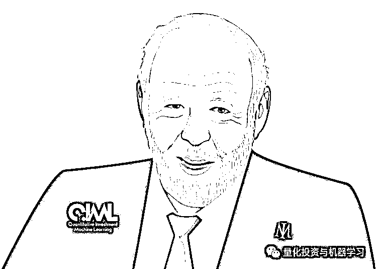
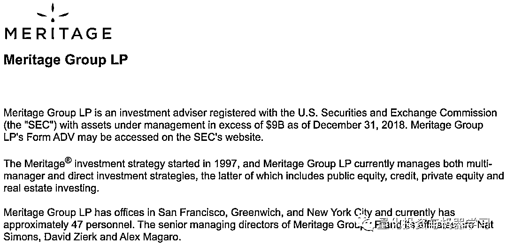

# 西蒙斯终放手！子承父业，文艺复兴该何去何从？

> 原文：[`mp.weixin.qq.com/s?__biz=MzAxNTc0Mjg0Mg==&mid=2653296607&idx=1&sn=0e23be0ef03e48d53f102c724101d1e7&chksm=802dd5cab75a5cdcbae6bd3fa2491505a386a7bafd7c74b064e3ceb9ee406114c4d189c330ae&scene=27#wechat_redirect`](http://mp.weixin.qq.com/s?__biz=MzAxNTc0Mjg0Mg==&mid=2653296607&idx=1&sn=0e23be0ef03e48d53f102c724101d1e7&chksm=802dd5cab75a5cdcbae6bd3fa2491505a386a7bafd7c74b064e3ceb9ee406114c4d189c330ae&scene=27#wechat_redirect)

**标星★****置顶****公众号     **爱你们♥   量化投资与机器学习编辑部报道

热门阅读：

***0***

**编辑部的话**

公众号自打创立之日起，西蒙斯的大名已经无人不知，无人不晓。现如今老爷子要将文艺复兴的未来交给下一代的手里，让我们不禁感慨西蒙斯传奇的一生。

1977 年，他永远离开了学术界，开始涉足金融领域。

2015。西蒙斯在接受 Numberphile 采访时说: “也许有一些方法可以从统计学上预测价格，我们逐渐建立了模型”。

这些模型的核心通常分为两大类，趋势跟踪或均值回归：1988 年第一年增长了 8.8%，1989 年下降了 4.1%。但在 1990 年，在专注于短期交易后，大奖章扣除费用后获得了 56%的回报。

最终，**科学家们甚至为他们的模型开发了一种内部编程语言**。如今，大奖章使用数十种策略作为一个系统一起运行。据知情人士透露，支持该基金的代码有几百万行。不同的团队负责特定的研领域究，但实际上每个人都可以在任何事情上工作。每周二都有一个会议讨论各种想法。

在大奖章的成功鼓舞下，西蒙斯在 90 年代中期开始寻找更多的研究人员。一份有华尔街工作经验甚至金融背景的简历就是一张通行证。西蒙斯曾经说过：“我们雇佣那些做过出色科学研究的人”。接下来涌现的人才，其中大部分至今仍是该公司的核心。在此期间，他们正在努力进行**语音识别和机器翻译**。

以至于后续更多的 IBM 资深人士加入了他们的行列，其中包括弦理论学家 Stephen Della Pietra 和 Vincent Della Pietra、发明了识别人类语音的算法 Lalit Bahl、专长于数字信号处理的 Mukund Padmanabhan 等。

**文艺复兴还花费大量时间收集、分类和清理数据，并使研究人员能够访问这些数据**：如果你有一个想法，你想要快速测试它。如果你必须让数据成形，它会极大地减缓这个过程。

“你需要建立一个层层叠叠的体系”。西蒙斯在 2000 年接受机构投资者采访时说。对于每一个新想法，你都必须确定：这是真正的新想法，还是以某种方式嵌入到我们已经做过的事情中？一旦确定了，团队就会计算出给它多少权重。随着时间的推移，信号可能最终会消失，但通常会被保留下来，因为它们有时会重现或者如果被移除，会产生意想不到的结果。

在 2013 年的某次会议上，有人分享了大奖章投资者的一个例子：通过研究云层覆盖数据，他们发现从纽约到东京，晴天与上涨的市场之间存在相关性：事实证明，当巴黎多云的时候，法国股市上涨的可能性比晴朗的时候要小。不过，但这并不是一个赚大钱的机会，因为它只在 50%的情况下是正确的。关键是，如果有一些信号非常强烈，而且很有意义，那么它们早就被交易出去了。我们要做的是寻找很多很多这样的信号。我们有 90 个数学和物理的博士，他们整天坐在那里寻找这些信号。 我们有 1 万个处理器在那里不断研磨，寻找信号。

据熟悉该公司的人士说，除了语言专家外，**天体物理学家对该系统的成功有着巨大的影响。这些科学家擅长筛选“有噪声”的数据。**

当竞争对手和前投资者被问及文艺复兴如何才能继续获得如此惊人的回报时，他们的回答是一致的：**他们跑得比任何人超前！**

***1***

**正文**

近日，全球顶尖的对冲基金公司文艺复兴正在重组董事团队，这些董事最终将接替创始西蒙斯，执掌全球最赚钱的对冲基金之一。

**詹姆斯·西蒙斯（ James Simons，1938 年－）是美国的数学家、投资家和慈善家。作为最伟大的对冲基金经理之一，他是量化投资界的传奇人物！**

根据提交给监管机构的文件，文艺复兴将董事会的成员数量增加了一倍（10 人），并将西蒙斯的儿子 Nathaniel Simons 提升为联席董事长。

Nathaniel Simons

根据资料显示，53 岁的 Nathaniel Simons 自 2006 年以来一直担任文艺复兴的副董事长，管理着旧金山的 Meritage Group。但并没有参与文艺复兴的日常运营。

Meritage Group

Pinetum Partners 是一家专注于金融服务行业高管培训和猎头的公司，其创始人 Sandy Gross 说：“**西蒙斯已经建立了一套体系，这样公司就可以在创始人不在后继续存在**”。“他正为儿子提供这样一个机会，让他们把家族的钱继续投资于公司”。

西蒙斯相信：

**最好的科学工作是人们在一起合作完成的**

这在华尔街是独一无二的，尤其是在量化金融。人们通常在竞争中度过，有时竞争可以带来最好的结果。但西蒙斯会说，他希望人们在遇到问题时，把它留给其他人去发现和解决。

**因此，他们有了开放的代码，任何人，从初级员工到高级员工，都可以看到他们的代码，看到其他人在做什么**。所以不可避免地，当有人感到沮丧，转向其他事情时，其他人可以看看他们在做什么，他们做了什么，并找到改进的方法。

**编辑部的话**

在国内要做到这一点，不是所以机构都能接受和认可。太难了

西蒙斯也用激励创造了这种文化。他们有一个大奖章基金和一个损益（P&L）表，大奖章的收益是每个人的收入。因此，人们意识到这里传递了一个信息：无论你做什么，只要有助于提高基金的业绩，你就会得到奖励。这可能是非常乏味的工作，比如收集数据，清理数据等。我的意思是，**在很多基金公司，确保数据准确并不是最重要的职位，但它在文艺复兴是！**当你发现了一些小故障，你真的帮助了你的同事，你会得到奖励。基本上，如果一只基金表现良好，无论是什么，你都会得到奖励。

还有一种**紧迫感**，这有点让我惊讶，因为大奖章的收益率太可怕了！自 1988 年以来，扣除手续费，每年平均上涨 66% ！但是他们还是觉得，市场在无时无刻变化，他们能跟上吗？所以我认为这种紧迫感对他们也有帮助。

同时，他们追求一种和谐：

*   破解密码是和谐的一种形式

*   数学证明是和谐的一种形式。

*   和有创造力的人合作是和谐的一种形式。

*   打破陈规，发现新事物是和谐的一种形式。

*   66%的年收益率和 230 亿美元的净资产是和谐的一种形式。

*   解决生命的起源和时间的本质是和谐的一种形式。

*   坚韧、失败和最终的突破是和谐的一种形式。

西蒙斯于 1982 年创立了文艺复兴，在 2010 年宣布退休，并将首席执行官交给了副手 Peter Brown 和 Robert Mercer。

当时，西蒙斯在给投资者的一封信中表示，他将继续担任公司的主要股东和非执行董事长，出席执行委员会和董事会会议，同时参与公司的所有重大决策。

文艺复兴的新董事会目前共有 10 名成员。在新增的 5 名董事中，有 4 人：Alan Stange、David Lippe、Anne Small 和 Jim Rowen 都是文艺复兴时期的高管，在运营、法律和交易方面扮演着关键角色。除了提拔儿子外，西蒙斯还把女婿 Mark Heising 也加入了这个团队。

具体新成员介绍如下：

*   **Alan Stange：**55 岁，非研究 infrastructur 施部门的负责人

*   **David Lippe：**55 岁，首席运营官

*   **David Lippe：**48 岁，outside funds 研究主管

*   **Anne Small：**45 岁，曾担任美国证券交易委员会总法律顾问，并曾担任美国前总统奥巴马的特别助理和助理法律顾问。这个有点料！

*   **Mark Heising****：**62 岁，西蒙斯基金会董事，他的妻子 Liz Simons 是基金会主席。

***2***

**关于文艺复兴**

下图显示了文艺复兴以 H1B 签证向其 East Setauket New York 办事处聘用的量化分析师和工程师支付的薪资（单位为 K）。**文艺复兴以只雇佣少数精英研究人员而闻名**，但与以往的 H1B 薪酬数据一样，这只是一个小样本，它反映了仅向非美国研究人员支付的薪酬数额（在美国工作的公民）。

数据表明，文艺复兴是很多对冲基金中薪酬最高的机构之一。然而，值得注意的是，**工资并不是大多数人为西蒙斯工作的原因。****真正的吸引力是他们向 Medallion 基金投资的机会**，该基金只对员工开放，自 1988 年成立以来，**每年的回报率约为****40%****。**

前段时间编辑部推荐的由 Greg Zuckerman 撰写的畅销书***《The Man Who Solved the Market》***让我们了解了很多关于西蒙斯和文艺复兴的故事。也在量化圈引起热议，众多达人分享读书心得或评论。

**点击图片获取此书**

热门阅读：

2020 年第 24 篇文章

量化投资与机器学习微信公众号，是业内垂直于**Quant、MFE、Fintech、AI、ML**等领域的**量化类主流自媒体。**公众号拥有来自**公募、私募、券商、期货、银行、保险资管、海外**等众多圈内**18W+**关注者。每日发布行业前沿研究成果和最新量化资讯。

你点的每个“在看”，都是对我们最大的鼓励