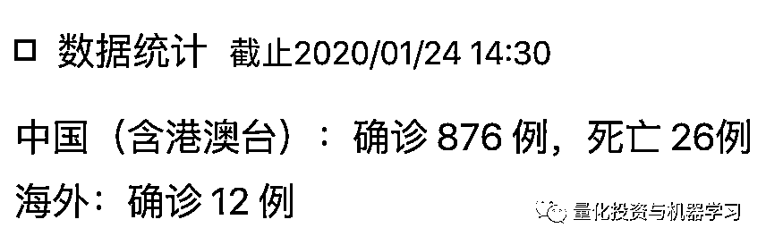

# 动态可视化：新型肺炎确诊人数！

> 原文：[`mp.weixin.qq.com/s?__biz=MzAxNTc0Mjg0Mg==&mid=2653296599&idx=1&sn=838b118d9e3128b787c158d57f54e821&chksm=802dd5c2b75a5cd460e6486301384a0e228ee71ba8ebe1bc5ab39306816531b46b8413c8e148&scene=27#wechat_redirect`](http://mp.weixin.qq.com/s?__biz=MzAxNTc0Mjg0Mg==&mid=2653296599&idx=1&sn=838b118d9e3128b787c158d57f54e821&chksm=802dd5c2b75a5cd460e6486301384a0e228ee71ba8ebe1bc5ab39306816531b46b8413c8e148&scene=27#wechat_redirect)

**标星★****置顶****公众号     **爱你们♥   

这个春节，新型冠状病毒肺炎来势汹汹，疫情牵动每个人中国人的心！

武汉人民在疫情中艰苦、勇敢的抗争！看到伟大的医护人员不怕自身安危，无畏地奋战在第一线！看到无数的人放弃回家探亲、集会和出游，牺牲个人利益以避免疫情扩散！更看到，国家领导及各级政府高度重视，各项有力措施陆续出台！

为了让大家更加直观的感受到所有感染地区（以省份为单位）疫情的进展情况，公众号特从公开的官方资料中，整理了最近肺炎确诊人数的动态图： 

[`mp.weixin.qq.com/mp/readtemplate?t=pages/video_player_tmpl&action=mpvideo&auto=0&vid=wxv_1178735401993994240`](https://mp.weixin.qq.com/mp/readtemplate?t=pages/video_player_tmpl&action=mpvideo&auto=0&vid=wxv_1178735401993994240)

数据来自：网易新闻

截止我们发稿：

**武汉加油！**

**中国加油！**

2020 年第 23 篇文章

量化投资与机器学习微信公众号，是业内垂直于**Quant、MFE、Fintech、AI、ML**等领域的**量化类主流自媒体。**公众号拥有来自**公募、私募、券商、期货、银行、保险资管、海外**等众多圈内**18W+**关注者。每日发布行业前沿研究成果和最新量化资讯。

你点的每个“在看”，都是对我们最大的鼓励