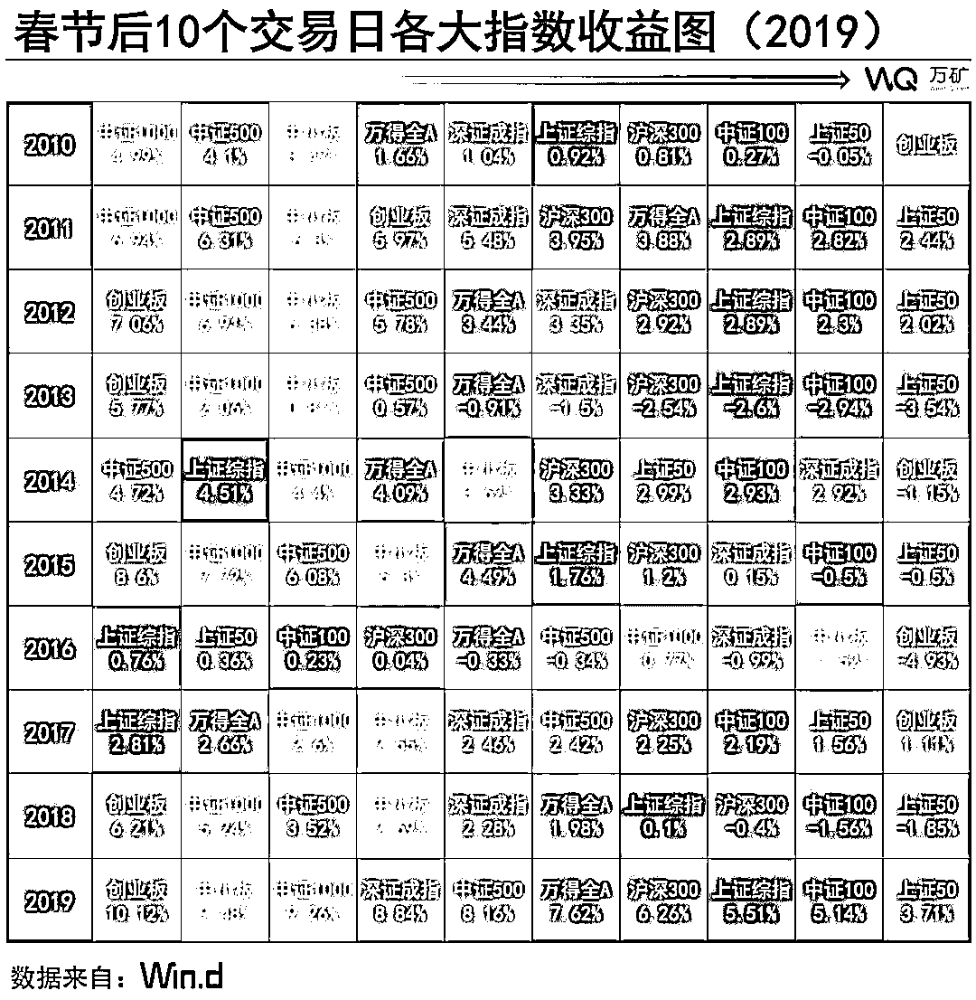

# 十、年可视化：A 股春节效应

> 原文：[`mp.weixin.qq.com/s?__biz=MzAxNTc0Mjg0Mg==&mid=2653296540&idx=1&sn=c756a5a8ac735a3724c52c280631c679&chksm=802dd589b75a5c9ffb59d7f9d33bdc2c7337b16aa45de94c1117980a04dd267161a4fa51911c&scene=27#wechat_redirect`](http://mp.weixin.qq.com/s?__biz=MzAxNTc0Mjg0Mg==&mid=2653296540&idx=1&sn=c756a5a8ac735a3724c52c280631c679&chksm=802dd589b75a5c9ffb59d7f9d33bdc2c7337b16aa45de94c1117980a04dd267161a4fa51911c&scene=27#wechat_redirect)

**标星★****置顶****公众号     **爱你们♥   

来自：WindQuant 万矿

**2019 年**

是不平凡的一年

中国大陆总人口突破 **14 亿**

国内生产总值（GDP）达 **99.0865 万亿元**

人均 GDP 突破 **1 万美元**

**14 亿、99.0865 万亿、1 万美元**，这三个数字标志着我们向着联合国划定的高收入国家标准又迈进了一步！

接下来，请大家花 1 分钟的时间，让万万带领你们领略这 58 年来中国的腾飞！

**↓↓↓**

[`mp.weixin.qq.com/mp/readtemplate?t=pages/video_player_tmpl&action=mpvideo&auto=0&vid=wxv_1172662752566067201`](https://mp.weixin.qq.com/mp/readtemplate?t=pages/video_player_tmpl&action=mpvideo&auto=0&vid=wxv_1172662752566067201)

由于各国数据公布时间不一致，最新到 2018 年

春节效应

春节效应就是专门针对春节的一种月份效应，A 股市场在春节期间的表现通常优于平日，国泰君安认为 A 股出现春节效应的原因主要有：

1、**盈利端预期的改善**，春季是开工旺季，经济动能预期会改善，开年信贷数据或会走强，而 1 月份宏观经济数据空窗期为这一预期升温发酵创造条件；

2、**年末提现因素的影响**，银行系统趋向资金紧张，二春节之后流动性回流，资本市场流动性将趋于改善；

3、**机构投资者存在着跨年度布局需求**，有利于提升市场交易活跃度；

4、每年 11 月份-12 月份举行的**中央经济工作会议**，3 月份左右的**两会**，会出现一些超预期因素。

如何编程计算春节天数

下面这段代码为计算春节前后交易日的核心代码：

**点击****阅读原文****查看全部代码** 

通过编程，我们可以得到历年春节：

*   date_bef：指休市前的最后一个交易日

*   date：指休市结束后的第一个交易日

*   periods：指春节休市天数

从上表可知，不同年份 A 股市场休市天数会有不同，2010 年-2019 年期间，除 2011 年、2014 年-2015 年、2017-2018 年的春节共休市 7 天，其余年份共休市了 9 天。

全球春节效应

首先让我们看看在这 20 年期间全球市场在春节时期的表现：

A 股春节效应

综合各大研究报告，我们引用兴业金工定义的“春节月”：**即包含春节假期在内的 4 周时间，即春节休市前的 5 个交易日和春节开市后的 10 个交易日**。春节前后或春节月的**收益率采用对数差分收益率**的计算方式，其中 rt 表示第 t 期的收益率，Pt 表示第 t 期的收盘指数点位：

基于上述公式，我们可以推出，第 i 期收盘到第 j 期收盘这段时间的收益率就等于：

下面是计算不同指数春节效应期间对数收益率的核心代码：

****点击****阅读原文****查看全部代码****

#### 本文主要对**2010-2019 年**期间 A 股市场的春节效应进行实证研究，包括指数层面和行业层面：

**指数层面：**万得全 A、上证综指、深证成指、上证 50、中证 100、沪深 300、中证 500、中证 1000、中小板指数、创业板指数。

**行业层面：** 申万一级、Wind 二级。

#### 节前 5 日风格分化相对显著，**小盘指数表现要好于大盘指数的表现。**从各年平均情况来看，各指数在春节前 5 日都取得了正收益，其中表现最好分别是创业板指、中小板指、中证 500、中证 1000，均高于 2.5%，而上证 50、中证 100 等大盘指数的平均涨幅均低于 1.5%。

#### **节后 5 日风格分化进一步加剧，其中，小盘指数较节前表现更优**，其中中证 1000 节后 5 日表现最优，节后 5 日收益由节前 5 日收益的 2.58% 上涨至 3.49%；大盘指数节后表现更为逊色，上证 50 和中证 100 的节前 5 日收益分别有 1.27%、1.5%，而节后 5 日收益却分别下跌至 0.45%、0.7%。

#### 通过 10 日我们也可以发现各指数节前节后的表现也存在明显的差异：**大盘指数节前表现要优于节后表现，而小盘指数的节后表现却优于节前表现**，这也与前面分析得到的结果一致。

单个指数的春节效应

今年春节“红包”行情还有吗？
根据 WindQuant 万矿统计显示，2010 年至 2019 年的 10 年间**，春节前后 A 股大概率上涨**，春节前 5 个交易日，有 8 次上涨，上涨概率 80%，平均涨幅 1.57%；春节后 5 个交易日，也有 8 次上涨，平均涨幅 1.33%。然说过持股过节，节后大概率会有一波上涨，但并不是大票小票同时上涨，其中也有一定的规律可循。接下来，我们再看看春节前后一周、两周内 A 股各主要指数具体的涨跌情况。
从 2000 年至 2019 年，深证成指在春节前后各时间段内的平均涨幅均超过 2%。**春节前后 10 个交易日上涨概率较大，其中节后上涨概率近九成**。从 2010 年至 2019 年，**沪深 300 指数在春节前后各时间段内的平均涨幅均超过 1%**。从平均涨跌情况来看，上证 50 指数和沪深 300 指数一样也呈现出节前涨幅大于节后的特征。就中小板指而言，节前 5 日的收益整体上要优于节前 10 日收益，说明越临近春节，表现越好，春节效应越显著；节后 10 日收益要优于节前 5 日收益，说明节后效应持续时间较长。创业板指节后平均涨幅大于节前，且在**春节前 5 个交易日和春节后 10 个交易日内上涨概率超过 80%**。

从上述统计情况不难看出 A 股的春节效应的确存在，除上证 50 外各指数在节前一周上涨概率最大，**大指数（如上证 50）相对小指数（中小板指、创业板指）更容易在节前见顶。**

行业的春节效应

根据 Wind 二级行业来看，** 节后表现整体上优于节前表现**，但不同行业节前与节后的表现相差较大。 1、有的行业节前表现不佳，**节后却出现大逆转**：如**商业与专业服务业、半导体与半导体生产设备行业、公共事业、食品饮料和烟草等行业**；2、有的行业**节前表现却优于节后表现**：典型的有**保险业**； 3、有的行业**节前节后都表现较优**：如**电信服务、软件与服务、运输、家庭与个人用品**等行业。

根据申万一级行业来看，** 节后表现整体上优于节前表现。**

****节后大逆转：****公用事业********节前：****交通运输、计算机、传媒、有色金融、汽车等行业表现突出。**** ****节后：****公用事业、通信、电子、建筑装饰、电气设备等行业表现突出。****

**** 

****点击****阅读原文****查看全部代码****

**量化投资与机器学习微信公众号，是业内垂直于**Quant、MFE、Fintech、AI、ML**等领域的**量化类主流自媒体。**公众号拥有来自**公募、私募、券商、期货、银行、保险资管、海外**等众多圈内**18W+**关注者。每日发布行业前沿研究成果和最新量化资讯。**

******你点的每个“在看”，都是对我们最大的鼓励**