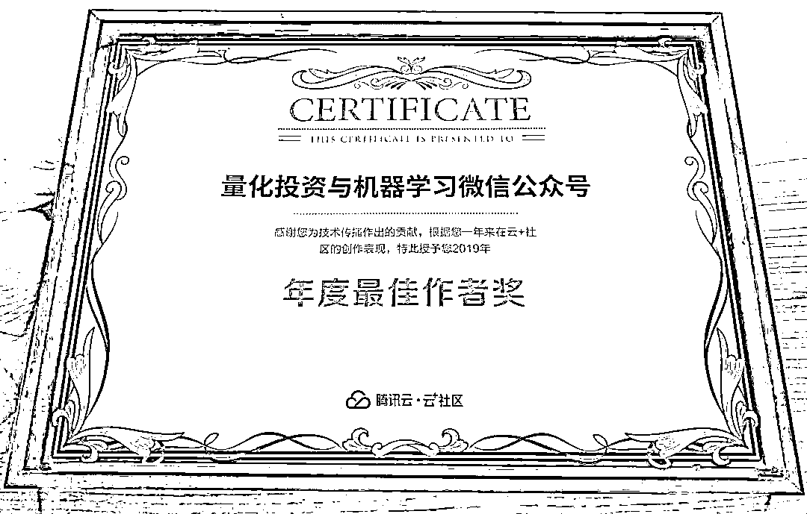
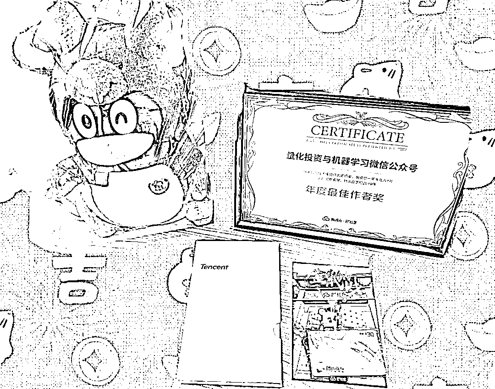
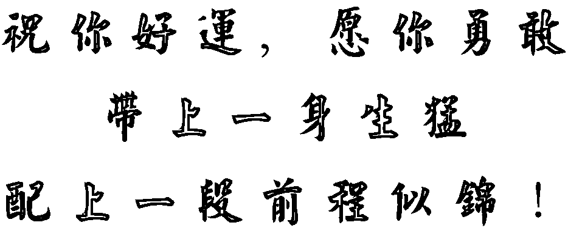

# Quant 最爱！

> 原文：[`mp.weixin.qq.com/s?__biz=MzAxNTc0Mjg0Mg==&mid=2653296534&idx=1&sn=c5fd47fe77cd33d7d27bcac0bd6f770b&chksm=802dd583b75a5c95209e8caa681c391791ece091d095347f5e2e37a652d5bcdf7c9ee0548a96&scene=27#wechat_redirect`](http://mp.weixin.qq.com/s?__biz=MzAxNTc0Mjg0Mg==&mid=2653296534&idx=1&sn=c5fd47fe77cd33d7d27bcac0bd6f770b&chksm=802dd583b75a5c95209e8caa681c391791ece091d095347f5e2e37a652d5bcdf7c9ee0548a96&scene=27#wechat_redirect)

**标星★****置顶****公众号     **爱你们♥   

今天，公众号收到了来自腾讯云社区寄来的**一箱礼物**，真的是一箱！其中有一件礼物是这张证书：

**公众号在云+社区**

**影响力排名第****285****位**

**超越了****95.2%****的作者**

感谢腾讯给自媒体时代做出的贡献，感谢腾讯给我们这些创作者提供如此优秀的平台。

这是全部礼物：

公仔是真的可爱。披着鼠衣的企鹅

转眼间，量化投资与机器学习微信公众号（QIML）已经运营 4 个年头了。

**一路走来，实属不易！**

可以用四个字总结我们的心路历程：

**不忘初心**

这里的初心就是我们始终追求的高品质、高质量，无论公众号做的多么大，我们认为：**好内容才是立身之本**在这几年间，微信经历了大大小小无数次改版，微信公众号也从最初的野蛮生长逐步趋于稳定。它成为很多人获取信息的主要渠道，也因此成就了很多大 V，改变了很多人的命运。
从寥寥无几的阅读量到几十万粉丝的关注度，QIML 改变的不仅仅是我们本身，更重要的是 QIML 帮助了无数的 Quant 们。在复杂的投资市场，我们也只是一个小学生。但**QIML 希望为国内的量化投资事业贡献一份自己微薄的力量**。我们不知道能影响多少人，但只要你们有所得、有所获，那就够了！**在此，还要特别感谢编辑部的小伙伴们，是你们的辛勤付出，才有了 QIML 的今天！**心灵鸡汤就不说那么多了，最后送给所有粉丝们一句话：QIML 全体成员