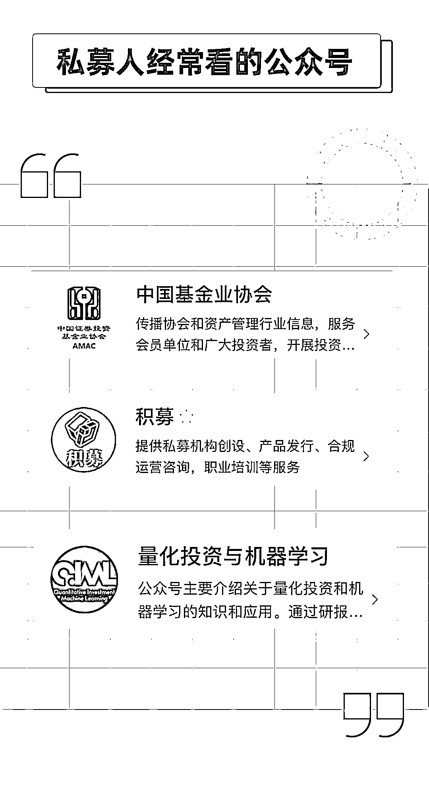
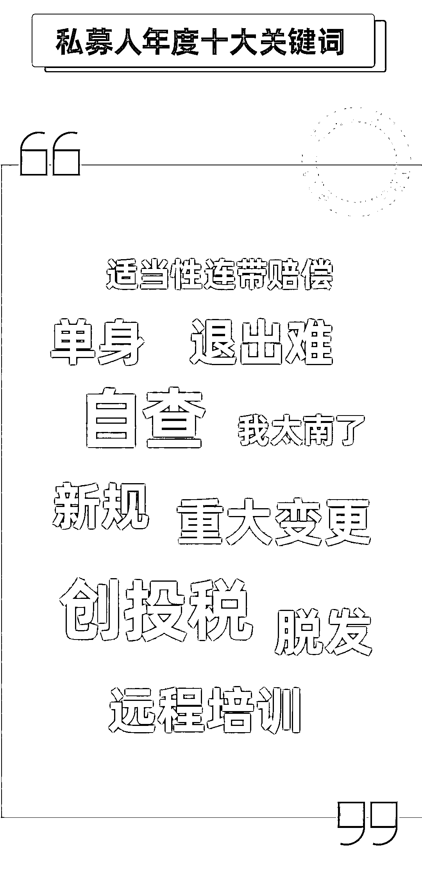

# 2019『私募人』年度账单强势出炉！

> 原文：[`mp.weixin.qq.com/s?__biz=MzAxNTc0Mjg0Mg==&mid=2653296470&idx=1&sn=ac28b077166d123dc04305c46d6fb23f&chksm=802dd543b75a5c55dda35db7086b190ac29c2e9aac72deb99c9fbd300ee7e3dae6f522f868aa&scene=27#wechat_redirect`](http://mp.weixin.qq.com/s?__biz=MzAxNTc0Mjg0Mg==&mid=2653296470&idx=1&sn=ac28b077166d123dc04305c46d6fb23f&chksm=802dd543b75a5c55dda35db7086b190ac29c2e9aac72deb99c9fbd300ee7e3dae6f522f868aa&scene=27#wechat_redirect)

**标星★****置顶****公众号     **爱你们♥   来自：积   募作者：积小玲

**2020 愿所有美好如期而至**

这一年私募人都经历了什么！

经历都多少次的检查？

发了多少只产品？

谁是最勤奋的私募管理人？

私募人的年度十大关键词是什么？

私募聚集最多的地区在哪里？

多少家管理人已经申请到了投顾资格？

一起来看看 2019 私募人的年度账单，如果你还有什么想说的，欢迎留言告诉我们哦~

* * *

声明：本文仅代表作者个人观点，不代表本公众号立场。本公众号转载此文仅出于传播更多资讯之目的。如有侵权或违规请及时联系我们，我们将立刻予以删除。本公众号所载文章、数据仅供参考，使用前请核实，风险自负。投资有风险，入市需谨慎。

2020 年第 16 篇文章

量化投资与机器学习微信公众号，是业内垂直于**Quant、MFE、Fintech、AI、ML**等领域的**量化类主流自媒体。**公众号拥有来自**公募、私募、券商、期货、银行、保险资管、海外**等众多圈内**18W+**关注者。每日发布行业前沿研究成果和最新量化资讯。

你点的每个“在看”，都是对我们最大的鼓励