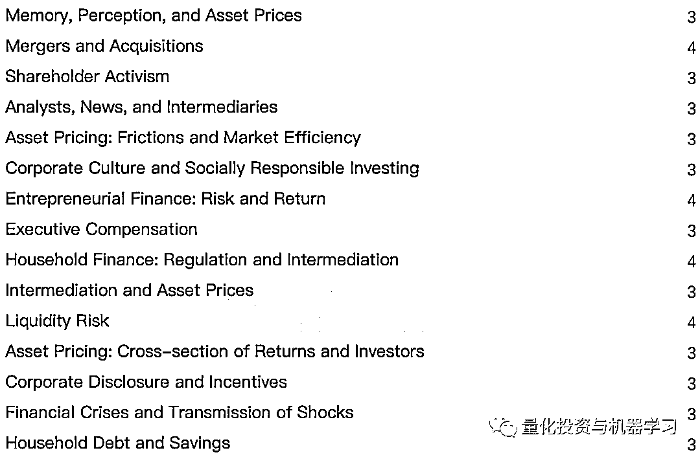

# AEA 年度大会精选：5 篇有趣的量化论文！

> 原文：[`mp.weixin.qq.com/s?__biz=MzAxNTc0Mjg0Mg==&mid=2653296463&idx=1&sn=e7fb6208bb4f1c6d119f9b2f33b28769&chksm=802dd55ab75a5c4ca576065c16a6d686ebfe2573938cd89803be465768a659cb2eb859ab0557&scene=27#wechat_redirect`](http://mp.weixin.qq.com/s?__biz=MzAxNTc0Mjg0Mg==&mid=2653296463&idx=1&sn=e7fb6208bb4f1c6d119f9b2f33b28769&chksm=802dd55ab75a5c4ca576065c16a6d686ebfe2573938cd89803be465768a659cb2eb859ab0557&scene=27#wechat_redirect)

**标星★****置顶****公众号     **爱你们♥   量化投资与机器学习编辑部综合报道

***1***

**前言**

****美国经济协会（American Economic Association，简称 AEA）**一年一度的 ASSA 年度会议前几天在加利福尼亚州的圣地亚哥举行。为期 3 天的会议汇集了学术界最聪明的人，讨论了数百篇最新的研究论文！**

# 前美联储主席 Janet Yellen 受邀发言

Alberto Abadie 教授 AEA 课程：“掌握基本无害的计量经济学”

此次年度大会，共有：**74 场会议，240 篇论文，18 次演讲**。可谓干货满满！

***2***

**AEA 介绍**

美国经济学会（American Economic Association，AEA）是在位于美国纽约州东部的村落——萨拉托加（Saratoga, New York）的一次会议上由一小部分对经济学感兴趣的人组织起来，之后于 1923 年 2 月 3 日正式成立。

从 1885 年至大约 1910 年，本学会的成员主要由大专院校的经济学教师组成。21 世纪以来，随着人们对经济学的普遍关注，学会吸引了越来越多的来自商业和专业群体的人士加入。迄今，美国经济协会（AEA）主要由来自学术界、商界、政府和咨询团体的 20000 多名成员组成，这些团体来自不同学科、不同文化背景。 他们都是致力于经济学研究和教学的专业人士或研究生。

美国经济学会超过 50%的会员来自各类学术机构，15%来自工商企业界，其余大多来自各级政府机构及其他非赢利组织。

***3***

**精选论文**

在 2020 年的年度会议上，有很多优秀的论文，那么有哪些论文是有趣的，值得我们深思的呢？接下来公众号带你一一解读！

2020 年度精选

✎

**因子投资**

**《还需要更多的因子》**

**有趣点：****当前的因子模型根本不能解决问题。，****研究人员需要继续寻找圣杯！**

我们需要多少因子才能解释股市预期收益率的横截面？著名的因子模型一般不超过 5 个因子，如 Fama-French 三因自模型、Carhart 四因自模型、Fama-French 五因自模型、Hou-Xue-Zhang Q 因子模型、Stambaugh-Yuan 错误定价因子模型。我们研究结果表明，所需的因子数量远远大于先前在文献中所认为的数量！

2020 年度精选

✎

**股票市场**

**《前景理论与股市异常》**

****有趣点：****法玛想要一个可测试的行为模型。作者给他提供了**** 

**作者提出了一个新的资产价格模型，在这个模型中，投资者根据前景理论评估风险，检验了 22 个解释股票市场显著异常现象的能力。该模型融合了前景理论的所有要素，考虑了投资者先前的收益和损失，并根据对资产的贝塔系数、波动性、偏度和资本收益的经验估计，对其平均收益进行了定量预测。作者发现，该模型在动量、波动、困境和盈利异常方面表现特别好，但在价值异常方面表现很差。**

**2020 年度精选**

**✎**

****基金投资****

****《共同基金投资者真正关心的是什么？》****

****有趣点：****投资者是理性的，他们会根据基金的过去收益和排名进行投资。****

**理性投资者在投资共同基金时应考虑风险因子近期两个颇具影响力的研究利用共同基金流动来检验投资者是否能够区分基金经理技能驱动的业绩和系统性风险因素。两项研究都发现投资者使用资本资产定价模型（CAPM），其中一项研究得出结论称，CAPM 是“最接近真正资产定价模型”。作者重新审视了这些结果，发现，实际上：基金流量数据与投资者盲目依赖基金排名（特别是晨星评级）和追逐近期收益的观点最为一致。作者没有发现任何证据表明，投资者在共与同基金之间配置资金时，会考虑任何常见的系统性风险因素。**

**2020 年度精选**

**✎**

****因子投资****

****《因子动量和动量因子》****

****有趣点：****为什么要追逐股票的动量，交易因子的动量就行了****

**个股收益的动量来源于因子收益的动量。且大多数因子都是正自相关的。因子动量解释了股票动量的所有形式。股票动量策略间接的时间因子：当因子保持自相关时，他们获利，当这些自相关被打破时，他们损失。作者的关键结论是：动量不是一个明显的风险因子，它聚集了所有其他因子的自相关性！**

**2020 年度精选**

**✎**

****金融市场****

****《ETFs 和股东表决》****

****一个意想不到的后果是，它可能导致糟糕的公司治理。**** 

*******4*******

******会议主题总览******

********

*******5*******

******论文下载******

****在**后台**输入（严格大小写）***********AEA-Quant 最爱*******

****2020 年第 15 篇文章****

****量化投资与机器学习微信公众号，是业内垂直于**Quant、MFE、Fintech、AI、ML**等领域的**量化类主流自媒体。**公众号拥有来自**公募、私募、券商、期货、银行、保险资管、海外**等众多圈内**18W+**关注者。每日发布行业前沿研究成果和最新量化资讯。****

************你点的每个“在看”，都是对我们最大的鼓励****