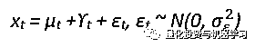

# 金融时序预测：状态空间模型和卡尔曼滤波（附代码）

> 原文：[`mp.weixin.qq.com/s?__biz=MzAxNTc0Mjg0Mg==&mid=2653296436&idx=1&sn=18d313a1e7a3ce270c2c7ef87d90cc9a&chksm=802dd521b75a5c377c1ae0e0bf40193e2d781cdebb6662e7ee47ab31897bd544bea93f3ccb4a&scene=27#wechat_redirect`](http://mp.weixin.qq.com/s?__biz=MzAxNTc0Mjg0Mg==&mid=2653296436&idx=1&sn=18d313a1e7a3ce270c2c7ef87d90cc9a&chksm=802dd521b75a5c377c1ae0e0bf40193e2d781cdebb6662e7ee47ab31897bd544bea93f3ccb4a&scene=27#wechat_redirect)


**标星★****置顶****公众号     **爱你们♥   作者：arit Maitra 编译：1+1=6

***0***

**前言**

时间序列由四个主要成分组成: 季节变化、趋势变化、周期变化和随机变化。在今天的推文中，我们将使用状态空间模型对单变量时间序列数据进行预测分析。该模型具有连续的隐状态和观测状态。

***1***

**状态空间模型**

基于状态空间模型对问题进行了结构分析。该系列是由不同的组成部分，如趋势、季节、周期、变化以及解释变量和干预分别建模，然后放在状态空间模型中。

数据基于 1986 年以来的 Schlumberger Limited 历史数据。 


在这里，为了方便计算，我采用了月（12 个月）频率，你也可以尝试天（252 天/年）的频率。


下面由密度和正态 QQ 图组成的分布图清楚地显示了数据分布的非正态性。


描述性统计：


***2***

**平稳性检验（ADF）**

```py
stationary.test(df1, method = “adf”)
stationary.test(df1, method = “pp”) # same as pp.test(x)
stationary.test(df1, method = “kpss”)
```


数据归一化：


***3***

**自相关函数（ACF）**

**确定不同时间 lags 的相关性是否趋近于 0！**

平稳性=高斯噪声和一个趋势=累积高斯噪声之和。

在这里，我们将通过查看每个信号的自相关函数来检查每个信号的平稳性特征。我们期望对于一个平稳信号，ACF 在每个时间 lag (τ) 时变为 0，因为我们期望不依赖于时间。


我们在这里看到，平稳信号有很少的 lags 超过 ACF 的 CI。这种趋势导致几乎所有的 lags 时间都超过了置信区间。结果表明，ACF 信号是平稳的。 但是，趋势信号并不是平稳的。平稳序列在均值水平附近有较好的方差，峰值是原始序列干预的证据。


我们将进一步分解时间序列，它通常涉及水平、趋势、季节性和噪声成分的组合。分解有助于在分析和预测期间更好地理解问题。

***4***

****时间序列分解****

对时间序列进行分解意味着将其分解为组成成分，这些成分通常是趋势成分和随机成分，如果数据是季节性的，则是季节性成分。分解涉及到将时间序列分离到这些单独的成分中。

我们可以对数据进行差分或对数变换来消除趋势和季节性。在许多统计和计量经济学应用的背景下，这些成分的知识具有潜在的重要性。趋势和季节的估计可以通过最大化残差均方差从差分序列中恢复，但是这并不像直接对分量建模那样吸引人。我们要记住，真实的时序从来都不是静止的。

在这里，我们将使用简单的时间序列移动平均平滑法来估计趋势分量。

```py
df1SMA8 <- SMA(df1, n=8)
plot.ts(df1SMA8)
```


```py
df1Comp <- decompose(df1SMA8) # decomposing
plot(df1Comp, yax.flip=TRUE)
```


我们看到，估计的趋势部分显示，从 1997 年的约 9 小幅下降到 1999 年的约 7，然后从那时起稳步上升到 2019 年的 12。

**经季节性调整**

```py
df1.Comp.seasonal <- sapply(df1Comp$seasonal, nchar)
df1SeasonAdj <- df1 — df1.Comp.seasonal
plot.ts(df1SeasonAdj)
```


**结构模型**

**结构时间序列模型是（单变量）时间序列的（线性高斯）状态空间模型。**在考虑状态空间架构时，通常我们感兴趣的有三个主要方面：

*   预测，预测状态的后续值
*   滤波，根据过去和现在的观测值来估计状态的当前值
*   平滑，根据观测值估计状态的过去值

我们将使用卡尔曼滤波器来执行上述各种类型的推理。

**过滤帮助我们在每次观察时更新系统的知识。****平滑可以帮助我们根据整个样本来估计感兴趣的数量。**

然而，你可能会问为什么我们不使用比结构模型更流行的 ETS（指数平滑）模型。

*   ETS 模型更具有一般性，因为它允许非线性（乘法成分）。
*   由于模型空间较大，ETS 允许自动预测。
*   附加的 ETS 模型几乎等同于相应的结构模型。
*   ETS 模型具有较大的参数空间。
*   结构模型参数总是非负的（方差）。
*   结构模型更容易推广（例如，添加协变量）。
*   使用结构模型更容易处理缺失的值。

***5***

**基本结构模型（BSM）**

结构模型具有使用简单、可靠性高等优点。给出了用极大似然法拟合时间序列结构模型的主要工具。

结构时间序列状态空间模型是将序列分解为若干个分量。它们由一组误差方差指定，其中一些可能是零。我们将使用一个基本的结构模型来拟合随机水平模型进行预测。构成状态空间模型的两个主要部分是：（1）可观测数据和（2）不可观测状态。

最简单的模型：


我们需要看到观测结果，因为状态被系统噪声隐藏起来了。观测结果是当前状态和一些额外的随机变化（称为测量噪声）的线性组合。观察结果是：


它实际上是一个 ARIMA(0,1,1)模型，但对参数集有一定的限制。

局部线性趋势模型具有相同的测量方程，但在µt 的动态性中具有时变斜率：


有三个方差参数。这里εt、ξt 和ζt 是独立的高斯白噪声过程。基本结构模型，是一个附加季节成分的局部趋势模型。因此，测量方程为：



其中 t 是具有动态性的季节性成分


**训练、测试**


**模型拟合和预测**

最好的做法是检查结构程序的收敛性。与任何结构化过程一样，我们需要有合适的初始点，以确保算法收敛到正确的最大值。


```py
autoplot(training, series=”Training data”) +
autolayer(fitted(train, h=12),
series=”12-step fitted values”)
```


**交叉验证**

交叉验证是时间序列分析的重要步骤。

*   Fit model to data y1, . . . , yt

*   Generate 1-step ahead forecast ˆyt+1

*   Compute forecast error e ∗ t+1 = yt+1 − yˆt+1

*   Repeat steps 1–3 for t = m, . . . , n − 1 where m is minimum number of observations to fit model

*   Compute forecast MSE from e ∗ m+1, . . . , e ∗

Ljung-Box 残差检验的 p 值为 0.2131015>显著水平(0.05)；因此，不建议使用交叉验证的结果，因为模型显然不适合数据。


***6***

**基本诊断**

对任何统计分析进行的第一个诊断是检查残差是否与假定的错误结构相符。在单变量状态空间模型中，我们有两种类型的误差：过程误差(wt)和观测误差(vt)。它们不应该有时间趋势。

**model.residuals**

vt 是 t：vt = yt - Zxt - a 时的数据与预测数据的差值

在状态空间模型中，xt 是随机的，模型残差是随机变量。yt 也是随机的，虽然与 xt 不同。模型残差随机变量为：Vt = Yt−ZXt−a

Vt 的无条件均值和方差为 0 和 R

```py
checkresiduals(train)
```


***7***

**卡尔曼滤波器**

卡尔曼滤波算法使用了一系列随时间变化的观测数据，其中包含了噪声和其他误差，并产生了对未知变量的估计。这一估计往往比仅基于单一测量的估计更准确。使用卡尔曼滤波器并不假设误差是高斯的；然而，在所有误差均为高斯分布的特殊情况下，该滤波器给出了准确的条件概率估计。

```py
sm <- tsSmooth(train)
plot(df1)
lines(sm[,1],col=’blue’)
lines(fitted(train)[,1],col=’red’)
Sm-tsSmooth (train) plot (df1) lines (sm [ ，1] ，col’ blue’) lines (fitted (train)[ ，1] ，col’ red’)

# Seasonally adjusted data
training.sa <- df1 — sm[, 1]
lines(training.sa, col=’black’)
legend(“topleft”,col=c(‘blue’,’red’, ‘black’),lty=1,
legend=c(“Filtered level”,”Smoothed level”)
```


```py
x <- training
miss <- sample(1:length(x), 12)
x[miss] <- NA
estim <- sm[,1]+sm[,2]
plot(x, ylim=range(df1))
points(time(x)[miss], estim[miss],
col=’red’, pch=1)
points(time(x)[miss], df1[miss],
col=’blue’, pch=1)
legend(“topleft”, pch=1, col=c(2,1),
legend=c(“Estimate”,”Actual”))
```


```py
plot(sm, main = “”)
mtext(text = “decomposition of the basic structural”
, side = 3, adj = 0, line = 1)
```


**预测**

```py
sm %>%
forecast(h=12) %>%
autoplot() + autolayer(testing)
```


可以看出，BSM 模型能够很好的提取季节成分。你可以在这里试验基于 SMA 的分解（如前面所示），并比较预测精度。

***8***

**动态线性模型与卡尔曼滤波**

动态线性模型（dlm）是状态空间模型的一个特例，其中状态误差和观测分量是正态分布的。这里，卡尔曼滤波将用于：

*   状态向量的过滤值。

*   平滑状态向量的值和终值。

*   预报提供了未来观测和状态的平均值和方差。

我们必须在拟合 dlm 模型之前定义参数。参数分别为 V、W（分别为测量和状态方程的协方差矩阵）、FF 和 GG（分别为测量方程矩阵和过渡矩阵）、m0、C0（状态向量的先验均值和协方差矩阵）。

然而，在这里，我们开始 dlm 模型写一个小函数如下：


我们考虑了一个带有 dlm 的局部水平模型一个多项式 dlm（一个局部线性趋势是一个二阶多项式 dlm）和一个季节分量 12。检查 MLE 过程的收敛性是很好的实践，而不是最佳实践的一部分。

我们还应用了卡尔曼滤波和平滑器。


由此可见，dlm 模型的预测精度相当好。过滤和平滑在时序中几乎是一起移动的，彼此之间的差别不大。这里忽略了季节因素。预测时序和原始时序非常接近。

在这里公众号普及一下**R 中的 dlm 包**：它是模块化的，因此你可以自由地构建具有多个组件的模型，例如，你可以指定具有季节性组件的线性趋势模型。

***9***

**总结**

状态空间模型有多种形式，是处理大量时间序列模型的一种灵活方法，并提供了处理缺失值、似然估计、平滑、预测等的框架。单变量和多变量数据均可用于状态空间模型的拟合。

*参考资料*

*1、Durbin, J., & Koopman, S. J. (2012). Time series analysis by state space methods. Oxford university press.*

*2、Giovanni Petris & Sonia Petrone (2011), State Space Models in R, Journal of Statistical Software*

*3、G Petris, S Petrone, and P Campagnoli (2009). Dynamic Linear Models with R. Springer*

*4、Hyndman, R. J., & Athanasopoulos, G. (2018). Forecasting: principles and practice. OTexts.*

2020 年第 14 篇文章

量化投资与机器学习微信公众号，是业内垂直于**Quant、MFE、Fintech、AI、ML**等领域的**量化类主流自媒体。**公众号拥有来自**公募、私募、券商、期货、银行、保险资管、海外**等众多圈内**18W+**关注者。每日发布行业前沿研究成果和最新量化资讯。

你点的每个“在看”，都是对我们最大的鼓励