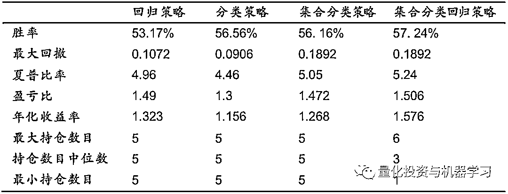
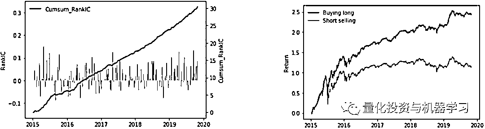

# 机器学习+T0 双核驱动：夏普高达 4.5 的中高频交易策略！

> 原文：[`mp.weixin.qq.com/s?__biz=MzAxNTc0Mjg0Mg==&mid=2653296385&idx=1&sn=68e6339be6dba076fac080f0dcbf3965&chksm=802dd514b75a5c020fc11e42c7e239ccacb5ed92d13340a0a73a62fb0d6aea383f12f7fd06f1&scene=27#wechat_redirect`](http://mp.weixin.qq.com/s?__biz=MzAxNTc0Mjg0Mg==&mid=2653296385&idx=1&sn=68e6339be6dba076fac080f0dcbf3965&chksm=802dd514b75a5c020fc11e42c7e239ccacb5ed92d13340a0a73a62fb0d6aea383f12f7fd06f1&scene=27#wechat_redirect)

**标星★****置顶****公众号     **爱你们♥   作者：周袤 | 安信证券金融工程、王深 | 实习生编辑：1+1=6

***1***

**机器学习**

机器学习是为了预测某个值而利用算法来学习数据中模式的科学。利用足够的数据，在所有输入变量与待预测值之间建立映射。在有限的输入变量的情况下，系统更容易预测一个新的值。这种方法不同于传统，传统方法是基于先前设臵的规则开发的，而机器学习模型是使用数据驱动的。

我们选用已经在大量的机器学习和数据挖掘挑战中被广泛地认可的 XGBoost（eXtreme Gradient Boosting），一种 tree boosting 的可扩展机器学习系统。XGBoost 是一个优化的分 布式梯度增强库，旨在实现高效，灵活和便携。XGBoost 在 Gradient Boosting 框架下实现 机器学习算法。XGBoost 提供了并行树提升，可以快速准确地解决数据量大的问题。

***2***

**规则交易与机器学习量化交易的区别**

规则交易是按照制定的规则进行交易的方法。规则，包含着应对未来行情发展不确定性的计划以及依据应对计划而制定的可操作的交易系统。通常来说，规则是基于单因子测试后对于有效因子进行有经验性的组合;机器学习量化交易是采用数据驱动模式进行数据挖掘的，因此机器学习量化交易更加客观。同时，机器学习量化交易对于非线性数据的解释性更好，更加符合股票市场的规律。

***3***

**集合竞价规则**

集合竞价是指对在规定的时间内接受的买卖申报一次性集中撮合的竞价方式。集合竞价时成 交价格的确定原则如下:

1、价格范围内选取成交量最大的价位。

2、高于成交价格的买进申报与低于成交价格的卖出申报全部成交。

3、价格相同的买方或卖方至少一方全部成交。 

两个以上价位符合上述条件的，上海证券交易所规定使未成交量最小的申报价格为成交价格。若仍有两个以上申报价格符合条件，取其中间价为成交价格。深圳证券交易所取距前收盘价 最近的价位为成交价。 

集合竞价的所有交易以同一价格成交。集合竞价未成交的部分，自动进入连续竞价。 

每个交易日的 9:15 至 9:25 为开盘集合竞价时段，14:57 至 15:00 为收盘集合竞价 时段。开盘集合竞价可以分成三个阶段：

第一阶段：9:15——9:20，交易主机可接受买卖申报，也可接受撤单申报。 

第二阶段：9:20——9:25，交易主机不接受参与竞价交易的撤销申报。 

第三阶段：9:25——9:30，交易主机只接受申报，但不对买卖申报或撤销申报作处理。交易 所认为必要时，可以调整接受申报时间。

*图片来自：安信证券

***4***

**日内涨幅影响因子 **

我们将收盘价相对开盘价的涨幅定义为日内涨幅，寻找开盘集合竞价时段可能会对日内涨幅有影响的因子，如下所示:

**因子 1：****隔夜涨幅，即开盘价相对前收盘价的涨幅。**

**因子****2****：****第一阶段（9:15-9:20）涨幅**

**因子 3：****第二阶段 （9:20-9:25）涨幅**

**因子 4：****集合竞价阶段成交金额占比**

**因子 5：****第一阶段是否涨停**

**因子 6：****第二阶段是否涨停**

**因子 7：****第二阶段价格是否平稳上升。**

**因子 8：****第一阶段委比变化（[9:20 的委比-9:15 的委比]/9:15 的委比）**

**因子 9：****第二阶段委比变化（[9:25 的委比-9:20 的委比]/9:20 的委比）**

**因子 10：****集合竞价阶段成交金额占当天总成交金额的比例**

**因子 11：****第二阶段的委买一价，委卖一价均值的平均值**

**因子 12：****第二阶段的委买一价，委卖一价均值的最大值**

**因子 13：****第二阶段的委买一价，委卖一价均值的最小值**

**因子 14：****第二阶段的委买一价，委卖一价均值的绝对变化值**

**因子 15：****第二阶段的委买一价，委卖一价均值的变化比率**

***5***

**机器学习模型**

**XGBoost 模型**

XGBoost 模型是一种基于 boosting 树模型，树模型可以更好的找到非线性关系，树形模型 更加接近人的思维方式，可以产生有效的分类规则。我们采用两种形式来建模，分别为使用 XGBoost 模型对日内涨幅进行回归和使用 XGBoost 模型对日内涨幅分类建模，之后根据运用传统的 Kfold 与安信金工《机器学习与量化投资之二：避不开的那些事》中的推进分析训练上述两种模型。根据 XGBoost 进行特征选择筛选出合适的特征；最后，使用贝叶斯优化对模型进行参数调节。

**数据集**

我们将数据集分为样本内和样本外两部分，样本外数据为 2015.1-2018.12，样本外数据为 2019.1-2019.10。我们对于样本内采取 Kfold 和推进分析模式进行模型训练。Kfold 可以保证 充足的数据量，但是在训练集当中可能用到未来函数（注意在全局回测中还是样本外数据）， 不过由于市场的复杂性和不确定性，我们假设每一折（Fold）的数据有着较好的独立性;推 进分析模式虽然避免了用到未来函数，但是由于前期训练数据量较小，因此会影响到模型的准确性和稳定性。

**XGBoost 回归模型**

XGBoost 回归模型直接对日内涨幅进行回归值预测，我们建立 XGBoost 分类模型对日内涨幅进行分类预测，输出预测的日内涨幅。训练模式为 Kfold 和推进分析，评价指标为平均绝对误差（Mean Absolute Error）。

**XGBoost 回归模型特征选择**

**XGBoost-Kflod 回归模型特征选择：**我们根据 XGBoost 回归模型在 Kflod 中输出的特征重要度进行特征选择，首先我们剔除相关 度较高的因子，之后将低相关性的因子放入 XGBoost 模型中根据重要度进行因子筛选。经过大量实验剔除因子 5：第一阶段是否涨停，因子 6：第二阶段是否涨停和因子，因子 7：第二阶段价格是否平稳上升，因子 12：第二阶段的委买一价，委卖一价均值的最大值，因子 13：第二阶段的委买一价，委卖一价均值的最小值，因子 14：第二阶段的委买一价， 委卖一价均值的绝对变化值。我们将其他 10 个因子全部选入 XGBoost-Kflod 回归模型中进行训练。

XGBoost-Kflod 特征重要度（特征筛选前）

XGBoost-Kflod 特征重要度（特征筛选后）

**XGBoost-Timesplit 回归模型特征选择：**我们根据 XGBoost 分类模型在推进分析中输出的特征重要度进行特征选择，首先我们剔除相关度较高的因子，之后将低相关性的因子放入 XGBoost 模型中根据重要度进行因子筛选。经过大量实验剔除因子 5：第一阶段是否涨停，因子 6：第二阶段是否涨停和因子，因子 11：第二阶段的委买一价，委卖一价均值的平均值和因子 14：第二阶段的委买一价，委卖一价均值的绝对变化值。

XGBoost-Timesplit 特征重要度（特征筛选前）

XGBoost-Timesplit 特征重要度（特征筛选后）

**XGBoost 回归模型评价**

XGBoost 回归模型采用平均绝对误差（MAE）作为评价指标，平均绝对误差值越小证明模型的稳定性越好。我们发现 Kfold 训练结果在训练集上表现没有推进分析的训练集表现结果好， 但是袋外表现上 Kfold 的训练表现优于推进分析。两种训练方式比起来 Kfold 在训练集和测试集表现出来的一致性高于推进分析。

回归模型训练表现（样本内数据）

**XGBoost 回归 T+0 策略**

我们的股票选择是中证 500 的成份股，回测时间区间为 2019.1-2019.10。我们根据 XGBoost-Kflod 回归模型和 XGBoost-Timesplit 回归模型选取每天概率值从大小排列前 1%的股票作为开仓信号。

**策略表现**

特征筛选后的模型在胜率，夏普比率，盈亏比和年化收益率均好于未进行特征筛选的模型， 因此我们在上一节根据模型重要度和相关性的特征选择是有效的。我们选用特征选择后的模型作为子模型，以单利计算，XGBoost-Kflod 分类 T+0 策略年化收益率 103.9%，胜率 53.17%，夏普比率 4.34，最大回撤 18.9%，盈亏比 1.43，每日持有个股数量为 5 只；XGBoost-Timesplit 分类 T+0 策略年化收益率 87.9%，胜率 52.59%，夏普比率 3.67，最大回撤 18.9%，盈亏比 1.4，每日持有个股数量为 5 只。

T+0 回归策略表现（样本外数据）

**XGBoost 分类模型**

我们对日内涨幅进行转换，日内涨幅小于等于零的设臵为 0，大于零的设臵为 1；之后，我 们建立 XGBoost 分类模型对日内涨幅进行分类预测，输出预测的概率值。训练模式为 Kfold 和推进分析，评价指标为 AUC（Area Under Curve）。

**XGBoost 分类模型特征选择**

**XGBoost-Kflod 分类模型特征选择：**我们根据 XGBoost 分类模型在 Kflod 中输出的特征重要度进行特征选择，首先我们剔除相关度较高的因子，之后将低相关性的因子放入 XGBoost 模型中根据重要度进行因子筛选。经过大量实验剔除因子 5：第一阶段是否涨停，因子 6：第二阶段是否涨停和因子，因子 11：第二阶段的委买一价，委卖一价均值的平均值和因子 14：第二阶段的委买一价，委卖一价均值的绝对变化值。

XGBoost-Kflod 特征重要度（特征筛选前）

图 XGBoost-Kflod 特征重要度（特征筛选后）

**XGBoost-Timesplit 分类模型特征选择：**我们根据 XGBoost 分类模型在推进分析中输出的特征重要度进行特征选择，首先我们剔除相关度较高的因子，之后将低相关性的因子放入 XGBoost 模型中根据重要度进行因子筛选。经过大量实验剔除因子 5：第一阶段是否涨停，因子 6：第二阶段是否涨停和因子，因子 11：第二阶段的委买一价，委卖一价均值的平均值和因子 14：第二阶段的委买一价，委卖一价均值的绝对变化值。

XGBoost-Timesplit 特征重要度（特征筛选前）

XGBoost-Timesplit 特征重要度（特征筛选后）

**XGBoost 分类模型评价**

XGBoost-Kflod 分类模型在第一次训练（Fold 1）时候的 AUC 大于 XGBoost-Timesplit 分类模型在第一次训练，我们认为是由于训练集的数据大小决定的。XGBoost-Kflod 分类模型第一次数据大小为 XGBoost-Timesplit 分类模型在第一次训练的 4 倍，伴随着 XGBoost-Timesplit 分类模型训练次数和数据量的增多，二者的 AUC 值趋于相近。在观察 XGBoost-Kflod 分类模型袋外 AUC 与袋内 AUC，我们发现两者 AUC 值相近；然而在 XGBoost-Timesplit 分类模型上出现了过拟合的情况，我们分析原因是训练过程中前 4 个 fold 的样本数量不足，而使用贝叶斯调参的迭代次数是按照全样本设计的，因此在使用全样本的 调参强度去训练前几个 Fold 时可能存在过拟合，最终导致模型的泛化能力较差。**虽然该方法由于舍弃了未来数据导致训练数据不足泛化能力下降，但是减少未来函数的对于过去的影响。**

分类模型表现（样本内数据）

**XGBoost 分类 T+0 策略**

我们的股票选择是中证 500 的成份股，回测时间区间为 2019.1-2019.10。我们根据 XGBoost-Kflod 分类模型和 XGBoost-Timesplit 分类模型选取每天概率值从大小排列前 1%的股票作为开仓信号。

**策略表现**
以单利和双边千分之二计算，XGBoost-Kflod 分类 T+0 策略年化收益率 87.5%，夏普比率 3.77，最大回撤 18.9%，盈亏比 1.27，每日持有个股数量中位数为 5 只；XGBoost-Timesplit 分类 T+0 策略年化收益率 59.9%，夏普比率 2.7，最大回撤 18.9%，盈亏比 1.32，每日持有个股数量中位数为 5 只。

T+0 分类策略表现（样本外数据）

**单模型 T+0 策略总结**

我们将从模型类型和训练方式两个方面进行分析**。在模型类型上来看回归模型在年化收益率，夏普比率和盈亏比上的表现好于分类模型，但是分类模型的胜率好于回归模型。从训 练方式上来看，Kfold 的模型胜率，夏普比率和年化收益率上好于推进模式。**

单模型 T+0 策略表现（样本外数据）

单模型 T+0 策略年化收益率（样本外数据）

***6***

**集合学习 T+0 策略**

在机器学习的有监督学习算法中，我们的目标是学习出一个稳定的且在各个方面表现都较好的模型，但实际情况往往不这么理 想，有时我们只能得到多个有偏好的模型（弱监督模型，在某些方面表现的比较好）。**集合学习就是组合这里的多个弱监督模型以期得到一个更好更全面的强监督模型，集合学习潜在的思想是即便某一个弱分类器得到了错误的预测，其他的弱分类器也可以将错误纠正回来。**

在之前的分析中，我们分析过回归模型和分类模型的优缺点，Kfold 和推进模式的优缺点，这些优缺点可以通过集合学习来进行相互的补偿。因此我们将对多种模型进行组合后形成更 加优质的策略。根据在验证集上的表现，我们选出如下的策略：

*   **集合分类策略：**我们对两个表现最好的子分类机器学习 T+0 策略（采取 Kfold 和推进模式训练的模型）进行几何加权集合学习选取集合学习后每日信号强度前 1%的作为开仓信号。

*   **集合分类回归策略：**我们将集合分类模型与回归模型进行组合选取每日信号强度前 2%的取交集作为开仓信号。

集合分类回归策略是我们设计出的最终策略，该策略融合回归模型的高年化收益和分类模型的高胜率。集合分类回归模型如下：

集合分类回归模型设计框架

***7***

**集合学习 T+0 策略表现**

在胜率上，分类子模 型模型高于回 归模型，集合学习模型继承了分类子模型模型的高胜率。同时，在样本外的年化收益率和盈亏比上也继承了回归策略的优点。集合策略并没有减少最大回撤，但是从夏普比率上来说集合分类回归策略还是优于子模型。

若按单利和双边千分之二计算，集合分类回归策略胜率 57.24%，年化收益率 130.2%，夏 普比率 4.32 和最大回撤 18.9%。每日持有个股数量最大值，中位数和最小值分别为 6 只，3 只和 1 只。

T+0 策略表现（样本外数据）

机器学习 T+0 策略年化收益率对比（样本外数据）

***8***

**交易成本敏感性分析**

我们将交易成本设臵成双边千分之二和双边千分之一点二，来进一 步观测该策略对于交易成本的敏感性。

*   若按单利和双边千分之二计算，集合分类回归策略胜率 57.24%，年化收益率 130.2%， 夏普比率 4.32 和最大回撤 18.9%。每日持有个股数量最大值，中位数和最小值分别为 6 只，3 只和 1 只。

*   若按单利和双边千分之一点二计算，集合分类回归策略胜率 57.24%，年化收益率 157.6%，夏普比率 5.24 和最大回撤 18.92%。每日持有个股数量最大值，中位数和最小值分别为 6 只，3 只和 1 只。

交易成本的变化给该策略的年化收益率带来了较大的影响，如果双边成本为双边千分之一点 二，集合分类回归策略年化收益率将提升 21%，夏普比率将从 4.32 提升至 5.24，提升幅度 21.3%。因此，我们需要严格地控制交易成本，尽可能以接近开盘价的价格买入，收盘价的价格卖出。

T+0 策略表现（双边千分之一点二）

T+0 策略表现（双边千分之二）

机器学习 T+0 策略年化收益率对比（左双边千分之二，左双边千分之一点二）

***9***

**单因子测试和分组测试**

我们通过分组法和 IC 法来评估因子的有效性，其中 IC 法是以交易日为单位，计算日内涨 幅与去极值、标准化后的因子值之间的秩相关系数（Rank IC），分组选用 IC 值前百分之十 的做多，选用 IC 值后百分之十的做空。本节中单因子测试过程不考虑交易成本，数据集为中证 500 的成份股，时间区间为 2015.1-2019.10。

**隔夜涨幅**
日内涨幅与隔夜涨幅呈现负相关性，因子 Rank IC 均值为-0.078，Rank IC 标准差为-0.082。隔夜上涨的日内平均做空收益 0.33%，隔夜上涨的日内平均做多收益 -0.03%。

隔夜涨幅因子 Rank IC、涨幅因子分组表现

**第一阶段涨幅**

日内涨幅与第一阶段涨幅呈现负相关性，因子 Rank IC 均值为-0.02，Rank IC 标准差为 0.061。第一阶段涨幅的日内平均做空收益 0.23%，第一阶段涨幅的日内平均做多收益 0.06%。

第一阶段涨幅因子 Rank IC、涨幅因子分组表现

**第二阶段涨幅**

日内涨幅与第二阶段涨幅呈现正相关性，因子 Rank IC 均值为 0.053，Rank IC 标准差为 0.083。第二阶段涨幅的日内平均做空收益 0.15%，第二阶段涨幅的日内平均做多收益 0.44%。

第二阶段涨幅因子 Rank IC、涨幅因子分组表现

**集合竞价阶段成交金额占比**

我们采用集合竞价阶段成交金额比上过去五日日均成交金额，日内涨幅与集合竞价阶段成交金额占比呈现负相关性，因子 Rank IC 均值为-0.019，Rank IC 标准差为-0.103。集合竞价阶段成交金额占比的日内平均做空收益 0.14%，集合竞价阶段成交金额占比的日内平均做多收益 0.09%。

合竞价阶段成交金额占比因子 Rank IC、成交金额占比分组表现

**第一阶段是否触及涨跌停**

由于第一阶段可以撤单，该阶段股 价是否触及涨跌停在一定程 度上反映了主力的试盘行为。触及涨停的个股平均日内收益-0.03%，触及跌停的个股平均日内收益 0.2%，未触及涨跌停的个股平均日内收益 0.20%。因此，该阶段涨跌停有较大概率是主力的吸筹行为。

第一阶段是否涨跌停因子分组表现、第二阶段持续上下行因子分组表现

**第二阶段持续上行/ 下行**

我们结合第二阶段特有的无法撤单的特性，设计形态学特征。我们将持续上行定义为第二阶段每一个 tick 的价格都是上涨或者与前一个 tick 价格持平；持续下行定义为第二阶段每一个 tick 的价格都是下降或者与前一个 tick 价格持平；第二阶段价格持续上行的个股平均日内收益 0.22%，持续下行的个股平均日内收益-0.03%，持续上行的个股日内表现远好于持续下行的个股。

**第一阶段委比变化**

委比可以很好的监控集合竞价阶段买卖双方的意图，因此我们定义如下的公式来定义委 比：

*   买量和=买一价的委托量+买二价的委托量+买三价的委托量

*   卖量和=卖一价的委托量+卖二价的委托量+卖三价的委托量

*   委比=(买量和-卖量和)/(买量和+卖量和)*100%

我们采用 9:20 的委比值减去 9:15 的委比值，之后除以 9:15 的委比值。日内涨幅与第一阶段委比变化呈现正相关性，因子 Rank IC 均值为 0.026，Rank IC 标准差为 0.05。第一阶段委比变化的日内平均做空收益 0.097%，第一阶段委比变化的日内平均做多收益 0.2%。

第一阶段委比变化因子 Rank IC、委比变化分组表现

**第二阶段委比变化**

日内涨幅与第二阶段委比变化呈现正相关性，因子 Rank IC 均值为 0.051，Rank IC 标准差为 0.052。第二阶段委比变化的日内平均做空收益 0.039%，第二阶段委比变化的日内平均做多收益 0.27%。

第二阶段委比变化因子 Rank IC、委比变化分组表现

**集合竞价阶段成交金额占当天总成交金额的比例**

日内涨幅与集合竞价阶段成交金额占当天总成交金额的比例呈现负相关性，因子 Rank IC 均值为-0.013，Rank IC 标准差为 0.09。集合竞价阶段成交金额占当天总成交金额的比例的日内平均做空收益 0.091%，集合竞价阶段成交金额占当天总成交金额的比例的日内平均做多收益 0.15%。

集合竞价阶段成交金额占当天总成交金额的比例因子 Rank IC、成交金额占当天总成交金额的比例分组表现

**第二阶段的委买一价，委卖一价均值的平均值**

由于集合竞价阶段并没有实际成交价格，因此我们采用委买一价，委卖一价的平均值看成实际成交价格， 之后计算出第二阶段整体的平均值。日内涨幅与第二阶段的委买一价，委卖一价均值的平均值呈现负相关性，因子 Rank IC 均值为-0.023，Rank IC 标准差为 0.149。第二阶段的委买一价，委卖一价均值的平均值的日内平均做空收益 0.073%，第二阶段的委买一价，委卖一价均值的平均值的日内平均做多收益 0.23%。

第二阶段的委买一价，委卖一价均值的平均值因子 Rank IC、委买一价，委卖一价均值的平均值分组表现

**第二阶段的委买一价，委卖一价均值的最大值**

由于集合竞价阶段并没有实际成交价格，因此我们采用委买一价，委卖一价的平均值看成实际成交价格， 之后计算出第二阶段整体的最大值。日内涨幅与第二阶段的委买一价，委卖一价均值的最大值呈现负相关性，因子 Rank IC 均值为-0.023，Rank IC 标准差为 0.149。第二阶段的委买一价，委卖一价均值的最大值的日内平均做空收益 0.075%，第二阶段的委买一价，委卖一价均值的最大值的日内平均做多收益 0.24%。

第二阶段的委买一价，委卖一价均值的最大值因子 Rank IC

**第二阶段的委买一价，委卖一价均值的最小值**

由于集合竞价阶段并没有实际成交价格，因此我们采用委买一价，委卖一价的平均值看成实际成交价格， 之后计算出第二阶段整体的最小值。日内涨幅与第二阶段的委买一价，委卖一价均值的最小值呈现负相关性，因子 Rank IC 均值为-0.023，Rank IC 标准差为 0.147。第二阶段的委买一价，委卖一价均值的最小值的日内平均做空收益 0.071%，第二阶段的委买一价，委卖一价均值的最小值的日内平均做多收益 0.24%。

第二阶段的委买一价，委卖一价均值的最小值因子 Rank IC、委买一价，委卖一价均值的最小值因子分组表现

**第二阶段的委买一价，委卖一价均值的绝对变化值**

由于集合竞价阶段并没有实际成交价格，因此我们采用委买一价，委卖一价的平均值看成实际成交价格， 之后计算出第二阶段整体的绝对变化值。日内涨幅与第二阶段的委买一价， 委卖一价均值的绝对变化值呈现负相关性，因子 Rank IC 均值为-0.017，Rank IC 标准差为 0.103。第二阶段的委买一价，委卖一价均值的绝对变化值的日内平均做空收益 0.23%，第二阶段的委买一价，委卖一价均值的绝对变化值的日内平均做多收益 0.12%。

第二阶段的委买一价，委卖一价均值的绝对变化 值因子 Rank IC、委买一价，委卖一价均值的绝对变化 值分组表现

**第二阶段的委买一价，委卖一价均值的变化比率**

由于集合竞价阶段并没有实际成交价格，因此我们采用委买一价，委卖一价的平均值看成实际成交价格， 之后计算出第二阶段整体的变化比率。日内涨幅与第二阶段的委买一价，委卖一价均值的变化比率呈现正相关性，因子 Rank IC 均值为 0.038，Rank IC 标准差为 0.08。第二阶段的委买一价，委卖一价均值的变化比率的日内平均做空收益 0.22%，第二阶段的委买一价，委卖一价均值的变化比率的日内平均做多收益 0.29%。

第二阶段的委买一价，委卖一价均值的变化比率因子 Rank IC、委买一价，委卖一价均值的变化比率分组表现

***10***

****总结****

**盘前集合竞价阶段展示出市场对于股票的短期期望，因此我们挖掘出 15 个因子，基于 15 个因子我们采用 Kfold 和推进分析的方法训练 XGBoost 子模型。最后，我们采用集合学习融合回归模型高年化收益的优点和分类模型高胜率的优点构建出集合分类回归策略。同时，我们进行交易成本的敏感性分析双边成本从千分之二变到双边千分之一点二，集合分类回归策略年化收益率将提升 21%，夏普比率将从 4.32 提升至 5.24，提升幅度 21.3%。**

**我们设计出集合分类回归策略：**我们运用集合学习将分类模型与回归模型进行组合，选取每日信号强度前 2%作为开仓信号；以开盘价等权重买入，持有至收盘卖出，在双边千分之二的交易成本下，集合分类回归策略样本外（2019.1-2019.10）表现：胜率 57.24%，年化收益率 130.2%，夏普比率 4.31 和最大回撤 18.9%。每日持有个股数量最大值，中位数和最小值分别为 6 只，3 只和 1 只。****

**风险提示：根据历史信息及数据构建的模型在市场急剧变化时可能失效。**

**2020 年第 12 篇文章**

**量化投资与机器学习微信公众号，是业内垂直于**Quant、MFE、Fintech、AI、ML**等领域的**量化类主流自媒体。**公众号拥有来自**公募、私募、券商、期货、银行、保险资管、海外**等众多圈内**18W+**关注者。每日发布行业前沿研究成果和最新量化资讯。**

******你点的每个“在看”，都是对我们最大的鼓励**