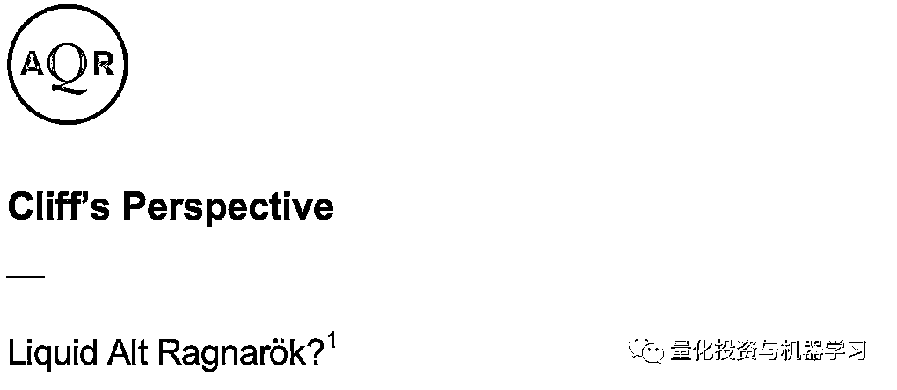
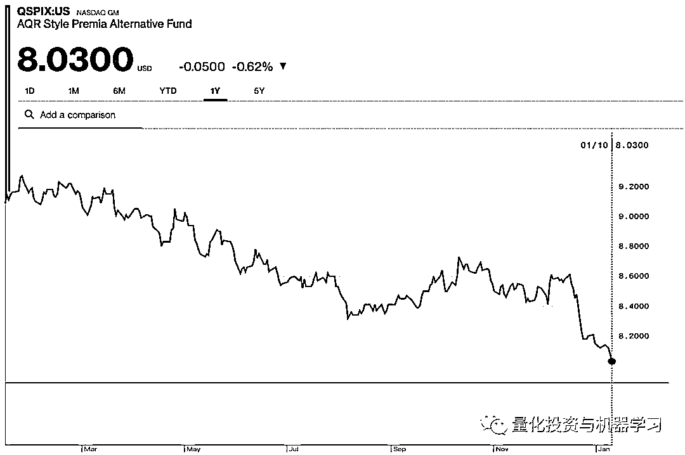

# AQR、WorldQuant 裁员：Quant 怎么了？

> 原文：[`mp.weixin.qq.com/s?__biz=MzAxNTc0Mjg0Mg==&mid=2653296334&idx=1&sn=685ac489db64dcae7d18014566a68ee8&chksm=802dd4dbb75a5dcd14d81301dca39f90a83bbd008f51111463f83ed1b2737e78883e38663331&scene=27#wechat_redirect`](http://mp.weixin.qq.com/s?__biz=MzAxNTc0Mjg0Mg==&mid=2653296334&idx=1&sn=685ac489db64dcae7d18014566a68ee8&chksm=802dd4dbb75a5dcd14d81301dca39f90a83bbd008f51111463f83ed1b2737e78883e38663331&scene=27#wechat_redirect)

**标星★****置顶****公众号     **爱你们♥   量化投资与机器学习编辑部整理出品

Cliff Asness 管理着拥有 1000+名员工的顶级量化对冲基金管理公司 AQR ，截至 19 年 9 月底，AQR 的 AUM 为 2260 亿美元缩水了近 20% ，至 1850 亿美元，为近年来最大跌幅。

虽然家大业大，但这已经是连续第二年裁员了。AQR 在本周二的一份声明中表示：“过去三年，在 AQR，我们的员工数量创下了历史新高，最近略微裁员，反映出我们需要在劳动力增长与当前业务需求之间取得平衡。”

大家还记得 2018 年 Cliff Asness 为了给自己的量化策略进行辩护，写了一篇**23 页，1.7 万字**的文章：

文章中承认，AQR 的策略经历了“艰难时期” ，预计不会出现奇迹般的反弹，但他认为，证据表明，AQR 的策略最终会占上风。

*图片来自：彭博

根据 Morningstar 的数据，今年的前 11 个月，AQR 旗下的共同基金流出了 50 亿美元。

AQR 管理着约 100 只只做多和另类基金。其中 AUM 最大的是其 21 亿美元的另类风格溢价基金，去年下跌 8.2% ，表现逊于美国 3 个月期国库券指数。

*图片来自：彭博

*图片来自：彭博

AUM44 亿美元的托管期货策略基金上涨 1.9%，落后于基准。

*图片来自：彭博

*图片来自：彭博

AQR 的一些 AUM 较小的基金做得更好。根据该网站的数据，其规模 2.45 亿美元的国际防守型基金去年上涨了 18.4%，其 AUM1.37 亿美元的多元资产基金上涨了 21%。

此次裁员，**AQR**的裁员人数在**45 到 90 人**之间。AQR 在伦敦、法兰克福、香港、东京和悉尼，以及格林威治、芝加哥、波士顿和洛杉矶设有办事处，据悉该公司正在全球范围内裁员。

位于康涅狄格州格林威治的**WordQuant**的裁员人数多**达 130 人**，**占各自员工总数的 10% 到 17% **。大多数裁员是在曼谷、墨西哥城和东欧等即将关闭的分支机构进行的。目前还不清楚裁员是否会影响到位于长岛湾豪华的老格林威治区的康涅狄格州办公室。

Igor Tulchinsky(伊戈尔·图利钦斯基)，华尔街资深交易员、量化交易公司 WorldQuant （世坤）的创始人兼 CEO。早年在得克萨斯大学奥斯汀分校（The University of Texas at Austin）获得了计算机专业的本科及硕士学位，接着去了 AT&T 的贝尔实验室从事科研工作。其后，又在宾夕法尼亚大学的沃顿商学院获得了 MBA 金融创业方向（MBA in Finance & Entrepreneurship）的硕士学位。他还是世坤基金的创始人，该基金为那些在科学和量化研究领域深造的杰出学子提供奖学金。他还创建了 WorldQuant 大学，免费提供计量金融硕士的在线学位教育。也曾是一名电子游戏程序员。

Ghost Hunt  - 由 WorldQuant 的创始人 Igor Tulchinsky 创作

在这里玩：

http://www.c64.cz/index.php?detailhry=22588&source=post_page---------------------------

前段时间，WorldQuant 的老大在领英上发表了一则消息。他们之前出版的《Finding Alphas: A Quantitative Approach to Building Trading Strategies》出第二版了！

**点击下方图片获取此书**

WorldQuant 为系统研究指定了一个而闻名 Triple-Axis 计划（TAP），分别是：

具体了解：

[**WorldQuant TAP：Alpha 如何多元化？**](https://mp.weixin.qq.com/s?__biz=MzAxNTc0Mjg0Mg==&mid=2653293682&idx=1&sn=a2fa86017c6aacd198fd9bebcb236527&scene=21#wechat_redirect)

尽管对定量分析师的需求依然强劲，但招聘人员表示，美国市场上已经有大量的量化分析师。招聘公司 Selby Jennings 驻纽约的量化分析、研究和交易主管 Ryan Mazza 表示：**“现在是一年中求职竞争非常激烈的时期。”**

在此次裁员之前，一些对冲基金经历了艰难的一年，量化行业的整体表现不及标普 500 近 30%的涨幅。截止到 2019 年 9 月，AQR 管理的资产下降了 20%。彭博也表示，WorldQuant 的业绩相对于 2018 年有所下降，但该公司今年的业绩依然良好。

一家另类数据公司 Tkn 一直在通过**领英**追踪 AQR 和 WorldQuant 的员工人数。报告称，**AQR 的员工人数从 2018 年年中开始激增，直到 2019 年年中进行了第一轮裁员**，目前仍比历史正常水平高出 10%左右。

**AQR 在领英的员工数**

*图片来自：QIML 公众号整理

从下图看：除 AQR 以外的所有公司都在**领英**上有所增长，其中贝莱德的原始员工人数增幅最大。

*图片来自：QIML 公众号整理

*图片来自：QIML 公众号整理

Tkn 还表示，**WorldQuant 的员工数量在 2019 年 3 月至 6 月期间大幅增长**。

*图片来自：QIML 公众号整理

那么，在 2020 年，该行业还会出现更多的裁员吗？目前，WorldQuant 和 AQR 都在小规模招聘。WorldQuant 在纽约开设了 6 个投资组合管理和 3 个技术职位，AQR 在康涅狄格州为有经验的交易员和技术人员招聘 4 个职位。

如果你失去了量化分析师的工作，进入了不断增长的“半量化”领域（量本投资），你有可能需要接受减薪才能重返原来的工作岗位！

一些老派交易员甚至表示，他们正在经历着机器人交易员的痛苦，这些机器人交易员是来取代他们的。详见热文：

## [**华尔街失守：**](https://mp.weixin.qq.com/s?__biz=MzAxNTc0Mjg0Mg==&mid=2653295698&idx=1&sn=8962f70a639c81174400861bec2883de&scene=21#wechat_redirect)[**23 万交易员被机器人取代！**](https://mp.weixin.qq.com/s?__biz=MzAxNTc0Mjg0Mg==&mid=2653295698&idx=1&sn=8962f70a639c81174400861bec2883de&scene=21#wechat_redirect)

当然，公众号觉得**Value**这两年连续亏损，是不是和裁员也有影响？

这也和知乎一位用户的回答类似：

今年 mid-frequency quant equity 着实不太好做，但 AQR 从两年前开始就一直没有起色，我觉得一定程度上是因为他们做的 factor investing 太传统了，估计有很大一笔钱都还放在非常古老的 value 之类的 factor 上，现在随着市场越来越拥挤，这些传统 quant factor 早就不好使了。其实连新 signal 都很不好做，虽然市场上几乎每个月都会有新的 dataset 出现，但是说实话，这个世界上可供使用的金融信息的理论上限就是有限的，data 不可能无限地爆炸增长，现在新 dataset 的趋势就是越来越详细化、但容纳的 universe 越来越小，比如以前某种投资者行为大家都只有 aggregated number，现在可能有的 data vendor 开始提供 transaction level number，但与此同时涵盖的股票变少了，诸如此类，这样的信息虽然也不错，但是能提供的新 alpha 其实有限。所以靠着新的 dataset 的高人一等的处理手法，实力高超的 quant team 还能再坚挺一阵，但我个人是不相信这种做法能持续一个新 quant 的整个职业生涯，比如直到 40 年后的，到时候新 data 的产出速度肯定已经大幅慢下来，获得 additional value 的机会越来越少，因为金融市场上能用数据表达的信息总共就那么多，注定有一天是要挖到头的。对于那些已经四五十岁的老兵，或许这无关紧要，过段时间就退休了；但是对于刚刚入行的新手 quant，二三十年后该如何恰到饭，为此该怎样有意培养自己的技能，我觉得是必须思考的问题。而且如今大 fund 都有成熟的 data sourcing 团队，对市场上有哪些 data vendor 了如指掌，任何 vendor 卖的 data 都不可能只有一家 fund 买，即使是新 dataset，大家一拥而上抢着用，效果也就不那么好了。

2020 年第 10 篇文章

量化投资与机器学习微信公众号，是业内垂直于**Quant、MFE、Fintech、AI、ML**等领域的**量化类主流自媒体。**公众号拥有来自**公募、私募、券商、期货、银行、保险资管、海外**等众多圈内**18W+**关注者。每日发布行业前沿研究成果和最新量化资讯。

你点的每个“在看”，都是对我们最大的鼓励