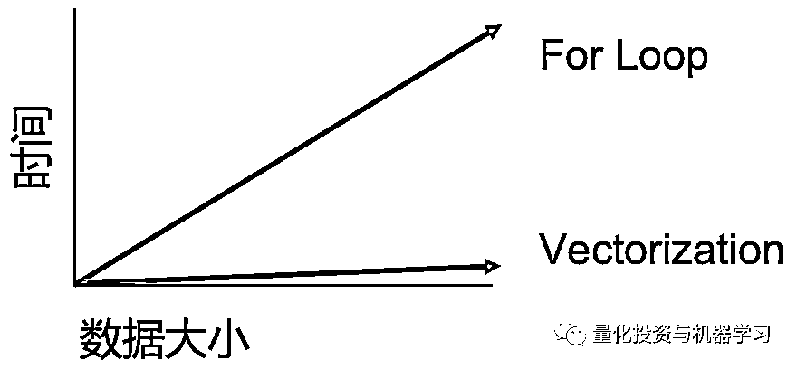
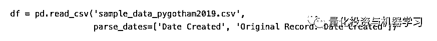
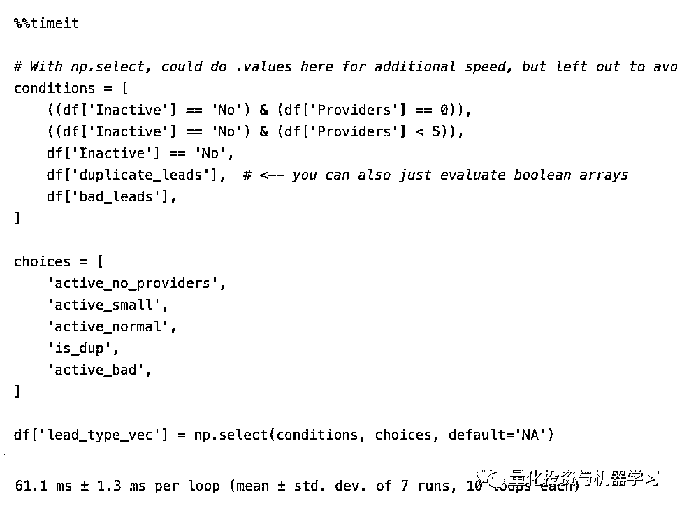

# 1000+倍！超强 Python『向量化』数据处理提速攻略

> 原文：[`mp.weixin.qq.com/s?__biz=MzAxNTc0Mjg0Mg==&mid=2653296308&idx=1&sn=254bcaa023ac25e883a2b2b44293b3f3&chksm=802dd4a1b75a5db7d5b2955e3340eb6ab9095691b77fc8186f0a6f28b3e083779a6d8771ce5a&scene=27#wechat_redirect`](http://mp.weixin.qq.com/s?__biz=MzAxNTc0Mjg0Mg==&mid=2653296308&idx=1&sn=254bcaa023ac25e883a2b2b44293b3f3&chksm=802dd4a1b75a5db7d5b2955e3340eb6ab9095691b77fc8186f0a6f28b3e083779a6d8771ce5a&scene=27#wechat_redirect)

**标星★****置顶****公众号     **爱你们♥   作者：Cheever 编译：1+1=6 

今天公众号给大家好好讲讲基于 Pandas 和 NumPy，**如何高速进行数据处理！**

***1***

**向量化**

1000 倍的速度听起来很夸张。Python 并不以速度著称。这是真的吗？当然有可能 ，关键在于你如何操作！

如果在数据上使用 for 循环，则完成所需的时间将与数据的大小成比例。但是还有另一种方法可以在很短的时间内得到相同的结果，那就是向量化。

这意味着要花费 15 秒的时间来编写代码，并且在 15 毫秒的时间内跑出结果。

当然，根据数据集的不同，库文件、硬件版本的不同，所以实际结果可能会有所不同。

公众号也多次发过相关文章：

[1、30 倍！使用 Cython 加速 Python 代码](http://mp.weixin.qq.com/s?__biz=MzAxNTc0Mjg0Mg==&mid=2653293723&idx=1&sn=8fcb3effaffd583882d5ffe13b330fe2&chksm=802dce8eb75a4798bcb14f9f9cb19b1333c2e31d78fc837448b8a4c8990da9ad083c7fe5ecee&scene=21#wechat_redirect)

[2、71803 倍！](https://mp.weixin.qq.com/s?__biz=MzAxNTc0Mjg0Mg==&mid=2653294130&idx=1&sn=42756891c73ab8b1ecbd6395efef4aba&scene=21#wechat_redirect)[超强 Pandas 循环提速攻略](https://mp.weixin.qq.com/s?__biz=MzAxNTc0Mjg0Mg==&mid=2653294130&idx=1&sn=42756891c73ab8b1ecbd6395efef4aba&scene=21#wechat_redirect)

3、[CuPy：将 Numpy 提速 700 倍！](http://mp.weixin.qq.com/s?__biz=MzAxNTc0Mjg0Mg==&mid=2653294102&idx=1&sn=5dc9d21b3497fe6e1c8df98ee61e02c7&chksm=802dcc03b75a4515a630076cbbe4d116ba1897f4fbb961b0811a888272f9e12953c3ca967c3c&scene=21#wechat_redirect)

4[、10 个提高工作效率的 Pandas 小技巧](http://mp.weixin.qq.com/s?__biz=MzAxNTc0Mjg0Mg==&mid=2653293923&idx=2&sn=3c344ab8661a2d9d6b79caa6f253f35d&chksm=802dcf76b75a466080145f290dc01ddc5775906e16e04cec5d48a10f1356b37b2644fd67a38a&scene=21#wechat_redirect)

5[、高逼格使用 Pandas 加速代码，向 for 循环说拜拜！](http://mp.weixin.qq.com/s?__biz=MzAxNTc0Mjg0Mg==&mid=2653292258&idx=1&sn=d5d79cecb461eab3591ab8e3c2c03ce0&chksm=802dc4f7b75a4de195bcd6211ac8532d68096bef4d7ca0e5a4fcd792d1e2c7dd5bbea85f91cf&scene=21#wechat_redirect)

那么什么是向量化？

简而言之，向量化是一种同时操作整个数组而不是一次操作一个元素的方法，这也得益于 Numpy 数组。

我们先导入测试数据：

第一次向量化测试：

以这个函数为例。这是一个非常基本的条件逻辑，我们需要为 lead status 创建一个新列。

我们使用 Pandas 的优化循环函数 apply()，但它对我们来说太慢了。

或者使用如下方法：

接下来，我们尝试一下使用向量化。将整个 Series 作为参数传递到函数中，而不是对每一行。

但没有成功。**if 语句试图确定 Series 作为一个整体的真实性，而不是比较 Series 中的每个元素，所以这是错误的**。

***2***

**numpy.where()**

语法很简单，就像 Excel 的 IF()。

第一个参数是逻辑条件 Numpy，它将为数组中的每个元素计算一个布尔数组。当条件满足且为 True 时，将返回第二个参数，否则返回第三个参数。

看下面的例子：

numpy.where()它从我们的条件中创建一个布尔数组，并在条件为真或假时返回两个参数，它对每个元素都这样做。这对于在 Dataframe 中创建新列非常有用。

比 apply 函数快**344 倍！**

如果我们在 Series 添加了**.values** ，它的作用是返回一个 NumPy 数组，里面是我的级数中的数据。

现在的 numpy.where()，只查看数组中的原始数据，而不必负责 Pandas Series 带来的内容，如 index 或其他属性。这个小的变化通常会在时间上产生巨大的差异。

各位！一开始，我们应用的 if/else 函数的时间超过了 8 秒，现在我们已经将其缩短到不到 9 毫秒，这几乎是一个 1000 倍的转换！

***3***

**numpy.vectorize()**

**这个函数将把 Python 函数转换成 NumPy ufunc，这样它就可以处理向量化的方法。它向量化了你的函数，而不一定是这个函数如何应用于你的数据，这有很大的不同！**

例子如下：

vectorize()将常规的 Python 函数转换成 Numpy ufunc（通用函数），这样它就可以接收 Numpy 数组并生成 Numpy 数组。vectorize()主要是为了方便，而不是为了性能。实质上是一个 for loop。

我们可以使用它的一种方式，包装我们之前的函数，在我们传递列时不起作用的函数，并向量化它。它比.apply()快得多，但也比.where()慢了 17 倍。所以在这种情况下，将**坚持使用 np.where()！**

**一些人认为这更快：使用 index 设置，但事实证明它实际上不是向量化！**

代码如下：

***4***

**Multiple conditions**

类似这样的多个 if/elif/elifs，如何向量化呢？

你可以调用 np.where 在任何情况下，代码长了就变得有点难读了

实际上有一个函数专门可以做多重条件的向量化，是什么呢？

***5***

**numpy.select()**

向量化 if...elif...else。更简洁（甚至更快）和做多重嵌套 np.where。

np.select()的一个优点是它的 layout。

你可以用你想要检查的顺序来表达你想要检查的条件。np.select 将按从前到后的顺序对每个数组求值，当数据集中的某个给定元素的第一个数组为 True 时，将返回相应的选择。**所以操作的顺序很重要！**像 np.where。其中，你的选择可以是标量，也可以是数组。只要它符合你的条件。

这是我们第一次尝试将多个条件从.apply()方法转换为向量化的解决方案。向量化选项将在 0.1 秒多一点的时间内返回列，.apply()将花费 12.5 秒。嵌套的 np.where()解决方案工具 179ms。

那么嵌套的多个条件，我们可以向量化吗？可以！

代码：

基本上，当使用 np.select()时。根据经验，你需要为每个 return 语句设置 n 个条件，这样就可以将所有布尔数组打包到一个条件中，以返回一个选项。

代码如下：

如果添加了.values：

***4***

**更复杂的**

有时必须使用字符串，有条件地从字典中查找内容，比较日期，有时甚至需要比较其他行的值。我们来看看！

**1、字符串**

假设你需要在一系列文本中搜索特定的模式，如果匹配，则创建一个新的 series。这是一种.apply 方法。

用 np.vectorize()时：

同时，当使用向量化方法处理字符串时，Pandas 为我们提供了向量化字符串操作的.str()。contains 基本上和 re.search 做的是一样的，它会给我们相同的结果。

为什么.str 向量化这么慢？

字符串操作很难并行化，**所以.str 方法是向量化的，这样就不必为它们编写 for 循环****。使用.apply 执行基本的 Python 是更快的选择。**

一般来说，我们还建议你使用 str 方法来避免循环，但是如果你的速度变慢了，这会让你很痛苦，试试循环是否能帮你节省一些时间。

**2、字典 lookups**

对于进行字典查找，我们可能会遇到这样的情况，如果为真，我们希望从字典中获取该 series 键的值并返回它，就像下面代码中的下划线一样。

你可以使用.map()在向量化方法中执行相同的操作。

**3、日期**

有时你可能需要做一些日期计算（确保你的列已经转换为 datetime 对象）。这是一个计算周数的函数。以天为单位的两个日期之差除以 7 得到过去的周数。下面是使用.apply()的方法。

有两种向量化方法。第一种方法是使用 pandas .dt series datetime 访问器。除了改变语法以适应 np.where。我们要做的就是在.dt 之前加上.days ，效果很好。

**完成此计算的另一种更加 Numpy 向量化的方法是将 Numpy 数组转换为****timedeltas**，获得 day 值，然后除以 7。这和最终结果是一样的，只是下面的那个代码更长。

**4、使用来自其他行的值**

在这个例子中，我们从 Excel 中重新创建了一个公式：

其中 A 列表示 id，L 列表示日期。

向量化所需要的所有函数都是在同一行上比较的值，这可以使用 pandas.shift()实现！

**确保你的数据正确排序，否则你的结果就没有意义！**

很慢！

为了解决这个问题，我们对 Pandas 中的一个 series 使用.shift()将前一行移到相同的级别。一旦它们被转移到相同的级别，我就可以使用 np.select()执行相同的条件向量化方法了！

***5***

**其他**

一种选择是使用 apply 跨 CPU 核并行化操作。因此，如果你有一个 4 核的 i7，你可以将你的数据集分成 4 块，将你的函数应用到每一块，然后将结果合并在一起。注意：这不是一个很好的选择！

Dask 是在 Pandas API 中工作的一个不错的选择。能够跨集群扩展到 TB 级的数据，或者甚至能够更有效地在一台机器上处理多核数据。

***6***

**总结**

向量化可以极大地加快速度！

*   np.where →一个逻辑条件

*   np.select →2+逻辑条件

如果你正在处理字符串/正则表达式函数，那么最好还是使用 Python。或者如果你的逻辑重写起来很麻烦或者你不想重写，你可以考虑并行化应用函数或者像 Dask 这样的东西可以帮你实现。

**最后，在优化之前一定要确保逻辑是合理的。**

**不成熟的优化是万恶之源！**

2020 年第 9 篇文章

量化投资与机器学习微信公众号，是业内垂直于**Quant、MFE、Fintech、AI、ML**等领域的**量化类主流自媒体。**公众号拥有来自**公募、私募、券商、期货、银行、保险资管、海外**等众多圈内**18W+**关注者。每日发布行业前沿研究成果和最新量化资讯。

你点的每个“在看”，都是对我们最大的鼓励