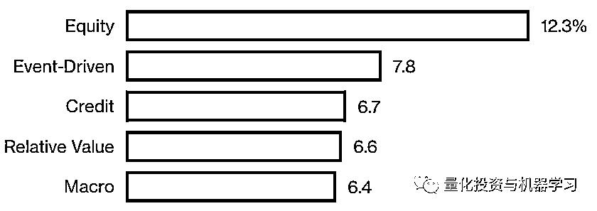
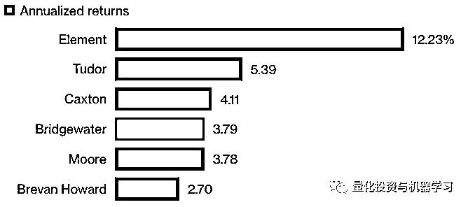
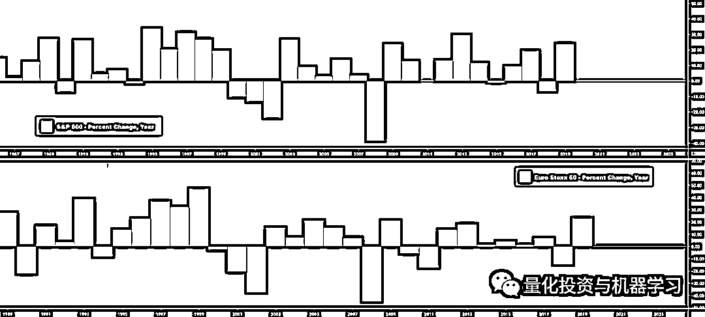
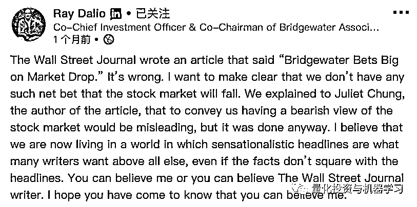

# 达里奥怎么了？桥水 Pure Alpha II 20 年来首度亏损！

> 原文：[`mp.weixin.qq.com/s?__biz=MzAxNTc0Mjg0Mg==&mid=2653296245&idx=1&sn=feb94792da3da5a9ec96ce2692e5bd45&chksm=802dd460b75a5d76136066cf1113bfe7458db15df6900a8b298d85c212f0558ffbd681cb91bb&scene=27#wechat_redirect`](http://mp.weixin.qq.com/s?__biz=MzAxNTc0Mjg0Mg==&mid=2653296245&idx=1&sn=feb94792da3da5a9ec96ce2692e5bd45&chksm=802dd460b75a5d76136066cf1113bfe7458db15df6900a8b298d85c212f0558ffbd681cb91bb&scene=27#wechat_redirect)

**标星★****置顶****公众号     **爱你们♥   量化投资与机器学习编辑部出品

**2019 年你赚钱了吗？**

如果是的话，那么你比达里奥过得要好

### 全球最大的对冲基金公司桥水（Bridgewater Associates），管理着近 1400 亿美元的资产。根据机构投资者在 20189 年 4 月份公布的年度收入最高对冲基金经理富豪榜中，桥水的掌舵人达里奥位居榜首。

#### **2019: $2 billion**
**2018 排名: 4 ($1.3 billion)**

*图片来自：网络

在过去一年半的时间里，达里奥一直看跌，这推动了他的旗舰产品 Pure Alpha 宏观策略，其获得了 14.6%的收益，这是自 2011 年以来的最佳表现，因此荣登今年富豪榜榜首。这也让达里奥净赚了 20 亿美元。正如机构投资者此前计算的那样，这相当于他：

**每天赚 550 万美元**

**or**
**每周工作 ****7 天****每天工作 ****24 小时****每小时赚 ****228310 美元**

然而，但在 2019 年，他的 Pure Alpha 表现并不好。

机构投资者表示，达里奥旗下最著名的**Pure Alpha II 基金**遭受了自 2000 年以来的首次亏损，跌了**0.5%！**因为自 1991 年 12 月桥水成立以来，除了 3 年以外的所有年份都实现了盈利，而截至 2018 年的 18 年中，每年都实现了正收益。这次有点尴尬···

如下图所示，与同类基金和宏观基金指数相比，Pure Alpha II 基金表现令人唏嘘！**标普 500 今年收益率都有 31.5%**，确实有点难受！

*图片来自：网络

我们先看看全球对冲基金在 2019 的收益率：

*图片来自：彭博

数据显示，2019 年股市涨幅最大的是股票基金，上涨了 12% 。 宏观基金涨幅为 6.4%。这是继 2014 年以来最好的表现。

*图片来自：彭博  

Pure Alpha 在 2010 年和 2011 年分别达到 45%和 25%的最高收益率之后，就一直表现不佳。达里奥的旗舰产品自 2012 年初以来的年化收益率为 3.8%，2018 的收益率为 15%。这使得它在这一时期落后于 Jeff Talpins 的 Element Capital Management 和 Tudor Investment Corp.等佼佼者，而根据 Bloomberg 汇编的数据，过去三年的情况也是如此。

*图片来自：彭博

早在 2019 年 8 月，Pure Alpha 在年初至今下跌了 6% ，这要源于在债券收益率跌至创纪录低点时，其看跌全球利率。

原因是在 2019 年 8 月，**随着全球最大两个超级大国之间的贸易紧张局势进一步升级，面对全球经济增长前景日益恶化，各国央行转向温和，投资者纷纷转向相对安全的政府债券，导致债券收益率（与价格走势相反）暴跌至年来最低水平。**

据彭 Bloomberg 的报道，Pure Alpha II 当时下跌了 9%。

*图片来自：网络

2019 年 11 月，华尔街日报在题为《Bridgewater Makes $1.5 Billion Options Bet on Falling Market》的报道中指出，桥水押注 15 亿美元﹙约 106 亿元﹚，打赌未来 3 个月股市下跌。该报称，无法确定这笔投资是对市场的定向押注，还是对公司其他投资项目的风险对冲。

华尔街日报报道称，桥水通过高盛与摩根士丹利等华尔街投资银行的操作，斥资 15 亿美元购入大量看跌期权（put options）合约，涉及美股及欧股市场。据报道，这批 15 亿美元的看跌期权，占桥水目前资产管理规模的 1%左右。尽管比例不高，但这种放空的选择权具有时效性，如果股市没有在今年底前或明年 3 月前出现大幅度下跌，这笔大额空单将血本无归；如果出现像去年一样的情况重挫 20%，这笔合约可获利 270 亿美元。

*图片来自：网络

桥水在 3 月前买入看跌期权，作为 1000 亿美元的 bet 或对冲标普 500 和 Euro Stoxx 50 的一者或两者。

华尔街日报还说，桥水投资的空仓仓位很不寻常，该对冲基金正在押注股市将出现尾端风险（tail-risk）。

# **尾部风险（tail risk）**

尾部风险是指在巨灾事件发生后，直到合约到期日或损失发展期的期末，巨灾损失金额或证券化产品的结算价格还没有被精确确定的风险。一般指价格呈现极端大幅波动的风险，尾部风险产生的概率较小，但是发生一次带来的破坏力极强。

达里奥对这篇报道感到震惊，他在领英上否认了《华尔街日报》的报道。推文指出：“报道是错的。坦白说，我们没有任何押注股市会跌的净仓位。”

*图片来自：领英

他还指出，已经向撰写这篇报道的记者表示，向外传达桥水基金对股市感到悲观，具有误导性，结果《华尔街日报》还是这么做了。

机构投资者周二率先报告了 2019 年 Pure Alpha II 的亏损，有一段这么说：

*桥水在与客户的沟通中强调，Pure Alpha 的设计宗旨是：****与客户选择的基准相比，不管市场走向如何，都能产生正的 Alpha，没有系统性偏差****。* *Pure Alpha 基金采用了桥水的混合组合策略。*

***这些基金与市场其它领域也没有关联****。* *根据桥水早期的一份文件显示，从该基金成立到 2018 年底，其与股市的相关系数为 0.19，与债券的相关系数为 0.15，与其他对冲基金经理的相关系数为 0.07。*

*2008 年，Pure Alpha 给投资者带来了很好的收益，在标普 500 指数下跌 37%的一年里，该指数上涨了 9.4% 。** 在 2018 年，Pure Alpha 的表现略好于市场。*

同时。Pure Alpha 策略的结构还为投资者提供了不同程度的波动性。客户通常会将一只 Pure Alpha 基金叠加在他们选择的 Beta 策略上，比如叠加在标普 500 指数上或全天候上。覆盖策略涉及使用衍生工具复制或抵消一个资产类别或市场风险敞口。

与此同时，据一名投资者称，为寻求在华投资的国际投资者打造的中国版全天候（All Weather，All Weather China）在 2019 年增长了 20.1%。

最近，一些人将达里奥作为作家的巨大声望和成功与其旗舰产品低迷的表现相比较。在《原则》的聚光灯下，Pure Alpha II 的表现显得没落。

达里奥是不是在自己的新书《原则》宣传上花了太多时间呢

*图片来自：领英

这本 600 页的成功宣言自 2017 年 9 月出版以来，已售出 220 万册。比尔·盖茨等名人都称赞过它，最近它还被改编成了儿童插画版。

与纳斯达克指数相比，2019 年几乎所有股票看起来都很像失败者

*图片来自：网络

桥水目前的管理规模约为 1600 亿美元，其中包括对冲基金和低收费产品，这个数字在过去 10 年的大部分时间里基本保持不变。作为全球最大对冲基金的创始人，达里奥的光环堪比巴菲特、Bill Gross。根据 Nexis 的搜索结果，自从 Dalio 的书出版以来，他已经在媒体上被提及了 9000 多次。

**不管怎么样，大佬风采依旧，传奇一生！**

2020 年第 8 篇文章

量化投资与机器学习微信公众号，是业内垂直于**Quant、MFE、Fintech、AI、ML**等领域的**量化类主流自媒体。**公众号拥有来自**公募、私募、券商、期货、银行、保险资管、海外**等众多圈内**18W+**关注者。每日发布行业前沿研究成果和最新量化资讯。

你点的每个“在看”，都是对我们最大的鼓励