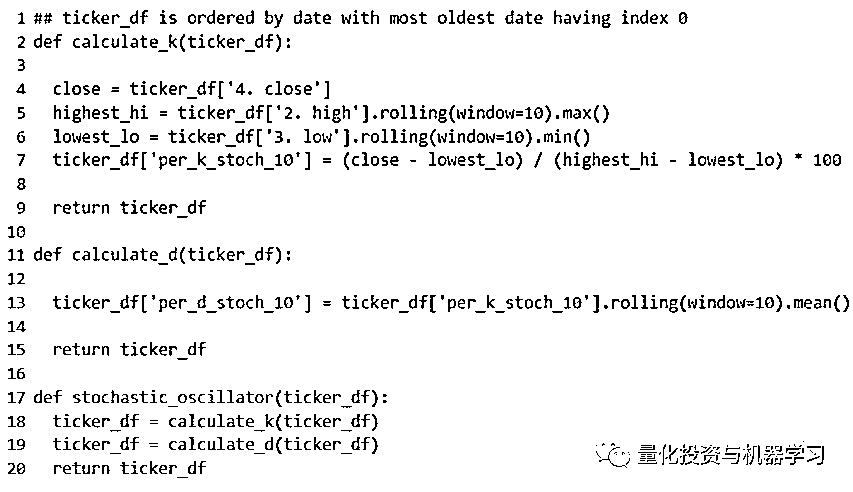
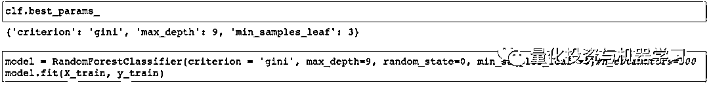
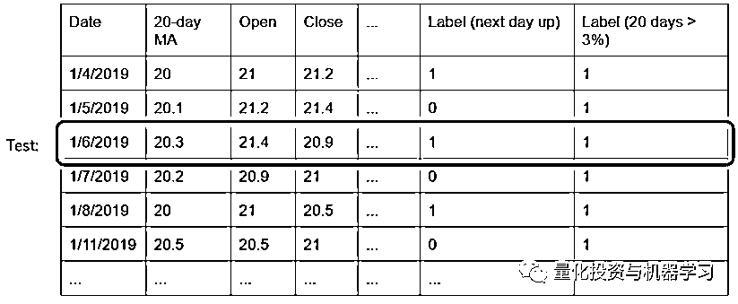
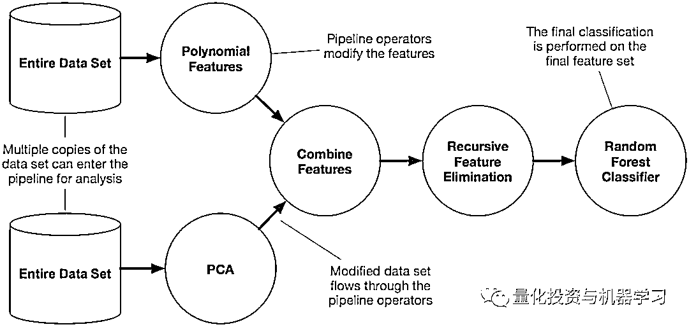
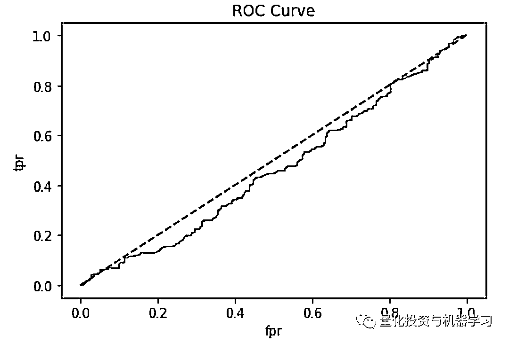
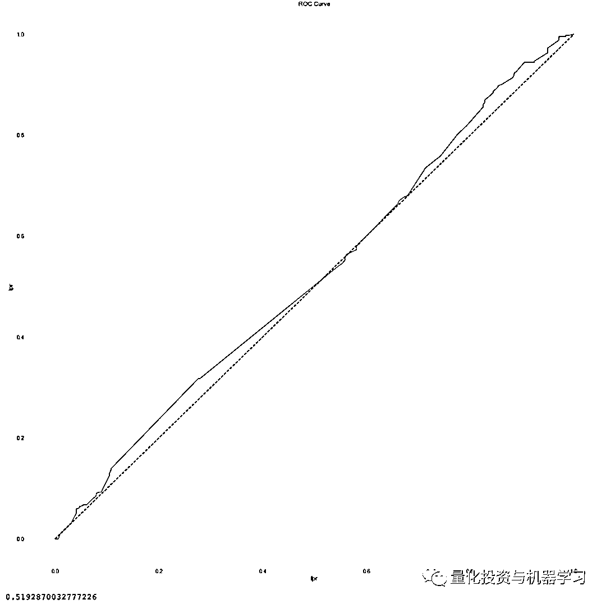

# 用代码说话！机器学习能预测股市吗？

> 原文：[`mp.weixin.qq.com/s?__biz=MzAxNTc0Mjg0Mg==&mid=2653296206&idx=1&sn=bcc31a55dc5abaa6bf32f4aa2b6812d9&chksm=802dd45bb75a5d4da18898a836283bff7d0423614ca0eec47a1c0a4e6860a4d1fbbc81d57de8&scene=27#wechat_redirect`](http://mp.weixin.qq.com/s?__biz=MzAxNTc0Mjg0Mg==&mid=2653296206&idx=1&sn=bcc31a55dc5abaa6bf32f4aa2b6812d9&chksm=802dd45bb75a5d4da18898a836283bff7d0423614ca0eec47a1c0a4e6860a4d1fbbc81d57de8&scene=27#wechat_redirect)

**标星★****置顶****公众号     **爱你们♥   

作者：Wilshire Liu

编译：1+1=6

**Quant 热点文章**[▪ Quant 们的身份危机！](https://mp.weixin.qq.com/s?__biz=MzAxNTc0Mjg0Mg==&mid=2653291856&idx=1&sn=729b657ede2cb50c96e92193ab16102d&scene=21#wechat_redirect)[▪ ](https://mp.weixin.qq.com/s?__biz=MzAxNTc0Mjg0Mg==&mid=2653291856&idx=1&sn=729b657ede2cb50c96e92193ab16102d&scene=21#wechat_redirect)[年度 Quant（2000-2019）](https://mp.weixin.qq.com/s?__biz=MzAxNTc0Mjg0Mg==&mid=2653289664&idx=1&sn=ec7e1db34342cd1ef8e4d4d468c35dd8&scene=21#wechat_redirect)[▪ ](https://mp.weixin.qq.com/s?__biz=MzAxNTc0Mjg0Mg==&mid=2653291856&idx=1&sn=729b657ede2cb50c96e92193ab16102d&scene=21#wechat_redirect)[你为什么劝入/劝退 Quant？](https://mp.weixin.qq.com/s?__biz=MzAxNTc0Mjg0Mg==&mid=2653292338&idx=1&sn=f7736862026b026972b0337bd6f65a01&scene=21#wechat_redirect)
[▪](https://mp.weixin.qq.com/s?__biz=MzAxNTc0Mjg0Mg==&mid=2653291856&idx=1&sn=729b657ede2cb50c96e92193ab16102d&scene=21#wechat_redirect) [Quant 资料：](https://mp.weixin.qq.com/s?__biz=MzAxNTc0Mjg0Mg==&mid=2653295346&idx=1&sn=367d3ba97ca8be85219d43eb6f9ed48e&scene=21#wechat_redirect)[最全量化资源大合集](https://mp.weixin.qq.com/s?__biz=MzAxNTc0Mjg0Mg==&mid=2653295346&idx=1&sn=367d3ba97ca8be85219d43eb6f9ed48e&scene=21#wechat_redirect)
[▪ ](https://mp.weixin.qq.com/s?__biz=MzAxNTc0Mjg0Mg==&mid=2653291856&idx=1&sn=729b657ede2cb50c96e92193ab16102d&scene=21#wechat_redirect)[Quant 面试：Quant 面试中的尴尬](https://mp.weixin.qq.com/s?__biz=MzAxNTc0Mjg0Mg==&mid=2653292571&idx=1&sn=92ec125b4b6b9d107087d52c26c95086&scene=21#wechat_redirect)[▪](https://mp.weixin.qq.com/s?__biz=MzAxNTc0Mjg0Mg==&mid=2653291856&idx=1&sn=729b657ede2cb50c96e92193ab16102d&scene=21#wechat_redirect) [Quant 书单：](https://mp.weixin.qq.com/s?__biz=MzAxNTc0Mjg0Mg==&mid=2653291789&idx=1&sn=e31778d1b9372bc7aa6e57b82a69ec6e&scene=21#wechat_redirect)[全网最全量化书籍整理](https://mp.weixin.qq.com/s?__biz=MzAxNTc0Mjg0Mg==&mid=2653291789&idx=1&sn=e31778d1b9372bc7aa6e57b82a69ec6e&scene=21#wechat_redirect)[▪ ](https://mp.weixin.qq.com/s?__biz=MzAxNTc0Mjg0Mg==&mid=2653291856&idx=1&sn=729b657ede2cb50c96e92193ab16102d&scene=21#wechat_redirect)[Quant 求职：求职分享（附真实试题）](https://mp.weixin.qq.com/s?__biz=MzAxNTc0Mjg0Mg==&mid=2653291844&idx=1&sn=3fd8b57d32a0ebd43b17fa68ae954471&scene=21#wechat_redirect)[▪ Quant 必读：关于因子投资的 12 本必读书](https://mp.weixin.qq.com/s?__biz=MzAxNTc0Mjg0Mg==&mid=2653293818&idx=1&sn=445a0603c89e3411900c9d01bd0f67b8&scene=21#wechat_redirect)[▪ ](https://mp.weixin.qq.com/s?__biz=MzAxNTc0Mjg0Mg==&mid=2653291856&idx=1&sn=729b657ede2cb50c96e92193ab16102d&scene=21#wechat_redirect)[Quant 面试：反守为攻，如何掌握主动权？](https://mp.weixin.qq.com/s?__biz=MzAxNTc0Mjg0Mg==&mid=2653290720&idx=1&sn=bbceffa2696bf651171733e4fe740187&scene=21#wechat_redirect)[▪ ](https://mp.weixin.qq.com/s?__biz=MzAxNTc0Mjg0Mg==&mid=2653291856&idx=1&sn=729b657ede2cb50c96e92193ab16102d&scene=21#wechat_redirect)[Quant 必备：学什么、哪家面试难、哪家挣大钱？](https://mp.weixin.qq.com/s?__biz=MzAxNTc0Mjg0Mg==&mid=2653295991&idx=1&sn=a13c487b064fbf743cbbc640cd5df19b&scene=21#wechat_redirect)[▪](https://mp.weixin.qq.com/s?__biz=MzAxNTc0Mjg0Mg==&mid=2653291856&idx=1&sn=729b657ede2cb50c96e92193ab16102d&scene=21#wechat_redirect)[ 2020 全美 MFE『权威鄙视链』出炉：Quant 何去何从？](https://mp.weixin.qq.com/s?__biz=MzAxNTc0Mjg0Mg==&mid=2653295958&idx=1&sn=16a90ff07a8c0d7b2abb1bc5cedc01d4&scene=21#wechat_redirect)

***1***

**数据**

选股部分股票的 Open、High、Low、Close 和 Volume。

***2***

**特征**

常用的量价技术指标：Chaikin A/D、BBAND、CCI、EMA、MACD、OBV、RSI、SMA 和 STOCH。

**▍简单移动平均线**

**▍指数移动平均线**

**▍MACD**

**▍随机指标**

**▍累积/派发线**

****

**▍布林带**

****

**▍OBV**

汇总如下：

***3***

**假设**

起初，我们想建立一个单一的模型，使用所有 ETF（QQQ、TQQQ、SPY、VTI、IWM）的数据来预测股票的长期价格趋势。如果未来 20 个交易日的收益为>3%，则我们将标签设为 1，否则设为 0。

然而，我们发现每个 ETF 之间的数据差异很大，因此我们决定为每个 ETF 构建单独的模型。最后只使用 QQQ ETF 数据集来构建我们的模型。

# **实验 1（20 天收益率 3%作为标签）**

# **LSTM: Test AUC 0.476**

## **MLP Neural Network: Test AUC 0.577**

## 

## **Random Forest: Test AUC 0.917**

***4***

****虚假的结果****

**我们使用 QQQ 数据集的最佳模型的 AUC 为 0.917。我们以为我们找到了预测股市的方法。然而，情况并非如此，因为我们发现了我们的模型的一个主要缺陷。** 

**按照惯例，在机器学习中，为了创建训练和测试集，需要对打乱数据集中数据顺序（shuffle）。这样做是必要的，因为我们希望在测试集中的数据与训练数据有相同的分布。然而，由于股票历史数据是时间序列，我们没办法知道随后几天的数据，因此对数据进行打乱意味着训练数据集有未来的数据（**未来函数**）。假设我们在 2017 年使用 2018 年的数据集训练我们的模型，我们实际上不能使用这个训练数据集来训练我们的模型，因为在 2017 年，2018 年的数据还不存在。因此，在创建训练和测试数据集时，我们不能打乱数据。**

**对于我们的下一个模型，使用 2010 年到 2016 年的数据作为我们的训练集，使用 2017 年到 2019 年的数据作为我们的测试集。**

**遗憾的是，在这个模型中，使用相同的随机森林分类器，AUC 分数显著下降到 0.44。**

****

****

*****5*****

****修改标签****

**正如在示例数据集中所看到的，所有这些行都有非常相似的 20-MAs，开盘价和收盘价。**

****

**如果在 2019 年 4 月 1 日之后的 20 天里上涨了 3%，那么在 2019 年 4 月 1 日左右的日子里也会上涨 3%，对于任何股票来说都是如此，标签在 20 天内上涨的决定因素一般不会在第 20 天决定。这取决于这些记录在其 20 个未来交易期重叠的日子。在这种情况下，如果我们提取出 2019 年 6 月 1 日的数据，作为测试集并对其余的测试集进行训练，该模型肯定会为测试数据分配一个标签，因为它的所有特征都与围绕它的日期相似，这些日期形成了一个集群。这种方法的另一个问题是，如前所述，模型允许训练集使用未来数据进行预测。例如，训练集包括 1/7/2019 -1/11/2019，预测 1/6/2019，但这在现实世界是不可能做到的。**

****

**在这种情况下,训练集的收盘价格徘徊在每股 20 美元,但因为我们使用的是 2019 年作为测试集,价格是截然不同的,因此,该模型将它们正确的标签在分配表现不佳,特别是考虑到我们的记录有一系列的特征值,在训练集不存在。** 

**当我们没有对原始数据集进行打乱时，当我们使用后来的日期作为测试集时，这就成了一个问题。在这种情况下，训练集的收盘价徘徊在每股 20 美元左右，但因为我们使用的是 2019 年作为测试集，价格是截然不同的，因此，模型在给他们分配正确的标签时将表现不佳，特别是考虑到我们的记录的特征，其值的范围在训练集中不存在。**

****

****我们想到的解决方案是将我们的标签改为每日的股价变动**。如果第二天的收盘价大于当天的收盘价，那么标签就是 1。在这里，当天的股价是否会在第二天上涨是相互独立的，这解决了我们形成集群和使用未来数据的问题。** 

****实验 2（第二天价格上升 / 下降作为标签）****

******1、TPOT******

********

******TPOT 是一个开源的 AutoML Python 包，可以运行许多不同的特性工程和模型选择组合。**TPOT 自动创建许多 pipeline，其中包括不同的特征工程方法（PCA、MaxAbsScaler、MinMaxScaler 等），以及各种混合超参数的不同模型。**** 

********

********

*****https://epistasislab.github.io/tpot/using/*****

****TPOT 的性能在很大程度上取决于 pipeline 的数量和允许它运行的时间。pipeline 总数等于**POPULATION_SIZE + generation x OFFSPRING_SIZE**，可以在 TPOT 的参数中确定。**** 

****由于我们只让 TPOT 运行 150 个 pipeline，这只需要不到 15 分钟的时间，所以性能并不理想：测试 AUC=0.509。然而，如果有足够的时间（几十个小时甚至几天），TPOT 可以是一个非常强大和容易的工具来产生我们想要的结果。****

********

********

****此外，**TPOT 会自动存储它搜索到的最佳 pipeline，并允许用户将这些结果导出为.py 文件**。在本文中，TPOT 对我数据进行 PCA，并选择 GaussianNB 作为最佳分类模型。****

********

******2\. XGBoost******

****使用 XGBClassifier，除了学习率、最大深度、n_estimators 和子样本之外，我们不需要配置太多。利用交叉验证和 AUC 评分指标对超参数进行优化。最后，利用优化后的超参数对 X_train 和 y_train 进行建模。测试集的准确率（不是 AUC）为 50.5%****

********

********

****使用 XGBClassifier：0.478 Test Set AUC 得分。****

******3、随机森林******

****使用随机森林分类器，我们使用**暴力网格搜索交叉验证**来调整超参数。最佳参数为 max_depth =3，min_samples_leaf = 3。****

********

********

********

********

****使用随机森林分类器：0.519 Test Set AUC 得分。****

******4、谷歌 AutoML******

****随着 AutoML 的日益流行，我们决定将数据集输入到谷歌 Cloud AutoML，看看它是否能比我们更好地预测 AUC 分数。谷歌 AutoML 有一个非常友好的界面，它会在你上传数据集后自动吐出一些统计数据。****

********

****在我们这样的分类项目中，谷歌 AutoML 允许用户选择不同的性能指标来优化最终的模型。****

********

****仅仅经过一个小时的训练，它的 AUC 就达到了 0.529，这是我们测试中最高的。值得注意的是，随机森林的 AUC 达到 0.519，仅比谷歌 AutoML 低 0.01。****

********

*******6*******

******结论******

****技术分析的弱点：**在金融领域，技术分析（使用历史股价预测未来股价）已被证明是徒劳的**。进一步分析时可考虑其他特征：**** 

****1、Twitter/微博等：情绪分析。****

****2、电话会议记录：分析高管在电话会议中的语调；评估主管/分析师正在讨论的主题。****

****3、卫星数据：油井的卫星图像可以用来预测油价等。****

****4、······****

****上面这些可以总结为另类数据或者文本情绪数据。****

****有关另类数据的热点文章，请点击：****

*   ****[AQR 最新研究 | 机器能“学习”金融吗？](http://mp.weixin.qq.com/s?__biz=MzAxNTc0Mjg0Mg==&mid=2653292710&idx=1&sn=e5e852de00159a96d5dcc92f349f5b58&chksm=802dcab3b75a43a5492bc98874684081eb5c5666aff32a36a0cdc144d74de0200cc0d997894f&scene=21#wechat_redirect)****

*   ****[人工智能和另类数据：](https://mp.weixin.qq.com/s?__biz=MzAxNTc0Mjg0Mg==&mid=2653292677&idx=1&sn=02245bb19a10b95f53c37f803d81810a&scene=21#wechat_redirect)[夸大其词 or 确有其用?](https://mp.weixin.qq.com/s?__biz=MzAxNTc0Mjg0Mg==&mid=2653292677&idx=1&sn=02245bb19a10b95f53c37f803d81810a&scene=21#wechat_redirect)****

*   ****[另类 Alpha：](https://mp.weixin.qq.com/s?__biz=MzAxNTc0Mjg0Mg==&mid=2653293853&idx=1&sn=e539473b6e192b8319d3a0db08129124&scene=21#wechat_redirect)[基于供应链数据的量化因子挖掘](https://mp.weixin.qq.com/s?__biz=MzAxNTc0Mjg0Mg==&mid=2653293853&idx=1&sn=e539473b6e192b8319d3a0db08129124&scene=21#wechat_redirect)****

*   ****[另类 Alpha：基于产业节点联动效应的量化交易策略](http://mp.weixin.qq.com/s?__biz=MzAxNTc0Mjg0Mg==&mid=2653294191&idx=1&sn=8d5e3c40a498c5fbcb7f6c7a561b3348&chksm=802dcc7ab75a456c9550270a49b3506a425f0fa558bece8e3a79c22e0e5822f0e21b6546a534&scene=21#wechat_redirect)****

****打败股市的唯一真正方法是获得额外的信息，比如获得未来的数据或提前知道季度收益结果，但这样做，要么导致不可能，要么违法。使用技术指标可以告诉我们部分情况，但预测第二天的股市走向太过随机，而且受到外部因素的影响，无法建立一个强有力的模型。****

******只有当用于训练模型的数据和模型与未来数据有相同的分布时，机器学习才是有用和有效的，而使用独立且波动的股市日收益率作为标签时，情况就不同了。******

****2020 年第 6 篇文章****

****量化投资与机器学习微信公众号，是业内垂直于**Quant、MFE、Fintech、AI、ML**等领域的**量化类主流自媒体。**公众号拥有来自**公募、私募、券商、期货、银行、保险资管、海外**等众多圈内**18W+**关注者。每日发布行业前沿研究成果和最新量化资讯。****

************你点的每个“在看”，都是对我们最大的鼓励****