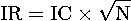

# 一名 Quant 的自白

> 原文：[`mp.weixin.qq.com/s?__biz=MzAxNTc0Mjg0Mg==&mid=2653296155&idx=1&sn=e20a715327315b619d74df2a18e8f82e&chksm=802dd40eb75a5d181549fc761d04f842dfd9d855930b340d1401988d016c1bf22f1ce0bc9b96&scene=27#wechat_redirect`](http://mp.weixin.qq.com/s?__biz=MzAxNTc0Mjg0Mg==&mid=2653296155&idx=1&sn=e20a715327315b619d74df2a18e8f82e&chksm=802dd40eb75a5d181549fc761d04f842dfd9d855930b340d1401988d016c1bf22f1ce0bc9b96&scene=27#wechat_redirect)

**标星★****置顶****公众号     **爱你们♥   

作者：**石川** | 北京量信投资管理有限公司创始合伙人，清华大学学士、硕士，麻省理工学院博士。量化投资与机器学习微信公众号量化专栏特约作者。

**未经授权，严禁转载！**

**Quant 热点文章**[▪ Quant 们的身份危机！](https://mp.weixin.qq.com/s?__biz=MzAxNTc0Mjg0Mg==&mid=2653291856&idx=1&sn=729b657ede2cb50c96e92193ab16102d&scene=21#wechat_redirect)[▪ ](https://mp.weixin.qq.com/s?__biz=MzAxNTc0Mjg0Mg==&mid=2653291856&idx=1&sn=729b657ede2cb50c96e92193ab16102d&scene=21#wechat_redirect)年度 Quant（2000-2019）[▪ ](https://mp.weixin.qq.com/s?__biz=MzAxNTc0Mjg0Mg==&mid=2653291856&idx=1&sn=729b657ede2cb50c96e92193ab16102d&scene=21#wechat_redirect)你为什么劝入/劝退 Quant？
[▪](https://mp.weixin.qq.com/s?__biz=MzAxNTc0Mjg0Mg==&mid=2653291856&idx=1&sn=729b657ede2cb50c96e92193ab16102d&scene=21#wechat_redirect) Quant 资料：最全量化资源大合集
[▪ ](https://mp.weixin.qq.com/s?__biz=MzAxNTc0Mjg0Mg==&mid=2653291856&idx=1&sn=729b657ede2cb50c96e92193ab16102d&scene=21#wechat_redirect)Quant 面试：Quant 面试中的尴尬[▪](https://mp.weixin.qq.com/s?__biz=MzAxNTc0Mjg0Mg==&mid=2653291856&idx=1&sn=729b657ede2cb50c96e92193ab16102d&scene=21#wechat_redirect) Quant 书单：全网最全量化书籍整理[▪ ](https://mp.weixin.qq.com/s?__biz=MzAxNTc0Mjg0Mg==&mid=2653291856&idx=1&sn=729b657ede2cb50c96e92193ab16102d&scene=21#wechat_redirect)Quant 求职：求职分享（附真实试题）[▪ Quant 必读：关于因子投资的 12 本必读书](https://mp.weixin.qq.com/s?__biz=MzAxNTc0Mjg0Mg==&mid=2653293818&idx=1&sn=445a0603c89e3411900c9d01bd0f67b8&scene=21#wechat_redirect)[▪ ](https://mp.weixin.qq.com/s?__biz=MzAxNTc0Mjg0Mg==&mid=2653291856&idx=1&sn=729b657ede2cb50c96e92193ab16102d&scene=21#wechat_redirect)Quant 面试：反守为攻，如何掌握主动权？[▪ ](https://mp.weixin.qq.com/s?__biz=MzAxNTc0Mjg0Mg==&mid=2653291856&idx=1&sn=729b657ede2cb50c96e92193ab16102d&scene=21#wechat_redirect)Quant 必备：学什么、哪家面试难、哪家挣大钱？[▪](https://mp.weixin.qq.com/s?__biz=MzAxNTc0Mjg0Mg==&mid=2653291856&idx=1&sn=729b657ede2cb50c96e92193ab16102d&scene=21#wechat_redirect) 2020 全美 MFE『权威鄙视链』出炉：Quant 何去何从？

***0***

**摘要**

量化投资是什么？如何做一名合格的 Quant？成为 Quant 的意义又是什么？

***1***

**引言**

时间悄然走进 2020 年。作为今年的第一篇文章，我想借此机会整理下过去几年做量化投资的体会。收拾心情，重新上路。具体而言，本文会就以下三个问题来唠一唠心里话。

首先在第一节会谈一谈什么是量化投资。需特别说明的是，这个问题的回答来自我的合伙人高老板。他的短短三段话写出了我的心声，所以就直接拿来引用了。第二节聊一聊做一名合格的 Quant 需要具备哪些必要条件。聪明、怀疑一切的态度、知行合一的执行力，以及近乎冷漠的理智是我给出的答案。本文的第三节讨论了作为一名 Quant 的意义何在，它是我内心的自白。

上面这些都是见仁见智的问题，也没有什么标准答案，每名 Quant 心中都有自己的解读。以下的内容仅代表我认可的观点，于我而言是一些反思。如果各位小伙伴也因它获得一些启发，那便是一种缘分。

***2***

**什么是量化投资？**

**量化投资绝不应当与主观投资对立起来**。任何一门科学研究深入到一定程度时，其中不可避免的会出现一些定量的、数学化的描述。无论量化还是主观，都是从投资实践出发，试图发现客观世界事物的规律，而量化投资只是更注重体系的完备性与逻辑的严谨性。**如果将量化投资狭隘的理解为一些神秘的魔法，醉心于模型的调教，见到数学公式就到处比划试试，那完全是舍本逐末。****量化永远是手段，而非目的。****量化也不等同于程序化**。计算机只是工具，一个投资体系水平高低与计算机在其中应用多寡并无直接关系。当然相较于人力，计算机在存储与运算上的优势毋庸置疑，其作为现代工业化大生产最重要的生产工具之一，必须得到充分重视。一个理念更量化、设计更工程化的投资体系，相对来说更容易充分发挥利用计算机的优势，减少日渐昂贵的人力成本，从而在起跑线上占据一定先发优势。归根到底，量化是投资业发展的必然方向。**量化不是信仰，而是求真务实的态度、观点和方法论**。“从实践中来，到实践中去”，这才是亘古不易的智慧结晶。

***3***

**做一名合格的 Quant**

前不久，WorldQuant 出版了 Finding Alphas 的第二版（Tulchinsky Eds. 2019）。

**点击图片，获取此书电子版**

这本书继承了第一版的优良传统，对于每个 topic，都是写到引人入胜之处便戛然而止，让你欲罢不能。不过，有一个话题是个例外，它被掰开了揉碎了说的特别清楚，这就是该书的第三十二章：***The Seven Habits of Highly Successful Quants***。在过去十多年，WorldQuant 培养了成百上千名 Quants，从其中优秀的员工身上总结出了 7 大特质，并在这一章声情并茂以鸡汤的形式全盘托出（可见资本家老板“大大滴坏”，开个玩笑）。这 7 大特质是：

1\. Work hard without even realizing it.

2\. Set ambitious long-term targets but attainable weekly goals.

3\. Prioritize based on risk and reward.

4\. Stay curious.

5\. Perform value-added work, and automate, automate, automate.

6\. Make sensible changes, and beware of overfitting.

7\. Form synergistic teams.

书中对上面每一条都进行了更细致的说明，读来很有启发。而我自己对这个问题也时有思考。在我看来，一个合格的 Quant 应该具备四个特征：**聪明、怀疑一切的态度、知行合一的执行力**，以及**近乎冷漠的理智**。

**▌聪明**

在我过去近二十年读书和工作的过程中，遇到了不少非常聪明的人。我也从来不掩饰对聪明人的羡慕之情。在量化投资领域，知识的发展可谓日新月异，促使人不断的学习才能不被淘汰。而聪明的人最大的长处在于他们非常善于举一反三、活学活用，真正做到融会贯通。

最近我在读 Gary Smith 的 AI Delusion（顺便说一句，这本书也出了中文版）。它里面提到人脑和机器最大的区别在于**人可以从特定情况推导出一般原则，并能在其他情况下应用这些原则**。聪明的人无疑更擅长这点，而这点对在量化投资中非常重要。

**▌怀疑一切的态度**

有些时候，Quant 的工作很接近做科研。以发掘 Alpha signal 为例，Quant 需要提出假设、清洗数据、统计检验、得出结论。而在做研究中，最重要的正是怀疑一切的态度。在如今这个信息爆炸的时代，各种资料、各种 ideas 满天飞，但是很多内容往往禁不起推敲。『量化投资与机器学习公众号』就曾经发文总结了一些错误的论文：[量化学术论文常：数据滥用严重、程序 Bug 泛滥！](http://mp.weixin.qq.com/s?__biz=MzAxNTc0Mjg0Mg==&mid=2653294020&idx=1&sn=fe1c8099556ab81fc4365f6875d489ca&chksm=802dcfd1b75a46c76a1cdf397adcdc8eb1e8383fac164af072c08b6e7bd5ef980d0f036d9398&scene=21#wechat_redirect)。这应当引起人们的重视。因此，遇到新方法、新模型、新因子时，不妨多问几个“为什么”：

*   这篇文章在讲什么？

*   这个因子背后的逻辑是什么？

*   这个模型是否适合它要解决的问题？

*   这个研究的数据处理是否有明显的 data snooping？

*   ……

量化投资的研究中没有捷径。很多时候需要我们追根溯源、搞懂技术演进的来龙去脉，得到一个大局观，弄清楚不同方法论之间的关联。唯有此，才能更好的运用它们。而在这个过程中，怀疑精神是必不可少的。熟悉我的朋友都知道我十分喜欢 Quantstart.com。下面就借用 Quantstart.com 上的一句话和各位共勉：

“

*True quantitative trading research is careful, measured and takes significant time to get right. There is no quick fix or "get rich scheme" in quant trading.*

”

**▌知行合一的执行力**

主动管理的基准法则告诉我们，一个策略的 IR 由以下两个因素决定：

其中 IC 代表了基金经理的能力；根号 N 则代表了基金经理运用其能力的频率。这个法则说明，能力越高、且使用的越频繁，策略的风险收益水平就越高。

如今，上面这个式子又被进行了扩展，加入了一项 TC：

其中 TC 代表转化效率。它的原始解读是被用在投资组合优化中。由于优化中需要满足各种约束条件（换手率、交易费、仓位、风险暴露等），导致约束下的最优 IR 和无约束时的最优 IR 之间存在一个折扣。TC 就代表这个折扣。TC 越高，说明因约束条件造成的 IR 的损失越少。

借助上述公式，我们也不妨从另外一个角度来理解 TC，这就是“知行合一的执行力”。一个模型、一个因子、一个策略，无论它 on paper 或者在回测中多么诱人，如果不能被落地都是竹篮打水一场空。这个由理论指导实践、并在实践中完美实现理论的能力正是 TC。**对于一名 Quant 来说，样本内的分析、避免过拟合固然重要，但如何真正落地，做到产学研一体化才是更关键的。**

**▌近乎冷漠的理智**

公允的说，在二级市场搬砖时刻都要面临不小的压力。市场的风险、策略的回调、投资人的质问，这些东西都是 Quant 必须面对的家常便饭。正视并处理好这些压力，不让它们影响正常的研究工作要求 Quant 时刻保持冷静。我有时会和朋友打趣说：“其实 Quant 特别需要定期进行心灵 massage”。

我写过不少行为金融学方面的文章，介绍了很多认知偏差：[投资中的 N 种认知偏差，总有一款打败你](http://mp.weixin.qq.com/s?__biz=MzIyMDEwNDk1Mg==&mid=2650878477&idx=1&sn=e316a8c5efa2de63ffdb4dbeb1889260&chksm=8c24839abb530a8c14046722f6787fd5582f4a247bb33b65fcde81e0d1e1b5ddc635c05e0943&scene=21#wechat_redirect)。任何人都会或多或少的受这些偏差影响。比如 Cliff Asness 就说他自己也会犯这些错误，但不会让个人的感受影响策略的实施。一个异常理智的大脑可以让我们在策略回调的时候更理性的分析和坚持，也可以让我们屏蔽这些偏差，避免这些坏情绪去干预策略，做到一致性。

什么是一致性？也许你会说“稳定的盈利，日复一日、年复一年；净值没有太大和太长的回撤”。诚然，这是 Quant 的（终极）目标。但是，一致性产生的好结果止于此，而一致性非始于此。下图展示了一般交易者（黑色）和一个优秀 Quant（红色）的学习曲线。一般交易者往往无法做到一致性、容易受到个人情感影响，将个人行为的不确定性错误地强加于量化系统的表现之上，从而误认为系统本身出了问题。这导致交易者无法持之以恒、三天两头更换系统、最终无奈退出市场。而一个优秀的 Quant 则会专注于一致性，这会让他在通往盈利的进程中越走越远，最终到达胜利的彼岸。

***4***

**我的自白**

在刚刚过去的 2019 年，量化投资界令我感触最深的一点 —— 不是某类策略的风起云涌、笑傲江湖 —— 是对人才的追逐。如今，一般量化类私募的起步价就是 985 和 211 的毕业生；头部私募则是非清、北以及海外名校（真 · 名校）硕士以上学历不考虑；而顶级私募已经在满世界搜刮最顶尖人才了。我丝毫不怀疑这些最强大脑会在量化投资领域干出一番作为，但我更愿意思考：**如果他们从事了别的职业，是否会为社会创造更大的价值？**

我的亲朋好友也经常对我灵魂拷问。“你整天干这事儿创造价值吗？”“你干点别的不行吗？”“国家辛辛苦苦培养你，你就干点这个？”

扎心啊！

这无时无刻不让我扪心自问：**作为一个 Quant 的意义何在？**

放眼世界，凡那些知名的对冲基金，它们让我们铭记、令我们钦佩的似乎并不（仅仅）是超凡的业绩，而是它们对金融业和科学的推动。就拿量化投资界第一人、文艺复兴的西蒙斯为例，他首先是个数学家，他在数学上的造诣和成就有目共睹。而如今，他投入了大量的资金来推动基础科学的发展。再说 AQR，这个金融圈的学术天团持续高水平输出和分享研究成果，它们发表在金融学顶刊上的学术论文甚至超过一般高校的金融系。又或者桥水，因桥水的全天候策略而发扬光大的风险平价时至今日仍然是非常重要的资产配置方法之一。这样的例子还包括 Aspect、Robeco、Two Sigma、Winton，WorldQuant，数不胜数……

这些前辈大佬给我的启发是，**一个 Quant 的意义可以体现在帮助人们更好的理解金融市场、让金融市场变得更加有效从而造福更多的人。**这个目标虽然听起来还是很缥缈，但这不妨碍我们日拱一卒、为之而努力。这也是我坚持写作的动力之一。

根据 2018 年底的数据，A 股市场的总市值已经超过 6.3 万亿美元，仅次于美国、高居世界第二，成为全世界都无法忽视的资本市场。然而，无论是 A 股市场的有效性，还是我们从量化角度对它的理解，似乎还停留在挑个指标、分组排序、算 IC 的层面上。当学术界已经把美股研究的底儿朝天的时候，对 A 股市场的研究却仍然处于起步阶段。可喜的是，已经有越来越多的顶级华人学者着眼于此。而作为一名扎根于 A 股市场的 Quant，我认为在这方面也有义不容辞的责任。最近，我和小伙伴写了一篇关于 A 股资产定价的文章、并在一个国际会议上作了报告。几个人的力量虽然渺小，但我们相信这是在做正确的事情，并愿意为之坚持。

本文的第一节提出了这样的观点：量化投资不等同于算法交易、也并非站在主观投资的对立面；**量化投资已经发展成为基于现代科学方法的理论体系、研究方式以及工程系统的总和**。人们在投资活动中积累了大量的经验，这些经验被抽象归纳，形成可以称之为科学的投资学。擅长各种精确计量的量化投资的兴起只不过是一个学科变得更为成熟的必由之路。量化投资的核心是对投资实践经验的抽象与归纳。它的本质是思维的过程，是将经验抽象提炼转化为知识的过程。投资经验一旦升华成了知识，就意味着其可检验、可重复，如日升月恒，运转不息。在这个“经验升级到知识”的进程中，离不开你、我每一名 Quant 的努力。

今年是 2020 年。很多人都喜欢 2020 这个数字，它无论是写起来还是读起来都令人愉悦。而且对于绝大多数人来说，它大概是我们能够经历的唯一的前后两个数字重复的年份。谈到 2020，我脑海中浮现的是 AQR 在 2018 年底推出的论文集 ***20 for Twenty***，它记录了 AQR 在过去两个 decades 发表的 20 篇高水平论文。从 Buffett’s Alpha 到 Betting Against Beta；从 Time Series Momentum 到 Value and Momentum Everywhere；从 Common Factors in Corporate Bond Returns 到 Craftsmanship Alpha …… 全都革新性的推动金融学的发展，被后人广泛学习和使用。**希望不久的将来，中国也有自己的 AQR！**

下载地址：*https://www.aqr.com/insights/research/book/20-for-twenty*

**参考文献**

*Tulchinsky, I. (Eds) (2019). Finding alphas: A quantitative approach to building trading strategies, 2nd edition. Wiley.*

免责声明：文章内容不可视为投资意见。市场有风险，入市需谨慎。

2020 年第 5 篇文章

量化投资与机器学习微信公众号，是业内垂直于**Quant、MFE、Fintech、AI、ML**等领域的**量化类主流自媒体。**公众号拥有来自**公募、私募、券商、期货、银行、保险资管、海外**等众多圈内**18W+**关注者。每日发布行业前沿研究成果和最新量化资讯。

你点的每个“在看”，都是对我们最大的鼓励