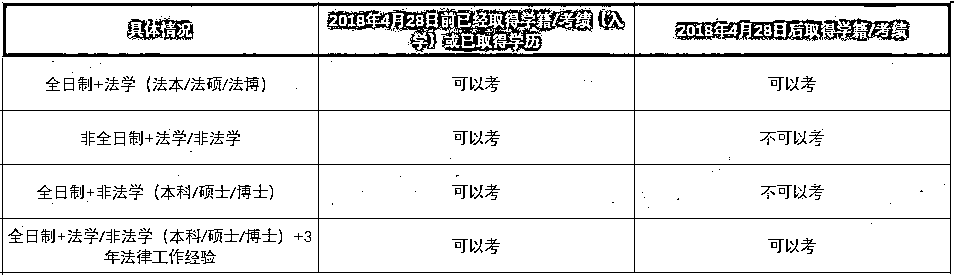

# 精英律师：打了多少法学生的脸?

> 原文：[`mp.weixin.qq.com/s?__biz=MzAxNTc0Mjg0Mg==&mid=2653296148&idx=1&sn=f892b509b6fb9fcc5a2f6e58b91224a9&chksm=802dd401b75a5d17b39b04f20c4b09c8077ea097025fa92c0e5c8edc23199015b786654c7624&scene=27#wechat_redirect`](http://mp.weixin.qq.com/s?__biz=MzAxNTc0Mjg0Mg==&mid=2653296148&idx=1&sn=f892b509b6fb9fcc5a2f6e58b91224a9&chksm=802dd401b75a5d17b39b04f20c4b09c8077ea097025fa92c0e5c8edc23199015b786654c7624&scene=27#wechat_redirect)

**标星★****置顶****公众号     **爱你们♥   

作者：Uni 酱
来源：UniCareer

2020 开年迷惑大赏：

顺手点开《庆余年》隔壁的《精英律师》

以为能看到一场神仙打架

没想到忍着看完 6 集

小小的脸上写满大大的疑惑

这难道不是一场披着律师剧外皮的 

靳东老师和他的朋友圈之大型玛丽苏爱情片？

***1***

**《精英律师》，真的不是来收智商税的吗？**

要说《精英律师》最大的亮点，就是**让所有法学生多年来努力摘掉的标签，一夜回到解放前**。

*图片来源：网络

实话说，本剧也不是完全无可取之处，但也确实有很多专业知识、情节逻辑上的漏洞。所以这里只讨论让法律专业的同学集中吐槽的地方，欢迎各位补充。

**1、法学生=法条张口就来**

蓝盈莹所饰演的女主角戴曦，设定是法学院没有毕业的学生，在前几集就展现出自己的天赋能力：法条张口就来，这其实也还能说得通，但律所里另一位大律师何赛一见面就让戴曦背诵法条来考查她，才是最大的 Bug。

*图片来源：网络

法学生都能完整背诵法条吗？

▼

不是

有种东西叫法律检索，还有种东西叫稿子。法学专业从来都不是一个被法条的专业。如果只要知道法条就可以处理案件，那法官、律师就已经没有存在的必要性了

（点击上面空白处看真相）

不论法学生一年要解释多少次：我真的不是一个没感情的法条背诵机器，一部电视剧就能让身边所有人更加坚信：你的法条一定背得很不错吧？

其实这就和“你是留学生能来翻译一下央视新闻吗？你学金融的那能推荐几只稳赚不赔的股票吗？”一个道理，背个法条就能进律所，那还考法考干嘛？感觉有被冒犯到。

*图片来源：网络*图片来源：网络

**法学是一门重逻辑、强体系的学科，所以国内很多法学院在大一会开设一门叫做逻辑导论的课程**；其次，学法学要有一个法学体系的架构以及对法的思维精神的理解。关键的法条还是要背的，但能内化法条背后的逻辑，与实际案例结合而才是法学生必备的能力。

**2、不过法考也能去做红圈所实习生**

能力出色、有合伙人推荐、但没有毕业证书可以破格进入顶级事务所吗？

别多想。

没有学校+专业+证书+出色的语言能力+各项加分项给你背书，简历都到不了 HR 手里。

（点击上面空白处看真相）

首先给非法律专业的同学科普一下：**所谓的红圈所即国内“金君方海中竞环通”八家律所**，包括：金杜、君合、方达、竞天公诚、通商、环球、海问以及中伦八大律所。相当于法律界的九大投行或者互联网的 BAT，大家自行感受。**大佬中的大佬是金杜、君合、海问、中伦、方达 5 家。**

红圈所门槛高，CBD 的顶级工作环境，可观的薪水（Entry Level 也是 2w 起的月薪），国内法律界的金字招牌，红圈所确实吸引着很多法律专业的学生。

而随便点开其中一家的实习生招聘 JD，清一水都是：

> *   知名院校本科或研究生学历，法学专业/或直接要求本硕均毕业于知名院校法学专业 
>     
>     
> *   英文能力优秀，可以作为工作语言 
>     
>     
> *   抗压和沟通能力 
>     
>     
> *   最好已经通过司法考试

而女主角一没有毕业、二连法考资格都没有，仅仅因为还只是普通合伙人的罗槟律师（靳东饰演的男主角）就可以把人招进来作为助理？**事务所招聘助理，看重学校背景、成绩、过往实习经历、证书和英语水平。****最低门槛也是司法考试已通过，要经过笔试、面试几轮筛选才能入职。**

*图片来源：网络

*图片来源：网络

**3、一家律所各项业务门门精通**

剧中设定的律师事务所**权璟**，可以帮助客户解决各类不同的问题，这好像挺符合我们普通人对于律所的认知。但实际上，

> 知乎@脱因冰咖啡
> 
> 我就奇怪一点罗槟是怎么做到什么类型案件都能做而且都能做好的！一会接知识产权，一会接名誉权，一会接房产纠纷，一会接商业并购，还有抚养权，劳动争议，行政诉讼，貌似紧接着还有赡养官司。
> 
> 打个不恰当的比喻吧！你病了，去了一家叫权璟的医院，接待你的导医跟你说，我们医院那是能比肩协和，301 的！这时候导医接着说我们有一个叫罗槟的大夫，那可是我们医院最牛叉的医生。他内外妇儿样样精通！穿上手术服就能换心肝俾肺肾，进了实验室就能做病理出报告，能打针会拔牙，捎带脚的还能给你剌一双眼皮！换上件中装就能号脉开方子，临了还能附送您一个免费心理咨询！听到这你心里会怎么想？

以红圈所为例，一般**不会像普通律所一样承接交通事故、医疗事故、离婚、普通刑事案件、小额民商事纠纷之类的常规业务**，其业务主要可分为非诉和争议解决两大类，**而每家都有自己擅长的领域**，通过几家律所的官网也可以看出

*图片来源：海问官网

*图片来源：君合官网

*图片来源：金杜官网

**4、新人一上来就能参与各种大案子**

这可能是让很多法学专业同学 Diss 的点，如果是还对律所实习抱有不切实际幻想的同学，醒醒吧：**因为律所的基层同学，一进去都是做的整理资料的杂活，包括但不限于扫描打印、法律检索、翻译、Double check 合同条款、算赔偿额、甚至找错别字之类**，毕竟学校的东西并不能立即在企业里现学现用，理论和实务还是有差距的。所以如果你真能遇到像罗槟这样让你一上来就写合同、上 Case、排查被执行人住所的上级，就偷着笑吧。*图片来源：网络*图片来源：网络

**5、法律专业知识层面的漏洞**

专业层面上的漏洞例如：

罗槟作为北京律所的资深合伙人律师，表示自己的咨询费是“一小时六千到十万”。（实际真没那么高）、无败诉记录；

从第一集外卖小哥父亲能否判定为工伤、到剧中搬出了不存在的《中华人民共和国知识产权法》、何塞+罗槟两大律师对 100 块把房子卖了的案子想不出「转让房价明显低于市场价，买卖合同是否有效」... ...

***2***

**法律题材剧的正确打开方式**

虽然《精英律师》让人期待很高但实际漏洞太多，但实际上，依然有很多优秀的法律题材电视剧：比如《傲骨贤妻》以及后续的《傲骨之战》（本酱最爱）。

*图片来源：Google | 《傲骨之战》豆瓣 9.5，去年最火的台剧《我们与恶的距离》、日剧《Legal High》、英剧《The Silk（皇家律师）》、美剧《Boston legal（波士顿法律）》《How to Get Away with Murder（逍遥法外）》，都是在专业细节和情节上都很优秀的律政剧。职场剧最大的原罪就是借着还原职场的幌子，让不明真相的吃瓜群众对这个行业误解继续加深。披了律师行业的皮，就要还原行业生态，而不是构建律师行业的乌托邦。

*****3*****

******不是每个法学生，都是戴曦******

**不是每个法学生可以像戴曦一样误打误撞进入顶尖律所，法律专业毕业的同学都基本面临着：**

** 1 **

****本科毕业后可以做什么****

*   **出国** 

*   **保研或考研（法研和法硕）** 

*   **直接工作**

** 2 **

****有哪些职业可以选择****

*   **律师、法务** 

*   **法官、检察官、公务员等**

*   **教授**

** 3 **

****不同职业选择如何做规划****

*   **出国
    ① 教授：LLM+JSD（一般而言），JSD 毕业后可回国任教职。
    ② 律师：LLM 或 JD（包括 joint degree），LLM 毕业后可考 NY BAR，回国在内所、外所找工作；JD 毕业后可在国外律所找工作，以后留在国外或者回国在外所工作。
    ③其它出路出国的必要性不是那么强。**

*   **保研或考研：关注哪所学校、哪个方向、哪位教授
    如果你本科毕业院校很好，毕业即能拿到优质（至少是让你满意的）Offer，那么对于找工作来说，读研并不必要（可能工作几年后去国外读个 LLM）；
    反之，如果你本科毕业院校不是很好，考一个名校的法学研究生无论对找工作还是继续研究都是很有助益的。想做法官、检察官的，现在法学研究生毕业是必须条件。**

*   **直接工作
    ①律师：关注内资和外资所、诉讼还是非诉、 具体方向
    ②法务：也要关注什么行业、什么公司
    ③法官、检察官、公务员：公务员要通过公务员考试，前两者也要通过司考和具体招聘考试，这些就不需赘述了。**

*******4*******

********面临毕业的法学生，如何另辟蹊径********

******1、想去红圈所，你需要成为？**********红圈所的目标院校稍微多一些，但也是有不低的门槛。但这不代表 Non-taget School 的学生就没希望进顶级律所了。同学们可以通过考取国内名校研究生、国外 Top LLM 来增强自己的背景。Uni 酱的一位同学就是通过考取武汉大学法学硕士进入君合北京了！****

********

*****图片来源：Uni 整理自制****

******2、跳出红圈所，你也有很多选择******

****进不了红圈所的律师不是好律师了吗？当然也有不少内资所不“红”也能有自己的特“色”。****

****18 年 9 月，American Lawyer 发布了 2018 Global 100 排名，在律所人数排名榜单中，锦天城排名大幅上升，金诚同达、康达、段和段、泰和泰 4 家中资所新上榜。****

********

*****图片来源：网络****

****红圈所就像咨询行业的 MBB 一样，并不是在所有专业领域都占据着金字塔尖的地位。**一些内资所同样有着不输的完备培养机制和明确晋升路径，小而美、垂直精尖**，因此无论是作为寻求更大发展的跳板，还是深耕的发展平台，这些律所都十分值得选择，比如**天通、锦天城、天元、国浩等**。****

******3、CPA+司考：****无敌是多么寂寞******

****而除了律师事务所，我们还有哪些选择？****

****对外经贸的法学院院长跟院里的学生说：**律所最缺的是能看懂财务报表的律师。**而担心自己会被 AI 取代的审计 er，**在国内除了 CPA，如果有司考傍身，在四大内部基本就是横着走了**（但前提是你能考下来...）。****

********

****如果还不确定自己之后还能不能报名新司考，可以参照下面这张图：****

********

*****图片来源：Uni 自制****

*********5*********

**********当我们看职场剧，我们在看什么？**********

******如果这样专业的律政剧、职场剧都能在拍摄时，请专业的法学教授、资深律师把把关，一定会起到更好的普法效果，才不会加深对一个行业的误解。******

******记得之前在看奇葩说，刚毕业的詹青云在找工作时，只能在面试前喝一口酒，才能满脸真诚地告诉面试官：**我真的很喜欢写合同，写合同就是我人生所爱。****但其实自己真的不爱写合同。********************

********真实的法律人，更多的还是经历着枯燥漫长的职业生涯，再凭借机遇和人脉，才有可能迎来如剧中「无败诉的罗槟」所享有的高光时刻。但祛魅之后，这份工作所需要持续的付出在电视剧里并没有体现出来，我们只看到靳东老师的精英光环和戴曦天选之女的运气。********

******2020 年第 3 篇文章******

*******—End—*******

******量化投资与机器学习微信公众号，是业内垂直于**Quant、CS、Fintech、AI、ML**等领域的**量化类主流自媒体。**公众号拥有来自**公募、私募、券商、期货、银行、保险资管、海外**等众多圈内**18W+**关注者。每日发布行业前沿研究成果和最新量化资讯。******

******************你点的每个“在看”，都是对我们最大的鼓励******