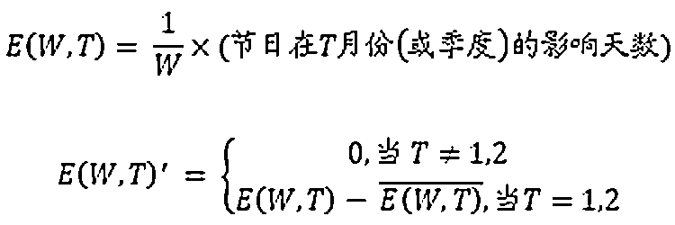
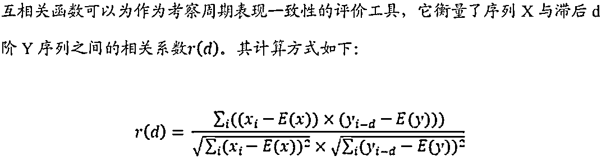
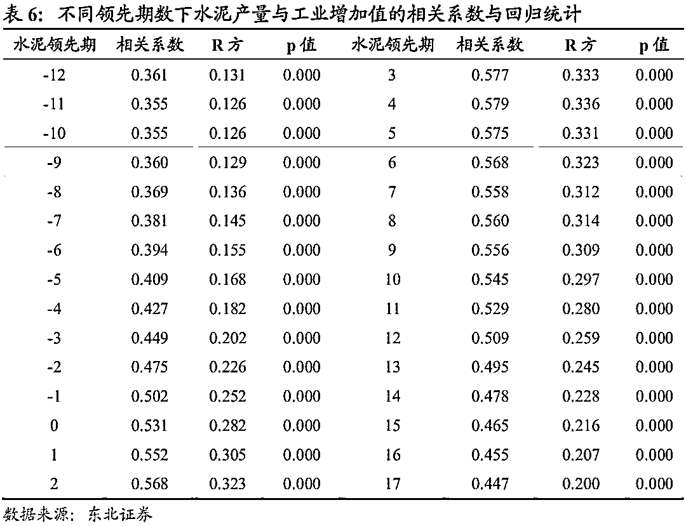

# 量本投资：经济指标周期及一个领先性确认的数理方法

> 原文：[`mp.weixin.qq.com/s?__biz=MzAxNTc0Mjg0Mg==&mid=2653296141&idx=1&sn=48f8e5fd3c233bdf00066682ce96f792&chksm=802dd418b75a5d0e4eb7fb626eafcddc78dde49c63b2da6432b48c6d3a3303816231d0462447&scene=27#wechat_redirect`](http://mp.weixin.qq.com/s?__biz=MzAxNTc0Mjg0Mg==&mid=2653296141&idx=1&sn=48f8e5fd3c233bdf00066682ce96f792&chksm=802dd418b75a5d0e4eb7fb626eafcddc78dde49c63b2da6432b48c6d3a3303816231d0462447&scene=27#wechat_redirect)

**标星★****置顶****公众号     **爱你们♥   

作者：肖承志、周飞鹏
来自：东北证券金融工程《经济指标周期及领先性确认的数理方法》

**本文已授权，未经允许，禁止转载**  

***0***

**摘要**

**本文是在近年来宏观、中观基本面量化兴起的背景下，针对量化手段该如何有效触及经济数据的问题，提供一个方法论的视角。**我们对世界主流经济研究机构所用的处理手段进行整理，同时引入此前并未广泛使用但适用的模型，以及我们自己设计的部分算法，形成一套研究周期性、领先性的数理流程。这些方法一方面可以作为宏观、策略研究中对传统以观察为主的工作提供量化视角，另一方面也可为目前方兴未艾的基本面量化研究提供契合经济数据特性的抓手。

**本文第一、二部分梳理了经济指标周期性、领先性研究的数理化流程，对主要模型进行介绍**。我们将整个流程分为两部分，第一部分为数据的预处理及信号分离，分离出主要研究的、或易于处理的信号，为识别拐点作准备；第二部分为从极值点到拐点的确认，以及两条时间序列间拐点的对应，进而通过综合评估来确认两者之间可能存在的领先性。

**本文第三部分以工业增加值、水泥产量的同比增速为例，实证前述模型效果。**我们详述了操作步骤，尤其是季调消除春节效应、经验模态分解平滑数据，以及在拐点确认过程中，极值点如何通过层层筛选被标记为拐点。

**本文第四部分探讨了前述几个关键步骤的重要性。**我们通过对比，说明了传统回归法求领先性存在局限性，而拐点识别与对应不仅能获取额外的周期信息，还能计算对应拐点平均间隔，可与回归法互为印证，综合确认领先期数。同时，我们也讨论了季调与平滑不论是对拐点识别还是传统回归法，都有重要意义。

最后，我们总结上述内容，对此流程可应用的领域及相关后续研究做展望。

风险提示：以上结果通过历史数据统计、建模和测算完成，在政策、市场环境发生变化时模型存在失效的风险。

***1***

**引言**

近年来，我国股票市场参与者的投资理念正在发生深刻的变化。2017 年以来，价值投资似乎正在兴起，巴菲特的投资理念也越来越多地被提及。相比以往，投资者更关注宏观、中观周期的更迭，行业的兴衰，以及公司的价值。如果我们把这些因素统称为“基本面”，我们看到几乎在同一时期，量化研究也开始试图渗透进基本面研究的范畴，形成一股“**基本面量化”（Quantamental）**的风潮。

过去一两年，我们看到基本面量化主要集中在几个方向：一是周期择时类，这里面包括宏观周期择时，例如信用周期、债务周期、库存周期的量化分析。也包括中观 周期择时，例如行业景气度的判别等。与传统基于量价分析的市场择时不同，宏、 中观周期判别仰赖经济数据（与量价数据存在本质不同）与经济逻辑。二是选股类， 探寻行业中具有区别公司基本面质地能力的财务及衍生指标。此外，基本面量化还 有其他展开形势，如利用经济指标进行因子择时，基本面事件驱动等。

周期类基本面量化研究，包括了经济变量的周期定期，领先关系探寻，合成综合领先指数等诸多方面。不像选股类策略与传统因子投资范式一脉相承，周期类研究缺少传统量化的衣钵可循，尤其是当研究的对象从相对高频的量价数据变为低频的经济数据，处理手段不宜直接迁移；指标所蕴含的信息，也由交易信息，变为与市场非直接相关的经济信息，相应的模型逻辑也会大有不同。

因此，**本文的研究目的就是针对如何定量化研究经济周期，提供工具上的一个视角**。具体的，我们试图解决以下问题：

**1、单指标的周期、阶段、拐点如何确认?**

**2、指标间的领先滞后关系如何确认?**

**3、关键过程为何重要?与传统方法相比有何优越性?**

***2***

**预处理与信号分离**

首先我们介绍流程的第一部分：数据预处理与信号分离，这是拐点识别必不可少的准备工作。该部分包括：频率对齐、季调、去趋势、平滑。

**2.1 频率对齐：让不同频率成为可比**

在研究两个或以上指标时，若指标频率不一，我们无法直接对比。因此流程的第一步即将指标频率统一化。我们可根据需要将低频指标高频化，也可以反向操作。

**2.2 季调：剔除季节性影响**

无论是生产、消费或其他类型经济指标，无一例外都会受源自社会、自然、数据统计等因素的季节效应的影响，指标反映的经济活动中真实规律会被一定程度掩盖。为此，流程的第二步，我们需剔除变量中由于季节性因素导致的扰动，即季调。

季调的基本思想是将指标序列分解为以下三个组成部分：

  1\. 趋势项(C)：长期和中长期序列运动;
2\. 季节项(S)：在每年相同月份或季节里反复出现的相似波动
3\. 不规则项(I)：去除趋势项和季节项后的剩余成分。 

而分解方式，根据指标特性不同，可以分为乘法模型和加法模型：

1\. 乘法模型：原序列为 C*S*I，季调后为 C*I，适用季节项随其他项变化的情况。

2\. 加法模型：原序列为 C+S+I，季调后为 C+I，适用季节项与其他项无关的情况。

从以上基本思想出发，常用季调方法包括美国人口普查局（Census Bureau）的 X 系列模型，以及西班牙央行的 TRAMO/SEATS，都是基于 ARIMA 的季调手段，但信号提取方式不同。2006 年 Census Bureau 将 X12-ARIMA 与 TRAMO/SEATS 结合，推出最新的 X13-ARIMA-SEATS，本文主要介绍这种方法。

**X-13ARIMA-SEATS 的核心是 regARIMA 模型，即带有 ARIMA 误差的回归。****它解决的是当回归误差项不满足无自相关假设，但可被 ARIMA 刻画时，如何建立线性回归的问题。**

**2.2.1 一般模型**
ARIMA 常用于刻画带季节性的时间序列。序列的一般乘法模型可写为以下形式：

选择在 regARIMA 的回归部分包含哪些回归变量，即对应了想要剔除哪些季节因素。X-13ARIMA-SEATS 介绍了诸多备选变量，在此我们仅列出部分常用变量计算方式：

**1、趋势常数**

**2、固定的月份效应（对于月频时序）**

**3、节日效应**

其中 W 是该节日总共影响的天数

**4、闰年**

**2.2.2\. 剔除节日效应**

剔除节日效应本属于季调的一部分，但需特别强调。有两方面原因：一是重大节日对指标的影响程度较大，体现为数据的大幅突变，影响统计手段的判断；二是我们通常研究同比数据，由于其计算方式是相同月对比，可以很自然地消除一大部分季节性因素，但仍然存在因重大节日在每年时间不同而导致的季节性，如西方的复活节、我国的春节就是典型的例子。由于这些节日在每年的时间不固定，给生产、消费活动带来的影响也相应在各年会有变化。很多时候，同比数据的季调只需剔除节 日效应即可（例见 4.2 节）。

消除节日效应的方法是在 regARIMA 中加入节日变量，以衡量节日影响。对于中国的经济指标，以消除春节效应为例，我们参考 X-13ARIMA-SEATS 中的复活节模型来构建节日变量：假定春节全部影响天数为 W，大年初一前占了 W-N 天，初一后 占 N 天，根据每年大年初一的公历日期，计算出 W 天中 1、2 月各占的天数，而后各自除以 W，即 1、2 月的变量值，其他月份为 0。最后，为了避免使调整后序列相对原序列产生偏移，历年 1、2 月的变量值做中心化（减均值）即可。

**2.3 去趋势:分离趋势与波动**

许多经济指标带有时间趋势，对于这类指标，我们要对其做去趋势的工作。我们借助信号处理的手段，将信号中的趋势项和波动项分离，如此才能研究波动项中携带的周期演化信息。以下我们介绍几种经典滤波方法。

**2.3.1 Baxter-King（BK）滤波**

理想的带通滤波器（Band-pass Filter，滤掉频率过低或过高的成分）能分离出在频率范围内即范围外的信号，而在时域上想达到相同的结果，需要无限项移动平均以及无限个样本点。Baxter 与 King (1999) 基于有限项的对称加权移动平均，提出一种对理想近似的线性带通滤波器，只保留信号中周期长度在限定范围内的部分。该 模型认为原信号可由以下形式近似，以最小化近似形式与频域滤波器的频域表达差异：

实际应用中，主要考虑三个参数：保留信号的周期长度上、下限，以及移动平均中前后各包含的期数，也即数据头尾的截断长度。根据美国国家经济研究局(NBER)Burns 与 Mitchell 的研究，大多数美国经济指标周期都在 6 到 32 个季度之间，Baxter 与 King 由此建议周期上、下限分别取 32、6（季频数据，年度数据取 8、1.5）；同时，头尾截断长度选 12（季度数据，年度数据取 3）。

值得注意的是，BK 滤波得到的波动项较平滑，相比 HP 滤波为了提取长周期趋势、 设置较大而得到的低信噪比波动项，在把握波动的主要走势方面更具优势。但 BK 滤波具有头尾数据截断属性，数据完整性受到较大影响。

**2.3.2\. Christiano-Fitzgerald（CF）滤波**

许多实证表明，当信号不平稳时，BK 滤波效果较差，无法滤出想要的成分。Christiano 和 Fitzgerald (1999) 提出，当时间序列是一阶单整时，对理想滤波器最优的近似需要知道序列的数据产生过程，并由此提出 CF 随机游走滤波。

与 BK 滤波相似，CF 滤波亦是对理想带通滤波的近似，当序列是连续的，或有无限样本点时，它们都逼近理想下的滤波器。其中 BK 滤波是对称近似，没有相位移动， 但代价是末端数据会有截断。而 CF 滤波是用全序列的信息去计算每个过滤后的点。相比 BK 滤波，CF 滤波的优点是适用于更广类型的序列（如非平稳），且随时序变长而收敛于最优滤波，在实际使用时往往效果比 BK 滤波好。

CF 滤波是一种陡峭的非对称滤波，计算如下：

**2.3.3 Hodrick-Prescott（HP）滤波**

HP 滤波是使用最广泛的去趋势方法之一，也是国际货币基金组织(IMF)和 OECD 等使用的方法。2008 年，OECD 对几种滤波方式（包括 HP、CF 滤波等）进行深入对比后，决定放弃使用原有去趋势模型，而改用 HP 滤波。这一改变使得波动项的估计更稳定，构建综合领先等指标时过程更加透明。

Hodrick 和 Prescott (1997) 首次提出这一提取趋势方法。趋势的估计是通过最小化瞬时分量的平方和得到的，在原始形式中趋势估计转换为以下优化问题：

**2.4 平滑：剔除高频噪声**

流程的第四步为平滑。平滑对象有两种，一是本身不带有时间趋势的同比/环比等增速数据；二是去趋势后的波动项，如 HP 滤波为了去除长周期趋势，将参数设得较 高，这样留下的波动项往往平滑性差，与未做滤波的增速数据一样，含有较多噪声。

为了在之后的步骤中准确把握波动项的周期模式，我们有必要做平滑，提高数据的信噪比。许多平滑方法本质就是滤波，OECD 在做去趋势与平滑时都使用 HP 滤波，

第一步用高剔除趋势，第二步用低去除波动项中的噪声，但我们认为 HP 滤波适用于去趋势，而作为平滑工具时对不同类型指标，难以自适应地确定合适的参数。

本节我们引入此前并未被 OECD，NBER，Census Bureau 等机构所关注，但我们认为有较高灵活度与实践价值的经验模态分解（Empirical Mode Decomposition，简称 EMD），1998 年由美国国家宇航局（NASA）的黄锷（Norden E. Huang）等人提出。

**2.4.1 经验模态分解(EMD) **

与传统信号处理方式不同，经验模态分解依据信号自身的时间尺度特征对信号进行分解，无需预先设定任何基函数，具有自适应特点，在处理非平稳和非线性信号方面具有明显优势（例见 4.3 节）。

经验模态分解假设任何复杂的信号都是由若干瞬时频率有意义且唯一、但不同时刻瞬时频率可不同的本征模函数（Intrinsic Mode Function，简称 IMF）叠加组成，这是普通滤波其或离散小波变换无法得到的。分解到最后一层 IMF 剩下的残差 rn 即为最底层趋势，其他 IMF 都可视为不同周期长度的波动。即原信号：

一个本征模函数须具备以下两个条件：

1、函数在整个时间范围内，局部极值点和过零点的数目相等，或者最多差一个。

2、任意时刻点，局部最大值的包络线（上包络线）和局部最小值的包络线（下包络线）平均必须为 0，即上、下包络线相对于时间轴局部对称。

EMD 方法基于以下假设条件：

1、数据至少有两个极值，一个极大值和一个极小值。

2、数据的局部时域特征是由极值点间的时间尺度唯一确定。

3、如果数据没有极值点，但是有拐点，则可以通过对数据微分一次或者多次求得极值，然后通过积分来获得分解结果。

经验模态分解的过程是不断从信号中提取出本征模态函数，直到信号仅保留趋势项的过程，具体分为以下几步：

将所有 IMF 及最后的残差叠加即可重构原序列，我们可以根据需要灵活选取分解的层数，得到理想的平滑结果。尽管 EMD 的算法简单明了，也仍有其缺点，比如分解结果在端点处可能有偏移（因为端点处极大/极小值的包络线是通过插值获得的）。

***3***

**周期、阶段、拐点及领先性的确认**

上一部分介绍了必要的数据预处理过程，接下去，我们就开始着手为经济指标做周期阶段的定期工作（Dating Cycles）。

实际上，周期的演绎模式可以由拐点来定义。拐点划分了指标序列的特定周期、阶 段，拐点序列本身形成了一个基本的经济循环“年表”。简而言之，确定了拐点，也就抓住了该指标周期性的基本特征。

定期工作主要包括：

1、识别拐点；

2、确定跨序列拐点的对应关系；

3、综合评价。

**3.1 拐点识别：****从局部极值到全局拐点**

在国际主要经济研究机构中，识别周期拐点的最常用模型，可以分为参数及非参数两类。参数类主要有 Hamilton (1989) 的马尔科夫转换模型，非参数类则主要是 NBER 提出的 Bry-Boschan (1971) (B-B 算法)，以及 Bruno and Otranto (2004) 提出的拐点全面分类定期方法。由于 NBER，OECD 等组织传统使用的是 B-B 算法，这里我们主要对其进行介绍（例见 4.4 节）。

B-B 算法处理的对象是平滑后的数据序列，其本质其实是一种极值筛选法，它将 NBER 经济周期决策委员会对拐点的判断方式，归纳为一系列简单决策原则，用于层层筛选过滤，最后剩下的极值被认定为拐点：

1、波峰、波谷必须交替出现；
2、相邻波峰、波谷之间须至少间隔 6 个月；
3、一个周期(峰与峰、谷与谷之间)需至少持续 15 个月；
4、序列头尾 6 个月内识别出拐点无效，若头尾 24 个月内识别出局部峰（谷）且该值不是 24 月内最大（小）值，则该峰（谷）同样无效。

具体的，经典 B-B 算法步骤如下：

第一步：寻找所有极值点(前后 N 期范围内最大/小值)；

第二步：检查相邻极值点之间该极值是否是最大/小值，若不是，则删除该极值点；

第三步：检查极值点是否交替出现，若有重复峰/谷，只保留时间最早或较大/小点；

第四步：检查周期长度是否满足最短时限要求，若不是，删除较小/大的极大/小值；

第五步：重复二、三步；

第六步：检查半周期是否满足最短长度要求，若不是，只保留偏离均值较大的极值；

第七步：重复二、三步，剩下的极值点认定为拐点。

在 NBER 的实际处理过程中，以上步骤作为一次运算会经过多次迭代，每次迭代使用的输入数据都是平滑后的序列，且每次平滑程度逐渐降低，这样得出的拐点对上一次迭代的结果进行必要的修正，来确定最终拐点。

此外，当数据是季频时，除了可以选择先将季频转换为月频再做处理外，也可以使用 Harding and Pagan (2001) 提出的类 B-B 算法。此种方法将数据列的差分近似为对时间的微分，并以当期差分与下期差分与 0 的大小关系来标记波峰/谷。同时，与 B-B 算法类似的拐点交替性、周期最小长度等筛选规则也包含在模型中。

**3.2 拐点对应：指标间拐点的对应关**

系确定拐点后，我们一方面也确定了序列的周期和阶段，另一方面也借此得以进一步研究两个经济指标的关联。我们的最终目的是确定两条时间序列之间的领先滞后性，在此之前就需要对两个序列的拐点进行一一对应，明确彼此的相位对照关系。

在这方面，目前没有被广泛使用或主要机构公布的算法，但这一过程应当并不复杂。我们根据拐点的对应、缺失、多余三种可能状态设计了一套拐点对应的算法，具体过程如下：

经过以上步骤，我们便可梳理 A、B 序列中拐点的对应关系，同时判定哪些拐点（周期）是缺失或多余的（例见 4.5.1 节）。以此为基础，我们即可在下一节做进一步分析，继而综合评价两经济指标的领先滞后性。

**3.3 领先期数确认：****综合评价确定领先性**

本节中，我们考察两个经济指标的周期行为是如何相互关联的。由于周期阶段的确认依赖拐点，故我们主要依据拐点识别的结论，从几个维度来综合评价指标间的领先滞后性（例见 4.5.2 节）。具体的，我们关注以下几个方面：

**3.3.1 领先期数的长度及其持续性 **

领先性以数据单位频率的期数来衡量，用以反映跨指标对应的拐点间间隔的时间。领先期数在各个对应拐点上的表达会有不同，因此我们可以求均值来总体评价；同时，我们也可求中位数，因为均值本身可能会被异常值影响。此外，领先性的持续性也是考察的一方面，通常用领先期数的标准差来衡量。

计算了均值、中位数、标准差等统计指标后，还需对结果进行评价。例如 OECD 的评价标准认为过短的领先/滞后性也许只是巧合，并不具有参考意义。

注：我们认为 OECD 的判断准则是从经济学家的直觉出发设定的， 这种直觉建立在如 NBER 等机构对西方 20 世纪以来各类经济指标的周期研究基础上，而随着现代社会通讯技术、交通技术的发展，经济中变量的传导能力或与过往不同，因此这 类评价标准也并非唯一，仅供读者参考。

**3.3.2 周期表现的一致性**

除了重点考察拐点这类特殊点外，我们也应当从整个序列的角度对比两个经济指标。如果两个序列是高度相关的，那么二者在周期的演变过程上也会较为相似。

一方面，互相关函数的峰值衡量了两个周期演化过程相似的程度。另一方面，峰值所对应的滞后阶数，也可以与上一步中领先期数均值/中位数形成印证。从交叉检验的角度来说，拐点平均领先/滞后期数，应当与互相关函数极大值点指征的领先/滞后阶数相差不大，这样才能为确定领先性提供可靠的信息。

**3.3.3 缺失与多余周期（拐点）**

理想情况下，序列 A 对 B 如果有很强的领先、指示意义，我们要求两序列间不存在过多的缺失或多余周期（拐点）。如果领先指标存在较多的多余拐点，则未来提示错误信号的概率很大；类似的，如果领先指标相对被指征的指标存在较多缺失拐点的情况，则未来很大概率不能提供预示另一序列之拐点的信号。

总结：以上我们分步介绍了研究经济数据周期性、领先滞后性的一般性流程和数理方法，主要包括数据的频率对齐、季调、滤波与平滑、拐点识别、拐点对应和综合评价等过程。

***4***

**各步骤的实例详解**

我们以工业增加值、水泥产量的同比增速为例，详述关键建模过程，实证本流程的定期、领先期数确定效果。

**4.1 低频转高频实例**

**4.2 剔除工业增加值同比增速中的“春节效应”**

我们以工业增加值同比增速为例，详解剔除“春节效应”的过程。其主要步骤是计算节假日虚拟变量，再结合 X13-ARIMA-SEATS 中的其他默认变量构建 regARIMA 模型。数据时间范围为 2000 年 1 月到 2019 年 11 月。

接下去，参照 X13-ARIMA-SEATS 的方法，加入我们计算的虚拟变量，按乘法模型构建 regARIMA：由于是同比数据，默认原序列平稳因而无需差分，且季节项主要是春节因素影响，故非季节性 ARIMA(0,0,2)，季节性 ARIMA(1,0,0)。最终季调结果如下：

我们看到，消除“春节因素”后序列相比季调前，1、2 月的数据突变现象明显减小，而其他月份的数值水平变化不大。

**4.3 经验模态分解：灵活平滑同比序列**

季调后的数据依然需经过信号处理。这里面分两种情况:第一是数据是原始值类型，往往带有趋势项，需经剔除趋势及平滑两步；第二是同比或环比数据，往往不带明确的趋势，因此只需做平滑即可。

HP 滤波是剔除趋势的常用手段，常被用于估计产出缺口，但提取的波动项往往平滑性较差。其作为平滑手段时，参数也难以自适应地确定。BK 滤波则是一种自带平滑属性的剔除趋势方法，波动项平滑性好，但其代价是损失了数据的完整性，故亦不常用。

对于数据的平滑我们用经验模态分解作为工具，其优点是分层滤波，灵活性强。除了按理论标准停止迭代外，我们可以视情况在不同层级停止滤波。此处我们就以上节季调后的工业增加值同比增速作为平滑对象，展示其效果。

首先我们不加入分解层数限制，将原始信号分解到最后一层趋势。可以看到，随着分解层级增大，剥离出的信号频率逐渐降低，由高频噪声，逐渐变为低频波动。同时，我们观察到除了最后的余波（底层趋势），其他 IMF（波动）的振幅较为接近， 且较趋势都较小。

这给我们选择分解层数提供便利，我们只需过滤掉频率较高的信号即可。因此，其实我们只需分解到 IMF3 即可，即 IMF1-3 之和作为波动，IMF4-11 及余波之和作为长周期波动，即平滑后结果。我们看到平滑后的序列基本保留了原序列的变化趋势， 平滑性较好，优于 HP 滤波、牺牲数据完整性的 BK 滤波。更重要的是，重要拐点也未发生显著偏移，这也是优于传统 MA 等平滑手段的。

**4.4 从极值到拐点的筛选过程**

经过必要的预处理及信号分离后，我们便可进入拐点识别环节。以上节中平滑的工业增加值增速为研究对象，我们展示识别拐点的过程。

按照 3.1 介绍的方法，首先我们要定位所有极值点。通过设定参数 N=5，我们找到在前后各 5 期范围内是极大/小值的点。

其次，我们在所有极值点中做第一次筛选，筛选的原则包括两方面：

1、是否为相邻 两极值点中最值，若不是，则删除该极值点；

2、极值点是否交替出现，若有重复峰/谷，只保留时间最早或较大/小点，这里我们选择保留较大/小点。初筛后结果如下， 其中一个点（2003 年 1 月）因不满足原则 1 被剔除。

接下去我们检查周期长度是否满足最短时限要求，若不是，删除较小/大的极大/小值，然后再按原则 1、2 剔除不满足条件的极值点。

随后，进而检查半周期是否满足最短长度要求，若不是，只保留偏离均值较大的极值；最后，按原则 1、2 进行一次筛选，保证为相邻极值点间最值，且极大、小值交替出现。最终剩下的点即通过筛选，成为拐点。

**4.5 拐点对应与领先性评估举例**

最后我们来看如何将两条序列的拐点进行对应，以及如何评价序列的领先滞后性。

**4.5.1 拐点对应**

我们选取逻辑上对工业增加值可能有领先意义的水泥产量同比增速作为第二个研究指标。经过相同的处理过程（季调、平滑以及拐点识别），我们得到水泥产量增速的拐点序列。

接着，按我们在 3.2 节介绍的算法，将工业增加值增速（序列 1）与水泥产量（序列 2）增速的各拐点进行匹配。

首先，我们设置拐点对应的时间范围参数为（-6,18），即对于序列 1 中的某拐点，序列 2 中与其可能的对应拐点最晚滞后 6 期，最早领先 18 期。我们遍历序列 1 中每 一拐点，在该时间范围内寻找序列 2 中类型相同的拐点（峰/谷），同时记录可能的无匹配情况；

其次，按照拐点不重复匹配、序列 1 对应的序列 2 的拐点应当在时间上由远至近， 这两条原则，对初步匹配的拐点进行筛选，剔除不满足条件的对应关系。最终得到的拐点对应结果如下图。其中，虚线指征波谷，实线代表波峰，相同颜色的线代表两个经济指标中对应的拐点。

我们看到工业增加值序列最头部的一个波峰拐点被认定为“周期缺失”，即水泥产量中无对应周期存在。同时，水泥产量最末尾两个拐点被判定为“多余周期”，即对应工业增加值中的拐点也许还未出现。除此以外，两序列剩余拐点在时间上是一一对应的，且可以明显观察到水泥产量对于工业增加值的领先性质。

**4.5.2 水泥产量对工业增加值的领先性评价**

我们首先统计两序列对应拐点的领先期数均值与中位数，分别为 5.6、5 个月。其次我们计算两序列的互相关函数，结果在水泥产量领先 4、5 期时，两者的相关系数达到最高，分别为 0.579、0.574，与拐点识别的结果相差不大，互为印证，这部分我们将在 5.1 中详述。因此，我们综合评价上游水泥产量增速对于工业增加值增速领先大概 4-5 个月。

***5***

**主要过程重要性论证**

此部分我们讨论本文所介绍经济指标定期、领先性确认流程中，几个关键步骤的作用。具体的，我们通过对比，观察拐点识别与对应的必要性，以及季调与平滑的重要性。

**5.1 拐点识别与对应的重要性**

4.5 节中，在确定领先性时，我们综合了对应拐点领先期数的均值/中位数，以及互相关函数的结果，确定了领先期数。

实际上，我们了解到，互相关函数是目前常用的用于估算经济指标领先性的手段， 相似的方法还通过遍历不同滞后期数，用 OLS 回归测算两序列的线性关系（非平稳情况下用需用协整，本质也是 OLS 回归），在回归系数显著的前提下，寻找拟合优 度（R 方）最大的滞后期数。计算相关性与做线性回归的方法本质是一样的，皮尔逊相关系数的平方就等于 R 方。

但其实这种做法在各期回归结果区别较大时能得出直观结论，而当某一序列有较强的自相关性时，该种方法就存在局限性，此时会出现不同滞后期数的相关系数较为接近，甚至是当滞后期数符号相反（即领先和滞后时）的相关性都区别不大。此时靠选择最大的相关系数来确定领先性，是不容易判断的。

依然是 4.5 节中的例子，我们统计平滑后工业增加值、水泥产量同比增速的互相关函数在不同滞后阶数下的取值，发现在水泥产量领先和滞后时，与工业增加值的相关性都较大，很容易让人得出相反的结论。同理，OLS 回归的结果也显示在水泥在领先与滞后情况下对于工业增加值有显著的解释意义，R 平方都在 0.2 以上，这对 于经济指标来说已经是较大的解释度（主要因为序列经过平滑）。

与对应的重要性得以体现。传统的 OLS 或互相关函数本身，在特定情形下如（序列本身不平稳、序列存在自相关）无法直接得出结论，而通过定位拐点，我们不仅能计算平均拐点间隔时间，还能给经济指标的周期及阶段进行定期，这是计算相关系数与回归无法得到的。

**5.2 季调与平滑的重要性**

无论是对于同比序列，或是经济指标的原始或环比值，季调都是必要的。尤其是重大节日对生产类、消费类指标都有显著的影响，体现在数据上则是时间序列在部分时间的突变，影响数据的统计特征。另一方面，序列的噪音也会影响我们的观察。若不经过合适的手段分离噪声信号、得到主要的走势，拐点判断以及定期的准确性会在一定程度上受到影响。

下面我们通过对比季调与平滑前后的传统相关系数或回归结果，以及拐点识别结果，来观察季调与平滑的作用。

**5.2.1 回归结果在季调与平滑前后的结果对比**

未经季调与平滑下，水泥与工业增加值依然有协整关系，但 R 方与相关系数大幅下 降，同时出现在滞后阶数分布上的双峰，更难以判断。若单纯按相关系数的最大值来确定领先性，甚至易得出两者是同步指标的结论。而水泥作为重要的上游生产品， 在经济逻辑上对于工业增加值当有一定的领先意义。这凸显了去噪的重要性。

**5.2.2 拐点识别在季调与平滑前后的结果对比**

不做去噪的情况下，我们用此前相同的模型对两指标做拐点识别，并与此前结果对比。总体上，平滑后的数据拐点比原数据稍有滞后，但周期识别更精确。未去噪的序列在周期数目上有所缺失，尤其是工业增加值，未识别出 5 个拐点，水泥产量则未识别出 2 个拐点。这是由于噪声与突变的存在，使极值到拐点的筛选过程受到干扰从而剔除了更多极值点。

工业增加值与水泥产量对应拐点的滞后期数均值和中位数分别是 5.25、5.5，虽然从结果上看，与去噪时相差不大，但对应周期数从 7 个降至 4 个，说服力降低。工业增加值作为总量指标中重要的研究对象，如果作为基准序列，我们通常是想找到对其有领先意义的指标，若其本身只能识别出数目较少的拐点，那么任何其他序列拐点在与其对比时，都会面临对应拐点数目不够的情况。因此，通过季调和平滑，提取数据的主要走势，为减少拐点识别受到的数据异动干扰提供便利显得尤为重要。

***6***

**总结及展望**

本文介绍了一种经济指标定期、领先性判定的数理化流程，并对其中主要过程进行模型展示以及效果验证，最后通过对比，讨论了拐点识别与对应、季调与平滑等几个关键过程的重要性。

该流程主要步骤有：频率对齐、季调、滤波和平滑，以及拐点识别和对应，最后一步则是综合评价领先性及领先期数。其中，频率对齐主要使用线性插值等插值法；季调主要参考 Census Bureau 的 X13-ARIMA-SEATS 模型；滤波和平滑分别是为了分离提取想要研究的指标分项，以及主要走势，以便于减少噪声对拐点识别或传统回归方法的干扰；拐点识别我们参考 NBER 的 Bry-Boschan 算法，通过量化 NBER 的拐点筛选原则，极值点经过层层筛选后被判定为拐点；拐点对应部分，则是我们根据拐点的对应、多余、缺失三种状态，设计了一套算法，将两指标的拐点进行对应；最后，根据对应拐点领先期数的均值/中位数，以及平滑后两指标的互相关函数， 综合确认指标间的领先性及领先期数。

我们认为目前“基本面量化”的研究方兴未艾，用量化的手段刻画宏、中观总量指标的周期性、领先性是许多研究的基础需求。目前我们看到业内对于两指标领先滞后性确认的方法更多局限在传统的协整研究或直接回归，我们也通过例子来说明此种方法有其局限性。我们认为通过数量化手段，给经济指标进行定期，或拐点识别，能给研究提供指标本身更多的信息。同时，用拐点间关系与回归法结果互相印证来综合确定领先性，更为合理。

本文例证展示了工业增加值及水泥产量同比增速间，领先期数确认的过程，得到符合经济逻辑的结论，认为水泥产量同比领先工业增加值同比大约 4-5 个月。我们认为这种方法可被广泛应用，以探寻更多指标间潜在的关联与交互作用。

同时我们注意到，流程中难以避免地涉及到一些主观性，如拐点识别中最短周期/半周期长度、拐点对应中的滞后区间、季调时春节效应的影响时间等参数，需依经济逻辑确定。这些参数在研究不同周期属性的指标时应当有所不同，这方面需进一步讨论。

2020 年第 2 篇文章

*—End—*

量化投资与机器学习微信公众号，是业内垂直于**Quant**、**MFE**、**Fintech****、AI、ML**等领域的**量化类主流自媒体。**公众号拥有来自**公募、私募、券商、期货、银行、海外**等众多圈内**18W+**关注者。每日发布行业前沿研究成果和最新量化资讯。

你点的每个“在看”，都是对我们最大的鼓励