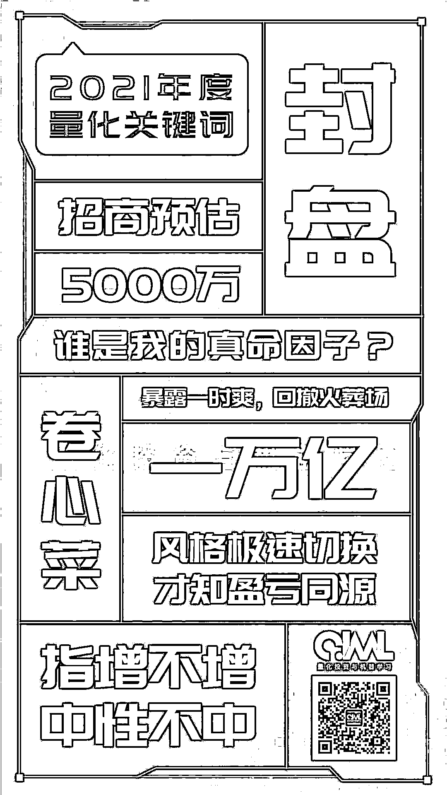
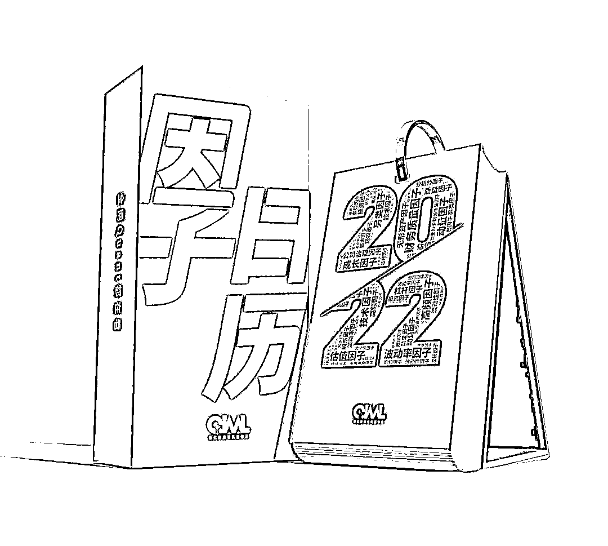
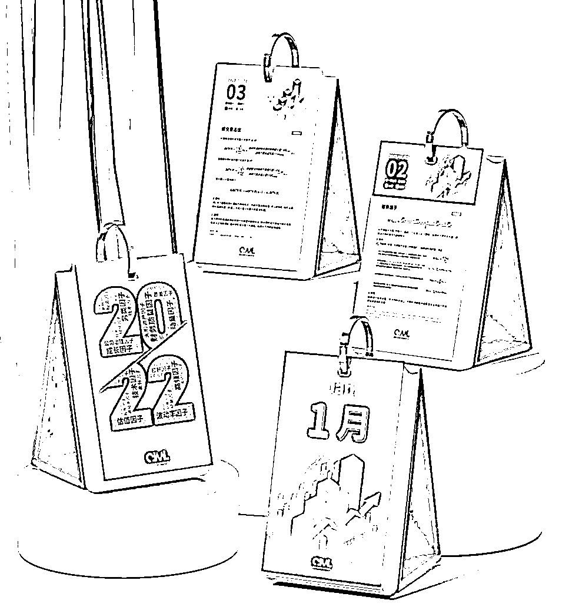
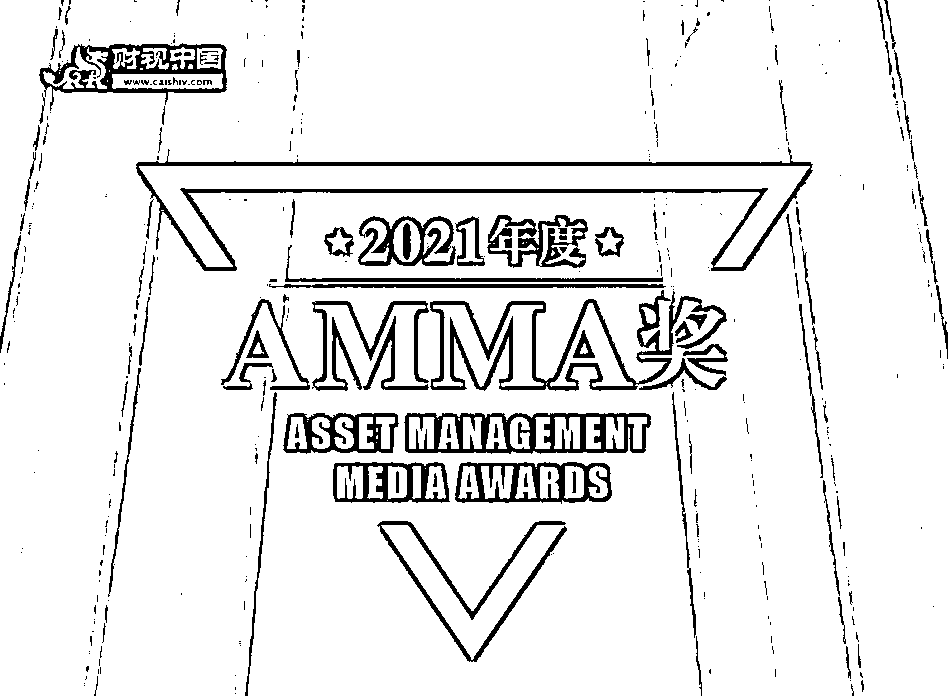
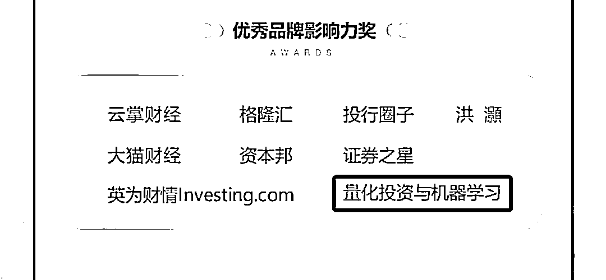
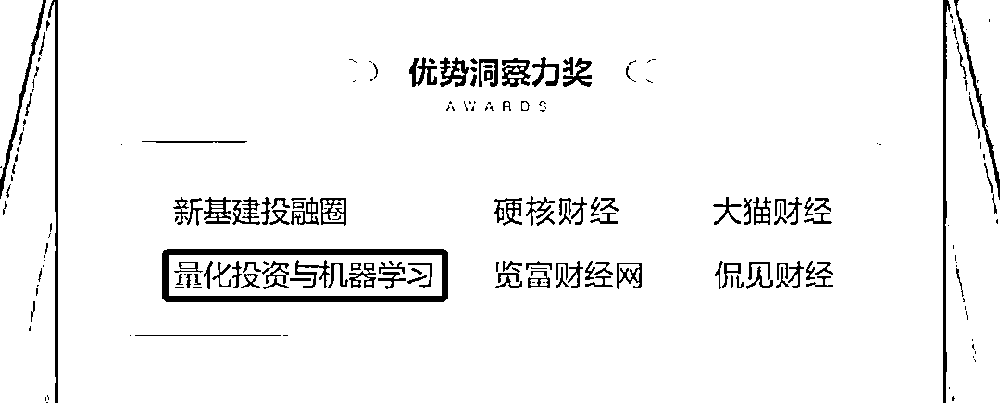
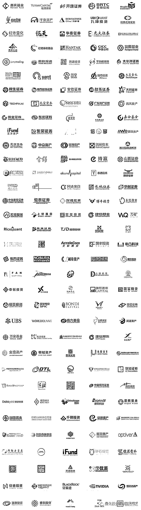

# 太卷了！太不容易了！

> 原文：[`mp.weixin.qq.com/s?__biz=MzAxNTc0Mjg0Mg==&mid=2653322944&idx=1&sn=fa26bdb1c6c4e0c58ffcfd684b6c0a5a&chksm=802dbcd5b75a35c3e38357d1e42df0a694a6d43eedf1d6ae916a14508bf8f160e851d5e02ffd&scene=27#wechat_redirect`](http://mp.weixin.qq.com/s?__biz=MzAxNTc0Mjg0Mg==&mid=2653322944&idx=1&sn=fa26bdb1c6c4e0c58ffcfd684b6c0a5a&chksm=802dbcd5b75a35c3e38357d1e42df0a694a6d43eedf1d6ae916a14508bf8f160e851d5e02ffd&scene=27#wechat_redirect)

# 

量化投资与机器学习微信公众号，是业内垂直于**量化投资、对冲基金、Fintech、人工智能、大数据**等领域的主流自媒体。公众号拥有来自**公募、私募、券商、期货、银行、保险、高校**等行业**30W+**关注者。连续 2 年被腾讯云+社区评选为“年度最佳作者”。

今天是 2021 年的最后一天，来点不一样的！

昨天，公众号揭榜了 2021 年度『量化』关键词。我们从上千份调查问卷里筛选而来，基本上代表了 2021 年量化圈最重要的几大事件：

公众号今天想做个总结，来说说我们 2021 年做的最值得称赞的几件事情。因为公众号成立 6 年以来，**一直坚持自己的初心，希望给国内量化投资圈贡献一份自己的力量。**现在看来，我们做到了，虽然微薄，但是我们努力了！ 

**因子日历：2021 量化圈最火周边**

今年公众号做的最值得骄傲的事情是推出了我们的第一个周边：**『**因子日历**』**

**可以说是全网第一本以因子为主题的日历！**

从创作到最后出品，公众号准备了近一年的时间。在这期间，公众号花费了大量的心血，我们的目标只有一个，就是给全网量化爱好者带来一本前所未有的量化周边！

一经推出，便受到了众多量化爱好者与机构投资者的认可与喜爱，在短短的几天时间内一售而空！这超出了我们的预期。在此，给没有买到因子日历的读者们放一个彩蛋： 

**明年，『**因子日历**』将以更好的形式，更丰富的内容、更有质量的因子与大家见面！**

**见字如面：刷爆朋友圈**

第二件大事件就是公众号于 2021 年初开始举办的 **原创 IP** 活动**『见字如面』**相比去年机构数据翻番，听说当天朋友圈直接刷屏！这让**『见字如面』**已成为一年一度量化圈大家最期待的一次新年活动！

 

再次感谢所有私募管理人对公众号的支持与厚爱，明年我们争取做到 100 家，让更多量化私募参与其中。

**QIML Insight：深度、前沿、高水准**

第三件大事就是******QIML Insight——深度研读系列****** ，这是公众号今年全力打造的一档**深度、前沿、高水准**栏目。

公众号**遴选**了各大期刊前沿论文，按照理解和提炼的方式为读者呈现每篇论文最精华的部分。QIML 希望大家能够读到可以成长的量化文章，愿与你共同进步！

**汇总链接：**

 

**AMMA 奖：行业认可，努力前行**

为表彰金融资管领域专业媒体，感谢他们作为服务平台，更是作为行业晴雨表长期做出的突出贡献，财视中国特发起 AMMA（Asset Management Media Awards）奖。本次评选范围涉及泛财经（非股票推荐类）、宏观经济、银行资管、券商资管、期货资管、保险资管、企业资管、资产负债管理、ABS、债务融资、不良资产等专业媒体。

此次财视中国 AMMA 奖主要从 2021 年媒体平台阅读量、转载量、原创比例、原创及时性、原创转载率、订阅用户数量、更新频次等维度进行考察，经综合评定后，最终为 15 家媒体颁出相关奖项。

公众号荣获：**优秀品牌影响力**与**优秀洞察力**两项大奖。这是对公众号在这 6 年里辛勤耕耘的认可，更是公众号在未来前行道路的鼓励！

**阅读排行榜前 10 文章**

这是今年公众号阅读排行榜前 10 的文章，可以看到，从各个维度为大家呈现量化圈的投研、人物、求职、资讯等。 

1、[幻方徐进：如何用 Deep Learning 为股票定价](http://mp.weixin.qq.com/s?__biz=MzAxNTc0Mjg0Mg==&mid=2653317789&idx=1&sn=8d71ad1afed97dd164a6908a80f11bfc&chksm=802da888b75a219ea95cadf0316b7561101214b1ab644668f9c02ec4512d98b137c57bbf7fa8&scene=21#wechat_redirect)  

[2、见字如面！84 家量化私募管理人『虎』年寄语](http://mp.weixin.qq.com/s?__biz=MzAxNTc0Mjg0Mg==&mid=2653322839&idx=1&sn=e30780e5e37215f74fe579f3dca150e3&chksm=802dbc42b75a35541115ba816e0e872dc52be4a12a33a9014b29f1d8a720d78b89ae0592b418&scene=21#wechat_redirect)

[3、王思聪语录：Quant 版](http://mp.weixin.qq.com/s?__biz=MzAxNTc0Mjg0Mg==&mid=2653317478&idx=1&sn=95ee10532ac668f0b2f0a560d3c8aaf1&chksm=802dab73b75a22650823d2194c8050af9bb3e79f87199ac23043b5580bd58673f325273fddd3&scene=21#wechat_redirect)

[4、Two Sigma 公布 2020 年最糟糕因子](http://mp.weixin.qq.com/s?__biz=MzAxNTc0Mjg0Mg==&mid=2653310880&idx=1&sn=cf830f7c2f2edfae02534353c07cd2ae&chksm=802d8db5b75a04a39fe72183710e412f002c8989ea4e767173c8e57cddf4209a290ff39b3416&scene=21#wechat_redirect)

[5、九坤王琛：量化+AI，未来可期！](http://mp.weixin.qq.com/s?__biz=MzAxNTc0Mjg0Mg==&mid=2653317918&idx=1&sn=ab0ff4e36afe55ffcf4714cdd9698321&chksm=802da90bb75a201deec9a35804c40199df3c322baa3f857c72af3ea0784dd7072a8da86b2b49&scene=21#wechat_redirect)

[6、巴菲特指标：严重高估！](http://mp.weixin.qq.com/s?__biz=MzAxNTc0Mjg0Mg==&mid=2653312142&idx=1&sn=0398909847826560a8bea59a877e9793&chksm=802d969bb75a1f8dadb08cde7f71d9a784565b4c35ca8129ac369f6ece49b6aa625f8c8d8c18&scene=21#wechat_redirect)

[7、独家！中国量化私募面试 Q&A 系列——白鹭资管](http://mp.weixin.qq.com/s?__biz=MzAxNTc0Mjg0Mg==&mid=2653315678&idx=1&sn=951b57c5025be182f627c8b41bbb0b2c&chksm=802da04bb75a295dbd9edbad2f67bf8ab27cfbe92687d2f83ec49d4847ea94cb79fef3e1a9b1&scene=21#wechat_redirect)

[8、AAAI 2021：仅有的 8 篇量化投资论文（论文+代码）](http://mp.weixin.qq.com/s?__biz=MzAxNTc0Mjg0Mg==&mid=2653321120&idx=1&sn=7c814886c2f0e179ebbc36417097749a&chksm=802db5b5b75a3ca3d13a8a8faab4b9910a1ce9532b2a28ad044c131066974633c972ea57f102&scene=21#wechat_redirect)

[9、文艺复兴遭巨额赎回！](http://mp.weixin.qq.com/s?__biz=MzAxNTc0Mjg0Mg==&mid=2653311970&idx=1&sn=f9867f3d7bed817223245c4390d6b7fb&chksm=802d91f7b75a18e1d3b15670e0b5e0b0b05e602ecbd0f08af8df469a3e631c2a20f611263f2d&scene=21#wechat_redirect)

[10、你永远不知道一个 Quant 挣多少钱！](http://mp.weixin.qq.com/s?__biz=MzAxNTc0Mjg0Mg==&mid=2653318629&idx=1&sn=da2abc0a53b3ea60b8f1dbefe7ac6291&chksm=802daff0b75a26e6c33368e2a984606cd53867a9611558ead3e7215a1086f1871cf2ff10008b&scene=21#wechat_redirect)

**2022 年公众号将会给大家带来更多干货**

**希望各位读者多多支持我们**

**在量化投资的道路上，你不是一个人在战斗！**

**部分合作机构**

