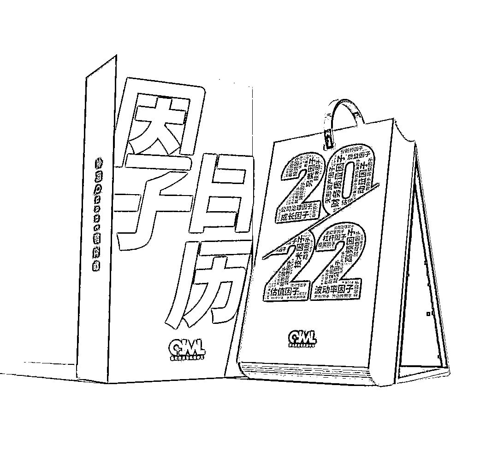

# 重磅！2021 年度『量化』关键词揭榜

> 原文：[`mp.weixin.qq.com/s?__biz=MzAxNTc0Mjg0Mg==&mid=2653322920&idx=1&sn=57de65e6507cc44663c8ae412f5098c1&chksm=802dbcbdb75a35ab4dfe241c35cf116d13a7dab36224eca151d306086c57afa337dc0bf39b73&scene=27#wechat_redirect`](http://mp.weixin.qq.com/s?__biz=MzAxNTc0Mjg0Mg==&mid=2653322920&idx=1&sn=57de65e6507cc44663c8ae412f5098c1&chksm=802dbcbdb75a35ab4dfe241c35cf116d13a7dab36224eca151d306086c57afa337dc0bf39b73&scene=27#wechat_redirect)

# 

量化投资与机器学习微信公众号，是业内垂直于**量化投资、对冲基金、Fintech、人工智能、大数据**等领域的主流自媒体。公众号拥有来自**公募、私募、券商、期货、银行、保险、高校**等行业**30W+**关注者，连续 2 年被腾讯云+社区评选为“年度最佳作者”。

经过半个多月全网收集与公众号内部评选，**2021 年度『量化』关键词今日正式揭榜！**

在此感谢入选的榜单的部分网友，他们是：***@******郑煜哲、@禾子八爷、@五蛋齐飞、@秋水、@一身白肉当细茶、@量化打工人、@风之子***、@无畏******、@凡之客******

入选榜单的网友，将赠送公众号 2022 年量化圈最火周边**《因子日历》**一本，我们会在近期联系各位！

**备注：目前《因子日历》已经售罄，公众号特此给入选榜单的网友留出一部分。如果大家填写的内容相同，公众号会则按照时间顺序进行筛选。**

**相关阅读**

 

**期待 2022，中国量化投资圈越来越好！**