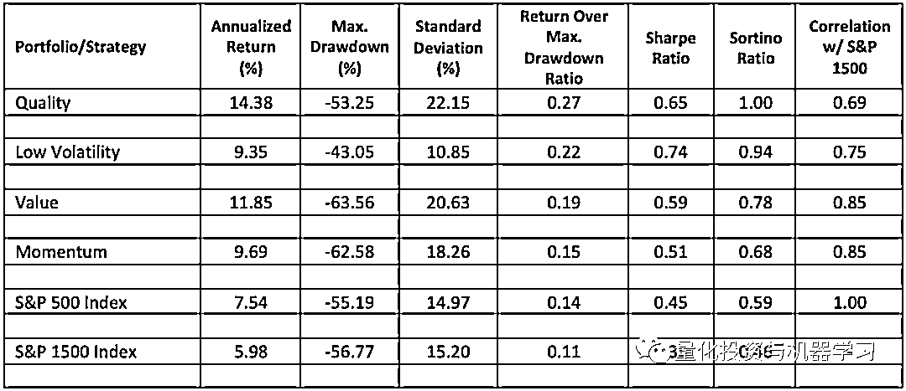
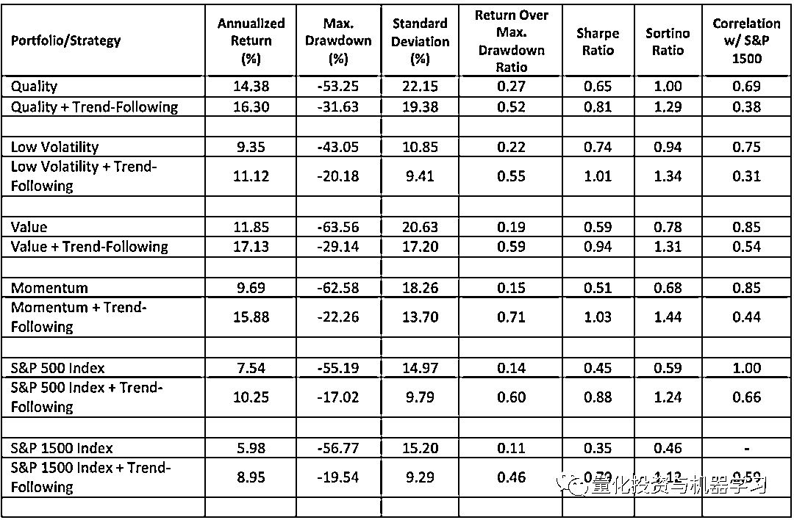
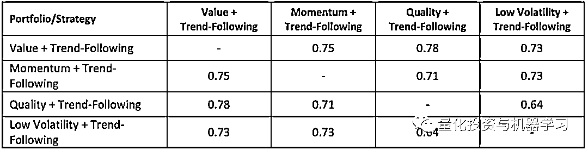
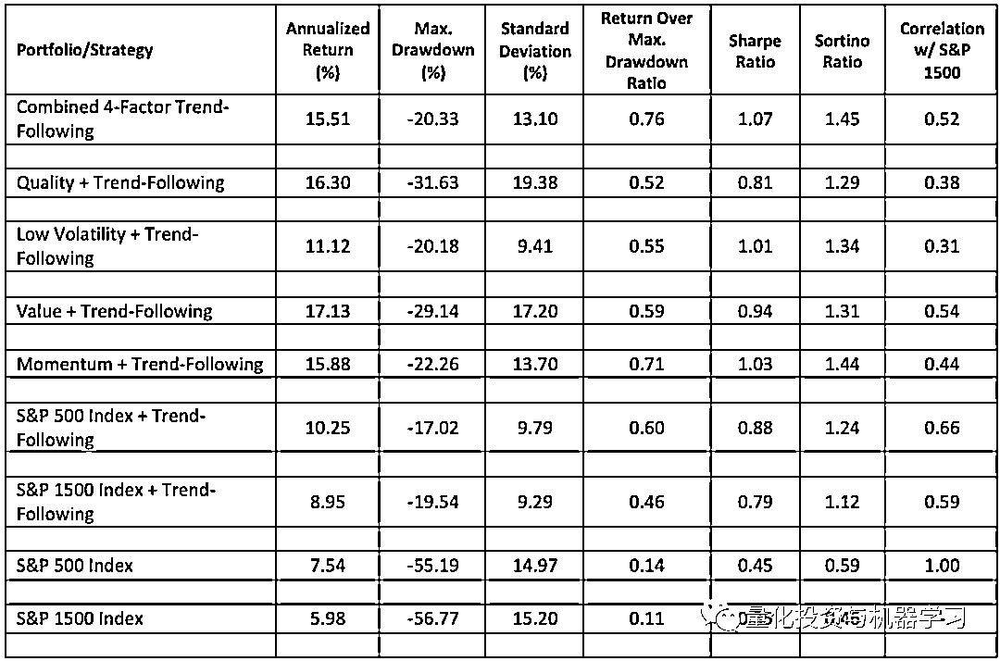
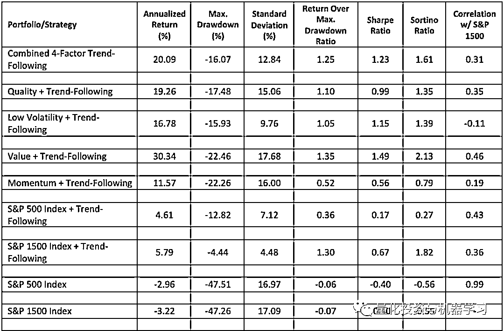
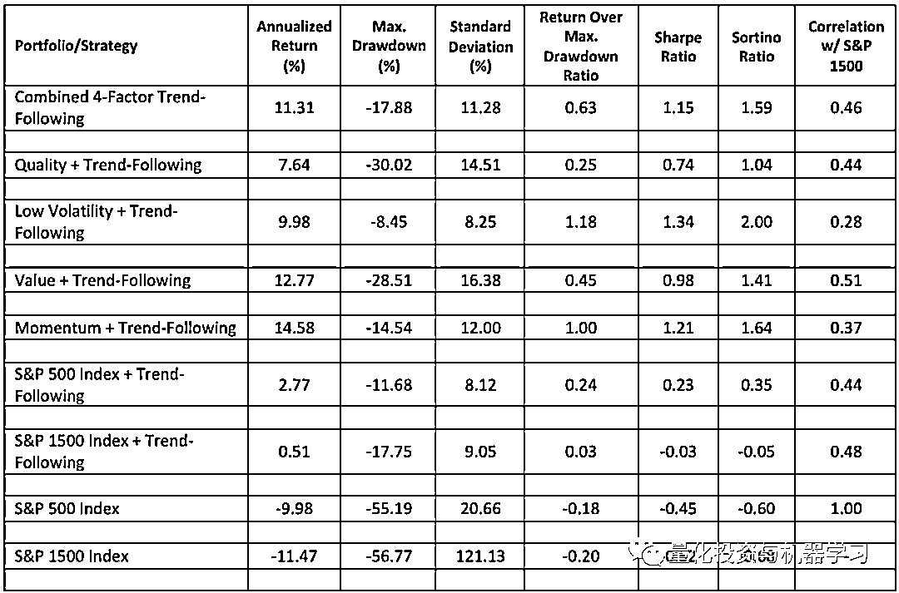
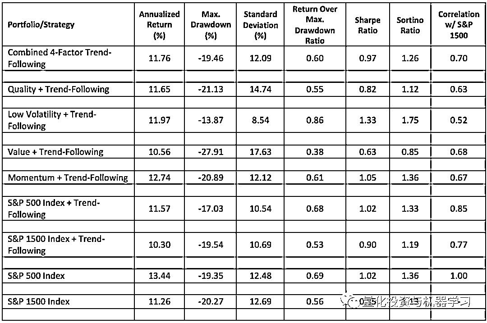

# 获取更稳健的收益：趋势策略与因子选股的结合

> 原文：[`mp.weixin.qq.com/s?__biz=MzAxNTc0Mjg0Mg==&mid=2653322897&idx=1&sn=b48de907eef6a7e16f8694c859b3bf9a&chksm=802dbc84b75a35922e2cb5daaaff9677309ba1876eccf357b069fccf6f99ed769b0c2c1938d6&scene=27#wechat_redirect`](http://mp.weixin.qq.com/s?__biz=MzAxNTc0Mjg0Mg==&mid=2653322897&idx=1&sn=b48de907eef6a7e16f8694c859b3bf9a&chksm=802dbc84b75a35922e2cb5daaaff9677309ba1876eccf357b069fccf6f99ed769b0c2c1938d6&scene=27#wechat_redirect)

# 

量化投资与机器学习微信公众号，是业内垂直于**量化投资、对冲基金、Fintech、人工智能、大数据**等领域的主流自媒体。公众号拥有来自**公募、私募、券商、期货、银行、保险、高校**等行业**30W+**关注者，连续 2 年被腾讯云+社区评选为“年度最佳作者”。

作者：Mark E. Ricardo   编译：1+1=6

**前言**

为了追求长期的超额收益，投资者们经常结合使用进攻和防守的策略。其中进攻端一般采用质量、价值、动量及低波动的因子以获取长期优于市场的回报。但是这些策略一般都具有较大的波动和回撤，这对于风险偏好较谨慎的投资者很难接受。 

**然后，将基于这些因子的策略与防守为主的多指标趋势跟踪策略结合，可以显著的降低风险，提供更稳定的风险调整后收益。**

像任何一支伟大的运动队一样，投资者需要打好进攻和防守才能获胜。通过结合基于因子的选股的进攻策略和多指标趋势跟踪的防御策略，投资者可以做到这一点。这种组合策略的目标是通过优质的股票选择产生长期优于市场的回报，同时通过使用强劲的趋势跟踪策略显著降低下行风险。

在本文中，我将演示如何将这种以防守为中心的趋势跟踪策略与以进攻为中心的基于因子的股票选择模型相结合，例如那些基于质量、价值、动量或低波动性的模型，可以产生更好的长期表现。

**单因子选股策略**

基于因子的选股模型是一种系统性的投资策略，根据某些关键特征或因子选择个股，这些特征或因子已被证明能够产生卓越的长期投资业绩。根据我自己以及更广泛的金融学术界的研究，最重要的因子是那些基于股票价值、势头、质量或波动性的因子。出于本文的目的，我将这些因子分别定义如下:

*   **Value** = free cash flow yield (i.e., trailing 12-month free cash flow/enterprise value)

*   **Momentum** = trailing 12-month price return

*   **Quality** = profitability as measured by gross profit-to-assets ratio (i.e., gross profit/total assets)

*   **Volatility** = trailing 2-year standard deviation of monthly returns

为了证明每个因子的有效性，我创建了由标普 1500 指数中特定因子暴露程度最高的 100 只股票组成的单因子组合。例如，价值投资组合是由标准普尔 1500 综合指数中自由现金流收益率最高的 100 只股票组成的。动量投资组合由过去 12 个月价格回报最高的 100 只股票组成。优质投资组合由毛利与总资产比率最高的 100 只股票组成。而低波动率投资组合是由 100 只过去两年标准差最低的股票组成的。此外，每个投资组合中的股票的权重是相等的，每个投资组合每年都要进行再平衡和重组。

如图 1 所示，基于过去 22 年的年化回报率，每个因子组合在都大大超过了标普 500 和标普综合 1500 股指。在风险调整的基础上，每个因子组合的表现也优于两个股票市场指数。然而，尽管表现突出，但所有的因子组合在这一时期也都经历了显著的下降，只有质量和低波动率组合的最大下降幅度低于两个市场指数。此外，除低波动率投资组合外，各因子投资组合也比各市场指数波动更大，从其较高的标准差可以看出。因此，尽管它们的绝对表现优于市场和经风险调整后的表现，但每种因子策略带来的高波动性和/或大幅下跌表明，许多投资者可能难以实现这样的结果。

图 1 单因子组合收益与市场指数对比

幸运的是，通过应用多指标趋势跟踪策略作为每个因子组合的叠加，可以显著降低与每个因子策略相关的风险。

**多指标趋势跟踪策略**

**多指标趋势跟踪策略结合了长短期移动平均线、波动率和时间序列市场时机指标来决定什么时候投资股票，什么时候不投资股票。**从操作上讲，当当前的市场趋势表明持有股票的风险很高时，这种趋势跟踪策略试图通过将投资组合从股票中转移到现金或政府债券等更安全的资产中来降低投资组合的风险。当当前的市场趋势表明持有股票的风险适中或较低时，它还寻求将投资组合主要投资于股票。**我们将多指标趋势跟踪策略应用于每个因子投资组合。**我还选择了一个中期政府债券基金，而不是现金，作为每个因子策略的对冲资产。

**趋势跟踪与因子选股的结合**

从图 2 中可以看出，在过去的 22 年里，将这种多指标趋势跟踪策略应用于各因子组合，显著提高了各因子策略的绝对收益和经风险调整后的收益。每个趋势跟踪因子投资组合不仅比其未对冲的版本有更高的年化回报，而且他们还实现了这种更高的回报，大大降低了波动性和最大回撤。

图 2 趋势跟踪的单因子策略、未对冲的单因子策略以及有无趋势跟踪的标普 500 和标普综合 1500 指数的对比(8/1/1999 - 8/1/2021)

与趋势跟踪和买入并持有市场指数组合相比，趋势跟踪的因子组合也能产生更好的年化回报。在经风险调整的基础上，它们的表现也优于市场指数组合，这可以从它们较高的索蒂诺比率(Sortino Ratio)看出。但是，与两个市场指数趋势跟踪组合相比，每个趋势跟踪因子组合的最大跌幅都更大。除低波动率趋势跟踪策略外，趋势跟踪因子策略的波动也更大。然而，对于愿意接受较高的投资组合波动率和下行风险水平的投资者，趋势跟踪因子策略明显优于两种市场指数趋势跟踪策略。

如图 3 所示，趋势跟踪因子策略之间相关性表明，由四个趋势跟踪因子组合平均配置而成的组合策略，与任何单一趋势跟踪因子策略相比，可以产生显著更好的风险调整绩效。

图 3 趋势跟踪单因子策略的相关性

图 4 详细分析了这种组合趋势跟踪因子策略与每个单因子趋势跟踪策略和两个市场指数趋势跟踪策略的相对长期表现。这里你可以看到，在 7 个组合中，合并的 4 因子趋势跟踪组合产生了第 4 高的年化收益率(即 15.51%)，第 4 低的最大回撤(即-20.33%)和第 4 低的波动率(即 13.10%的标准差)。然而，尽管在上述统计数据中没有排名第一，但 4 因子趋势跟踪组合的夏普比率最高。

图 4 组合趋势跟踪单因子策略与趋势跟踪单因子策略对比

此外，如图 5-8 所示，在最近的三个市场危机时期以及金融危机后的牛市期间，组合 4 因子趋势跟踪策略产生了最一致的绝对和风险调整后的表现。尽管合并的 4 因子趋势跟踪策略的表现在任何一个时期都没有排在第一位，但在这些牛市和熊市期间，其持续的中期至上半绝对和风险调整的表现表明，它是应对多种市场环境的最佳策略。因此，与任何单一策略相比，通过将多个趋势跟踪因子策略组合到一个组合中，投资者更有可能获得显著更好的长期、绝对和风险调整表现。

图 5 组合趋势跟踪单因子策略与趋势跟踪单因子策略对比（2000/01/03-2004/01/03）

图 6 组合趋势跟踪单因子策略与趋势跟踪单因子策略对比（2007/01/07-2010/01/07）

图 7 组合趋势跟踪单因子策略与趋势跟踪单因子策略对比（2020/01/01-2021/01/01）

图 8 组合趋势跟踪单因子策略与趋势跟踪单因子策略对比（2010/01/01-2020/01/01）

**总结**

一种以进攻为导向的投资策略，投资于具有显著质量、价值、动量或低波动因子优势的股票，是产生长期超过市场回报的极好方法。不幸的是，这些基于因子的策略可能是不稳定的，并受制于大量的提款，这可能使它们不适合风险偏好的投资者。然而，将基于因子的选股与以防御为重点的多指标趋势跟踪策略相结合，作为投资组合叠加，投资者可以显著降低这种选股方式的风险，并获得更好的长期绝对收益和风险调整后的收益。为了获得最佳的长期、经风险调整后的表现，投资者应该考虑将多种趋势跟踪因子策略组合成一个投资组合。