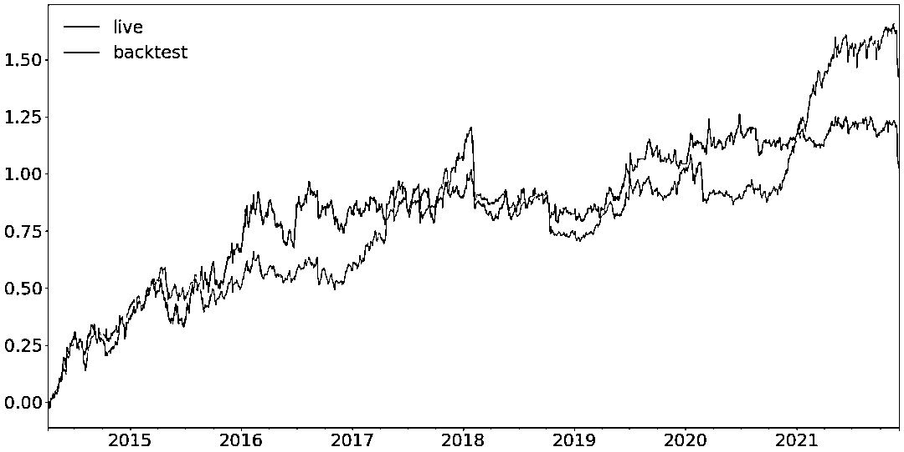

# 我的交易系统

> 原文：[`mp.weixin.qq.com/s?__biz=MzAxNTc0Mjg0Mg==&mid=2653322871&idx=1&sn=30fdf497ca337cfcc15787dc816c1184&chksm=802dbc62b75a3574e2d2be9a4ac521803ab9708035f57d970fcfd1cc5be32b4175dbbdfa9070&scene=27#wechat_redirect`](http://mp.weixin.qq.com/s?__biz=MzAxNTc0Mjg0Mg==&mid=2653322871&idx=1&sn=30fdf497ca337cfcc15787dc816c1184&chksm=802dbc62b75a3574e2d2be9a4ac521803ab9708035f57d970fcfd1cc5be32b4175dbbdfa9070&scene=27#wechat_redirect)

# 

量化投资与机器学习微信公众号，是业内垂直于**量化投资、对冲基金、Fintech、人工智能、大数据**等领域的主流自媒体。公众号拥有来自**公募、私募、券商、期货、银行、保险、高校**等行业**30W+**关注者，连续 2 年被腾讯云+社区评选为“年度最佳作者”。

**前言**

Robert Carver 是一位 CTA 策略研究与实战领域活跃的分享者，他的书 Systematic Trading 清晰且系统的介绍了如何构建一套多品种多周期的 CTA 交易系统。知乎上有小伙伴分享了系统的读书笔记：

*https://zhuanlan.zhihu.com/p/26584986*

除了书本之外，他还在个人博客不断的更新他在 CTA 实践过程中的心得。他的所有分享都配有代码，且在 github 上有开源的项目 pysystemtrade。

**最近 Robert Carver 在个人博客对其 2021 年的研究及过去在博客发表的文章做了系统化的总结，公布了其正在使用的交易系统，涉及从品种的筛选到具体的交易规则。**这篇文章中，作者大量链接了过往的文章，如果需要对系统化的掌握 Robert Carver 的研究，推荐直接阅读原文：

*https://qoppac.blogspot.com/2021/12/my-trading-system.html*

接下来，我们简要总结下本文值得关注的地方。

**研究踩坑：哪些可以做，哪些不可以做**

我从 2013 年到 2021 一直在使用这套交易系统，并且在 2020 年把策略的执行切换到了 pysystemtrade（作者的开源框架）。一个月前，我对这套系统做了一个很大的升级，并投入到了实盘中。在这之后，我有这样一个机会来回顾我过去三年时间的研究，以及这些研究中最终哪些部分值得放入到我现在使用的新系统中。

以下是一些我知道无效的方法，但还是有人推荐我去尝试的：

*   Discrete trading / expanding stop losses 

*   Fixed vol targeting 

*   Binary forecasts 

*   Using a fixed estimate of vol 

以下是一些我原本觉得有效，但实际研究出来无效的尝试：

*   Heuristic dynamic optimisation 

*   Dynamic optimisation using a grid search

以下方法确实有效，但我不准备应用在实盘中：

*   Fitting forecast weight by instrument and asset class (too complex!)

*   Setting risk using drawdown levels (too simple!)

*   A risk overlay (actually was in my old system, but not yet in my new system - a change I plan to make soon)

*   Kurtosis as a trading rule (too complex and didn't work as well as expected)

以下方法确实有效，且已经应用在了今年的交易系统改进中：

*   Dynamic optimisation using minimum tracking error (here and here)

*   A systematic method for choosing instruments to trade or not

*   Changing behaviour of rules when vol changes

*   Handcrafting in it's automated variant

*   Improving handcrafting correlation estimate adjustments and Sharpe Ratio estimate adjustments

*   Estimating vol using a partially mean reverting method

*   Skew as a trading rule

*   Various other trading rules (no blog posts - read the book I'm currently writing and hope will come out next year!)

在经过了今年的调整后，在接下来我不准备再对当前的系统做过多的调整。我准备尝试一些完全不同的策略。接下来我们从不同的角度来分享当前的系统。

**如何选择交易的标的/市场？**

关于这个问题，我之前也写过一些文章，现在我总结性的概括一下我筛选标的/市场的流程：

*   阶段性的关注下经纪商（盈透）现在可供交易的品种；

*   维护一个关注品种的清单 (当前清单中有 64 个品种)；

*   从 barchart.com 提取历史数据，并加入到当前的交易系统。

回测时会忽略以下标的：

*   已经在列表中的标的，但只是合约大小不一下（比如 SP500 emini 和 micro）; 但如果是不同市场交易的同一种合约或标的，是可以进一步测试的；

*   数据质量与数据源不稳定的标的；

*   合约头寸太贵的品种，或者交易成本太高的品种。

实盘交易时，会忽略以下标的：

*   法律限制，我无法交易的市场；

*   没有达到我对于成本和流动性考量的市场。

**我使用的交易策略规则**

我当前使用的交易策略分为趋势跟踪和非趋势跟踪两大类，其中趋势跟踪的策略包括（关于策略具体逻辑请参考原文）：

*   时序动量-EWMAC

*   突破

*   截面动量

*   大类资产动量

*   标准化动量

*   动量加速

非趋势策略包括：

*   大类资产内的慢速均值回归策略

*   Carry 

*   相对 Carry

*   偏度套利

*   相对价值偏度

*   Mean reversion in the wings

其中有些策略，并没有在博客中提到，但会在我明年（2022 年圣诞）的新书中给大家分享。所有策略的代码可以在 pysystemtrade 中找到。

**其他**

关于仓位的确定：每个品种的仓位通过 Partially Mean Reverting 的方法进行确定，在波动率的选取上使用波动加权的方法：近期波动的 30%加上 10 年波动的 30%。

此时，我可能会列出 100 多个品种的最佳头寸。但其中绝大多数都少于一份合约，因此不可交易，而且我的账户里也没有数千万美元我需要在所有这些工具中保持合理的头寸。**今年我的系统最大的变化是引入了一个动态优化系统**，这意味着我不会真的会交易 100+的品种！通过动态组合优化的研究，我发现跟踪误差最小的投资组合是最优投资组合，我在这些品种上采用整数合约头寸。

关于动态组合仓位的优化，可以关注，公众号也会在近期进行解读和分享：

*https://qoppac.blogspot.com/2021/10/mr-greedy-and-tale-of-minimum-tracking.html*

最后上一张作者实盘会回测对比的收益图：

强烈建议大家阅读原文，公众号后续也会对其中有显著价值的文章进行分享。