# 新财富『金融工程』：  从倒数第一到第一

> 原文：[`mp.weixin.qq.com/s?__biz=MzAxNTc0Mjg0Mg==&mid=2653322384&idx=1&sn=499b1b2ee226349e956d6e26343d6d3c&chksm=802dbe85b75a37930841fad7b3ecad97eafc8067c4b3a55033efe6d9f5b390cb2422717cc0c5&scene=27#wechat_redirect`](http://mp.weixin.qq.com/s?__biz=MzAxNTc0Mjg0Mg==&mid=2653322384&idx=1&sn=499b1b2ee226349e956d6e26343d6d3c&chksm=802dbe85b75a37930841fad7b3ecad97eafc8067c4b3a55033efe6d9f5b390cb2422717cc0c5&scene=27#wechat_redirect)

# 

量化投资与机器学习微信公众号，是业内垂直于**量化投资、对冲基金、Fintech、人工智能、大数据**等领域的主流自媒体。公众号拥有来自**公募、私募、券商、期货、银行、保险、高校**等行业 3**0W+**关注者，连续 2 年被腾讯云+社区评选为“年度最佳作者”。

**回顾 2020**

2020 年第十八届新财富最佳分析师大会上，有一张图刷屏朋友圈：

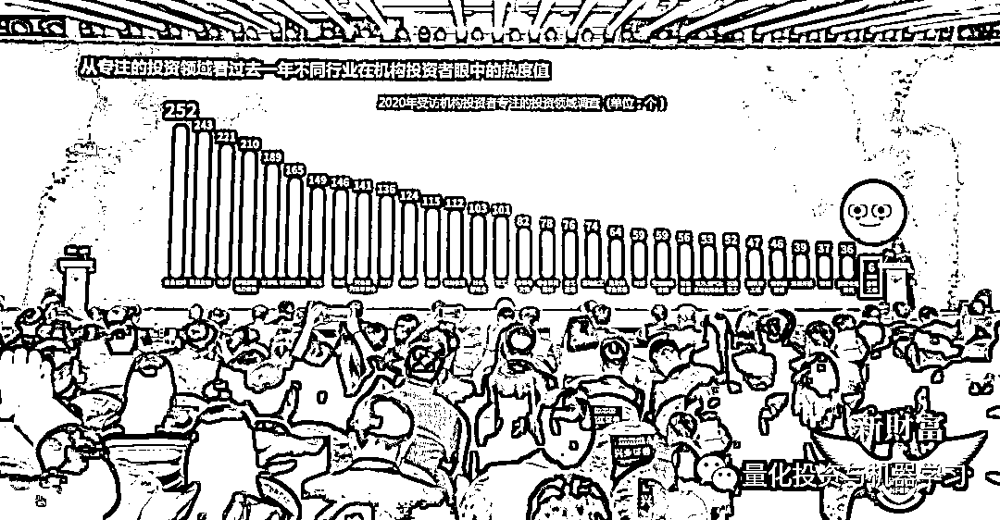

来个放大版：

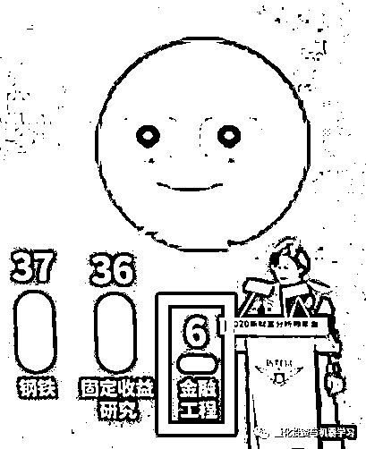

**2021 实况**

在今年的参选中，**金融工程参评报名人数竟然是最多的！**

**许多排名中小券商也开始重视金融工程团队，比如开源证券、德邦证券和国元证券都在近几年发力，组建金工团队。**

**同时也有一个有趣的现象：很多团队都是集体带队跳槽去了另外一家券商的金融工程部门。**

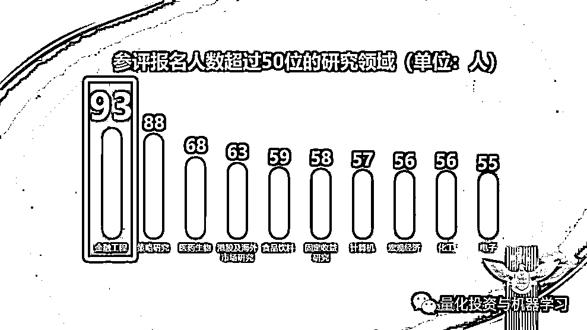

**『金融工程』评选结果**

量化投资与机器学习公众号每年都会报道新财富的评选情况，主要是针对**金融工程**这块，因为与 Quant 最密切。 

在刚刚结束的 2021 第十九届新财富最佳分析师评选中，长江证券、广发证券、国盛证券、国信证券、海通证券、申万宏源证券、招商证券成功入围。

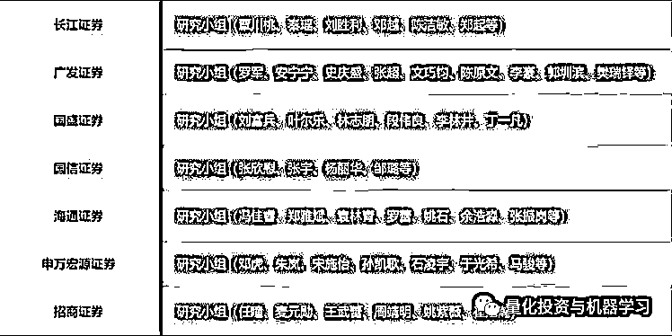

另外，**由于每家券商对新财富有不同的考核标准，部分券商没有参与新财富的评选**。所以榜单里面可能少了几家大家熟悉的面孔。

在最后的评选中，**国盛证券、招商证券、广发证券、长江证券、国信证券**获得了本年度金融工程组的前五名。希望**海通证券、申万宏源证券**明年再接再厉！

富兵总带领的国盛证券也是继续蝉联榜单第一名，总分高达**36000**多分！

同时，富兵总因多年蝉联第一名，被评选为新财富白金分析师：

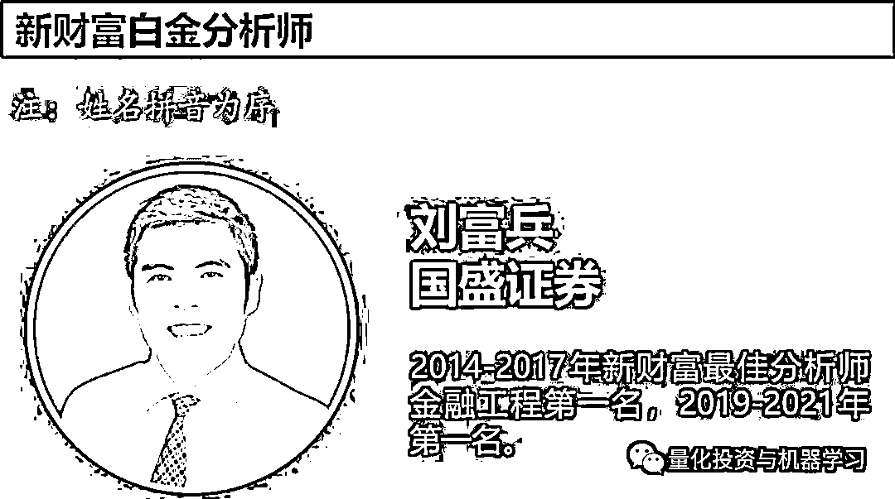

**2021 年值得关注的券商金工研报**

我们通过第三方平台慧博的数据来看看。筛选的日期从**2021 年 1 月 1 日—2021 年 12 月 23 日**。

**免责声明：**以下所引述机构或个人的观点、言论、数据及其他信息仅作参考和资讯传播之目的，不代表公众号赞同其观点或证实其描述。

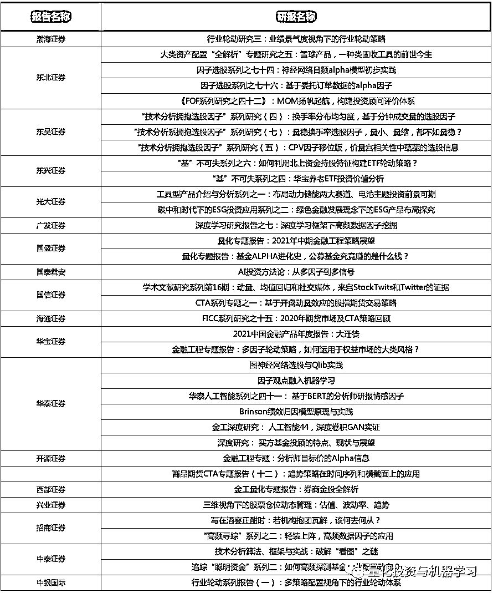

*按机构首字母排序

**历届新财富「**金融工程**」榜单**

**2013 年**

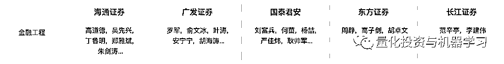

**2014 年**

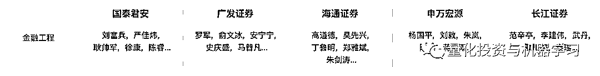

**2015 年**

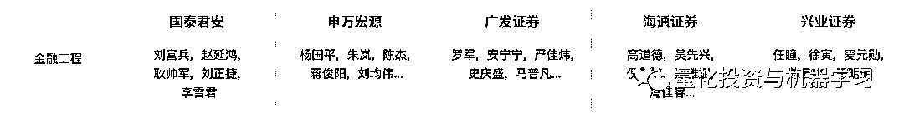

**2016 年**

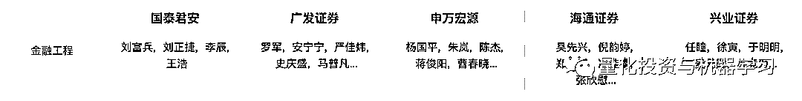

**2017 年**

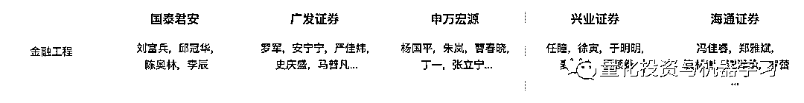

**2018 年**

因为大家都知道的原因没有举办。 

**2019 年**

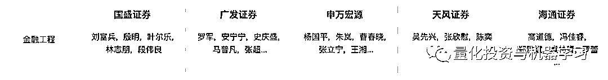

**2020 年**

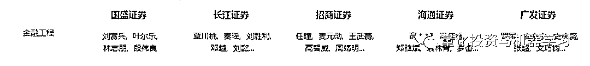