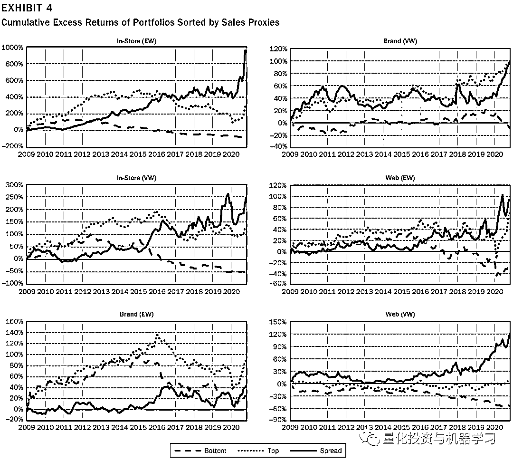
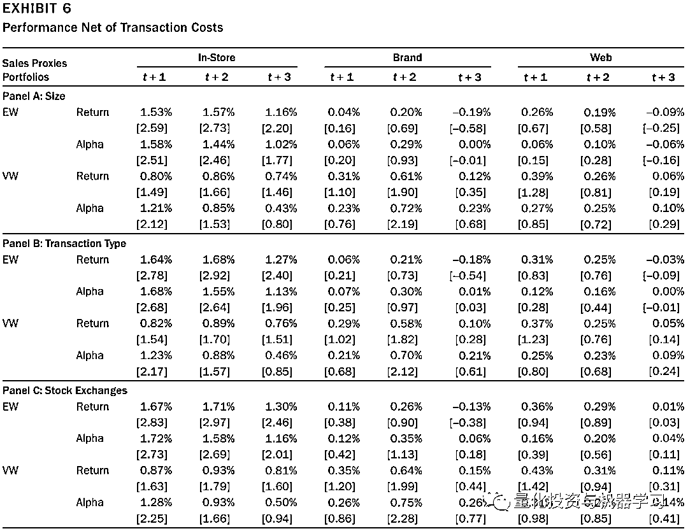

# 另类因子：消费者行为数据与公司业绩及股票收益

> 原文：[`mp.weixin.qq.com/s?__biz=MzAxNTc0Mjg0Mg==&mid=2653322222&idx=1&sn=0cb70d621fe03686fc26597e6e0c7245&chksm=802db9fbb75a30ed24c4394d25d28f6a19641e9f5cf3891fc21796157e8cd47d298664bb286e&scene=27#wechat_redirect`](http://mp.weixin.qq.com/s?__biz=MzAxNTc0Mjg0Mg==&mid=2653322222&idx=1&sn=0cb70d621fe03686fc26597e6e0c7245&chksm=802db9fbb75a30ed24c4394d25d28f6a19641e9f5cf3891fc21796157e8cd47d298664bb286e&scene=27#wechat_redirect)

# 

量化投资与机器学习微信公众号，是业内垂直于**量化投资、对冲基金、Fintech、人工智能、大数据**等领域的主流自媒体。公众号拥有来自**公募、私募、券商、期货、银行、保险、高校**等行业**20W+**关注者，连续 2 年被腾讯云+社区评选为“年度最佳作者”。

# 

量化投资与机器学习公众号独家解读

量化投资与机器学公众号 *** ***QIML Insight——深度研读系列 ******是公众号今年全力打造的一档**深度、前沿、高水准**栏目。

公众号**遴选**了各大期刊前沿论文，按照理解和提炼的方式为读者呈现每篇论文最精华的部分。QIML 希望大家能够读到可以成长的量化文章，愿与你共同进步！

> **本期遴选论文** **来源：**The Journal of Portfolio Management February 2022
> **标题：**Predicting Performance Using Consumer Big Data
> **作者：**Kenneth Froot, Namho Kang, Gideon Ozik, Ronnie Sadka

**前言**

在这篇文章中，我们研究了大数据预测公司基本面和股票收益的能力。Froot et al.(2017)使用了大约 60 家公司的**店内销售信息**，而我们整合了不同的数据源，使用了覆盖 330 家公司的另外两种类型的信息——**网络流量和品牌知名度**。我们研究这三种类型（店内销售信息、网络流量及品牌知名度）的信息是否被有效地纳入资产定价中，这对学者和从业人员来说都是一个有意义的问题，特别是当他们试图理解哪种类型的数据应该得到更多的关注时，因为现在有大量可供选择的数据。

**数据源**

作者使用由研究公司 MKT MediaStats, LLC 收集的多个专有来源的底层数据来构建本文使用的以下指标：

**IN-STORE：**线下店铺到店人数，IN-STORE 衡量零售商店的消费者活动。**具体来说，它通过搜索到商店位置的行车路线、查询商店营业时间或下载折扣券等活动来估计消费者访问或在零售商店购物的意愿。**零售商店的这些消费者活动是从各种来源收集的，包括数以百万计的消费者设备。IN-STORE 只衡量那些收入主要来自实体零售店的大型零售商。它不包括电子商务企业或其他类型的零售商，如电信公司或餐馆。因此，IN-STORE 仅涵盖 66 家零售公司。

**WEB：**线上网站（包括所有相关网站）访问人数。访问被定义为访问样本公司网站的人数。有些公司有多个不同品牌的网站。例如，TripAdvisor 运营着 TripAdvisor 品牌网站，包括美国的 tripadvisor.com。它还管理和运营其他 23 家媒体品牌网站，提供旅游行业的旅游规划资源，如 airfarewatchdog.com、citymaps.com、cruisecritic.com、flipkey.com、gateguru.com、housetrip.com 和 viator.com。在 WEB 中，我们试图通过在线访问来估计与公司相关的整体消费者活动。因此，以 TripAdvisor 为例，WEB 对总活动的估计是这些品牌网站活动的总和。我们的 WEB 数据样本包括来自不同行业部门的 312 家公司，包括大型零售商、在线零售商、餐馆、酒店和娱乐。

**BRAND：**品牌知名度 BRAND 评估消费者对产品品牌名称的兴趣程度。与 WEB 不同的是，WEB 通过企业网站访问量来评估消费者的活动，**而 BRAND 则是通过消费者搜索和社交媒体活动来获取样本公司产品和品牌名称。**样本由不同行业的 250 家公司组成，然后根据公司内部品牌进行汇总。

作者定义了两种不同周期的代理指标，一个衡量季度销售活动，另一个衡量月度销售活动。季度代理指标计算当前季度相对过去四个季度平均值得增长度。月度代理指标计算的增长率估计消费者活动在最近的三个月期间的平均相对过去的 12 个月均值的增长率。增长率是用对数差来计算的。

**数据覆盖度**

数据覆盖了 2009-2020 年美股市场的 331 家上市公司，其中包括 178 家消费板块、47 家金融板块及 29 家信息技术板块，还有剩下 77 家公司来自医疗健康、房地产、通信及建筑材料板块。这些上市公司的基本面数据来自 CRSP，行情数据来自 Compustat，分析师一致预期数据来自 IBES。

表 1 中，A 部分给出了从数量、销售额及市值维度的数据覆盖度。其中所覆盖公司占所有美股上市公司的 7%，销售额占 33.1%，市值占 45.9%。B 部分给出了不同代理指标的统计值，而 C 部分给出了指标之前的相关性，其中除了本文研究的三个代理指标，还加入了如 Size、Mom 及 BE/ME 指标。

**预测公司基本面财务数据**

表 2 检验了销售代理对公司基本面的预测能力。具体来说，面板 A、B、C 和 D 分别显示了销售代理与收入增长、标准化意外收入(SUR)、标准化意外收入(SUE)和分析师预测误差(AFE)的回归结果。收入增长是公司 i 在财政季度 t 时季度收入增长的百分比。

Panel A 显示，这三个指标都与公司的收入增长显著相关。三种指标的系数均为正且非常显著。对于 BRAND 和 WEB 来说，销售代理和收入增长之间的关联对于消费行业的公司来说要强得多。例如，BRAND 的 R2 在整个样本中为 6.4%(模型 3)，而在消费行业中为 18.3%(模型 5)。然而，WEB 的 R2 比其他代理的 R2 小得多，说明 WEB 与收入增长之间的关系要弱得多。

Panel B 和 C 检验销售代理与 SUR 和 SUE 的关系，收入和收益增长的意外部分。虽然三种代理均与 SUR 和 SUE 显著相关，但 WEB 的系数和 R2 倾向于比其他代理更显著。例如，在 Panel B 中，WEB 上的 SUR 的回归(模型 7)的系数为 0.461 (t 值为 8.96)，R2 为 0.9%，表明 WEB 的一个标准差的变化导致 SUR 的变化对应其标准差的 46%。模型的系数 t 值和 R2 值均大于其他代理对应模型的值。结果还显示，BRAND 和 WEB 中包含的信息对消费者企业更相关。例如，在 Panel C 中，虽然 BRAND 在使用整个样本时与 SUE 没有显著相关(模型 3 和 4)，但模型 5 和 6 中的消费者行业子样本结果表明，BRAND 也包含了关于消费者公司的意外收益增长的显著信息。

Panel D 显示销售代理也与 AFE 有显著的关联。与 SUE 结果相似，使用 BRAND 和 WEB 的预测对于消费部门的公司更强。例如，BRAND 的一个标准偏差的变化与 AFE 的大约 6%的标准偏差相关(模型 3)。对于消费行业，其幅度增加到大约 27%的标准偏差的变化(模型 5)。

**预测股票收益**

在表 3 中，我们分析了基于销售代理构建的投资组合策略。为了简单起见，我们将重点放在消费行业子样本上，因为前面的分析表明，销售代理中的信息对消费行业的公司更相关。

我们根据每个日历时间的销售代理，在每个日历月构建投资组合。具体来说，t 月的销售代理是根据过去 12 个月期间最近 3 个月期间的消费者活动增长率估算出来的。以 t 月的销售代理为基础形成五等分组合，计算 t + 1、t + 2、t + 3 个月组合的平均超额收益率。使用 Fama-French 六个因子(Fama-French 3、RMW、CMA 和 Momentum)计算多空投资组合的 alpha 值 Panel A 显示等权投资组合的结果，Panel B 是市值权重投资组合的结果。

Panel A 显示 IN-STORE 显著预测了形成期后三个月的等权重投资组合回报。多空投资组合回报和 alpha 不仅在统计上是显著的，而且在经济上也是相当可观的。例如，IN-STORE 多空组合在 t + 1 月和 t + 2 月的平均回报率约为 1.9%(每年分别为 22.7%和 23.2%)。相反，BRAND 和 WEB 上形成的投资组合在 t + 1 个月没有提供强劲的回报。然而，BRAND 的多空组合在 t+2 提供了一个显著的 alpha。没有一个 WEB 投资组合在任何传统水平上显示出重要意义。**这些结果表明，WEB 中的信息很可能会被迅速传播，而 BRAND 中的信息则会被延迟地纳入价格中。**

Panel B 显示，当使用市值加权方法时，使用 BRAND 和 WEB 的投资组合结果通常更强。与等权的投资组合结果类似，IN-STORE 市值加权的投资组合在三个月内提供显著的正回报。然而，与 Panel A 不同，BRAND 强烈预测 t+1 和 t+2 月份的投资组合回报。例如，BRAND 的多空组合提供了显著的正收益，在 t + 1 月约为 0.5%(每年 6.5%)，在 t + 2 月约为 0.8%(每年 10.0%)。在 WEB 上构建的市值加权投资组合也在 t + 1 月产生了显著的回报。这些结果表明，**BRAND 和 WEB 中的信息可能对预测大公司的收益更有用，表明消费者的在线活动，无论是访问网站还是表达对公司品牌的兴趣，与大公司的销售更相关。**图 4 给出了多空收益曲线，其中红线为多头，蓝线为空头，黑线为多空组合的净值曲线。

表 6 估计了 t + 1、t + 2 和 t +3 个月的平均收益和多空组合扣除 Fama-French 六因子及交易成本之后的 Alpha。如表 3 所示，我们关注消费行业样本。Panel A、B 和 C 使用三种不同的交易成本估算，即分别是规模、类型和交易，参考 Frazzini, Israel, and Moskowitz (2015)。

图表显示，基于 IN-STORE 的投资组合的平均收益和 alpha，在扣除交易成本后，在 t + 1 和 t + 2 月份显著为正，并且对不同的交易成本估计是稳健的。例如，Panel A 显示，当执行成本基于公司规模估计时，t + 1 月的等权重 IN-STORE 投资组合产生 1.58%的 alpha (t 值为 2.51)。此外，BRAND 的价值加权组合为 t + 2 月提供显著的正回报和 alpha，对不同的交易成本估计都很稳健。总的来说，结果表明，销售代理指标是可以获取超额收益的。

**总结**

我们的分析表明，所有三个代理都预测了公司的(未预期的)收入增长和收益，这表明该指标包含了公司基本面的价值相关信息。然而，每个销售代理中的信息内容反映了不同方面的基本面。店内和品牌是收入增长的重要预测因素，而 WEB 提供了相对强劲的盈利预测。此外，对消费行业公司的预测也明显增强。

销售代理在预测投资组合回报方面也很有用。然而，在预测公司收益方面，WEB 要比 IN-STORE 和 BRAND 弱得多。与 IN-STORE 和 BRAND 相比，这似乎与实时构建 WEB 的速度和易用性是一致的。我们由此推断，WEB 信息被市场消化的速度比店内信息和品牌信息更快。在考虑了交易成本之后，基于销售代理的投资组合策略的盈利能力通常是稳健的。