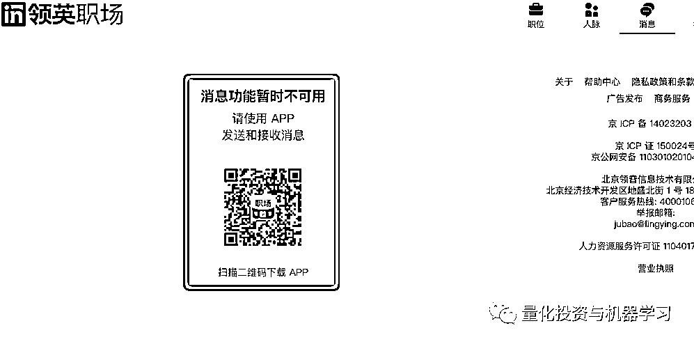

# LinkedIn 领英大改版，量化猎头说：断了他们财路！

> 原文：[`mp.weixin.qq.com/s?__biz=MzAxNTc0Mjg0Mg==&mid=2653322178&idx=1&sn=27ef55fae8c3c5049a6339301e68ebc6&chksm=802db9d7b75a30c13f3a7cdab2db9d35ae6225502456f7db218161ebc1e6c6649b6da46ccc9d&scene=27#wechat_redirect`](http://mp.weixin.qq.com/s?__biz=MzAxNTc0Mjg0Mg==&mid=2653322178&idx=1&sn=27ef55fae8c3c5049a6339301e68ebc6&chksm=802db9d7b75a30c13f3a7cdab2db9d35ae6225502456f7db218161ebc1e6c6649b6da46ccc9d&scene=27#wechat_redirect)

# 

量化投资与机器学习微信公众号，是业内垂直于**量化投资、对冲基金、Fintech、人工智能、大数据**等领域的主流自媒体。公众号拥有来自**公募、私募、券商、期货、银行、保险、高校**等行业**3****0W+**关注者，连续 2 年被腾讯云+社区评选为“年度最佳作者”。

**与其说是“更新”，不如说是“更换”**

****阉割版的 LinkedIn 领英已不再是“一站式职业发展平台”，职场社交功能被直接砍掉，这意味着领英从一个社交招聘软件变成了一个纯粹的求职网站！****

**基本可以卸载了！**

****LinkedIn**领英**这次真的改版了！****

**今年 10 月领英就有传闻说“计划退出中国市场”，这是 10 月 14 日的官微澄清：**

****

**在官网的博客中领英也写到，虽然领英在中国提供职场服务上比较成功，但在社交分享层面没有预期的好，且**中国法律法规环境变得越来越具有“挑战性”**，因此不得不做出调整。**

**近日，大家发现 App 端图标也进行了更新：**

****

**官微也做出了改版后的功能介绍说明：** 

****

****电脑端****也 ****不能发消息了！****

**无法与其他人脉进行自由交流，只限于与已连接的人脉发送消息！**

****

****动态****也 ****没了！****

**现在首页直接是职位信息····**

****

****网址** **也** **变了****

**www.linkedin.com/** 

**变成了**

**www.linkedin.cn/injobs/jobs**

****

****猎头该何去何从？****

**量化圈的人都知道，领英是超多量化猎头的聚集地。公众号也采访了一些深耕量化圈多年的猎头，根据他们反馈：**

**1、现在根本找不到候选人，之前通过一些关键词和人名的搜索可以很快找到信息，现在直接废了！**

**2、很多海外的候选人只会在领英上有自己的个人信息，像国内的 Boss 直聘、猎聘等招聘网站在海外人选这块和领英差距蛮大。**

**3、领英是他们在工作中一个很重要的工具，现在改版后，之前维护的很多内容与候选人都变得可望不可得！**

****4、更有猎头直言说：领英的改版直接断了他们财路！****

****结语****

**中国政府在今年 9 月和 11 月分别实施了《数据安全法》和《个人信息保护法》，要求任何组织尽量减少收集个人数据。**

**改版后的领英要求用户在登录时同意一份“中国隐私政策附录”。该附录提到“领英职场”的服务是通过美国的服务器提供的，这意味着如果用户同意，个人数据将通过“合法的跨境传输机制”发送到海外。**

****

**如此一来，领英在未来的发展之路必定会面临诸多困境，如何破局，让我们拭目以待！******投票，看看民意！**** **/mp/newappmsgvote?action=show&__biz=MzAxNTc0Mjg0Mg==&supervoteid=470228584#wechat_redirect**