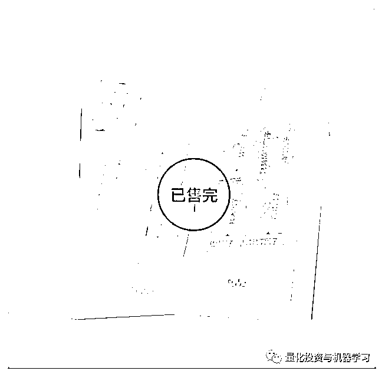
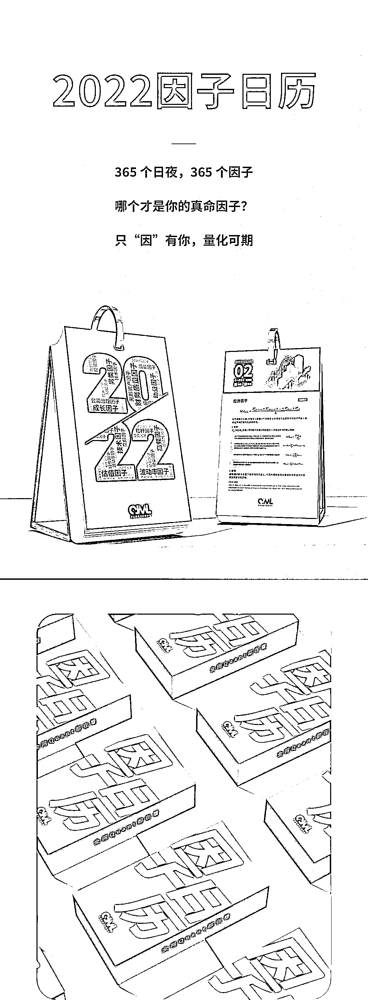
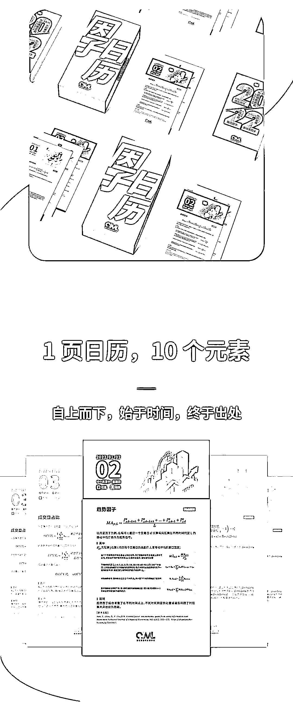
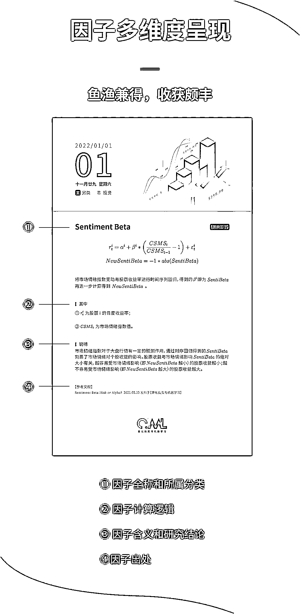
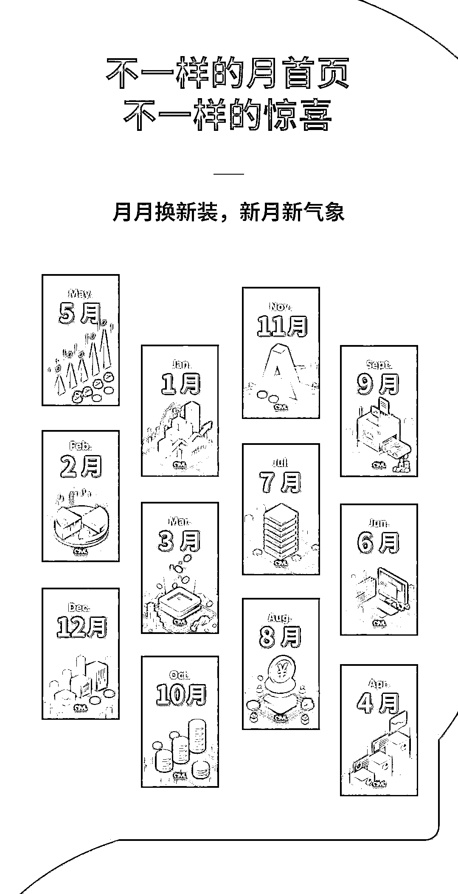
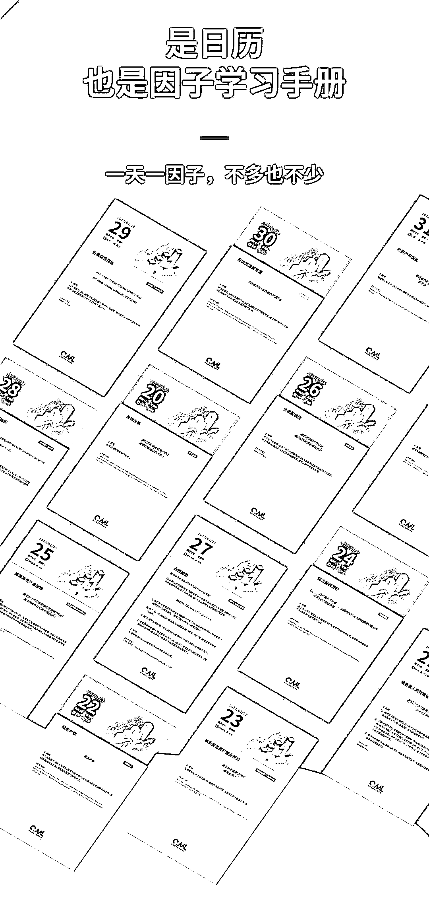
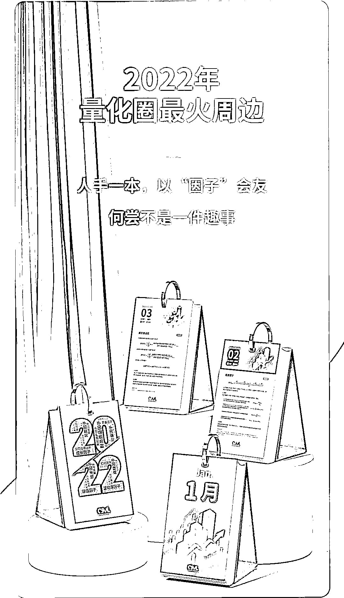

# 售罄！！！

> 原文：[`mp.weixin.qq.com/s?__biz=MzAxNTc0Mjg0Mg==&mid=2653322147&idx=1&sn=ea1303e2a11e1d7cfbd1a00bbe410310&chksm=802db9b6b75a30a07bf0f06b86590a721ae35e3d053f9da5246d796e6e93b9f9c4f80d9cf3a2&scene=27#wechat_redirect`](http://mp.weixin.qq.com/s?__biz=MzAxNTc0Mjg0Mg==&mid=2653322147&idx=1&sn=ea1303e2a11e1d7cfbd1a00bbe410310&chksm=802db9b6b75a30a07bf0f06b86590a721ae35e3d053f9da5246d796e6e93b9f9c4f80d9cf3a2&scene=27#wechat_redirect)

# 

量化投资与机器学习微信公众号，是业内垂直于**量化投资、对冲基金、Fintech、人工智能、大数据**等领域的主流自媒体。公众号拥有来自**公募、私募、券商、期货、银行、保险、高校**等行业**3****0W+**关注者，连续 2 年被腾讯云+社区评选为“年度最佳作者”。

2022 年量化圈最火周边《因子日历》

**全部售罄啦！！！**

谢谢大家对 QIML 的支持与厚爱在这中间有诸多不易还望大家能多多谅解我们会越来越好
2022 年，让 365 个因子伴你度过每一天

