# 五千、万，多吗？

> 原文：[`mp.weixin.qq.com/s?__biz=MzAxNTc0Mjg0Mg==&mid=2653322119&idx=1&sn=9c687bc8cb3c3b479876f55d6b5f7ca6&chksm=802db992b75a30849e4c23b226f4923ff0c77c88a4dd7d0a48cb614835bd4eebaf6183d1d891&scene=27#wechat_redirect`](http://mp.weixin.qq.com/s?__biz=MzAxNTc0Mjg0Mg==&mid=2653322119&idx=1&sn=9c687bc8cb3c3b479876f55d6b5f7ca6&chksm=802db992b75a30849e4c23b226f4923ff0c77c88a4dd7d0a48cb614835bd4eebaf6183d1d891&scene=27#wechat_redirect)

# 

量化投资与机器学习微信公众号，是业内垂直于**量化投资、对冲基金、Fintech、人工智能、大数据**等领域的主流自媒体。公众号拥有来自**公募、私募、券商、期货、银行、保险、高校**等行业**3****0W+**关注者，连续 2 年被腾讯云+社区评选为“年度最佳作者”。

**5000 万，多吗？**

如果这个数据是对个人真实的 Bonus，**是真的多******

在量化投资行业，大多数公司基本工资的上限往往在 25 万至 30 万美元左右，****其中大部分薪酬是以奖金形式支付的****（这个 Bonus 高到天上都不夸张）！

然而，我们还是要看看大家的平均水平，看看下面的数据。

**数据 1 **

让我们看看截止 2021 年 12 月，根据 WSO 最新数据显示，对冲基金行业的薪资平均水平如下：

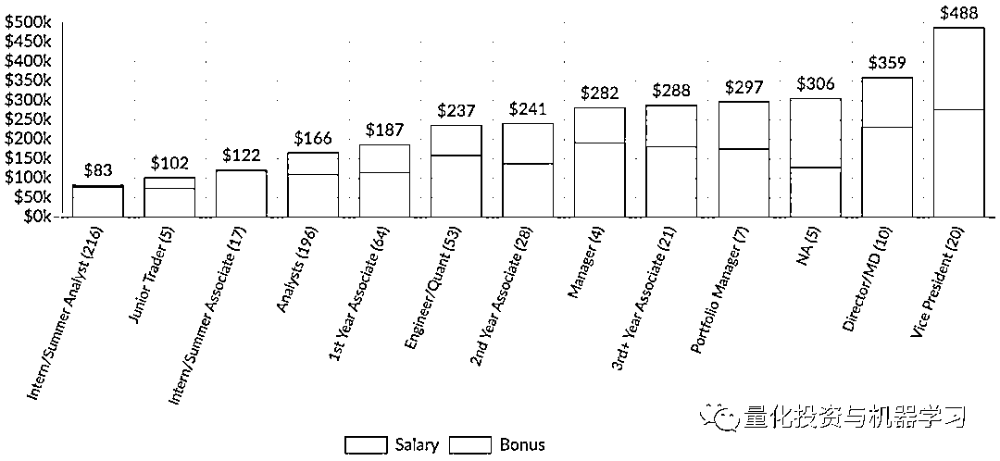

VP 的薪资+Bonus 近 50 万美金，折合人民币 300 多万！当然，这个样本比较少。但是也具有一定参考。

**数据 2 **

根据 2019 年 1 月至今 H1B 申请数据（统计数量为 453 份，不考虑奖金和其他费用）。在这里重点列举了 10 家对冲基金公司。

这 10 家公司的名称是：

*   **Akuna Capital**

*   **Balyasny**

*   **Citadel Asset Management**

*   **Citadel Securities**

*   **DRW**

*   **Hudson River Trading**

*   **Point72**

*   **Quantlab**

*   **Squarepoint**

*   **Two Sigma**

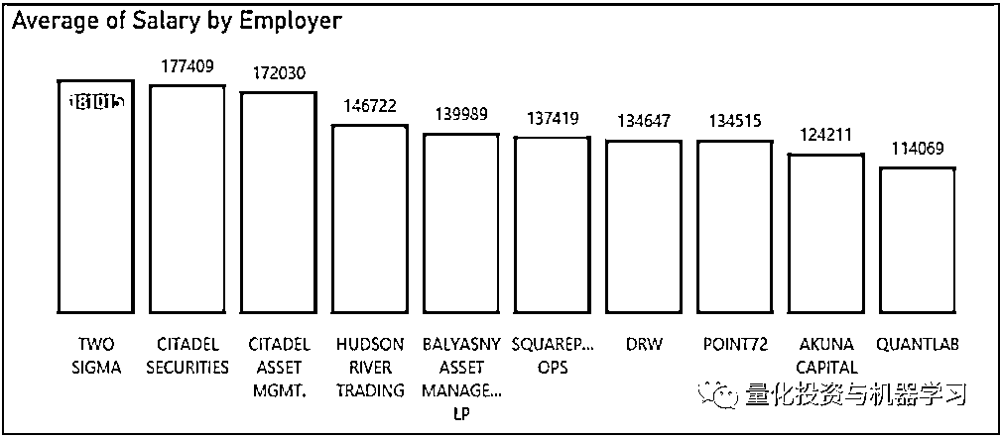

根据数据统计，这十家公司的总体薪资情况如下：

平均薪资（$）：**162120**

**薪资中位数（$）：**169000****

薪资最小值（$）：**70000**

薪资最大值（$）：**300000**

****数据 3 **** 

**全球著名猎头公司 Selby Jennings 在最近的一份 Quant 全球市场报告中，在**亚太地区，**对于不同岗位的招聘薪酬范围如下：**

**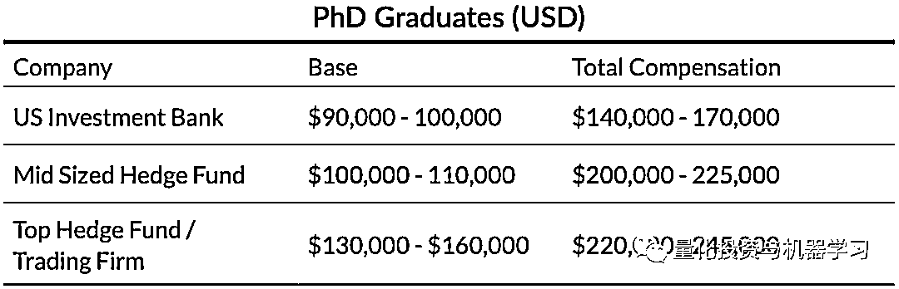**

**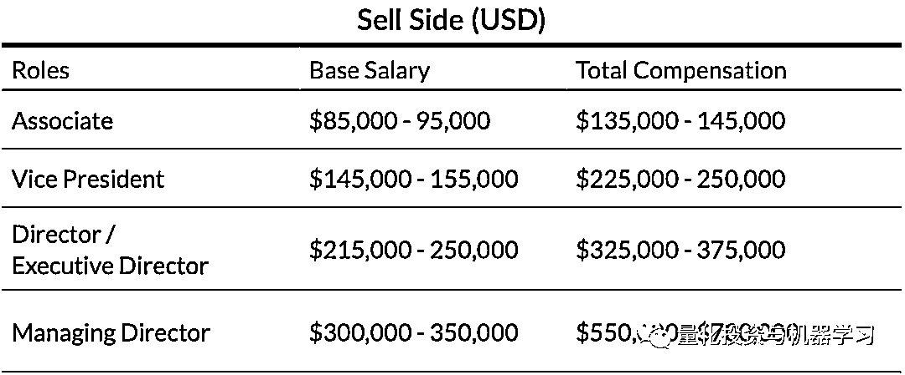** 

**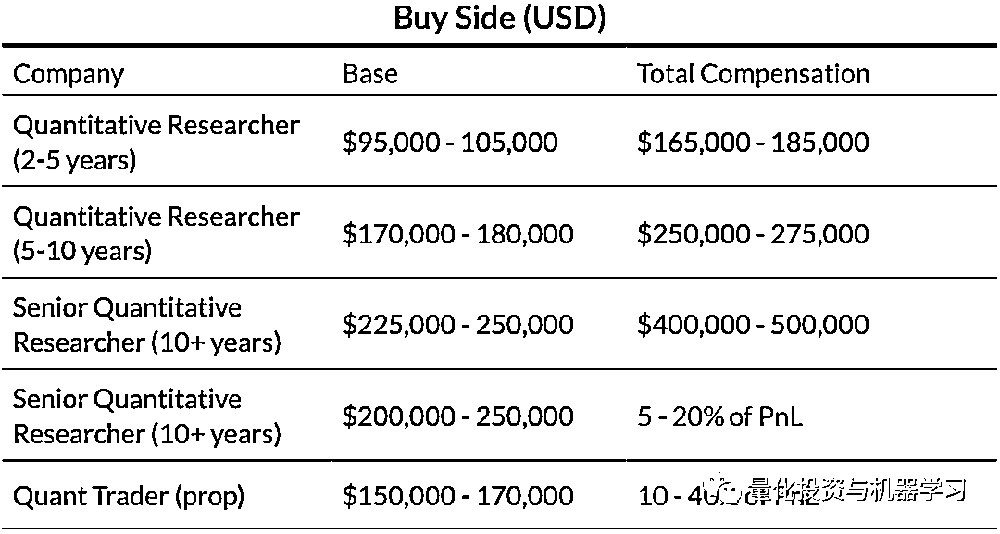**

****数据 4 ****

**根据 Selby Jennings 的另外一项数据，在下面的薪资表格没有准确说明量化从业者的具体收入，但考虑到其可以拿到高达 50%的 PnL 作为奖金，而且他们可能管理着超过 5000 万美元的基金，这些基金的价值每年可能上升 5% ，所以，有些人可能赚得更多！**

**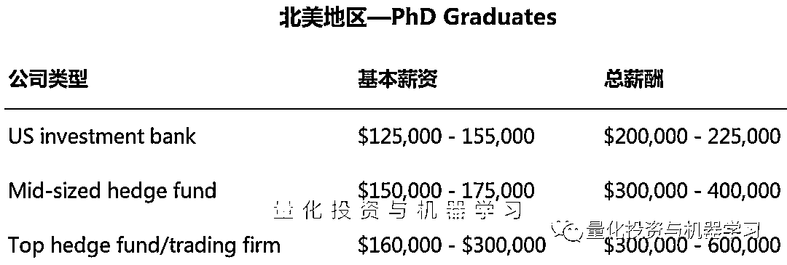**

**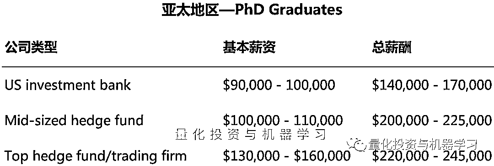**

**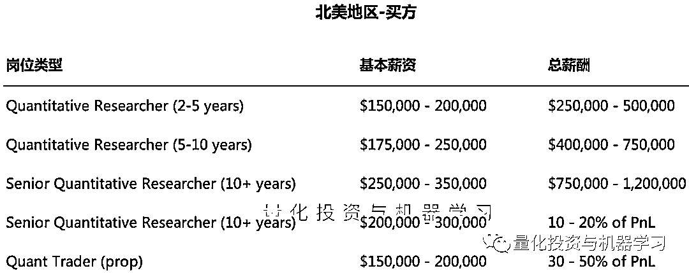**

**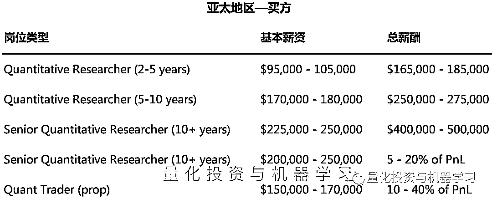**

****数据 5 ****

**Morgan Mckinley 在近期发布了**2021 中国薪酬报告**中，与 Quant 相关的职位的：**

**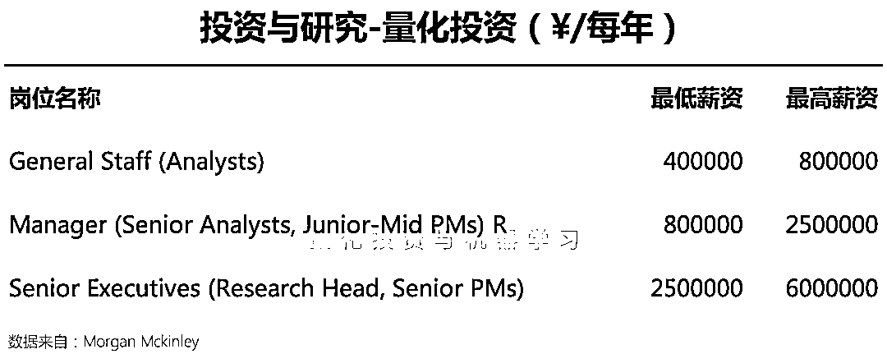**

**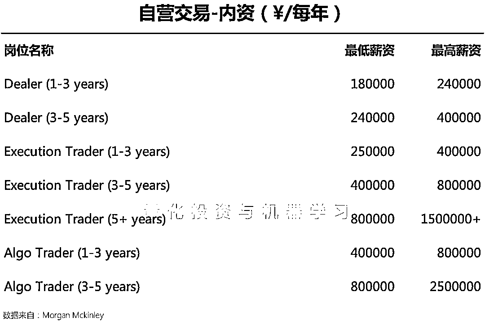**

**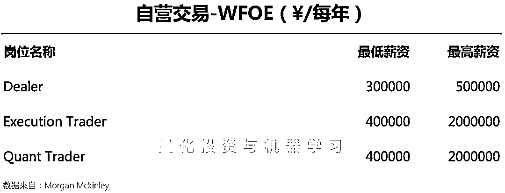**

****结语****

**所以，被某些媒体带偏的朋友们：5000 万确实多，但也不至于如此夸张，一切还在掌握之中！**

**使用中国基金报一位读者的评论作为结束语再好不过：**

****各行各业都有翘楚，但绝不代表整个行业！****

********

******2022 年量化圈最火周边，****点击上方图片****进行抢购！******

******点击阅读原文，抢购属于你的因子！！！******

****▼▼▼****