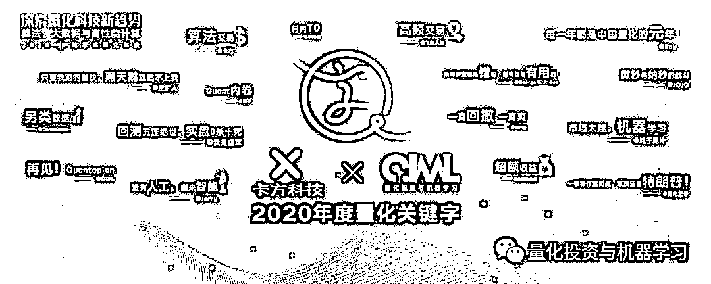
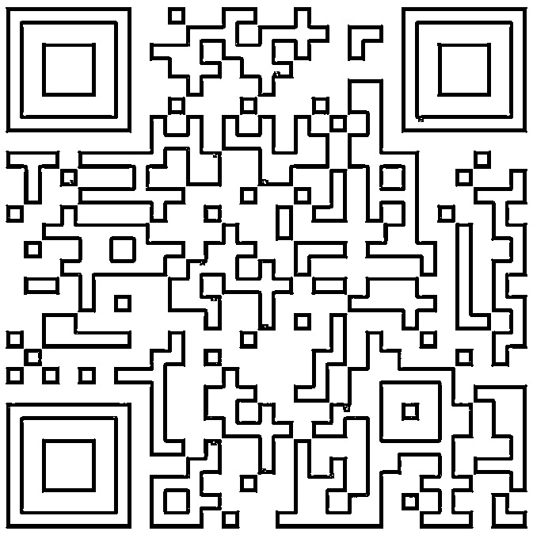

# 2021『量化关键词』揭秘中···

> 原文：[`mp.weixin.qq.com/s?__biz=MzAxNTc0Mjg0Mg==&mid=2653322087&idx=1&sn=bb6332bcac03341cc09353941704f201&chksm=802db972b75a306433d98fffa87228a6741d92dd1d4ea7a86e77e7e886171a17c14dd6ac7faf&scene=27#wechat_redirect`](http://mp.weixin.qq.com/s?__biz=MzAxNTc0Mjg0Mg==&mid=2653322087&idx=1&sn=bb6332bcac03341cc09353941704f201&chksm=802db972b75a306433d98fffa87228a6741d92dd1d4ea7a86e77e7e886171a17c14dd6ac7faf&scene=27#wechat_redirect)

# 

量化投资与机器学习微信公众号，是业内垂直于**量化投资、对冲基金、Fintech、人工智能、大数据**等领域的主流自媒体。公众号拥有来自**公募、私募、券商、期货、银行、保险、高校**等行业**3****0W+**关注者，连续 2 年被腾讯云+社区评选为“年度最佳作者”。

**QIML 年度 IP 系列**

量化投资与机器学习特别策划的一年一度**『量化关键词』**今日正式启动！

现在，公众号向全网征集属于 Quant 的年度量化关键词。经过我们内部评选后将会在年底正式揭榜！

**回顾 2020**

回顾我们 2020 年全网征集关键词榜单：

让我们一起期待今年会有怎样**与众不同、全体共鸣、惊骇世俗**的关键词出现吧！

**关键词征集方式、时间**

**2021 年 12 月 14 日~12 月 27 日**

注：言简意赅，字数请勿过长

扫描下方**二维码**或

点击**阅读原文**进行填写

**入选榜单的网友，将赠送公众号 2022 年量化圈最火周边****《因子日历》****一本！**

**特此声明**

**本次征集活动为匿名进行，大家安心填写，不用担心信息泄露！**

**点击阅读原文，可直接进行填写！**

▼▼▼