# 基于决策树的动态时序动量策略

> 原文：[`mp.weixin.qq.com/s?__biz=MzAxNTc0Mjg0Mg==&mid=2653322076&idx=1&sn=74247b0a9358fa07ca3c87c6e9af9fa8&chksm=802db949b75a305f95dca3055a1ffbbbb376a98a1f0c84ea605598c466907f80037e64d73f5f&scene=27#wechat_redirect`](http://mp.weixin.qq.com/s?__biz=MzAxNTc0Mjg0Mg==&mid=2653322076&idx=1&sn=74247b0a9358fa07ca3c87c6e9af9fa8&chksm=802db949b75a305f95dca3055a1ffbbbb376a98a1f0c84ea605598c466907f80037e64d73f5f&scene=27#wechat_redirect)

# 

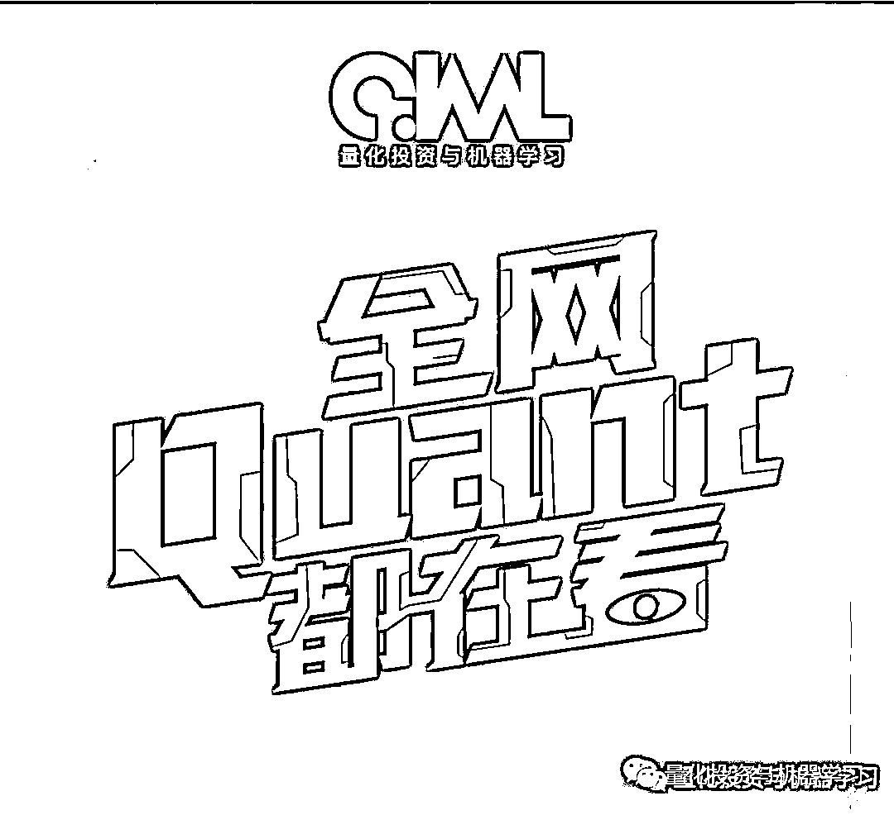

量化投资与机器学习微信公众号，是业内垂直于**量化投资、对冲基金、Fintech、人工智能、大数据**等领域的主流自媒体。公众号拥有来自**公募、私募、券商、期货、银行、保险、高校**等行业**20W+**关注者，连续 2 年被腾讯云+社区评选为“年度最佳作者”。

# 

量化投资与机器学习公众号独家解读

量化投资与机器学公众号 *** ***QIML Insight——深度研读系列 ******是公众号今年全力打造的一档**深度、前沿、高水准**栏目。

公众号**遴选**了各大期刊前沿论文，按照理解和提炼的方式为读者呈现每篇论文最精华的部分。QIML 希望大家能够读到可以成长的量化文章，愿与你共同进步！

> **本期遴选论文** **来源：**The Journal of Portfolio Management December 8,2021
> **标题：**Trending Fast and Slow
> **作者：**Eddie Cheng, Nazar Kostyuchyk, Wai Lee, Pai Liu, Chenfei Ma

**前言**

时序动量策略的基础是假设过去的收益对未来的收益有一定程度的预测能力。通常，一个策略是通过在上涨阶段建立多头头寸，在下跌阶段建立空头头寸来实现的。学术文献文献表明，最近过去的资产收益与未来收益正相关。时序动量策略的有效性在多个时期、许多市场和许多资产中得到了证明。例如，Moskowitz, Ooi 和 Pedersen(2012)发现，在测试了 1 到 12 个月的回溯窗口，发现 12 个月的时序动量策略具有可观的盈利能力。其本质上说明基于较慢信号的策略往往比基于较快信号的策略更能捕捉长期趋势，表现出更好的风险收益曲线。

但是 Garg et al.(2021)发现，时序动量策略在市场方向转折时通常会遭受损失。这时，信号较慢的策略，如 12 个月的时序动量，需要更多的时间转向，因此受到这些转折点的影响更大。而基于一个月收益等更快信号的策略反应更敏感，受转折点影响也更小。然而，也正是因为短周期策略更敏感，信号可能最容易受到错误转折点的影响，因此可能会出现过度的变动而带来较弱的表现。

在市场动荡期间（通常对应于转折点），基于缓慢信号的策略所承受的损失可能会减少，一种方法是使用波动率管理投资组合（VOM），这一概念得到了学术文献的充分支持。例如，Moreira 和 Muir(2017)声称，“当波动率高时，承担较小风险的管理投资组合会产生较大的阿尔法值，提高夏普比率，并为均值-方差投资者产生较大的效用收益。”这些策略背后的基本思想是，按照已实现波动率的反比来调整头寸规模，在最近波动较高时减少敞口，反之亦然。通过使用 VOM 策略来提高风险调整收益的潜力是基于以下假设：方差在短期范围内是高度可预测的，而方差预测仅与这些范围内的未来收益有微弱的相关性。Harvey 等人(2018)和 Plessis Hallerbach(2016)提出了类似的方法，帮助在不确定时期降低风险，在平静时期增加头寸。

时序动量策略面临一个关键的矛盾：长周期的信号对行情的转折反应缓慢，短周期的信号对行情的波动过于敏感。两种速度信号的有效组合，可以利用不同的市场周期，减少与转折点相关的下行风险敞口。与 VOM 和中周期的策略相比，在本文的时序动量策略中，我们采用了不同的风险管理方法。在我们的方法中，我们不是在高度不确定性时期对冲我们的风险，而是采取积极的头寸，试图从这些时期获取价值，以提高市场择时的效率。因此，我们的方法也不同于因子择时。

**基本动量策略**

对于给定月份 t，如果过去 N 个月的收益率 ，则在下一个月买入该资产，如果小于 0，则在下一个月卖出该资产。

<embed style="vertical-align: -2.233ex;width: 26.043ex;height: auto;max-width: 300% !important;" src="https://mmbiz.qlogo.cn/mmbiz_svg/a18XcQ1EBBgzgouRoaMcibJBqQBvAm9LWDGSloB8o3LmIL6uzyMNqscEQmvc3UwkTHxsPJNRg0OEgficvRYoTlH5eFJxdCe1OR/0?wx_fmt=svg" data-type="svg+xml">

在本文中，我们选取 N=1 作为短周期动量信号，N=12 作为长周期动量信号。下图 1、2 给出了 2000 年 1 月到 2020 年 12 月，标普 500 指数的长短周期动量信号。长短周期动量在过去 20 年，平均占了 63.5%的时间。

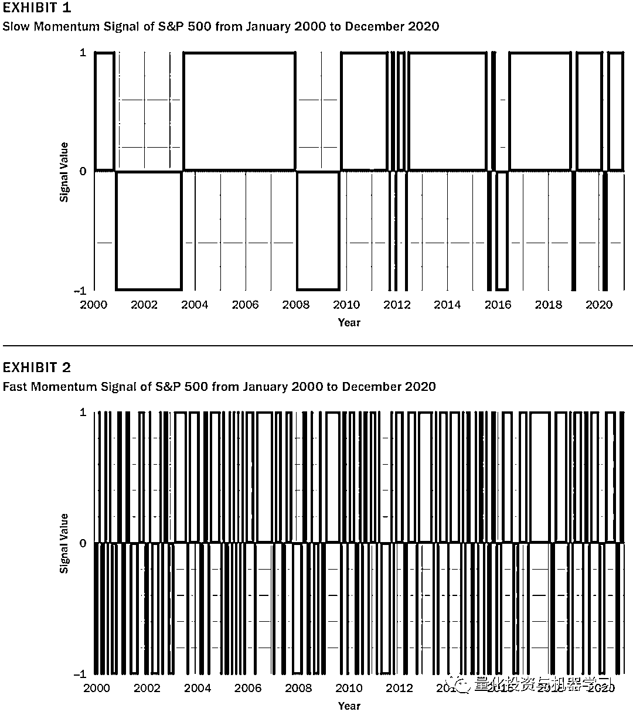

下图 3-4 给出了按照基本动量策略交易的策略收益曲线及绩效指标，可以看出长短周期的策略都有正收益，说明市场是有动量效应的。但是长短周期的动量信号并不总是一致，如果能够有效结合，那对策略收益的提升会有很大的帮助。

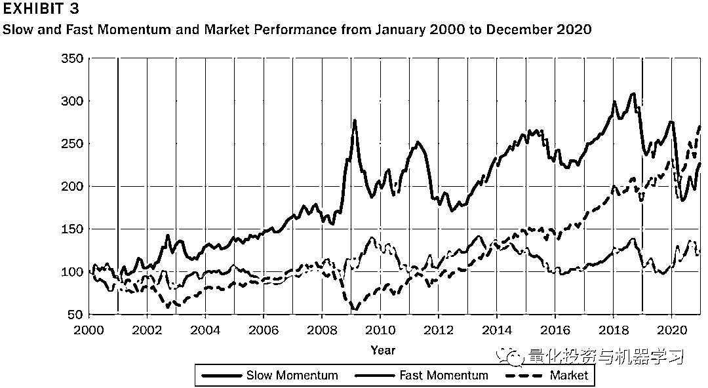

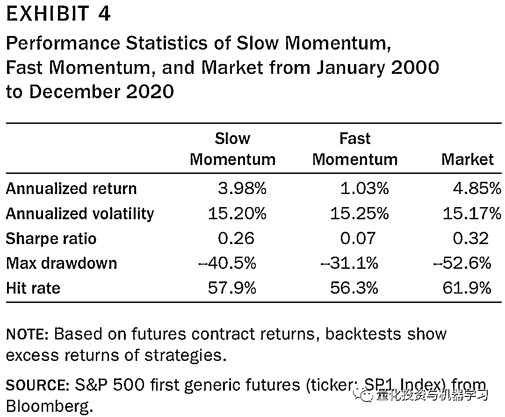

**不同市场波动下的动量表现**

当市场相对平稳的时候，长周期的动量策略更能适合市场的走势，相比短周期的动量信号，能获得更高的收益。而在市场波动较大时 ，短周期的动量策略更占优势。为了验证，我们使用决策树模型去学习在什么样的市场波动下使用什么样的动量策略。我们的训练目标定义为在当前市场波动情况下，在长周期和短周期动量信号的不一致的情况下，在下一个阶段采用的策略。

**也就是说，在标注训练数据时，预测目标是下一时间段该采用的动量策略类型。**在时间 t，如果 ，那下一时间段使用短周期（Fast）的动量策略；如果 ，那下一时间段使用长周期（Slow）的动量策略。

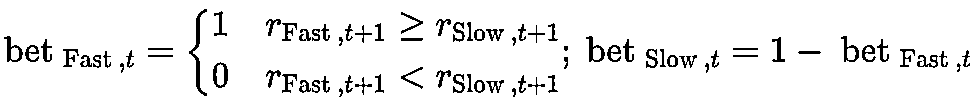

我们使用 1971 年到 2020 年总计 50 年的数据滚动计算标普 500 月度波动率，其中前 35 年的数据做训练，后 15 年的数据做测试。训练时，只使用长短周期动量不一致的数据，所使用的模型只是简单的决策树模型。**经过训练后，决策树模型给出了一个阈值 17%。当月度波动大于 17%时，短周期的动量策略效果优于长周期的动量策略；反之亦然。在样本外，以 17%作为分界点的策略，其表现也远远好于单独采用长周期或短周期的动量策略（或者是两者的固定组合），如下图 5、6 所示。**

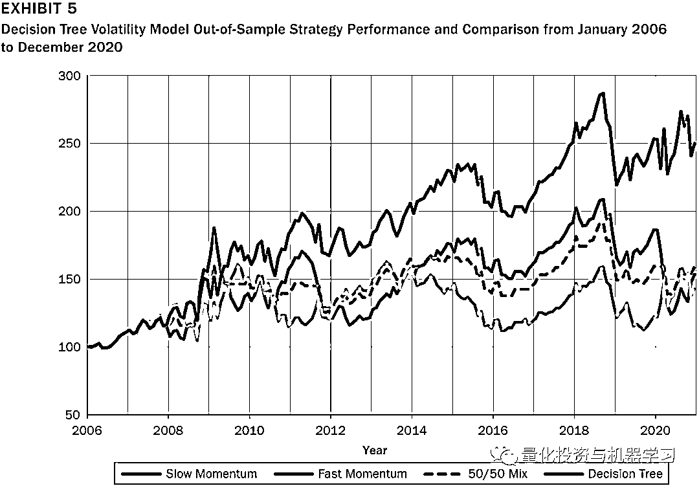

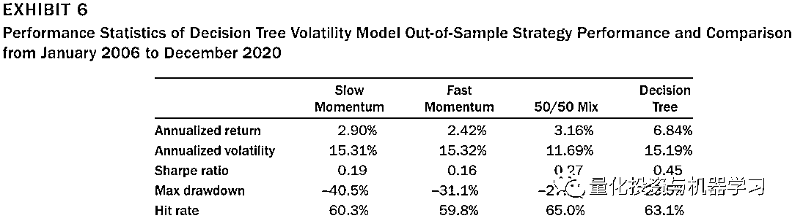

**收益的来源**

参考 Garg 等（2021），动量策略收益率 与标普 500 本身的收益 的协方差可以按如下等式进行拆解：

<embed style="vertical-align: -1.469ex;width: 88.526ex;height: auto;" src="https://mmbiz.qlogo.cn/mmbiz_svg/a18XcQ1EBBgzgouRoaMcibJBqQBvAm9LWVcKHtHIDf3LXgQmRpctFES04jutqZnTPkMDbPAxpAxZ41FSNzSYLP00f80PujKhic/0?wx_fmt=svg" data-type="svg+xml">

那么等式两边都除以标普 500 收益率方差，就得到了策略的 Beta：

<embed style="vertical-align: -1.238ex;width: 65.026ex;height: auto;" src="https://mmbiz.qlogo.cn/mmbiz_svg/a18XcQ1EBBgzgouRoaMcibJBqQBvAm9LWxQkhdcNOjRc5CIlJicZTdicgvLhrVvNk4WSoKrOXcYgmagMKuvkANqVbR4D0J6B5VD/0?wx_fmt=svg" data-type="svg+xml">

而等式右边三部分分别表示 Beta 的来源：固定（staic）、市场择时（market timing） 及 波动率择时（volatility timing）。

而 Alpha 可以拆分为市场择时（market timing） 及 波动率择时（volatility timing）两部分：

<embed style="vertical-align: -1.238ex;width: 60.32ex;height: auto;" src="https://mmbiz.qlogo.cn/mmbiz_svg/a18XcQ1EBBgzgouRoaMcibJBqQBvAm9LWnVHteNxN7Z0buDNjKibakdmvLHHXfTqPMJm8P7lRLMicZlpxeSYybMToE672cAm7yd/0?wx_fmt=svg" data-type="svg+xml">

> 关于 Beta 及 Alpha 拆解的证明参考以下论文的第 3.2 节：Garg A., C. L. Goulding, C. R. Harvey, and M. G. Mazzoleni. “Momentum Turning Points.” Working paper, 2021, https://ssrn.com/abstract=3489539.

图 7 和图 8 的结果表明，对阿尔法最显著的贡献来自于市场时机选择。在低波动率的情况下，长周期比短周期有更高的市场时机 alpha，而在高波动率的情况下，短周期比长周期有更高的市场时机 alpha。结果证实，在低波动的情况下，慢信号能更好地预测市场走势，而在高波动的情况下，快信号能更好地预测市场走势。不管是快还是慢，都能提供积极的波动时机，而不受市场状态的影响。然而，在低波动率的情况下，快周期提供了更高的波动择时 alpha。尽管在低波动性和高波动性的情况下，长周期动量和短周期动量之间的 alpha 值在统计上都不显著，但我们仍然相信，这种关系提供了有价值的投资洞察。

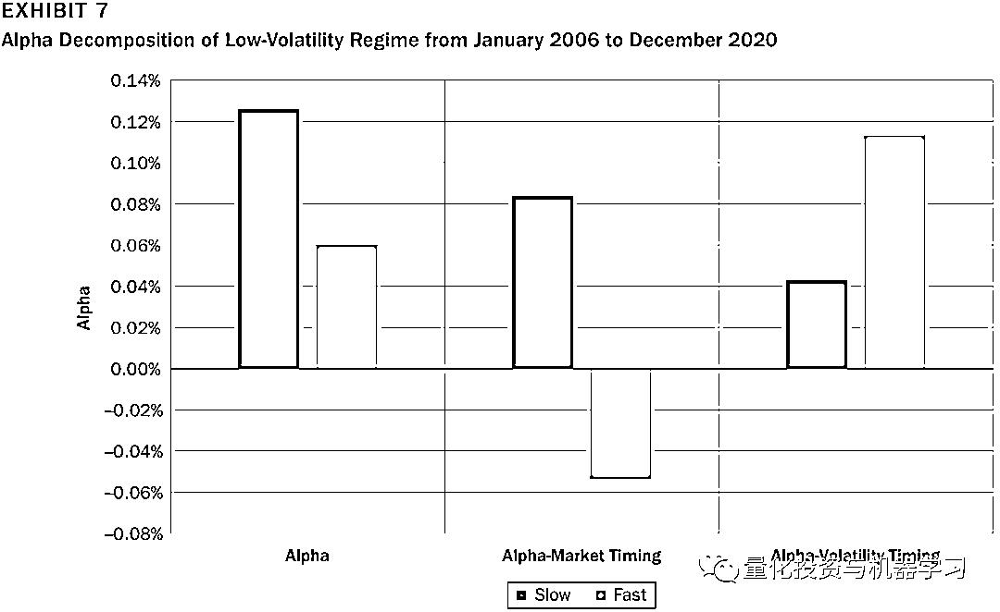

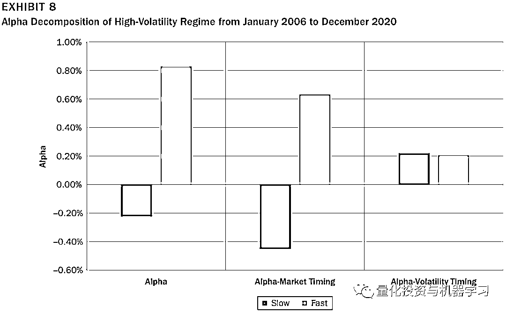

图 9 和图 10 展示了长周期、短周期、50/50 组合和图 5 中展示的决策树策略的 alpha 和 beta 分解，以及标准普尔 500 指数买入并持有策略。基于 SPX 波动率的决策树策略通过两种方式实现其优异表现：一是其总体 beta 敞口相对中性，这解释了其较低的下跌；其次，它的 alpha 来自于市场择时和波动择时。

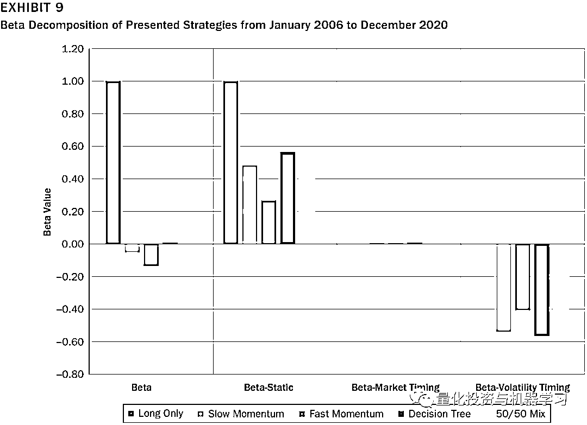

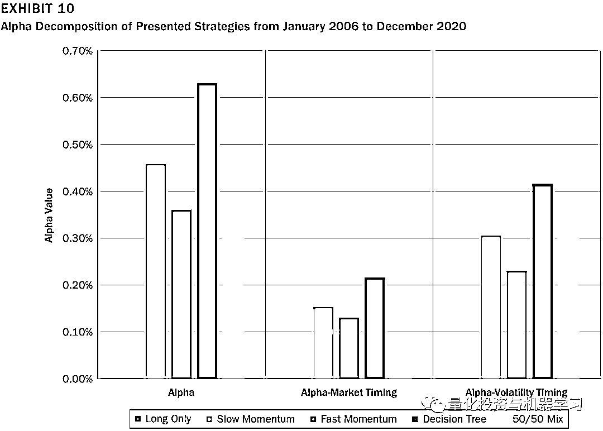

**总结**

**在本研究中，我们基于决策树模型来建立一个基于市场波动状态来动态选择不同周期的时许动量策略。其中，利用决策树分类器的简单性和可解释性来提取和理解时序动量策略投资者所面临的信号速度的问题**。我们证明，当波动性较低时，缓慢信号似乎能有效地捕捉资产的趋势。然而，在高波动性的市场环境下，投资者的行为是由恐惧和不确定性催化的，这迫使投资者更频繁地改变主意。在这种情况下，更快的动量信号比更慢的信号是更好的选择。使用经典的 alpha 和 beta 分解框架，我们还确定了市场择时和波动择时对收益贡献的占比。

**点击下方图片****进行抢购↓↓↓**

**点击阅读原文，抢购属于你的因子！！！**

▼▼▼