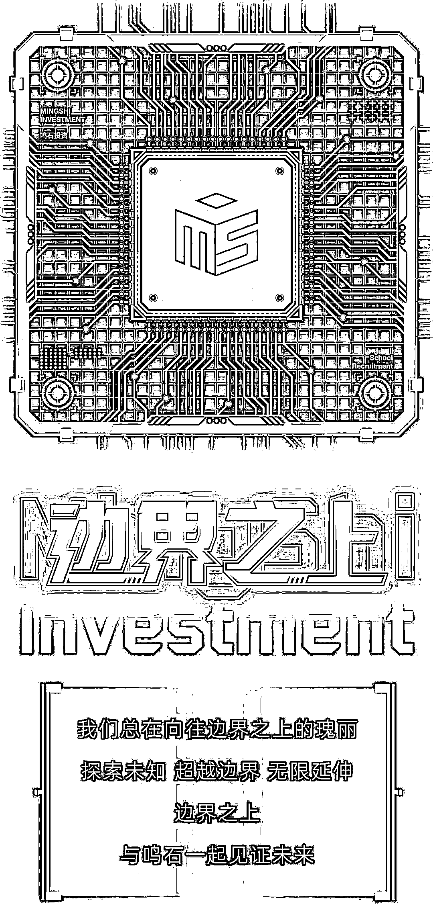

# 鸣石投资投研校招：抓住最后的投递机会！

> 原文：[`mp.weixin.qq.com/s?__biz=MzAxNTc0Mjg0Mg==&mid=2653322031&idx=1&sn=ca6e0117951c03500fcc9aac720e7fbe&chksm=802db93ab75a302c0e138ead492f238189fe6f32830467d573cd383d6ac780827d69b534e424&scene=27#wechat_redirect`](http://mp.weixin.qq.com/s?__biz=MzAxNTc0Mjg0Mg==&mid=2653322031&idx=1&sn=ca6e0117951c03500fcc9aac720e7fbe&chksm=802db93ab75a302c0e138ead492f238189fe6f32830467d573cd383d6ac780827d69b534e424&scene=27#wechat_redirect)

·

量化投资与机器学习微信公众号，是业内垂直于**量化投资、对冲基金、****Fintech、人工智能、大数据**等领域的主流自媒体。公众号拥有来自**公募、私募、券商、期货、银行、保险、高校**等行业 20W+**关注者，****我们为所有量化金融机构提供岗位招聘与推广服务。**

**** **[`mp.weixin.qq.com/mp/readtemplate?t=pages/video_player_tmpl&action=mpvideo&auto=0&vid=wxv_2138129081102581765`](https://mp.weixin.qq.com/mp/readtemplate?t=pages/video_player_tmpl&action=mpvideo&auto=0&vid=wxv_2138129081102581765)** ************

****具体投递方式****

**投递邮箱**

*****talent2021@mingshiim.com*****

****简历命名****

****岗位-姓名-QIML 公众号****

****企业如有招聘需求**** 

****请发邮件至：*****lhtzjqxx@163.com*****

*******或添加微信：********l******htz******jqxx*****

****部分合作机构****

****