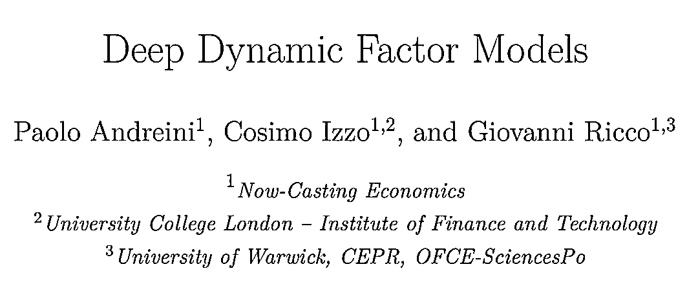
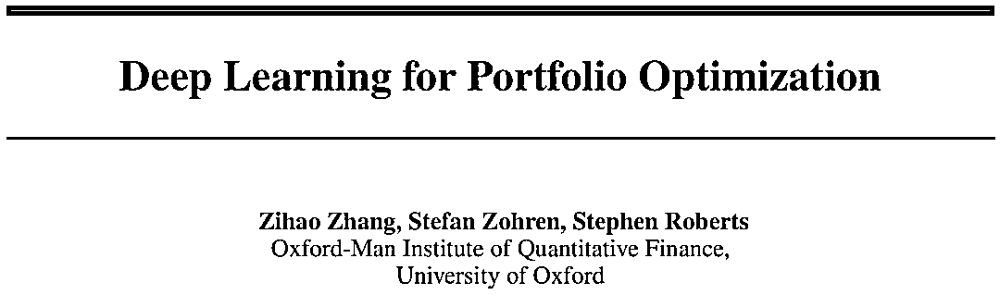

# 可以哦！深度动态因子模型、图神经网络

> 原文：[`mp.weixin.qq.com/s?__biz=MzAxNTc0Mjg0Mg==&mid=2653321986&idx=1&sn=92268bcd4b97c03fa4b71143decdc96c&chksm=802db917b75a3001978cc85a0512d14e03e7226a5b0a945542f880383b2864c58a39a85fb2d0&scene=27#wechat_redirect`](http://mp.weixin.qq.com/s?__biz=MzAxNTc0Mjg0Mg==&mid=2653321986&idx=1&sn=92268bcd4b97c03fa4b71143decdc96c&chksm=802db917b75a3001978cc85a0512d14e03e7226a5b0a945542f880383b2864c58a39a85fb2d0&scene=27#wechat_redirect)

# 

量化投资与机器学习微信公众号，是业内垂直于**量化投资、对冲基金、Fintech、人工智能、大数据**等领域的主流自媒体。公众号拥有来自**公募、私募、券商、期货、银行、保险、高校**等行业**3****0W+**关注者，连续 2 年被腾讯云+社区评选为“年度最佳作者”。

今天，公众号为大家带来三篇精选论文。希望大家有所收获！

**论文一**

传统动态因子模型（DFM）在宏观计量领域里应用度极高，因为它能够最大程度的从高维数据中提取出共同因子来分析很多变量间的关系。但 DFM 的局限是对于非线性信息的处理，**本文结合深度学习算法提出了一个新颖的深度神经网络框架——我们称之为深度动态因子模式来编码可用的信息，从数百个宏观经济和金融时间序列到少数几个未观察到的潜在状态。**虽然在逻辑上类似于传统的动态因素模型(DFMs)，但与那些不同的是，这类新的模型允许因素和观测之间的非线性信息（**主要使用 AutoEncoder 提取隐含因子**）。然而，通过设计，模型的潜在状态仍然可以解释为标准因子模型。**在对美国经济状况预测和预测的实证应用中，我们展示了该框架在处理高维、混合频率和异步发布的时间序列数据方面的潜力。在使用美国数据进行的完全实时样本外测试中，DFM 的性能优于最先进的 DFM。**

**论文二**

在公众号之前的文章中介绍过如果直接用组合的 Sharpe 作为损失函数，进行模型训练。本文也是类似的思路，本文采用深度学习模型直接优化投资组合夏普比率。本文提出的框架避开了预测预期收益的要求，并允许我们通过更新模型参数直接优化投资组合的权重。我们不是选择单独的资产，而是交易市场指数的 ETF，以形成一个投资组合。不同资产类别的指数显示出强劲的相关性，对它们进行交易大大减少了可供选择的资产种类。我们将我们的方法与一系列算法进行了比较，结果表明，我们的模型在 2011 年至 2020 年 4 月底的测试期间（包括 2020 年第一季度的金融不稳定性）获得了最好的性能。通过敏感性分析，本文还研究了各特征的相关性，并通过波动率缩放进一步研究了该方法在不同成本率和不同风险水平下的表现。

**论文三**

**近年来，随着图神经网络算法及知识图谱类数据的发展，越来越多的机构尝试 GNN 在投资组合管理中的应用。****Amundi 刚刚发表**的工作论文从基础的图论知识、GNN 算法到 GNN 在组合构建的实证分析都有系统的讲解。是一篇快速熟悉 GNN 与量化投资的好文章。

在金融投资中，不可能孤立地分析一项资产，而要考虑多像资产的关联关系。传统的做法，大家会使用 copula 或向量自回归模型，它允许建立资产之间的依赖关系。在本文中，作者将研究基于图的方法来建模资产的关联关系。图在表示关系时是无处不在的，无论是建模社会网络交互、疾病传播、交通还是供应链信息。它可以非常直观地表示市场的相互联系。我们将展示几种类型的市场信息如何转化为图表，并展示一些用于市场分析的基于图表的工具。此外，神经卷积层已经发展，允许更有表现力的神经模型。**我们展示了三个图神经层在股票收益预测问题上的作用。利用这些预测，我们构建了投资组合，并表明图层可以作为 LSTM 等经典方法的稳定器，降低交易成本并过滤掉高频信号。我们还研究了不同的基于图表的信息对预测的影响，并观察到在 2021 年，供应链信息变得比基于行业或相关图表的信息更加丰富。**

**论文下载**

后台回复：***QIML1208***

**点击下方图片****进行抢购↓↓↓**

**点击阅读原文，抢购属于你的因子！！！**

▼▼▼