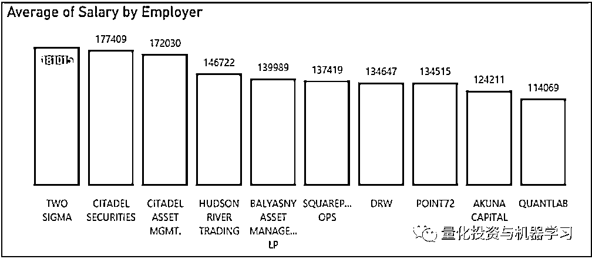
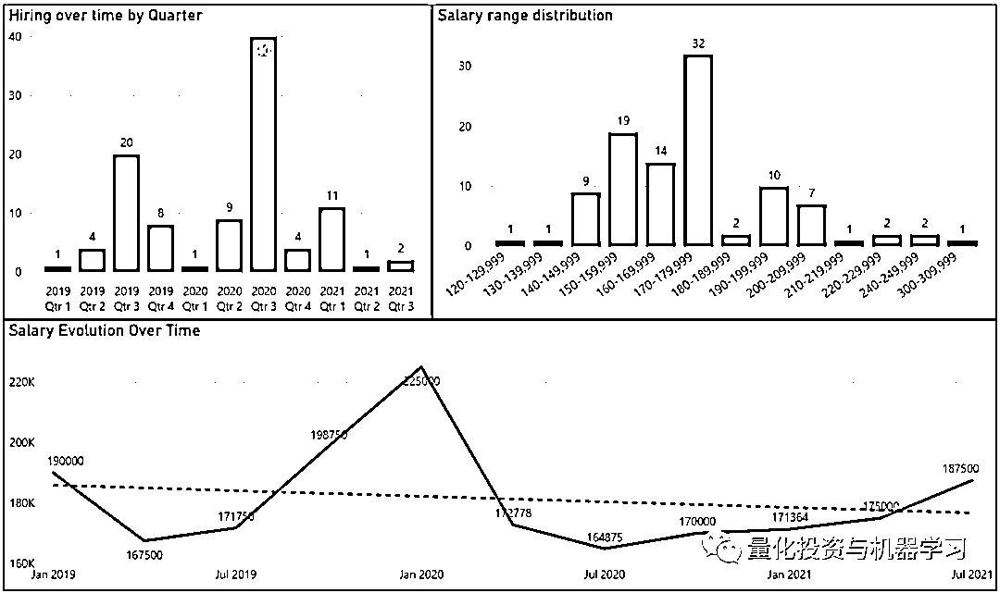

# 百万年薪，Citadel 领跑！全球顶尖对冲基金薪资最新披露

> 原文：[`mp.weixin.qq.com/s?__biz=MzAxNTc0Mjg0Mg==&mid=2653321969&idx=1&sn=c35efe78ee5113127fe6dd1c93239d92&chksm=802db8e4b75a31f21eaaa1054886b4ab492675991e00c7724bce92a3d07802bb73e51e9df220&scene=27#wechat_redirect`](http://mp.weixin.qq.com/s?__biz=MzAxNTc0Mjg0Mg==&mid=2653321969&idx=1&sn=c35efe78ee5113127fe6dd1c93239d92&chksm=802db8e4b75a31f21eaaa1054886b4ab492675991e00c7724bce92a3d07802bb73e51e9df220&scene=27#wechat_redirect)

# 

量化投资与机器学习微信公众号，是业内垂直于**量化投资、对冲基金、Fintech、人工智能、大数据**等领域的主流自媒体。公众号拥有来自**公募、私募、券商、期货、银行、保险、高校**等行业**3****0W+**关注者，连续 2 年被腾讯云+社区评选为“年度最佳作者”。

作者：Grainstone Lee    编译：1+1=6

**2022 年量化圈最火周边**

****点击上方图片****进行抢购****

****前言****

**今天要为大家带来的是来自 Grainstone Lee 的全球顶尖对冲基金薪资大调查，该调查是利用从 H1B 文件中获取的工资数据编制而成。我们认为 H1B 的工资与当地标准相差不大，因此可以作为一个很好的参考点。**

**需要注意的是，我们无法根据级别或经验来分解数据，因为这会导致数据失真。然而，**在量化投资行业，基本工资的上限往往在 25 万至 30 万美元左右，其中大部分薪酬是以奖金形式支付的！****

**本次统计数据来自 2019 年 1 月至今 H1B 申请数据（统计数量为 453 份）。在这里重点列举了 10 家对冲基金公司。**

**申明：此篇文章的分析是建立在公开的 H1B 签证文件数据之上，不能够完全反映整个公司实际现状，同时它也不考虑奖金和其他费用。**

**这 10 家公司的名称是：**

*   ****Akuna Capital****

*   ****Balyasny****

*   ****Citadel Asset Management****

*   ****Citadel Securities****

*   ****DRW****

*   ****Hudson River Trading****

*   ****Point72****

*   ****Quantlab****

*   ****Squarepoint****

*   ****Two Sigma****

**通过平均薪资我们可以看到，**Two Sigma、Citadel**领跑前三，不亏为大家喜爱的量化雇主。**

****

**根据数据统计，这十家公司的总体薪资情况如下：**

**平均薪资（$）：**162120****

****薪资中位数（$）：**169000****** 

**薪资最小值（$）：**70000****

**薪资最大值（$）：**300000****

**下面让我们看看每家的具体情况。** 

****

****Akuna Capital****

**平均薪资（$）：**124211****

****薪资中位数（$）：**120000******

****薪资最小值（$）：**120000******

****薪资最大值（$）：**180000******

********

********

******Balyasny****** 

****平均薪资（$）：**139989******

******薪资中位数（$）：**130000******** 

****薪资最小值（$）：**120000******

****薪资最大值（$）：**200000******

********

********

******Citadel Asset Management******

****平均薪资（$）：**172030******

******薪资中位数（$）：**175000******** 

****薪资最小值（$）：**125000******

****薪资最大值（$）：**300000******

********

********

******Citadel Securities******

****平均薪资（$）：**177409******

******薪资中位数（$）：**175000******** 

****薪资最小值（$）：**140000******

****薪资最大值（$）：**300000******

********

********

******DRW******

****平均薪资（$）：**134647******

******薪资中位数（$）：**140000******** 

****薪资最小值（$）：**100000******

****薪资最大值（$）：**1650000******

********

********

******Hudson River Trading******

****平均薪资（$）：**146722******

******薪资中位数（$）：**145000******** 

****薪资最小值（$）：**81000******

****薪资最大值（$）：**250000******

********

********

******Point72******

****平均薪资（$）：**134515******

******薪资中位数（$）：**123011******** 

****薪资最小值（$）：**73861******

****薪资最大值（$）：**293250******

********

********

******Quantlab****** 

****平均薪资（$）：**114069******

******薪资中位数（$）：**104874******** 

****薪资最小值（$）：**70000******

****薪资最大值（$）：**247500******

********

********

******Squarepoint******

****平均薪资（$）：**137419******

******薪资中位数（$）：**120000******** 

****薪资最小值（$）：**95000******

****薪资最大值（$）：**300000******

********

********

******Two Sigma******

****平均薪资（$）：**181015******

******薪资中位数（$）：**175000******** 

****薪资最小值（$）：**137000******

****薪资最大值（$）：**224000******

********

******点击下方图片****进行抢购↓↓↓******

********

******点击阅读原文，抢购属于你的因子！！！******

****▼▼▼****