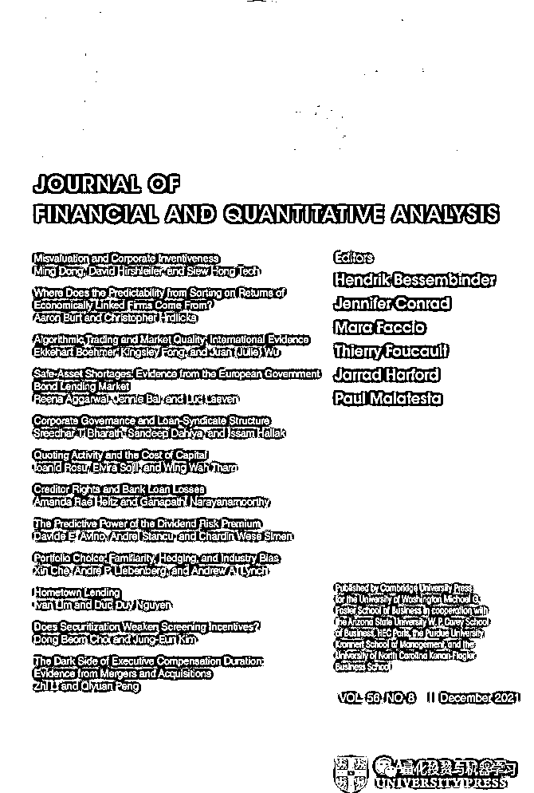
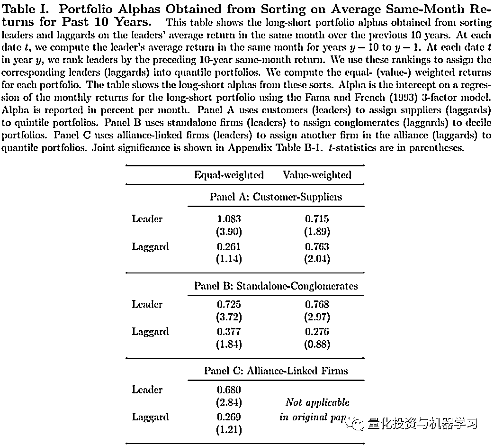
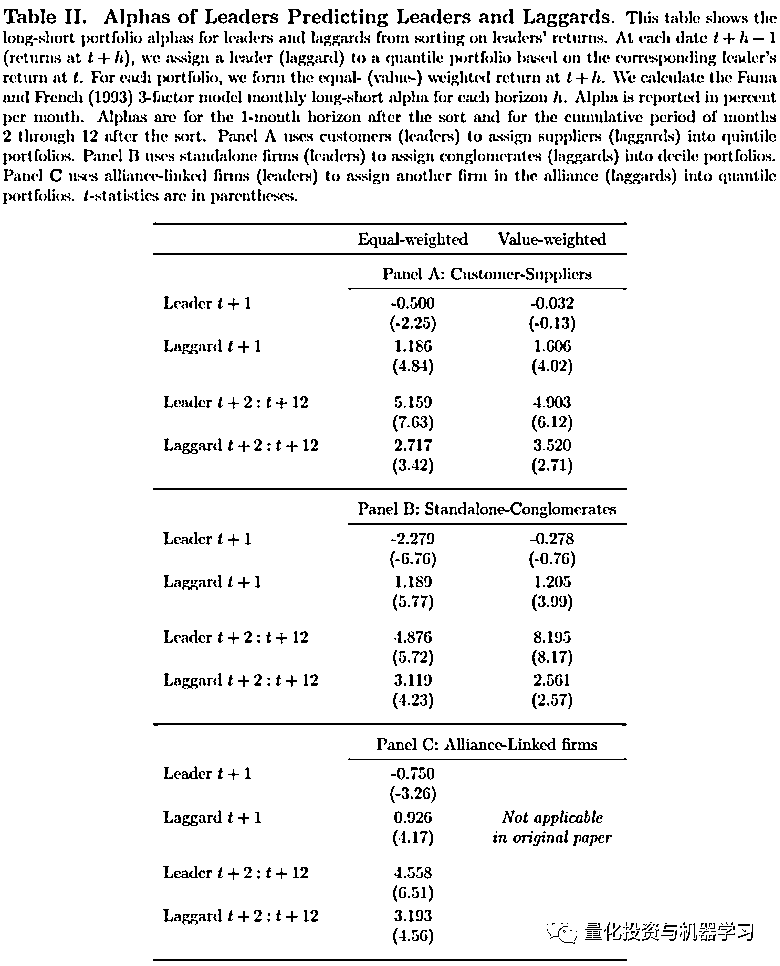
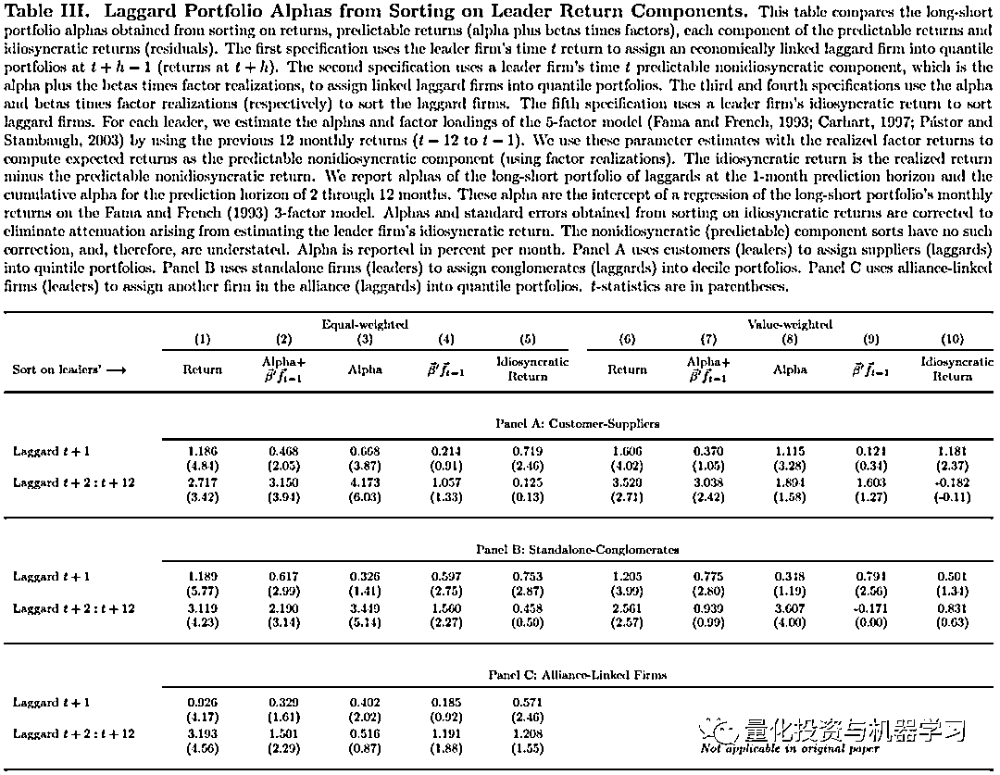

# 还是动量！经济关联公司的收益传导性研究

> 原文：[`mp.weixin.qq.com/s?__biz=MzAxNTc0Mjg0Mg==&mid=2653321872&idx=1&sn=3e08e1a1a3eb2ba35139f43a28bc0ad4&chksm=802db885b75a319377a0ddb947a6da0f9bf01b399fe6a80d0c458c39eadca679191787ce155f&scene=27#wechat_redirect`](http://mp.weixin.qq.com/s?__biz=MzAxNTc0Mjg0Mg==&mid=2653321872&idx=1&sn=3e08e1a1a3eb2ba35139f43a28bc0ad4&chksm=802db885b75a319377a0ddb947a6da0f9bf01b399fe6a80d0c458c39eadca679191787ce155f&scene=27#wechat_redirect)

# 

量化投资与机器学习微信公众号，是业内垂直于**量化投资、对冲基金、Fintech、人工智能、大数据**等领域的主流自媒体。公众号拥有来自**公募、私募、券商、期货、银行、保险、高校**等行业**3****0W+**关注者，连续 2 年被腾讯云+社区评选为“年度最佳作者”。

**点击上方图片****进行抢购↑↑↑**

经济关联公司之间的收益传导性一直是大家研究的热点，关联公司之间的收益是否存在明确的传导关系，这些传导是由于什么原因？

2021 年 12 月的国际顶刊《Journal of Financial and Quantitative Analysis》刊登了一篇 2020 年初就发表的论文《Where Does the Predictability from Sorting on Returns of Economically Linked Firms Come From? 》。

**该论文探讨了经济关联公司之间的收益传导性，是因为消息的传导的滞后性，还是有别的原因？**

> 经济关联公司只公司之间有经济上关联关系的公司，比如供应链的上下游公司、股权上有关系的公司及有联盟关系的公司等。

信息的传导一直是理解金融市场有效性的关键。大量的论文对经济关联公司间的收益传导归结于信息传导的滞后性。当引领的公司（leader firm）的股票大幅上涨，由于消息传导的滞后性，相关联的公司（laggard firm）的收益会在之后的一段时间才有反应。如果将 laggard firm 根据 leader firm 公司的上一时间段的收益进行排序，并构建 long-short 组合。根据之前的文献，这个多空组合的 Alpha 超过 1.5%每月。

> 以供应链为例，如果研究的是客户对供应商的传导，那么 Leader firm 就是客户，Laggard firm 就是供应商。

但这些 Alpha 并不全是因为信息传导的滞后性带来的，其中有一部分能被长期存在的季节性解释，也有一部分能被 Leader firm 本身的动量效应及其他共同因素所解释。那么信息传导的滞后性带来的 Alpha 到底存在不存在？如果存在，到底有多大？本文对于这个问题做了详细的研究。本文考虑的经济关联关系主要有以下三种：客户-供应商。  

**季节性 Alpha**

为了研究经济关联公司之间的季节性 Alpha，本文构建了如下的因子：每个月计算每个 Leader firm，历史前十年，同样月份的平均收益。然后根据这个“历史同月平均收益”对 Laggard firm 进行排序，并构建多空组合。经 Fama 三因子回归后的 Alpha 结果如下表，其中括号内为显著性。如下表 Laggard 行所示，**其中市值加权后的 Alpha 为 0.76%。这部分 Alpha 应该更可能属于长期的季节性 Alpha，而不是信息传导的滞后性。**下表 Leader 行表示，leader firm 根据自身“历史同月平均收益”进行排序后的 Alpha 结果。

**Leader Firm 的动量 Alpha**

之前的研究发现，Leader firm 对于 laggard firm 的信息滞后性在 1 个月左右，也就是说，根据当月 t 的 Leader firm 的收益排序，构建下一个月（t+1）的 Laggard firm 的组合是有明显的 Alpha。下表 2 的测试也证明了这一点，客户-供应商的 Laggard t+1 组合的 Alpha 为 1.606%（市值加权）。所有三种关系的 Laggard t+1 组合的 Alpha 都在 1%左右，且显著。

**如果信息滞后性在 1 个月左右，那么理论上 2-12 个月的组合是不会有显著的 Alpha。但是从下表测试来看，Laggard t+2: t+12 的累计收益均显著。说明除了信息滞后性带来的 Alpha，Leader Firm 本身的动量也有 Alpha（更详细的分析见下文）。**

**普通动量与信息传导的拆分**

上一小节，作者证明了 laggard firm 未来的收益受上一期 leader firm 动量的影响，但这个 leader firm 的上期动量中，有多少是由于新增信息传导带来的，有多少是普通动量的传导，并没有区分开来。

作者进一步把 Leader firm 的当期收益切分成**可预测的非特质收益及不可预测的特质收益两部分，其中不可预测的特质收益**是因为当期 Leader firm 的增量信息带来的（文中称为 News 部分）。

具体的拆分方法，根据每个 leader firm 过去 12 个月的收益，与 Fama 三因子（加上动量与流动性，共五因子）做回归，其中为可预测部分，剩余的为不可预测的特质收益率部分。而可预测部分又可以分为（文中称为 old news），和两部分

> 关于 old news 和 news，old news 表示 lead firm 历史上发生的新消息（当时的新消息）带来的收益，news 表示当前发生的新消息带来的收益，而剩余的部分为 beta 收益。

由下表可以看出：

*   **Leader firm 的 beta 收益对 laggard firm 短期收益有预测性，说明 laggard firm 的短期收益并不仅仅受 old news 影响，也不是仅仅收特质收益影响（news 的部分）。**

*   **Leader firm 的特质收益对于 Laggard firm 的长期（2-12 个月）预测性并不不显著。**

*   **Leader firm 的 old news 的收益对于 Laggard firm 的长期（2-12 个月）预测性并不不显著。**

**总结**

在经济关系的企业的收益可预测性方面，市场比我们想象的更有效，经济关联公司收益的传导性，并不是仅仅因为信息传导的滞后性。当 Leader firm 的收益出现异动时，Laggard firm 的收益确实会受影响，但这个影响并不是仅仅因为信息传导的滞后性，其中有很大一部分，即使 learder firm 不发生异动，也会存在。一方面，Laggard firm 可能只是对关于 learder firm 的旧(可预测的)信息做出反应，就像 learder firm 也会对自己的旧信息做出反应一样。这种常见的“延迟”反应不同于传统意义上的缓慢，也可能是由于经济关联的企业间所共有的其他未建模因素。

*文章下载：*

*https://papers.ssrn.com/sol3/papers.cfm?abstract_id=2423795*

**点击下方图片****进行抢购↓↓↓**

QIML 希望我们的每一篇文章，每一个周边、每一个产品都能得到大家的认可！

**点击阅读原文，抢购属于你的因子！！！**

▼▼▼