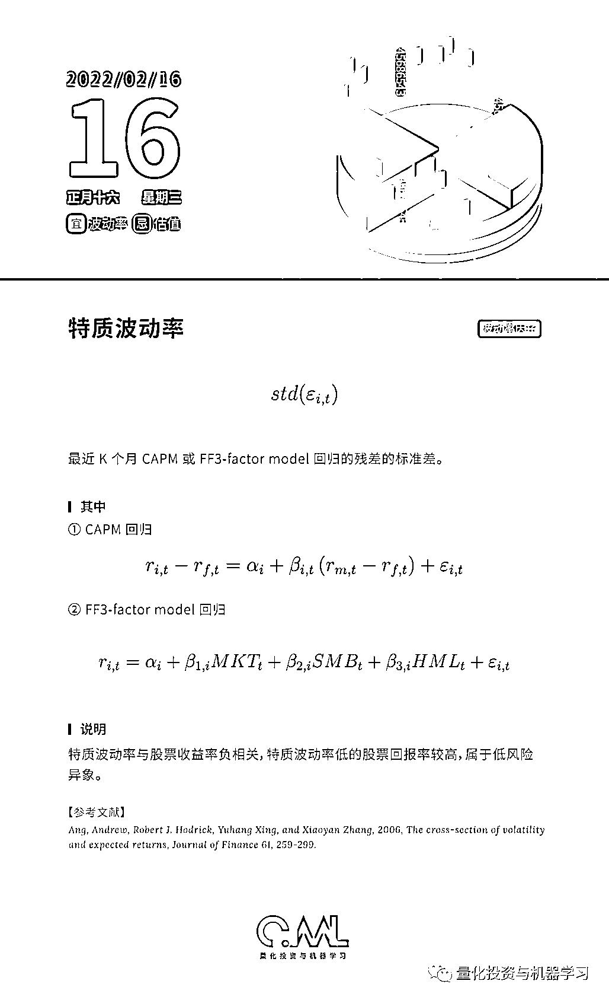

# 因子 API：一切皆有可能！

> 原文：[`mp.weixin.qq.com/s?__biz=MzAxNTc0Mjg0Mg==&mid=2653321859&idx=1&sn=6c18b5991b6fdd036c7a74cf2334f1de&chksm=802db896b75a31800eca8750ca32a3bd874df57d58a9e7b16590315cc1fbf48d7e70498d98e5&scene=27#wechat_redirect`](http://mp.weixin.qq.com/s?__biz=MzAxNTc0Mjg0Mg==&mid=2653321859&idx=1&sn=6c18b5991b6fdd036c7a74cf2334f1de&chksm=802db896b75a31800eca8750ca32a3bd874df57d58a9e7b16590315cc1fbf48d7e70498d98e5&scene=27#wechat_redirect)

# 

量化投资与机器学习微信公众号，是业内垂直于**量化投资、对冲基金、Fintech、人工智能、大数据**等领域的主流自媒体。公众号拥有来自**公募、私募、券商、期货、银行、保险、高校**等行业**3****0W+**关注者，连续 2 年被腾讯云+社区评选为“年度最佳作者”。

此次公众号推出的年度因子日历，从学术论文、研究报告、常规通用指标、原创因子等维度筛选了如下 26 类因子：

*   **规模因子**
*   **估值**因子****
*   **投资**因子****
*   **无形资产**因子****
*   **杠杆**因子****
*   **成长**因子****
*   **股东**因子****
*   **分析师**因子****
*   **公司治理**因子****
*   **质量**因子****
*   **高频**因子****
*   **流动性**因子****
*   **波动率**因子****
*   **动量**因子****
*   **另类**因子****
*   **财务质量**因子**（盈利能力、偿债能力、营运能力、资本结构、每股指标、改进）**
*   **技术因子（动量反转型、趋势型、波动型、成交量型、超买超卖型）**

从**因子计算逻辑、因子含义、因子研究结论、因子出处**等角度进行呈现：

我们还将在明年推出

**因子 API**

**不止 365 个因子！**

**【届时购买日历的读者会享有****意想不到的福利****】**

**点击下方图片****进行抢购↓↓↓**

QIML 希望我们的每一篇文章，每一个周边、每一个产品都能得到大家的认可！

**点击阅读原文，抢购属于你的因子！！！**

▼▼▼