# 全球 TOP 量化对冲基金最爱哪些学校？

> 原文：[`mp.weixin.qq.com/s?__biz=MzAxNTc0Mjg0Mg==&mid=2653321840&idx=1&sn=34819fa24c665e4f4920d233967bfe14&chksm=802db865b75a317378f1679e5514101f540fbe38d9ac6242a77daafd33ecf6ce29e92f80a6d0&scene=27#wechat_redirect`](http://mp.weixin.qq.com/s?__biz=MzAxNTc0Mjg0Mg==&mid=2653321840&idx=1&sn=34819fa24c665e4f4920d233967bfe14&chksm=802db865b75a317378f1679e5514101f540fbe38d9ac6242a77daafd33ecf6ce29e92f80a6d0&scene=27#wechat_redirect)

# 

量化投资与机器学习微信公众号，是业内垂直于**量化投资、对冲基金、Fintech、人工智能、大数据**等领域的主流自媒体。公众号拥有来自**公募、私募、券商、期货、银行、保险、高校**等行业**3****0W+**关注者，连续 2 年被腾讯云+社区评选为“年度最佳作者”。

作者：Grainstone Lee              编译：1+1=6

 

专注于量化投资和开发岗位招聘，擅长利用数据分析进行职位匹配的精品猎头公司 GL 近期根据其服务的客户统计了全球头部对冲基金中，员工毕业院校的分布。我们统计了 90 家全球对冲基金和自营交易公司员工的毕业院校，统计样本以北美及欧洲的对冲基金为主。这项分析以公开数据为基础，需要注意的是，该统计基于员工最近所在的公司。

所有参与统计的公司名单如下（红框是大家所熟知的一些头部对冲基金）：

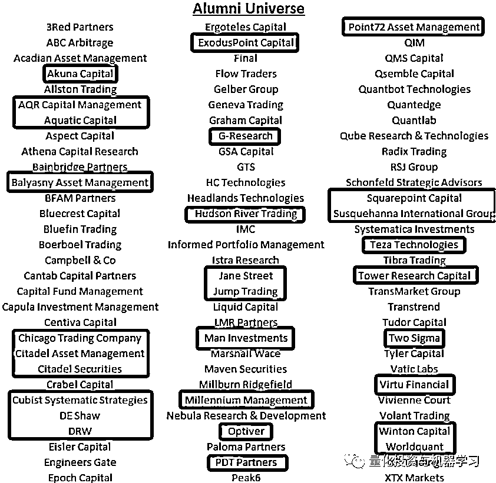

按对冲基金的校友人数计算，前 10 名包括 8 所美国大学（考虑到我们 56% 的目标人口都在美国，这并不奇怪），但英国也榜上有名，剑桥大学（Cambridge）和帝国理工学院（Imperial）也榜上有名。

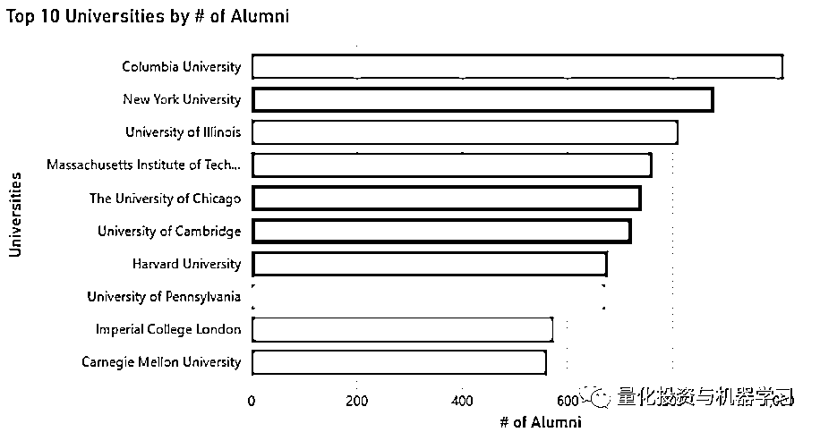

报告对这 10 所院校进一步分析，统计校友专业的分布，**可以发现社会科学（包括统计学和金融学）是前十名中一半的最大类别。工程和技术是第二大，紧随其后的是自然科学（数学和物理）。**

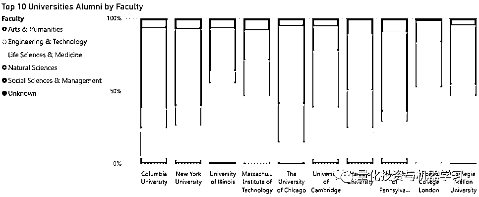

专业类别的具体划分如下：

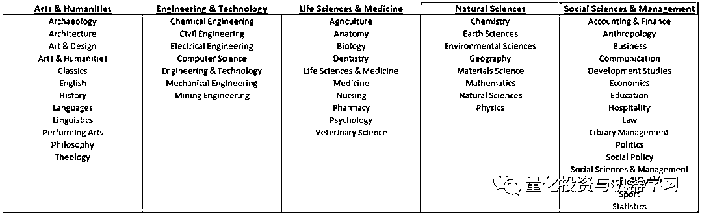

然后，报告分别对投资岗位和技术岗位的校友来源分别进行了统计。在投资岗位排名中，前 10 的榜单并没有明显的变化，只有伊利诺伊大学、帝国理工学院和卡内基梅隆大学被普林斯顿大学、牛津大学和斯坦福大学取代。

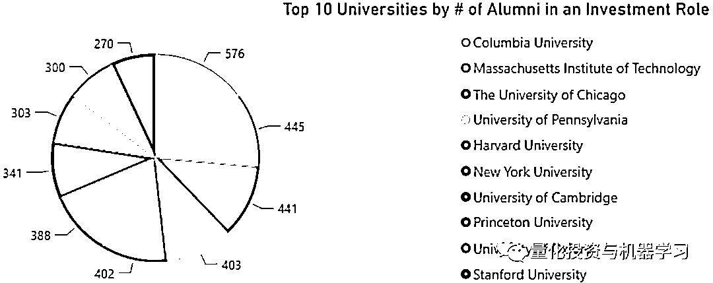

而在技术岗位的前十名榜单出现了较大变化，德雷塞尔大学（Drexel University）出现在了第七位，这主要是因为统计样本中，自营交易公司 SIG Susquehanna 有 90%的员工来自该学校。SIG Susquehanna 是一家极度追求技术（而又有深厚的德州扑克文化底蕴）的公司。德雷塞尔大学成立于 1891 年，是美国国家级大学。德雷塞尔大学（Drexel University）的工程科系经国立科学基金会任命为国家模范学校。

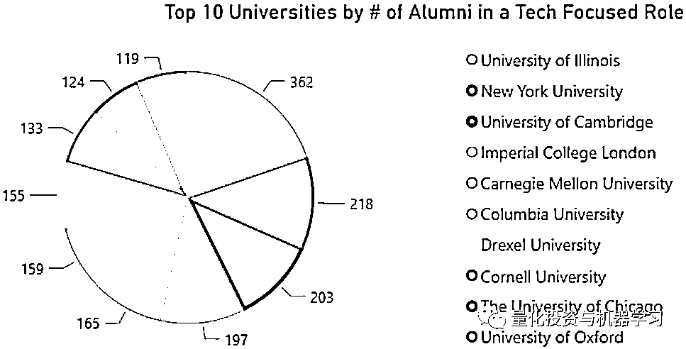

分地区统计的结果如下：

**北美洲：**

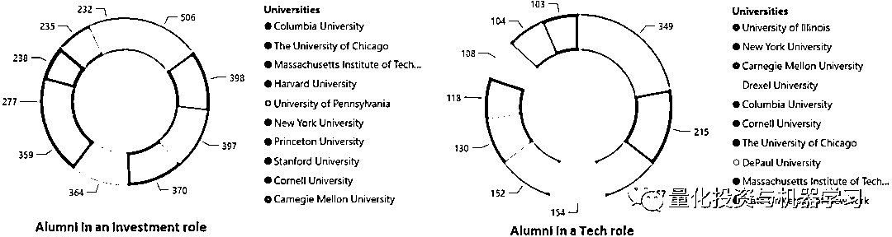

**欧洲：**

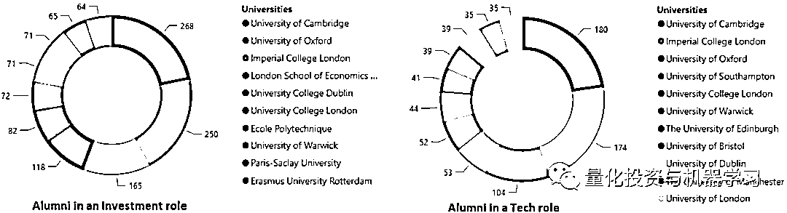

**亚洲：**

**投资岗位中，内地大学只有****【清华大学】****进入了亚洲前十。技术岗位中，内地大学只有****【****上****海交通大学】****进入了前十。**

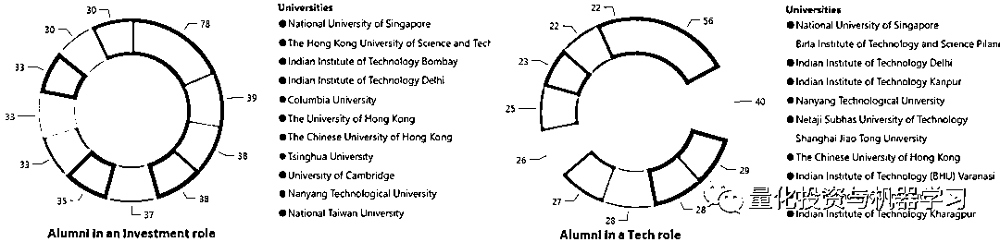

**大洋洲：**

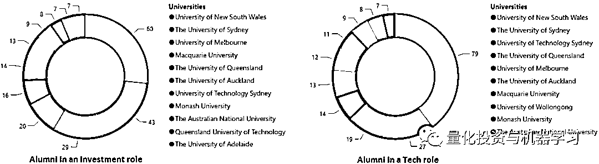

排名 100 的大学如下（右侧为按首字母排序）：

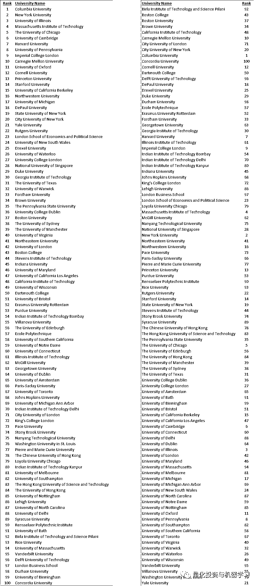

**点击阅读原文，抢购属于你的因子！！！**

▼▼▼