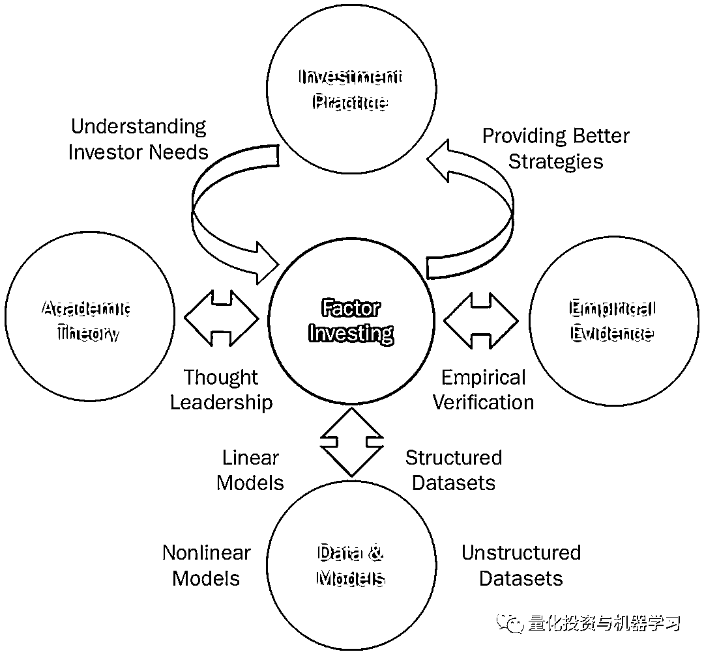
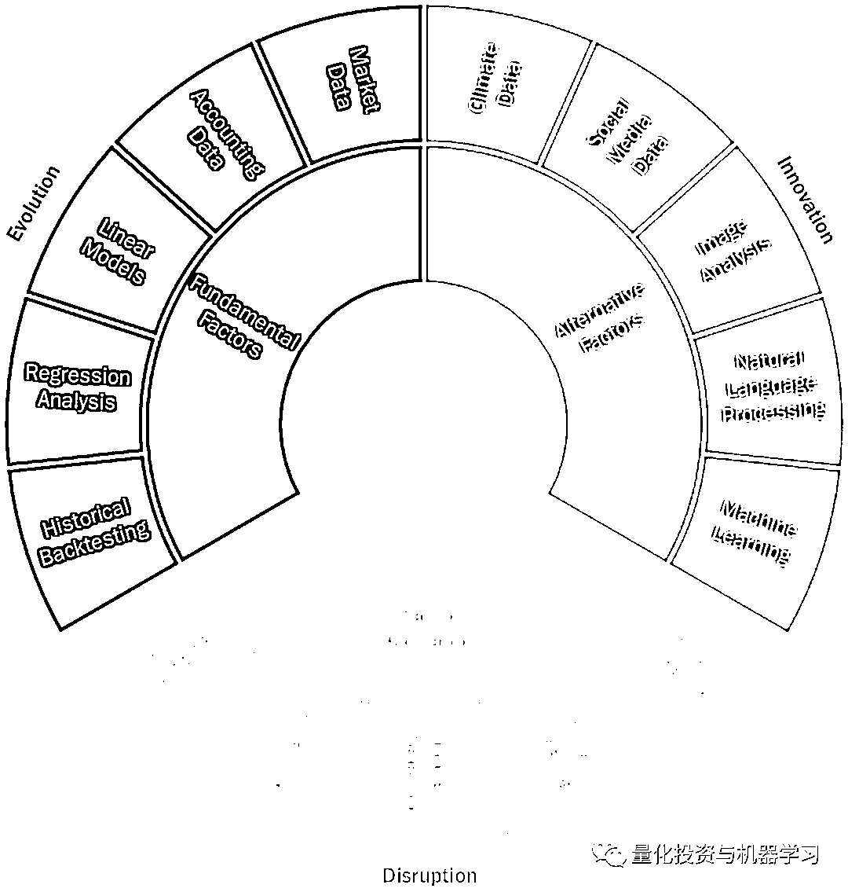
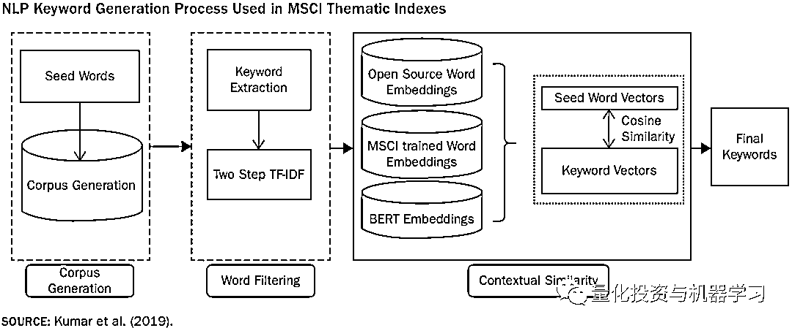
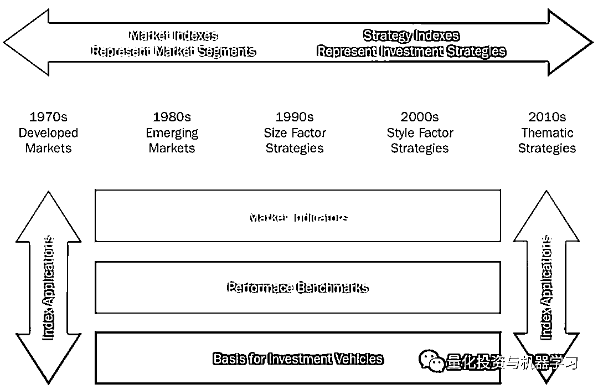
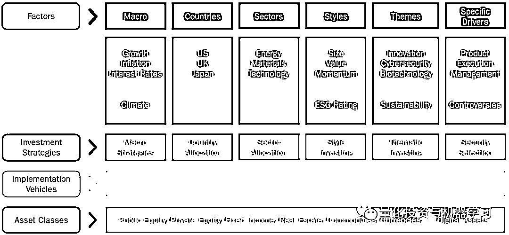
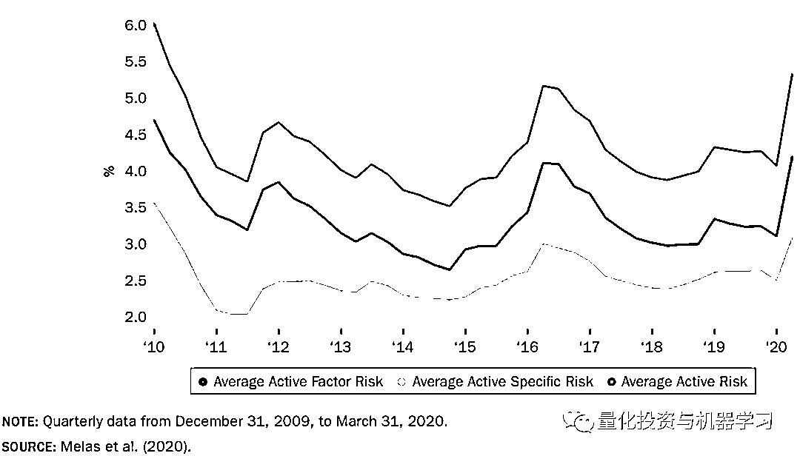
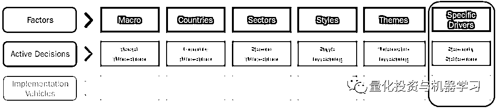

# 因子投资的未来！

> 原文：[`mp.weixin.qq.com/s?__biz=MzAxNTc0Mjg0Mg==&mid=2653321775&idx=1&sn=ae96c713f2e6a353832be5f29b6b523a&chksm=802db83ab75a312c3b2beb3153d7840774c3b998a58278fdbbdbf597c6995777d8b7715bde60&scene=27#wechat_redirect`](http://mp.weixin.qq.com/s?__biz=MzAxNTc0Mjg0Mg==&mid=2653321775&idx=1&sn=ae96c713f2e6a353832be5f29b6b523a&chksm=802db83ab75a312c3b2beb3153d7840774c3b998a58278fdbbdbf597c6995777d8b7715bde60&scene=27#wechat_redirect)

# 

量化投资与机器学习微信公众号，是业内垂直于**量化投资、对冲基金、Fintech、人工智能、大数据**等领域的主流自媒体。公众号拥有来自**公募、私募、券商、期货、银行、保险、高校**等行业**20W+**关注者，连续 2 年被腾讯云+社区评选为“年度最佳作者”。

**前言**

因子是投资组合的风险和表现的潜在驱动因素。在学术研究和投资实践中都得到了广泛的应用。作者从以下三个角度阐述了因子投资的未来：**改进、创新及多样性**。

长期以来，现代投资组合管理主要使用基本面因子。在此期间，因子模型和策略并不是一成不变的。它们受益于资本市场和投资过程的持续改进（Evolution）。他们还受益于学术理论的进步、数据可用性的改善以及投资者对投资组合风险和回报来源更好的理解(图 1)。目前寻求增强传统基本面因子的研究集中在两个关键领域：更细致的因子挖掘和更有效的投资组合构建。我们将讨论这些研究工作如何影响在股票市场中以价值因子为目标的策略。

除了传统的基本面因子的建模技术的不断发展，目前大量的研究工作集中在创新上（Innovation）。这些努力包括寻求更多的另类数据和研究更新的建模技术。另类数据，如知情交易者和社交媒体数据，能使投资经理获得更多的收益。新的建模技术(如机器学习和自然语言处理)能够使投资者利用非结构化数据来捕捉新兴的投资主题，如可持续性。

因子的可解释性，并将其整合到不同的投资工具的可能性，已经丰富了资产配置过程的多样性（Disruption），并为投资者提供了表达积极投资观点的新机会。在本文的最后一部分，我们探讨了因子投资的创新是如何重塑传统资产配置范式的，并讨论了这种错位所带来的组合构建和投资治理挑战。

Foundations of Factor Investing: Theory, Data, Models, Evidence, and Practice

**Evolution 改进**

基本面因子是现代投资管理的基石。对于股票，除了国家和行业，通过实证研究并广泛用于投资组合管理的基本面因子包括价值、规模、动量、波动率、质量、收益率、增长和流动性。在跨资产类别投资中，，包括股票、利率、信贷和房地产中，会使用到常见的宏观驱动因子。

基本面因子之所以能取得持久的成功，是因为它们有学术理论的指导，有实证证据的支持，更重要的是，它们反映了投资实践。研发工作继续专注于发展和加强基本因子模型和策略，以便它们能够继续服务于投资者的需求。更具体地说，目前发展传统因子投资策略的研究可以分为两个广泛的领域：**因子的改进和更有效的投资组合构建。**

当前研究的一个重要方向是价值因子的改进。学者和实践者一直在试图理解价值策略的长期表现不佳背后的原因。拥有无形资产的科技公司占主导地位，而这些公司在传统价值投资组合中却不存在，这使得研究工作集中在如何通过其他衡量方法获取价值，以及如何受到不同会计政策的影响。

**关于因子的改进，传统上，价值是通过比较价格和帐面价值来衡量的。这种价值衡量方法未能计入无形资产的投资，这些无形资产在损益表中支出，而在资产负债表中没有资本化。这种会计实践可能导致价值策略偏向于依赖实物资产(其成本被资本化)的企业，而不偏向于投资于无形资产(其成本被费用化)的技术企业。**

为了解决这一缺点，改进的因子使用多个指标（不同的度量）来衡量价值。例如，除了市净率外，MSCI 全球股票模型还纳入了其他几个价值衡量指标，包括市净率、市净率与现金流、市净率与销售额、企业估值与 ebitda 之比，甚至长期反转的技术指标。其中一些措施受无形资产费用的影响(例如，价格-收益，价格-现金流)，而其他措施则不受影响(例如，价格-销售，长期反转)。

**此外，一些关于价值投资的最新研究已经引入了明确将研发(R&D)费用从损益表中删除，并将其添加到资产负债表中。这个过程的一个问题是为资本化的研发费用指定适当的折旧率。为了解决这一问题，研究人员探索了特定行业的研发折让率。**

就更有效的投资组合构建而言，只根据价值因子标准筛选和选择公司的价值投资策略，无论这些衡量标准是多么精细或复杂，都会不可避免地存在某些结构性偏差和意外风险。例如，使用全球股票领域的任何绝对估值衡量方法来选择公司，可能会导致投资组合中大量且持续地押注于某些国家(新兴市场)、某些行业(金融、材料和公用事业)和某些风格特征(低增长、低质量和高波动性)。

更有效的投资组合构建可以消除其中一些偏见。例如，通过比较行业内的估值来选择股票，消除了一些结构性行业的押注。当模型估计过程(多元横截面回归)去除其他因素暴露时，最佳基本因子模型中的因子反映了这些调整，从而允许这些模型获取纯因子的回报。然而，这些纯因子回报对应的是不可真实创建的投资组合，因为它们包含数千个多头和空头头寸，需要高周转率。在可投资因子策略中，使用各种基于规则和优化的投资组合构建技术来消除投资组合中的非预期因子风险。

研究表明，在过去 15 年里，价值因子的不佳表现不能归咎于某一个原因，如无形资产的费用化或低利率环境下，尽管这些假说能解释部分表现不佳。相反，一些不利因素影响了价值策略。有些是周期性的，有些是结构性的，包括因子本身的构建、naïve 投资组合构建和不利的宏观条件。

一些结构性问题可能通过研究和开发得到缓解(例如，更精确的因子和更有效的组合构建)。另一方面，一些周期性问题可能会消失，甚至逆转；例如，如果我们在未来经历一段通货膨胀和利率上升的时期，低利率对价值策略的不利影响可能会被消除。旨在了解不断变化的市场条件和不断演变的投资过程如何影响基本因子的研究努力，为策略增强带来了新的见解和潜在途径。

Evolution, Innovation, and Disruption Are Shaping the Future of Factor Investing

**Innovation 创新**

随着市场逐渐变化，传统因子建模工具和技术的得到了持续发展。目前的大量研究工作已经超越了改进的范畴，而集中在可能重新定义投资者如何识别共同因子以及如何在投资组合中捕捉这些因子上的创新。**具体来说，这些努力集中在使用另类数据，应用新的建模技术，并将可持续性和气候因素纳入投资策略。**

因子投资历来主要依赖于财务和量价数据。这些数据类型有几个固有的优点:它们是高度结构化的；它们用离散的数值表示；它们可以很容易地被投资从业者解释和理解；它们定期生产；他们可以在不同的公司之间进行比较；它们可以通过线性因素模型有效地处理，从而产生直观和可操作的见解。线性模型还提供了一些固有的好处，包括简便性、简约性，以及将分析从单个证券扩展到投资组合并轻松解释结果的能力。

在过去的几年中，我们看到了另类数据可用性的爆炸式增长。有些另类数据是以前难以获得的市场数据(例如，分析师预测、内幕交易、期权交易信息、信用违约互换和对冲基金头寸)。这些数据集以数字形式提供，可以从供应商处获得。然而，其他新的数据集以新的非典型格式出现(例如，文本、音频和视频)，它们只能从互联网站点和社交媒体中提取。投资者可以通过处理和理解非结构化另类数据(如新闻报道、产品评论、员工评论、职位招聘、监管备案、通话记录、卫星图像等)中包含的信息，获得更多的信息。

新的数据类型需要新的建模技术和强大的计算机来提取信息。云计算和定制微处理器等信息技术的创新为机器学习、自然语言处理、和其他计算密集型的算法提供有力支撑。这些创新正在推动因子投资朝着更透明和系统化的主题投资策略的方向上发展。

将可持续性和气候因素纳入投资组合，这是因子投资的下一个创新前沿。在过去几年中，由于投资者认识到环境和社会变化特别是对投资组合的深刻影响，使用环境、社会和治理(ESG)因子进行投资分析和投资组合管理已得到越来越多的接受。最近，气候紧急情况和碳中和经济过渡的必要性被认为是社会和投资者面临的最大挑战。

因子模型和策略可以在帮助投资者识别碳中和机会和管理气候风险方面发挥关键作用。非结构化数据集和非线性模型的创新使研究人员能够开发创新因子和分析模型，如气候风险值、隐含温升、主题相关性评分这些信号可以被纳入因子投资策略，以确保投资者实现其组合目标的同时管理气候风险，并利用碳中和经济中的新兴主题和机会。

**Disruption 多样化**

因子投资的演进和在资产配置中使用因子策略的另一个重要的结构性变化是指数投资革命，它彻底改变了投资格局。

指数已经在过去的 30 年里，主要在以下两个重要方面不断的发展：用途和它们的代表性(表 4)。关于如何使用它们，指数最开始作为市场指标，然后最为绩效基准。最近他们已经成为可投资的基础工具。就它们所代表的内容而言，指数已经经过了时间的演变，目前有两个不同的目的：市场指数代表市场细分板块，策略指数反映系统化的投资策略。在本节中，我们将回顾这两种类型的指数以及基于它们的投资策略是如何实现资产配置过程的。

在传统的资产配置模式下，投资者对不同的资产类别进行配置，如股票、固定收益、房地产和另类投资。所有的配置决策都围绕着管理资产类别和市场的配置。投资组合分析侧重于了解风险敞口，并将风险归因于资产类别。例如，在传统观点下，总投资组合风险可以归因于股票、固定收益、房地产和私募股权。按照这种观点，不可能理解不同资产类别之间的共性。

**新的因子配置范式从顶层开始，明确承认因子是投资组合风险和绩效的真正驱动因素，因此也应该驱动资产配置决策。宏观因子反映宏观经济的影响，包括经济增长、通货膨胀和利率，但也包括气候变化。国家和产业因子解释了地理效应和产业定位。风格因子体现了增长导向和资产负债表质量等共同特征，主题因子反映了结构性趋势和创新、可持续性等新兴投资主题所产生的共同影响。最后，一旦考虑到因子的影响，投资组合业绩的剩余部分由具体的来源决定，例如公司的产品质量、执行能力和管理技能。**

Evolution of What Indexes Represent (x-axis) and How They Are Used (y-axis)

Factor Allocation Allows Investors to Manage the Drivers of Portfolio Performance

在因子配置框架下的下一个层次是将不同类型的因子转化为相应的投资策略，如宏观策略、国家配置、产业轮转、风格投资、主题投资，以及在特定驱动因子的情况下的证券的选择。反过来，这些投资策略可以通过一系列不同的投资工具来实现，包括指数基金、共同基金、交易所交易基金、上市衍生品和个别证券。最后，在因子配置框架的底部，资产类别只是实现因子配置决策的证券池。

在这个框架下，可持续性和气候并不是新的或单独的因子类别。相反，它们可以无缝地集成到现有的熟悉的因子组中。具体来说，气候风险成为一个重要的宏观因子，ESG 评级可以作为新风格因子的基础，可持续性可以被解释为一个重要的主题因子，公司层面的争议可以被视为公司分析和证券选择决策的具体驱动因子。

因子配置框架揭穿了有关指数投资及其对市场效率影响的普遍误解。事实上，这个框架表明，主动与被动的辩论完全没有抓住要点。根据这场辩论，尽管指数基金带来了透明度和低成本，但批评者声称，它们是被动的，因此不加选择地配置资本，损害了市场效率。事实上，因子配置框架证明了这种批评是错误的。在解释投资组合风险和业绩方面，共同因子比特定的驱动因子更重要，这些因子可以通过指数跟踪工具进行主动管理。指数跟踪基金不但不会损害价格发现和市场效率，还通过提供多样化和高效的工具来表达观点，并在多个维度上实施积极的投资决策，从而促进积极的投资组合管理。

Factor Risk Dominated Specific Risk in Global Equity Portfolios

Index Tracking Funds Are Tools to Express Views and Implement Active Decisions

***参考文献***

*Melas, D. (2021, November 17). The future of factor investing. The Journal of Portfolio Management. Retrieved December 1, 2021, from https://jpm.pm-research.com/content/early/2021/11/16/jpm.2021.1.308. *