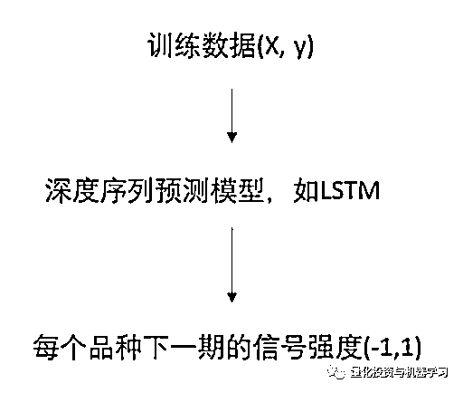
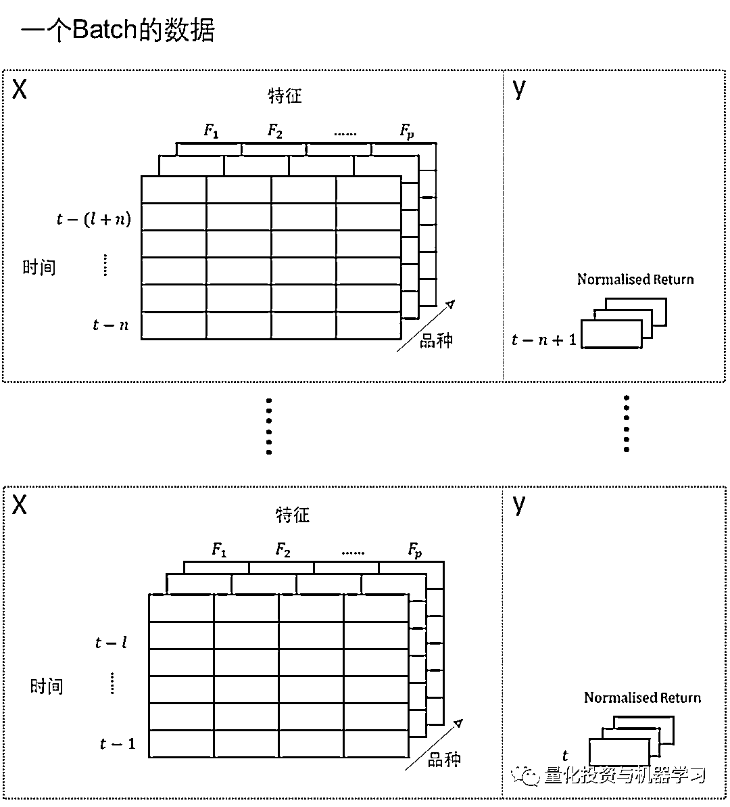
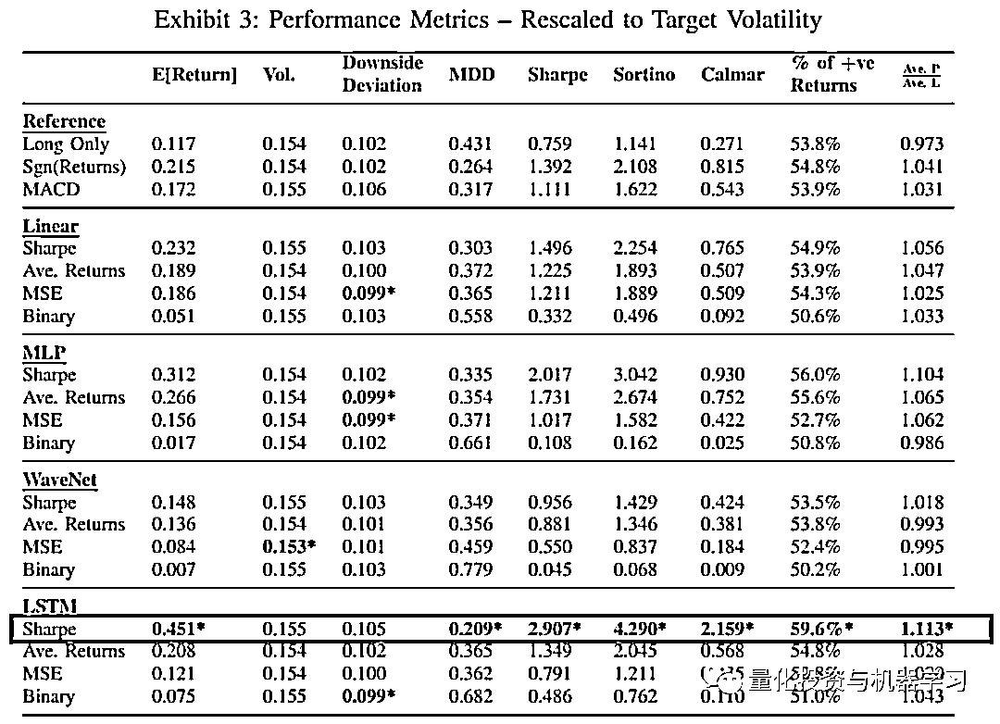

# 量化 CTA：Deep Momentum Network 的细节思考

> 原文：[`mp.weixin.qq.com/s?__biz=MzAxNTc0Mjg0Mg==&mid=2653321756&idx=1&sn=3622d497375d619c0d3b9a0f758b3e48&chksm=802db809b75a311fe885610a3fc663f5925517be753eb640ac263ddf8ab4f632b70c1f0797c9&scene=27#wechat_redirect`](http://mp.weixin.qq.com/s?__biz=MzAxNTc0Mjg0Mg==&mid=2653321756&idx=1&sn=3622d497375d619c0d3b9a0f758b3e48&chksm=802db809b75a311fe885610a3fc663f5925517be753eb640ac263ddf8ab4f632b70c1f0797c9&scene=27#wechat_redirect)

# 

量化投资与机器学习微信公众号，是业内垂直于**量化投资、对冲基金、Fintech、人工智能、大数据**等领域的主流自媒体。公众号拥有来自**公募、私募、券商、期货、银行、保险、高校**等行业**20W+**关注者，连续 2 年被腾讯云+社区评选为“年度最佳作者”。

**前言**

传统的 CTA 策略多为**多品种多周期的趋势跟踪策略组合。**其中对于趋势的定义，大**都基于时间序列计算出的传统技术指标，如 MACD、均线等。**然后根据趋势的多空，构建多品种的多空组合。随着深度学习的发展，很多研究者在量化 CTA 策略的研发中，开始尝试深度学习算法。常见的作法，如直接用深度学习预测每个品种未来一段时间的收益率，并根据预测收益构建品种多空的组合。但这钟做法有以下两个缺点：

*   直接预测收益，并没有考虑组合的风险；

*   没有考虑每个品种在组合钟的权重。

在 Lim etl. 2019 的论文*《Enhancing Time Series Momentum Strategies Using Deep Neural Networks》*中，作者提出了 Deep Momentum Network（DMN）这样一个框架应用在多品种趋势跟踪策略的框架。DMN 主要有以下特点：

*   直接预测 N 个品种未来的头寸，区间为（-1，1）；

*   直接使用 Sharpe 比率作为模型的损失函数。

模型整体框架非常直观，输入为所有品种的特征数据，输出为所有品种下一期的信号强度，信号强度的取值区间为[-1，1]，正负号表示多空的方向，数值大小表示仓位大小。其中模型部分可以采用任何用于序列预测的深度学习模型，我们这里以 LSTM 为例。

虽然模型非常直观，但其中有多细节值得我们推敲，我们主要讨论以下两个问题：模型怎么校准？Batch 数据怎么划分等？

**1、模型如何训练与校准？**

由于模型预测的是下一期每个品种的信号强度，**并不像直接预测下期收益率那样直接可以将下期收益率作为预测目标，然后再使用 MSE 作为损失函数。**DMN 最大的不同是，是直接使用 Sharpe 比率作为损失函数：

<embed style="vertical-align: -5.616ex;width: 25.296ex;height: auto;max-width: 300% !important;" src="https://mmbiz.qlogo.cn/mmbiz_svg/a18XcQ1EBBgzgouRoaMcibDJxpDEFEt0xCttN9Aia6C05FFwvibzsFTtLskmmmT0ib3ZCfpdFL4p1Mzb2OQeBZso3KhxA5zcgjCL/0?wx_fmt=svg" data-type="svg+xml">

其中：

 为所有资产在过去 t-1 到 t-n 时间平均收益， 为所有资产在过去 n 个时间步的方差；

为品种 i 在时间 t+1 的给组合贡献的收益率，其等于 t 时间计算出的信号强度 乘以组合目标波动 与品种 i 在过去 m 天的波动 ，再乘以资产 i 在 t+1 时间的收益率 。

这样，使用每个 Batch 的数据前向计算以上损失函数的值，再进行 Backpropagation 更新模型的参数，那什么时候模型停止训练呢？

这里就需要引入验证集，每次训练时，作者使用 90%的数据进行训练，10%的数据用作验证集，只要满足以下任意条件，模型就停止训练：

*   **达到最大的训练 epoch，比如 100 个 epoch；**

*   **没有达到最大的训练 epoch，但在验证集上已经连续 25 个 epoch，验证集的 loss 没有降低，此时就提前终止训练。**

**2、每个 Batch 的数据怎么准备？**

根据上述损失函数的定义，每次前向计算的损失为过去 N 天，多品种组合表现的夏普比率的负数，所以每个 Batch 的数据需要支持**计算出每个资产在过去 N 天每天的信号强度** 。基于这样的需求，每个 Batch 的数据就不能随机抽取。**以下是公众号根据本文的损失函数构造，推测的 Batch 数据的格式（作者在原文钟并没有提到这些细节），**其中假设使用的模型为 LSTM： 

*   每个训练数据样本包括**所有品种**在 t-n 到 t-(l+n)时间步数的数据，如下图每个虚线方框内所示，其中 X 为特征数据，y 为 t-n+1 的所有品种的收益率数据。其中 l 为 LSTM 模型输入的序列长度。

*   每个 Batch 包括 t-n 到 t-1 时间的虚线框内的数据。

*   这样，每个 Batch 的前向输入就是，所有资产在 t-n 到 t-1 每天的信号强度，这样就能计算这段时间（过去 n 天）组合的夏普比率的负数作为损失函数。

**3、原模型的其他细节**

弄清楚以上细节，对于理解本篇文章至关重要，文章具体使用的特征如下：

*   标准化后的不同时间段的每个品种的收益率，标准化的做法为区间收益率除以标准差；

*   MACD 指标，具体可参考原文。

**原文的模型使用的是递推式滚动训练，每五年训练一次，其中前 4 年作为训练数据，最后 1 年作为验证数据。并在接下来的五年使用前五年数据训练的模型。**

最终在近 20 年历史数据测试中，模型取得了将近 3 的夏普比率，具体测试结果参考原文。

**趋势跟踪策略最大的问题是对于忽然转向的迟钝性，**传统的量化 CTA 会使用多周期的方式捕捉不同时间区间的趋势收益。最近作者又在《Enhancing Time Series Momentum Strategies Using Deep Neural Networks》的基础上，针对趋势迟钝性的问题，发表了新的论文《Slow Momentum with Fast Reversion: A Trading Strategy Using Deep Learning and Changepoint Detection》。**在这篇文章中，作者结合了基于高斯过程的变点检测方法（CPD），计算出每个时间点变点的得分，用于量化当前时间点作为变点的概率，再把这个 CPD 作为深度学习模型的特征。**与原始未加入 CPD 的 DMN 模型相比，**加入 CPD 的 DMN 模型的回测结果显示，最大回撤来的更低，夏普比率更高。**

**更多的思考**

很多时候，**损失函数的设计关系到模型训练优化的方向。**与常用的 MSE、MAE 作为损失函数的时间序列预测相比，量化应用场景中，我们更应该深入这些细节。这样才能更大的发挥算法的价值。本篇文章讨论的是 CTA 策略的场景，将收益预测与权重预测通过一个模型得到了解决。**如果是在截面多因子模型中，可以使用一个模型预测各资产的收益，另一个模型学习组合的权重，而组合权重的损失函数可以设计为夏普比率等风险收益指标。**

这正如我们在前两天关于 Two Sigma 的文章中提到的，**深度学习模型是在传统量化框架下，深入结果框架各个细节的有利提升工具。**

有思考就有进步！下载地址见参考文献。

***参考文献***

*B. Lim, S. Zohren, and S. Roberts, “Enhancing time-series momentum strategies using deep neural networks,” The Journal of Financial Data Science, vol. 1, no. 4, pp. 19–38, 2019.* *https://arxiv.org/pdf/2105.13727.pdf. *

*Lim, B., Zohren, S., & Roberts, S. (2020, September 27). Enhancing time series momentum strategies using Deep Neural Networks. arXiv.org. Retrieved November 29, 2021, from* *https://arxiv.org/abs/1904.04912. *